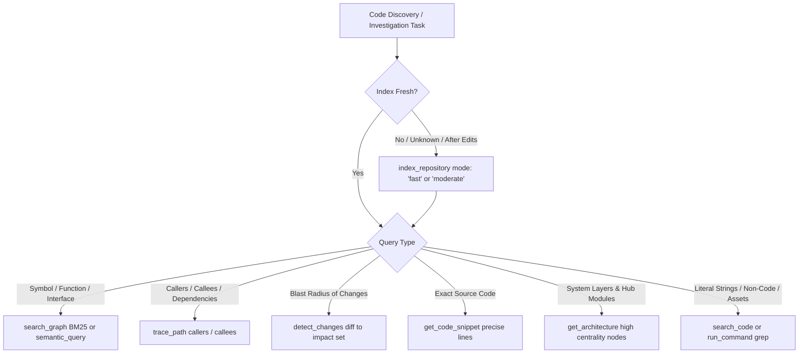

# Codebase Memory & Graph Intelligence (`codebase-memory`)

This skill defines the engineering standards, operational procedures, and tool usage contracts for exploring, searching, and understanding code using the **codebase-memory MCP knowledge graph**.

---

## Core Invariant: The Index-First Protocol

> [!CRITICAL]
> **INDEX-FIRST INVARIANT:** Background watch re-indexing is permanently disabled (`auto_watch = false`) across this workspace to prevent disk thrashing, zstd serialization overhead, and system stuttering during active file editing.
>
> **Consequently, the agent MUST ALWAYS verify index freshness or trigger an on-demand re-index (`index_repository`) before executing searches against the code knowledge graph.**

Whenever you are tasked with finding a symbol, understanding a module, investigating a bug, or preparing a refactor, execute the **Index-First Gate** before making search calls.

---

## Tooling Hierarchy: Graph First, Grep Second

When discovering, navigating, or reviewing code, adhere strictly to this precedence hierarchy:



1. **`search_graph` > text grep**: BM25 ranked structural search with camelCase splitting, label boosting (Functions +10, Routes +8, Interfaces +5), and vector embeddings.
2. **`trace_path` > manual file hopping**: Instant multi-hop caller and callee graph resolution.
3. **`get_code_snippet` > view_file on large files**: Retrieves the exact declaration and body of a symbol with start/end lines and caller counts without bloating agent context.
4. **`detect_changes` > manual diff inspection**: Maps git diffs (`since: "HEAD~1"`, `base_branch: "main"`) directly to their transitive blast radius.
5. **Grep Fallback**: Use `search_code` or `run_command` (`git grep`, `rg`) **ONLY** for:
   - Literal text in markdown (`.md`), config (`.json`), or stylesheets (`.css`).
   - Line ranges explicitly flagged under `parse_partial` in `index_status`.
   - Files excluded by design via `.cbmignore`.

---

## Standard Operating Workflow

### Step 1: Index Synchronization Gate (Mandatory First Action)

Before issuing search queries, determine the project name and ensure the graph reflects recent filesystem edits.

1. **Identify Project Name:**
   Call `list_projects` if the project identifier is unknown:

   ```json
   {
     "ServerName": "codebase-memory",
     "ToolName": "list_projects",
     "Arguments": {}
   }
   ```

   _(In this workspace, the derived project name is `"D-Scripts-aminwebsite"`)._

2. **Check Status or Refresh Index:**
   If files were created or modified during the session, call `index_repository`:

   ```json
   {
     "ServerName": "codebase-memory",
     "ToolName": "index_repository",
     "Arguments": {
       "repo_path": "d:/Scripts/aminwebsite",
       "mode": "fast"
     }
   }
   ```

   - **Mode Selection**:
     - `mode: "fast"`: Incremental parse, filtered files, no semantic vector embeddings. Fast and lightweight for active development.
     - `mode: "moderate"`: Incremental parse + vector similarity embeddings for natural-language concept bridging.
   - **Coverage Inspection**: Check the response for:
     - `parse_partial`: Files where certain line ranges had parse errors.
     - `skipped`: Files completely skipped (e.g. binary or oversized).

---

### Step 2: Symbol & Structure Discovery (`search_graph`)

Find functions, interfaces, types, components, and route definitions.

```json
{
  "ServerName": "codebase-memory",
  "ToolName": "search_graph",
  "Arguments": {
    "project": "D-Scripts-aminwebsite",
    "query": "LocaleSwitcher"
  }
}
```

- **Natural Language Discovery**:
  Use `query` for keyword / BM25 search (e.g. `"theme toggle transition"`, `"locale routing"`).
- **Exact Name Pattern**:
  Use `name_pattern` for regex filtering (e.g. `".*Provider.*"`, `".*Skeleton.*"`).
- **Semantic Conceptual Search**:
  Use `semantic_query: ["i18n", "language", "switch"]` (requires array of strings) to bridge vocabulary gaps.
- **Handling Truncation (`has_more`)**:
  If the response returns `"has_more": true`, paginate by adding `"offset": <current_offset + limit>`.

---

### Step 3: Relationship Tracing & Blast Radius

Never modify a function or interface without inspecting its dependents.

1. **Trace Callers & Callees (`trace_path`):**

   ```json
   {
     "ServerName": "codebase-memory",
     "ToolName": "trace_path",
     "Arguments": {
       "project": "D-Scripts-aminwebsite",
       "function_name": "D-Scripts-aminwebsite.app.components.LocaleSwitcher.handleSelectLocale",
       "direction": "both",
       "depth": 3
     }
   }
   ```

   - `direction: "inbound"`: Identifies all callers that depend on this function (blast radius).
   - `direction: "outbound"`: Identifies downstream functions called by this symbol.
   - `direction: "both"`: Full bidirectional call chain.

2. **Map Git Diff Impact Set (`detect_changes`):**
   Before committing or finalizing changes, evaluate blast radius:
   ```json
   {
     "ServerName": "codebase-memory",
     "ToolName": "detect_changes",
     "Arguments": {
       "project": "D-Scripts-aminwebsite",
       "base_branch": "main",
       "scope": "impact"
     }
   }
   ```

---

### Step 4: Surgical Code Retrieval (`get_code_snippet`)

Instead of consuming context by viewing whole files with `view_file`, retrieve exact symbol implementations:

```json
{
  "ServerName": "codebase-memory",
  "ToolName": "get_code_snippet",
  "Arguments": {
    "project": "D-Scripts-aminwebsite",
    "qualified_name": "D-Scripts-aminwebsite.app.components.LocaleSwitcher.LocaleSwitcher"
  }
}
```

The response includes:

- Exact `start_line` and `end_line`
- Clean source code of the symbol
- Direct caller and callee counts

---

### Step 5: High-Level Architecture Exploration (`get_architecture`)

When getting oriented in a new subsystem or understanding system topology:

```json
{
  "ServerName": "codebase-memory",
  "ToolName": "get_architecture",
  "Arguments": {
    "project": "D-Scripts-aminwebsite",
    "aspects": ["layers", "hub_nodes"]
  }
}
```

Identifies top architectural hub components, central dependencies, and layer hierarchy.

---

## MCP Lazy Tool Reference Matrix

| Capability           | Tool Name          | Required Parameters         | Key Optional Parameters                                            |
| :------------------- | :----------------- | :-------------------------- | :----------------------------------------------------------------- |
| **Verify Status**    | `index_status`     | `project`                   | N/A                                                                |
| **Trigger Indexing** | `index_repository` | `repo_path`                 | `mode` (`"fast"`, `"moderate"`, `"full"`), `persistence`           |
| **List Projects**    | `list_projects`    | None                        | N/A                                                                |
| **Search Symbols**   | `search_graph`     | `project`                   | `query`, `name_pattern`, `semantic_query`, `limit`, `offset`       |
| **Trace Call Chain** | `trace_path`       | `project`, `function_name`  | `direction` (`"inbound"`, `"outbound"`, `"both"`), `depth`, `mode` |
| **Retrieve Source**  | `get_code_snippet` | `project`, `qualified_name` | `include_neighbors`                                                |
| **Blast Radius**     | `detect_changes`   | `project`                   | `base_branch`, `since`, `scope` (`"impact"`, `"files"`), `depth`   |
| **Architecture**     | `get_architecture` | `project`                   | `aspects` (`["hub_nodes"]`, `["layers"]`, `["all"]`)               |
| **Literal Text**     | `search_code`      | `project`, `query`          | `file_pattern`, `case_sensitive`, `limit`                          |

---

## Guardrails & Common Anti-Patterns

| Anti-Pattern                                       | Correct Operational Standard                                                                                                     |
| :------------------------------------------------- | :------------------------------------------------------------------------------------------------------------------------------- |
| **Searching without checking index freshness**     | Always call `index_repository(mode: "fast")` or verify with `index_status` first, since background auto-watch is disabled.       |
| **Using `grep` to find function definitions**      | Call `search_graph` with the symbol name; it returns qualified names, exact file paths, line ranges, and caller counts.          |
| **Reading 1000 lines of a file to see 1 function** | Call `get_code_snippet` with the symbol's `qualified_name`.                                                                      |
| **Manually reading every file to find callers**    | Call `trace_path` with `direction: "inbound"`.                                                                                   |
| **Assuming graph is 100% complete**                | Graph is best-effort. If `index_status` lists files under `parse_partial`, use text grep for those specific flagged line ranges. |
| **Enabling `auto_watch`**                          | Never enable `auto_watch`; keep it `false` to maintain peak interactive development performance.                                 |
