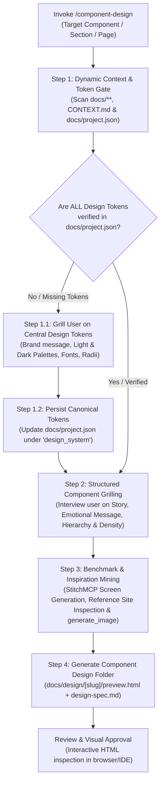

# Component & UI Design Skill (`component-design`)

This skill defines the complete, repeatable workflow for designing web and app components, sections, and full pages. It focuses strictly on **User Experience (UX), User Interface (UI), layout architecture, visual aesthetics, typography, color tokens, and interactive previews**.

> [!IMPORTANT]
> **Pure Design Scope (Zero Coding Guardrail):**
> This skill is strictly concerned with design, layout, visual hierarchy, aesthetic tokens, and previewing. It does **NOT** generate React components, Next.js code, TypeScript props interfaces, component library installation commands (no shadcn/Radix commands), or backend logic. Code implementation is handled in downstream development workflows.

> [!CAUTION]
> **Design Tokens Prerequisite Gate (Tokens First Rule):**
> No component, section, or page design can proceed without a fully verified set of central design tokens in [`docs/project.json`](file:///d:/Scripts/aminwebsite/docs/project.json). The skill MUST first verify all tokens exist; if any are missing, it must grill the user to define them and persist them to `docs/project.json` before drafting any component designs.

---

## 1. Core Deliverables & Workflow Overview



### Deliverable 1: Canonical Design Tokens in `docs/project.json`

The single source of truth for the application's visual system. Before any component is designed, the skill verifies and centralizes all brand identity, light and dark color palettes, typography pairings, border radii, and elevation scales into [`docs/project.json`](file:///d:/Scripts/aminwebsite/docs/project.json) under the `"design_system"` schema.

### Deliverable 2: The Component Design Output Folder (`docs/design/[slug]/`)

For every designed component, section, or page, this skill outputs a dedicated directory named after the component slug (e.g., `docs/design/hero-section/` or `docs/design/doh-tester/`) containing exactly two core files:

1. **`preview.html`**: A fully styled, self-contained, responsive, and interactive HTML5 preview strictly styled using the centralized design tokens. Includes an interactive control toolbar allowing immediate toggling of **Light vs. Dark theme**, **LTR (English) vs. RTL (Persian / Vazirmatn)**, and **Viewport widths (Desktop, Tablet, Mobile)**.
2. **`design-spec.md`**: A comprehensive Markdown design specification detailing the emotional story, visual hierarchy, layout grid, typography scale, color token mapping, interactive states (hover, active, focus, loading, error), and accessibility considerations.

---

## 2. Step-by-Step Execution Workflow

### Step 1: Dynamic Context Discovery & Design Token Verification Gate

> [!IMPORTANT]
> **Dynamic Discovery Rule:** Documentation files in the workspace do not have fixed names. Never assume hardcoded file paths. Dynamically scan all files within the `docs/` directory and root `CONTEXT.md` to extract existing context.

Before designing any component, automatically inspect the workspace to establish context and verify central design tokens:

1. **Scan `docs/**`and`CONTEXT.md`:\*\*
   - Target audience (e.g., recruiters, technical clients, developers, general public).
   - Core business goals (e.g., lead generation, building trust, showcasing technical competence).
   - Existing design references, benchmark URLs, and bookmarks.
2. **Inspect Existing Tokens:**
   - Read [`docs/project.json`](file:///d:/Scripts/aminwebsite/docs/project.json) and inspect any existing style files (e.g., `app/globals.css`, `styles/`).
3. **The Design Token Verification Checklist:**
   Verify whether [`docs/project.json`](file:///d:/Scripts/aminwebsite/docs/project.json) has a complete `"design_system"` object containing:
   - [ ] **Brand Story / Message:** Core emotional tone and visual personality.
   - [ ] **Light Mode Color Palette:** Canvas background/foreground, alternate section background/foreground, elevated card surface, subtle border, primary accent, secondary accent, status colors (success, warning, error, info).
   - [ ] **Dark Mode Color Palette:** Complete dark counterpart for every light token.
   - [ ] **Typography System:** Heading font, body font, monospace/code font, and RTL font (e.g., `Vazirmatn`).
   - [ ] **Border Radii:** Base, card, button, badge, modal.
   - [ ] **Elevation / Shadows:** Card shadow, elevated shadow, modal shadow.

#### Step 1.1: Grilling the User on Missing Tokens (If Not Verified)

If **ANY** of the required tokens above are missing from `docs/project.json`, pause immediately and grill the user to establish them:

- **Brand Story & Tone:**
  - _"What is the core visual aesthetic and emotional message of the brand?"_
  - _(Recommended) High-precision systems engineering, technical clarity, trustworthy infrastructure._
  - _Creative design boutique, expressive typography, high-motion aesthetics._
  - _Enterprise minimalist SaaS, ultra-clean neutral surfaces._
- **Color Palette Strategy:**
  - _"What primary canvas and accent colors should we anchor the light and dark palettes on?"_
  - _(Recommended) Deep slate canvas (`#0B0F17` dark / `#F8FAFC` light) with vibrant Emerald (`#10B981`) and Amber (`#F59E0B`) accents._
  - _Cool neutral gray canvas with Electric Cyan / Blue accents._
  - _Warm monochrome canvas with high-contrast black/white and subtle pastel accents._
- **Typography Pairing:**
  - _"What typography pairing should we use for Latin headings, body text, and Persian RTL?"_
  - _(Recommended) Latin Sans (`Geist Sans` or `Inter`), Monospace (`Geist Mono`), paired with `Vazirmatn` for Persian RTL._
- **Border Radius & Geometry:**
  - _"What geometric feel should containers, cards, and buttons have?"_
  - _(Recommended) Modern subtle rounding (8px / 0.5rem base, 12px / 0.75rem cards, pill badges)._
  - _Sharp, brutalist/developer-terminal edges (2px - 4px radius or 0px)._
  - _Soft, playful rounded curves (16px / 1rem cards, fully rounded buttons)._

#### Step 1.2: Persist Canonical Tokens to `docs/project.json`

Once the tokens are established from existing docs or user grilling, update [`docs/project.json`](file:///d:/Scripts/aminwebsite/docs/project.json) under `"design_system"`:

```json
{
  "project_context_and_metadata": { ... },
  "design_system": {
    "brand_message": "Technical clarity, high-precision systems engineering, trustworthy infrastructure",
    "color_palette": {
      "light": {
        "canvas_background": "#F8FAFC",
        "canvas_foreground": "#0F172A",
        "section_alternate_background": "#F1F5F9",
        "section_alternate_foreground": "#1E293B",
        "surface_elevated": "#FFFFFF",
        "surface_elevated_foreground": "#0F172A",
        "border": "#E2E8F0",
        "primary_accent": "#059669",
        "primary_accent_foreground": "#FFFFFF",
        "secondary_accent": "#3B82F6",
        "secondary_accent_foreground": "#FFFFFF",
        "status_success": "#10B981",
        "status_warning": "#F59E0B",
        "status_error": "#EF4444",
        "status_info": "#0EA5E9"
      },
      "dark": {
        "canvas_background": "#0B0F17",
        "canvas_foreground": "#F8FAFC",
        "section_alternate_background": "#111827",
        "section_alternate_foreground": "#E2E8F0",
        "surface_elevated": "#1E293B",
        "surface_elevated_foreground": "#F8FAFC",
        "border": "#334155",
        "primary_accent": "#10B981",
        "primary_accent_foreground": "#0B0F17",
        "secondary_accent": "#60A5FA",
        "secondary_accent_foreground": "#0B0F17",
        "status_success": "#10B981",
        "status_warning": "#F59E0B",
        "status_error": "#F87171",
        "status_info": "#38BDF8"
      }
    },
    "typography": {
      "heading_font": "Geist Sans, Inter, sans-serif",
      "body_font": "Geist Sans, Inter, sans-serif",
      "code_font": "Geist Mono, JetBrains Mono, monospace",
      "rtl_font": "Vazirmatn, sans-serif"
    },
    "border_radius": {
      "base": "0.5rem",
      "card": "0.75rem",
      "button": "0.5rem",
      "badge": "9999px",
      "modal": "1rem"
    },
    "elevation_and_shadows": {
      "card": "0 1px 3px 0 rgb(0 0 0 / 0.1), 0 1px 2px -1px rgb(0 0 0 / 0.1)",
      "elevated": "0 10px 15px -3px rgb(0 0 0 / 0.1), 0 4px 6px -4px rgb(0 0 0 / 0.1)",
      "modal": "0 20px 25px -5px rgb(0 0 0 / 0.2), 0 8px 10px -6px rgb(0 0 0 / 0.2)"
    }
  }
}
```

---

### Step 2: Structured User Grilling on Component Intent

With all global design tokens verified and recorded, interview the user regarding the specific component, section, or page to be designed:

#### Round 1: Specific Component Purpose & Story

- **Question:** What specific task does the visitor accomplish here, and what emotional impression should it leave?
  - _(Recommended) Instant technical value and responsiveness (e.g. interactive network tool with live feedback)._
  - _High-impact storytelling showcasing expertise and measurable outcomes (e.g. case study showcase)._
  - _Clear conversion path to initiate contact or explore services._

#### Round 2: Spatial Density & Layout Scale

- **Question:** What layout density best fits this component's function?
  - _(Recommended) High-density developer dashboard / terminal layout with compact data chips and monospace metrics._
  - _Airy, editorial layout with generous negative space, large headlines, and soft borders._
  - _Modular card grid with balanced padding and prominent action buttons._

#### Round 3: Visual Focal Point & Eye Flow

- **Question:** In what sequence should the visitor's eye navigate through this section?
  - _1st: Primary headline / value proposition & live availability badge._
  - _2nd: Interactive control or primary visual showcase._
  - _3rd: Supporting metrics, secondary links, or trust indicators._

#### Round 4: Media, Accents & Iconography

- **Question:** What visual assets are needed to support this component?
  - _Custom vector brand mark / icon badges (generated via AI)._
  - _3D / glassmorphic ambient backdrop or interactive canvas._
  - _Pure typographic layout supported by consistent outline icons._

---

### Step 3: Benchmark & Inspiration Mining (MCP & AI Tools)

To defeat the "Curse of the White Page" and ground the design in proven patterns:

1. **Google Stitch MCP Execution (`StitchMCP`):**
   - Call `StitchMCP` tools (`generate_screen_from_text` or `create_project`) using the prompt synthesized from Steps 1 and 2.
   - Generate layout variants for both desktop and mobile viewports.
   - Inspect generated component layouts to extract spacing rhythms and structural hierarchies.
2. **Reference Site & Benchmark Inspection:**
   - For reference URLs identified in `docs/` or specified by the user, use browser tools (Playwright / Chrome DevTools MCP) or web search to inspect:
     - Layout structures, card paddings, and section transitions.
     - Color contrasts, glassmorphic backdrop filters, and subtle border treatments.
     - Micro-interaction cues, hover states, and badge designs.
3. **Asset Generation with `generate_image`:**
   - If custom brand marks, favicons, abstract technical backdrops, or feature illustrations are required:
     - Formulate a precise prompt (e.g., _"Minimalist geometric vector logo mark combining letters A and J with subtle networking node accents, monochrome with emerald green highlight"_).
     - Invoke `generate_image` to save the resulting image asset into the project artifacts or `public/assets/generated/`.

---

### Step 4: Generate the Component Design Output Folder

Create the directory `docs/design/[slug]/` and generate the two required files:

#### File 1: `preview.html` (Interactive Design Preview)

The preview HTML file must be fully self-contained and feature a top control bar for interactive inspection:

- **Interactive Control Bar:**
  - **Theme Toggle:** Button to switch between Dark (`dark` class on root) and Light themes.
  - **Direction Toggle:** Button to switch between `dir="ltr"` (English with sans-serif) and `dir="rtl"` (Persian with `Vazirmatn` font).
  - **Device Viewport Toggle:** Buttons to constrain the container width (`100%` Desktop, `768px` Tablet, `375px` Mobile) to verify responsive wrapping.
- **Embedded Styling:**
  - Uses Tailwind CSS CDN or cleanly structured inline CSS variables reflecting the centralized design tokens in `docs/project.json`.
- **High-Fidelity Mockup Elements:**
  - Realistic copy (no generic lorem ipsum; uses domain-accurate terminology).
  - Working hover states, active transitions, and focus rings.
  - Empty, active, or loading visual indicators where appropriate.

#### File 2: `design-spec.md` (Design Specification Document)

A comprehensive document formatted as follows:

```markdown
# Design Specification: [Component / Section Name]

## 1. Executive Summary & Story

- **Component Identifier:** `[slug]`
- **Section Type:** (Hero / Interactive Tool / Case Study Card / Navigation / Footer / CTA)
- **Target Persona:** (Recruiters, Engineers, Clients, General Public)
- **Core Emotional Message:** (The specific story and feeling conveyed)

## 2. Visual Hierarchy & Spatial Flow

- **Primary Focal Point (Z-Pattern / F-Pattern):** What draws the eye first.
- **Secondary Supporting Elements:** Contextual information, badges, secondary links.
- **Tertiary Information:** Metadata, timestamps, status indicators.

## 3. Layout Grid & Responsive Breakpoints

- **Mobile (< 768px):** Stacking order, touch target padding (min 44px), horizontal scroll containers if needed.
- **Tablet (768px - 1024px):** 2-column shifts, sidebar/drawer transformations.
- **Desktop (>= 1024px):** Full multi-column grid, sticky headers, max-width constraints.

## 4. Design Tokens & Color Mapping (From docs/project.json)

| Element / Surface | Light Mode Token | Dark Mode Token | Purpose                      |
| :---------------- | :--------------- | :-------------- | :--------------------------- |
| Canvas Background | `#F8FAFC`        | `#0B0F17`       | Root background              |
| Card Surface      | `#FFFFFF`        | `#1E293B`       | Elevated container           |
| Primary Accent    | `#059669`        | `#10B981`       | Interactive actions & status |
| Subtle Border     | `#E2E8F0`        | `#334155`       | Dividers & card outlines     |

## 5. Typography Scale

- **Headline / Title:** Size, font weight, line height, letter spacing.
- **Body / Descriptions:** Size, weight, color contrast (WCAG AA compliant).
- **Metadata / Chips:** Monospace or small caps sizing.
- **Bidirectional (RTL) Font:** `Vazirmatn` adjustments (e.g. line-height loosening).

## 6. Interaction States Matrix

- **Default State:** Initial visual appearance.
- **Hover / Pointer Over:** Subtle elevation lift, border color transition, background tint change.
- **Active / Pressed:** Visual depth press, scale change.
- **Loading / Processing State:** Skeleton pulse or shimmer effect.
- **Empty / Error State:** Humanized illustration or warning banner.

## 7. Bidirectional (RTL / Persian) Adaptations

- Layout mirroring rules (start vs. end margins, flex direction reversals).
- Numerical and code block preservation (`dir="ltr"` for code/IPs/domain names).
- Directional icon flipping (arrows, chevrons flip; checkmarks, search icons remain invariant).

## 8. Accessibility & Ergonomics

- Minimum color contrast ratio >= 4.5:1 for standard text, >= 3:1 for large text.
- Visible keyboard focus indicators (`outline-2 outline-offset-2`).
- Touch target ergonomics for mobile interactions.
```

---

## 3. Execution Verification Checklist

Before presenting the design to the user, ensure:

- [ ] No code or framework implementation instructions (no React, Next.js, or shadcn mentions) exist in the deliverables.
- [ ] The `docs/` directory was scanned dynamically for project context and domain terminology.
- [ ] The **Design Token Verification Gate** passed: all required tokens (brand, light/dark palettes, typography, radii) are completely recorded in [`docs/project.json`](file:///d:/Scripts/aminwebsite/docs/project.json).
- [ ] The user was grilled on component-specific story, hierarchy, and density before finalizing the visual plan.
- [ ] Inspiration sources, StitchMCP, or benchmark websites were utilized.
- [ ] Output directory `docs/design/[slug]/` contains both `preview.html` and `design-spec.md`.
- [ ] `preview.html` includes working theme (Dark/Light) and RTL (Persian/Vazirmatn) toggles.
