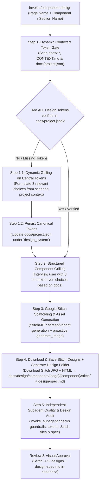

# Component & UI Design Skill (`component-design`)

This skill defines the complete, repeatable workflow for designing web and app components, sections, and full pages in any project. It focuses strictly on **User Experience (UX), User Interface (UI), layout architecture, visual aesthetics, typography, color tokens, Google Stitch AI screen scaffolding and variant exploration, proactive asset generation, and saving Stitch design files (JPG + HTML) into the codebase**.

> [!IMPORTANT]
> **Pure Design Scope (Zero Coding Guardrail):**
> This skill is strictly concerned with design, layout, visual hierarchy, aesthetic tokens, and design asset generation. It does **NOT** generate React components, Next.js code, TypeScript props interfaces, component library installation commands (no shadcn/Radix commands), or backend logic. Code implementation is handled in downstream development workflows.

> [!CAUTION]
> **Design Tokens Prerequisite Gate (Tokens First Rule):**
> No component, section, or page design can proceed without a fully verified set of central design tokens in [`docs/project.json`](file:///d:/Scripts/aminwebsite/docs/project.json). The skill MUST first verify all tokens exist; if any are missing, it must grill the user to define them and persist them to `docs/project.json` before drafting any component designs.

---

## 1. Core Deliverables & Workflow Overview



### Deliverable 1: Canonical Design Tokens in `docs/project.json`

The single source of truth for the application's visual system. Before any component is designed, the skill verifies and centralizes all brand identity, light and dark color palettes, locale-specific typography pairings, border radii, and elevation scales into [`docs/project.json`](file:///d:/Scripts/aminwebsite/docs/project.json) under the `"design_system"` schema.

### Deliverable 2: The Component Design Output Folder

Every designed component or section must be saved in a dedicated path structured strictly by page and component:

```text
docs/design/components/[page name]/[component name]/
├── design-spec.md          # Comprehensive UX/UI design specification (citing Stitch layout benchmarks)
├── stitch/                 # Downloaded Google Stitch design files
│   ├── screen.jpg          # Stitch-generated JPG screenshot of the primary screen
│   ├── screen.html         # Stitch-generated HTML design export of the primary screen
│   ├── variant-N.jpg       # Variant JPG screenshots (variant-1.jpg, variant-2.jpg, …)
│   ├── variant-N.html      # Variant HTML design exports (variant-1.html, variant-2.html, …)
│   └── stitch-meta.json    # Stitch project ID, screen ID, variant IDs, and generation prompt
└── [generated assets...]   # Bespoke images, portraits, backdrops, or icons created via generate_image
```

---

## 2. Step-by-Step Execution Workflow

### Step 1: Dynamic Context Discovery & Design Token Verification Gate

> [!IMPORTANT]
> **Dynamic Discovery Rule:** Documentation files in the workspace do not have fixed names. Never assume hardcoded file paths or hardcoded project themes. Dynamically scan all files within the `docs/` directory and root `CONTEXT.md` to extract existing context.

Before designing any component, automatically inspect the workspace to establish context and verify central design tokens:

1. **Scan `docs/**`and`CONTEXT.md`:\*\*
   - Target audience and user personas.
   - Core business objectives and product category.
   - Existing design references, benchmark URLs, and bookmarks.
2. **Scan Supported Locales (`docs/project.json`):**
   - Extract the list of supported languages and layout directions (e.g. `ltr`, `rtl`) from `project_context_and_metadata.supported_languages`.
3. **Inspect Existing Tokens:**
   - Read [`docs/project.json`](file:///d:/Scripts/aminwebsite/docs/project.json) and inspect any existing style files (e.g., `globals.css`, `styles/`).
4. **The Design Token Verification Checklist:**
   Verify whether [`docs/project.json`](file:///d:/Scripts/aminwebsite/docs/project.json) has a complete `"design_system"` object containing:
   - [ ] **Brand Story / Message:** Core emotional tone and visual personality.
   - [ ] **Light Mode Color Palette:** Canvas background/foreground, alternate section background/foreground, elevated card surface, subtle border, primary accent, secondary accent, status colors (success, warning, error, info).
   - [ ] **Dark Mode Color Palette:** Complete dark counterpart for every light token.
   - [ ] **Typography System (Per Locale Object):** An object keyed by each supported locale in the project with `heading_font`, `body_font`, and `code_font`.
   - [ ] **Border Radii:** Base, card, button, badge, modal.
   - [ ] **Elevation / Shadows:** Card shadow, elevated shadow, modal shadow.

---

#### Step 1.1: Dynamic Grilling on Missing Tokens (Context-Driven Options)

> [!IMPORTANT]
> **Zero Hardcoded Repository Assumptions:**
> The options presented during grilling MUST NEVER be hardcoded from any specific project or repository. The agent must dynamically synthesize **3 genuinely relevant choices** formulated entirely from the active project's scanned `docs/**`, `CONTEXT.md`, business goals, and supported languages.
>
> - Formulate 3 distinct, high-quality, and plausible choices directly fitting the project's domain.
> - Mark the single strongest and most coherent choice as `(Recommended)`.
> - Do not include filler options or artificial opposites; all 3 choices must represent legitimate, thoughtful design directions for the active project.

When grilling on missing tokens, formulate dynamic questions covering:

1. **Brand Story & Aesthetic Tone:** Formulate 3 relevant aesthetic philosophies derived from the project's purpose.
2. **Color Palette Strategy (Light & Dark):** Formulate 3 cohesive color combinations (canvas, surfaces, accents, and status tokens) tailored to the project.
3. **Typography System (Per Locale):** Formulate 3 font pairing choices covering heading, body, and monospace fonts for every locale defined in the project's supported languages.
4. **Border Radii & Spatial Geometry:** Formulate 3 geometric curvature scales appropriate for the project's aesthetic.

---

#### Step 1.2: Persist Canonical Tokens to `docs/project.json`

Once established from existing docs or user grilling, update [`docs/project.json`](file:///d:/Scripts/aminwebsite/docs/project.json) under `"design_system"`.

---

### Step 2: Structured User Grilling on Component Intent

With all global design tokens verified and recorded, interview the user regarding the specific component, section, or page to be designed.

> [!IMPORTANT]
> **Context-Driven Component Choices:**
> For each question below, synthesize **3 relevant choices** derived specifically from the active project's documentation, target user persona, and component purpose. Mark the primary fit as `(Recommended)`:

1. **Specific Component Purpose & Story:**
   - What specific task does the visitor accomplish here, and what emotional impression should it leave? Provide 3 relevant options based on component type and project goals.
2. **Spatial Density & Layout Scale:**
   - Provide 3 density options appropriate for the component's role (e.g. data density vs. narrative storytelling vs. visual showcase).
3. **Visual Focal Point & Eye Flow:**
   - Sequence of eye navigation: 1st focal point, 2nd focal point, 3rd focal point.
4. **Media, Accents & Visual Graphics:**
   - Proactively evaluate what visuals are needed: vector brand marks, ambient backdrops, 3D elements, or diagram graphics.

---

### Step 3: Google Stitch AI Scaffolding, Variant Exploration & Asset Generation

To defeat the "Curse of the White Page" and ground every design in professional layout architecture, use **Google Stitch (`StitchMCP`)** to scaffold screens, explore spatial variants, and generate bespoke assets.

#### 1. Google Stitch Project Persistence & Design System Seeding (`StitchMCP`)

> [!IMPORTANT]
> **Single Project Per Repository Rule (Zero Duplicate Projects):**
> Every repository must maintain exactly **one shared Google Stitch project container** for all of its component and screen designs.
> NEVER create multiple Stitch projects for the same repository.
>
> **Project Persistence Protocol:**
>
> 1. **Check `docs/project.json` First:** Inspect `docs/project.json` for an existing `"stitch"` object with `project_id`.
> 2. **Reuse Existing Project:** If `stitch.project_id` exists, ALWAYS reuse that `projectId` directly for all screen scaffolding, variants, and design system updates. Do NOT call `create_project`.
> 3. **Create & Immediately Persist:** If no `stitch.project_id` exists in `docs/project.json`:
>    - Call `call_mcp_tool` on `StitchMCP` with `list_projects` to check if a project matching the repository title already exists.
>    - If none exists, call `create_project` with `title: "[Project Title] Design System & Components"`.
>    - **IMMEDIATELY persist the project properties** to `docs/project.json` under `"stitch"`:
>      ```json
>      "stitch": {
>        "project_id": "<projectId>",
>        "project_name": "projects/<projectId>",
>        "title": "<title>"
>      }
>      ```
> 4. **Seed Design Tokens (`upload_design_md` or `create_design_system`):** Provide the project's canonical design system (from `docs/project.json`) to Stitch via `upload_design_md` or `create_design_system_from_design_md` to establish global color, font, and radius consistency.

#### 2. Screen Scaffolding from Prompt (`generate_screen_from_text`)

1. **Synthesize Detailed Design Prompt:**
   - Combine the component purpose, user persona, emotional tone, and answers from Step 2 grilling.
   - Specify the exact visual tokens: background canvas, surface cards, primary accent, secondary accent, status colors, and per-locale typography from `docs/project.json`.
   - Specify the target device layout: `DESKTOP`, `TABLET`, or `MOBILE`.
2. **Generate Screen via Stitch:**
   - Call `generate_screen_from_text` on `StitchMCP` with:
     - `projectId`: Active Stitch project ID.
     - `prompt`: Detailed synthesized component prompt.
     - `deviceType`: `"DESKTOP"` (or target viewport).
3. **Inspect Generated Layout (`get_screen`):**
   - Call `get_screen` with the generated screen identifier (format: `projects/{projectId}/screens/{screenId}`).
   - Extract the generated layout composition, spatial grid, typography scale, and responsive hierarchy.

#### 3. Layout Variant Exploration (`generate_variants`)

1. **Explore Spatial & Visual Variations:**
   - Call `generate_variants` on `StitchMCP` for the generated screen to explore alternative arrangements (e.g. data-dense vs. narrative-focused, card-based vs. full-bleed, symmetric vs. asymmetric).
   - Evaluate the returned variants and select the strongest composition that best achieves the component's emotional and functional goals.
2. **Prepare for Download (Step 4):**
   - Note the selected screen ID and any chosen variant IDs — these will be fetched and saved to the `stitch/` folder in Step 4.
   - Record the selected screen name (format: `projects/{projectId}/screens/{screenId}`) for traceability.

#### 4. Proactive Visual Asset Generation (`generate_image`)

> [!TIP]
> **Proactive Image Generation Mandate:**
> The AI agent **can and should proactively generate visual assets** whenever a component or section benefits from visual graphics. Do NOT leave empty gray placeholder boxes or generic icons when custom imagery enhances the design.
>
> - **Ambient Hero / Section Backdrops:** Deep tech grids, glowing network topologies, futuristic particle fields, or abstract editorial textures.
> - **Portraits & Avatars:** High-contrast studio portraits with custom lighting matching the design system.
> - **Brand Marks & Favicons:** Vector monogram logos, geometric badges.
> - **Diagrams & Data Illustrations:** Flow diagrams, architecture visualizations, security shields, or domain-specific graphics.
> - **Aspect Ratios:** Use `16:9` for section backdrops/banners, `1:1` for badges/avatars/logos, `4:3` or `3:2` for feature cards.
> - **Asset Storage:** Save generated images directly into the component's design folder (`docs/design/components/[page]/[component]/`) so the spec is self-contained.

---

### Step 4: Download Stitch Design Files & Generate Component Folder

Generate the component design folder and populate it with the Stitch-generated designs and the design specification.

#### File 1: Stitch Design Downloads (`stitch/`)

> [!IMPORTANT]
> **Mandatory Stitch Asset Download Rule:**
> After generating and selecting the best Stitch screen, you MUST download and save both the JPG and HTML outputs from the Stitch API response directly into the component's `stitch/` subfolder. These files are the primary visual design artifacts for the component and must live in the codebase for traceability and review.

**Download Protocol:**

> [!CAUTION]
> **Binary Download Rule — NEVER use `read_url_content` for images or HTML files:**
> `read_url_content` is a text-only tool that converts responses to markdown, **corrupting binary image data** (producing unreadable files) and mangling raw HTML structure. ALL Stitch file downloads MUST use `run_command` with PowerShell `Invoke-WebRequest -OutFile` to fetch binary-safe files directly to disk.
> HTML download URLs from `contribution.usercontent.google.com` are **short-lived signed URLs** — download immediately after receiving the Stitch response before they expire.

1. **Download Primary Screen JPG:**
   - Extract `screenshot.downloadUrl` from the `generate_screen_from_text` / `get_screen` response.
   - Run:
     ```
     Invoke-WebRequest -Uri '<screenshot.downloadUrl>' -OutFile 'docs/design/components/[page]/[component]/stitch/screen.jpg'
     ```
   - Verify file size is non-zero (> 10KB).

2. **Download Primary Screen HTML:**
   - Extract `htmlCode.downloadUrl` from the `generate_screen_from_text` / `get_screen` response.
   - Run:
     ```
     Invoke-WebRequest -Uri '<htmlCode.downloadUrl>' -OutFile 'docs/design/components/[page]/[component]/stitch/screen.html'
     ```

3. **Download Variant JPGs (for each variant from `generate_variants`):**
   - Extract `screenshot.downloadUrl` from each variant object in the response.
   - Run for each variant (N = 1, 2, …):
     ```
     Invoke-WebRequest -Uri '<variant.screenshot.downloadUrl>' -OutFile 'docs/design/components/[page]/[component]/stitch/variant-N.jpg'
     ```

4. **Download Variant HTMLs (for each variant from `generate_variants`):**
   - Extract `htmlCode.downloadUrl` from each variant object in the response.
   - Run for each variant (N = 1, 2, …):
     ```
     Invoke-WebRequest -Uri '<variant.htmlCode.downloadUrl>' -OutFile 'docs/design/components/[page]/[component]/stitch/variant-N.html'
     ```

5. **Save Stitch Metadata:**
   - Write a `docs/design/components/[page]/[component]/stitch/stitch-meta.json` file containing:
     ```json
     {
       "projectId": "<stitchProjectId>",
       "screenId": "<screenId>",
       "screenName": "projects/<projectId>/screens/<screenId>",
       "deviceType": "<DESKTOP|TABLET|MOBILE>",
       "generationPrompt": "<the prompt used for generate_screen_from_text>",
       "variantIds": ["<variantScreenId1>", "<variantScreenId2>"]
     }
     ```

#### File 2: `design-spec.md` (Design Specification Document)

A comprehensive specification documenting:

1. **Executive Summary & Story:** Component identifier, section type, target persona, emotional message.
2. **Google Stitch Layout Architecture & Screen Benchmarks:** Screen generation prompts, Stitch project and screen IDs, layout composition rationale, and variant comparisons. Embed the downloaded `stitch/screen.jpg` directly in the spec: ``.
3. **Visual Hierarchy & Spatial Flow:** 1st, 2nd, and 3rd focal points.
4. **Layout Grid & Breakpoints:** Stacking behavior for mobile (<768px), tablet (768-1024px), desktop (>=1024px).
5. **Design Tokens & Color Mapping:** Light and dark values from `docs/project.json`.
6. **Typography Scale (Per Locale):** Typographic sizing, weights, and line heights for each locale defined in `docs/project.json`.
7. **Interaction States Matrix:** Default, hover, active, focus rings, loading states.
8. **Bidirectional (RTL) Adaptations:** Mirroring rules, code preservation, directional icon flips (if RTL is supported).
9. **Accessibility & Ergonomics:** WCAG AA/AAA contrast ratios, touch targets ($\ge 44\text{px}$), focus rings.

---

### Step 5: Independent Subagent Quality & Design Audit (`invoke_subagent`)

> [!IMPORTANT]
> **Unbiased Verification Architecture (Subagent Review Loop):**
> To eliminate author confirmation bias and prevent self-grading, the primary design agent MUST NOT self-certify its output. Before presenting the completed design to the user, you MUST invoke an independent reviewer subagent using the `invoke_subagent` tool to audit the generated deliverables.

#### 1. Spawn Independent Design Auditor Subagent

Call `invoke_subagent` with:

- `TypeName`: `"self"`
- `Role`: `"Independent Design & UX Auditor"`
- `Model`: `"inherit"`
- `Prompt`: Provide a rigorous design auditing prompt:

```text
You are an independent Senior Design & UX Reviewer. You did NOT generate these designs. Your job is to audit the completed design deliverables with completely fresh eyes and find any flaws, token mismatches, or guardrail breaches before the user reviews them.

TARGET COMPONENT DIRECTORY:
docs/design/components/[page name]/[component name]/

CANONICAL PROJECT TOKENS:
docs/project.json (under "design_system")

Deliverables to Audit:
1. docs/design/components/[page name]/[component name]/stitch/screen.jpg
2. docs/design/components/[page name]/[component name]/stitch/screen.html
3. docs/design/components/[page name]/[component name]/stitch/stitch-meta.json
4. docs/design/components/[page name]/[component name]/design-spec.md
5. docs/design/components/[page name]/[component name]/ (generated images/assets)

Audit against these strict criteria:
1. Zero Coding Guardrail: Confirm that NO React components, Next.js directives ('use client'/'use server'), TypeScript prop interfaces, or package installation commands (no shadcn/Radix CLI commands) leaked into design-spec.md. Code implementation belongs strictly downstream.
2. Design System & Token Compliance: Verify that colors (light/dark canvas, surfaces, accents, status), typography (headings, body, code per locale), border radii, and elevation shadows used in design-spec.md strictly align with docs/project.json without arbitrary or hallucinated values.
3. Stitch JPG & HTML Download Integrity: Verify that stitch/screen.jpg exists as a real downloaded file (non-zero size), stitch/screen.html exists as the Stitch-generated HTML layout, and stitch/stitch-meta.json contains valid projectId, screenId, and generationPrompt fields. If variants were generated, verify variant-N.jpg files are present.
4. Bilingual & Directional Fidelity: If the project supports RTL languages (e.g. Persian 'fa'), verify design-spec.md provides clear bidirectional mirroring guidelines.
5. Specification Completeness: Verify design-spec.md documents all 9 required sections: Executive Summary, Google Stitch benchmarks (with embedded stitch/screen.jpg), Visual Hierarchy, Breakpoints Grid, Design Tokens, Typography Scale, Interaction States Matrix, BiDi Adaptations, and Accessibility (contrast & >= 44px touch targets).
6. Asset & Stitch Integrity: Verify any proactive visual assets (generate_image) are saved locally in the folder, and that Stitch project properties are persisted in docs/project.json.

Respond in this exact format:
VERDICT: PASS | ISSUES_FOUND

ISSUES (if any):
- LOCATION: {file:line or section}
- PROBLEM: {what is non-compliant or broken}
- FIX: {concrete instruction to fix}

SUMMARY: {brief overall evaluation}
```

#### 2. Evaluate Review & Auto-Repair Resolution

1. **Evaluate Subagent Verdict:**
   - **PASS**: The reviewer found no issues. Proceed directly to presenting the completed deliverables to the user.
   - **ISSUES_FOUND**: The primary design agent MUST immediately resolve all flagged issues in `stitch/` and `design-spec.md` (e.g., re-downloading missing Stitch JPG/HTML, correcting mismatched token values, or filling missing spec sections) before completing execution.
2. **Sanity Check**: Confirm all auditor corrections are applied and clean.

---

## 3. Execution Verification Checklist

Before presenting the design to the user, ensure:

- [ ] No code or framework implementation instructions (no React, Next.js, or shadcn mentions) exist in deliverables.
- [ ] Central design tokens in [`docs/project.json`](file:///d:/Scripts/aminwebsite/docs/project.json) are verified.
- [ ] Output directory follows the exact path: `docs/design/components/[page name]/[component name]/`.
- [ ] **Google Stitch (`StitchMCP`) was used to scaffold the screen layout, explore variants, and guide the spatial hierarchy.**
- [ ] **Google Stitch project properties (`project_id`, `title`) were saved/verified in `docs/project.json` to prevent duplicate project creation.**
- [ ] All grilling options and choices were generated dynamically from the active project's documentation, with zero hardcoded repository assumptions.
- [ ] **Stitch JPG (`stitch/screen.jpg`) and HTML (`stitch/screen.html`) were downloaded and saved into the codebase from the Stitch API response.**
- [ ] **`stitch/stitch-meta.json` was written with valid `projectId`, `screenId`, and `generationPrompt` fields.**
- [ ] Proactive visual assets were generated via `generate_image` if beneficial for the component.
- [ ] `design-spec.md` details Stitch layout benchmarks (with embedded `stitch/screen.jpg`), visual hierarchy, tokens, per-locale typography, and states.
- [ ] **Independent subagent design audit was invoked via `invoke_subagent`, and all flagged issues were resolved.**
