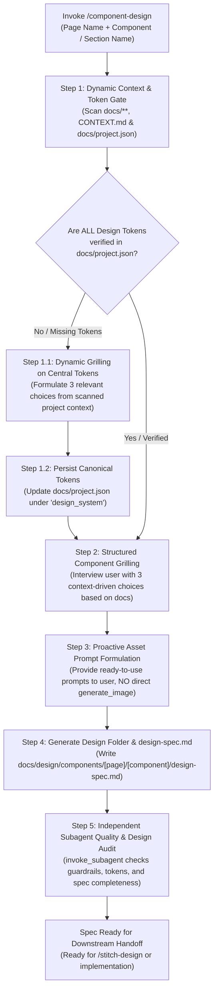

# Component & UI Design Skill (`component-design`)

This skill defines the complete, repeatable workflow for discovering and specifying web and app components, sections, and full pages in any project. It focuses strictly on **User Experience (UX), User Interface (UI), layout architecture, visual aesthetics, typography, color tokens, and producing a comprehensive design specification markdown file (`design-spec.md`)** that can be fed downstream to visual prototyping tools like [`stitch-design`](file:///d:/Scripts/aminwebsite/.agents/skills/stitch-design/SKILL.md) or code implementation workflows.

> [!IMPORTANT]
> **Pure Design Scope (Zero Coding Guardrail):**
> This skill is strictly concerned with design, layout, visual hierarchy, aesthetic tokens, and design specifications. It does **NOT** generate React components, Next.js code, TypeScript props interfaces, component library installation commands (no shadcn/Radix commands), or backend logic. Code implementation is handled in downstream development workflows.

> [!CAUTION]
> **Design Tokens Prerequisite Gate (Tokens First Rule):**
> No component, section, or page design can proceed without a fully verified set of central design tokens in [`docs/project.json`](file:///d:/Scripts/aminwebsite/docs/project.json). The skill MUST first verify all tokens exist; if any are missing, it must grill the user to define them and persist them to `docs/project.json` before drafting any component designs.

> [!TIP]
> **Zero In-Skill Image Generation (Token Conservation Rule):**
> To conserve tokens and maintain user control over visual assets, this skill MUST NOT invoke `generate_image` directly. When bespoke imagery is needed (hero backdrops, diagrams, portraits, brand marks), formulate and output structured image generation prompts directly to the user so they can generate and place the images in the project files.

---

## 1. Core Deliverables & Workflow Overview



### Deliverable 1: Canonical Design Tokens in `docs/project.json`

The single source of truth for the application's visual system. Before any component is designed, the skill verifies and centralizes all brand identity, light and dark color palettes, locale-specific typography pairings, border radii, and elevation scales into [`docs/project.json`](file:///d:/Scripts/aminwebsite/docs/project.json) under the `"design_system"` schema.

### Deliverable 2: The Component Design Specification

Every designed component or section must be saved in a dedicated path structured strictly by page and component:

```text
docs/design/components/[page name]/[component name]/
├── design-spec.md          # Comprehensive UX/UI design specification
└── [user placed assets...] # Bespoke images placed by user from recommended prompts
```

---

## 2. Step-by-Step Execution Workflow

### Step 1: Dynamic Context Discovery & Design Token Verification Gate

> [!IMPORTANT]
> **Dynamic Discovery Rule:** Documentation files in the workspace do not have fixed names. Never assume hardcoded file paths or hardcoded project themes. Dynamically scan all files within the `docs/` directory and root `CONTEXT.md` to extract existing context.

Before designing any component, automatically inspect the workspace to establish context and verify central design tokens:

1. **Scan `docs/**`and`CONTEXT.md`:\*\*
   - Target audience and user personas.
   - Core business objectives and product category.
   - Existing design references, benchmark URLs, and bookmarks.
2. **Scan Supported Locales (`docs/project.json`):**
   - Extract the list of supported languages and layout directions (e.g. `ltr`, `rtl`) from `project_context_and_metadata.supported_languages`.
3. **Inspect Existing Tokens:**
   - Read [`docs/project.json`](file:///d:/Scripts/aminwebsite/docs/project.json) and inspect any existing style files (e.g., `globals.css`, `styles/`).
4. **The Design Token Verification Checklist:**
   Verify whether [`docs/project.json`](file:///d:/Scripts/aminwebsite/docs/project.json) has a complete `"design_system"` object containing:
   - [ ] **Brand Story / Message:** Core emotional tone and visual personality.
   - [ ] **Light Mode Color Palette:** Canvas background/foreground, alternate section background/foreground, elevated card surface, subtle border, primary accent, secondary accent, status colors (success, warning, error, info).
   - [ ] **Dark Mode Color Palette:** Complete dark counterpart for every light token.
   - [ ] **Typography System (Per Locale Object):** An object keyed by each supported locale in the project with `heading_font`, `body_font`, and `code_font`.
   - [ ] **Border Radii:** Base, card, button, badge, modal.
   - [ ] **Elevation / Shadows:** Card shadow, elevated shadow, modal shadow.

---

#### Step 1.1: Dynamic Grilling on Missing Tokens (Context-Driven Options)

> [!IMPORTANT]
> **Zero Hardcoded Repository Assumptions:**
> The options presented during grilling MUST NEVER be hardcoded from any specific project or repository. The agent must dynamically synthesize **3 genuinely relevant choices** formulated entirely from the active project's scanned `docs/**`, `CONTEXT.md`, business goals, and supported languages.
>
> - Formulate 3 distinct, high-quality, and plausible choices directly fitting the project's domain.
> - Mark the single strongest and most coherent choice as `(Recommended)`.
> - Do not include filler options or artificial opposites; all 3 choices must represent legitimate, thoughtful design directions for the active project.

When grilling on missing tokens, formulate dynamic questions covering:

1. **Brand Story & Aesthetic Tone:** Formulate 3 relevant aesthetic philosophies derived from the project's purpose.
2. **Color Palette Strategy (Light & Dark):** Formulate 3 cohesive color combinations (canvas, surfaces, accents, and status tokens) tailored to the project.
3. **Typography System (Per Locale):** Formulate 3 font pairing choices covering heading, body, and monospace fonts for every locale defined in the project's supported languages.
4. **Border Radii & Spatial Geometry:** Formulate 3 geometric curvature scales appropriate for the project's aesthetic.

---

#### Step 1.2: Persist Canonical Tokens to `docs/project.json`

Once established from existing docs or user grilling, update [`docs/project.json`](file:///d:/Scripts/aminwebsite/docs/project.json) under `"design_system"`.

---

### Step 2: Structured User Grilling on Component Intent

With all global design tokens verified and recorded, interview the user regarding the specific component, section, or page to be designed.

> [!IMPORTANT]
> **Context-Driven Component Choices:**
> For each question below, synthesize **3 relevant choices** derived specifically from the active project's documentation, target user persona, and component purpose. Mark the primary fit as `(Recommended)`:

1. **Specific Component Purpose & Story:**
   - What specific task does the visitor accomplish here, and what emotional impression should it leave? Provide 3 relevant options based on component type and project goals.
2. **Spatial Density & Layout Scale:**
   - Provide 3 density options appropriate for the component's role (e.g. data density vs. narrative storytelling vs. visual showcase).
3. **Visual Focal Point & Eye Flow:**
   - Sequence of eye navigation: 1st focal point, 2nd focal point, 3rd focal point.
4. **Media, Accents & Visual Graphics:**
   - Proactively evaluate what visuals are needed: vector brand marks, ambient backdrops, 3D elements, or diagram graphics.

---

### Step 3: Proactive Visual Asset Prompt Formulation

> [!CAUTION]
> **Do NOT Invoke `generate_image` Directly:**
> To conserve tokens, never call `generate_image` in this skill. Instead, evaluate the visual needs of the component and provide structured image generation prompts directly in your response and in `design-spec.md`.

When the component benefits from custom imagery, provide a structured prompt block:

```markdown
### Recommended Visual Asset: [Asset Name]

- **Target File Path:** `docs/design/components/[page]/[component]/[filename].png`
- **Recommended Aspect Ratio:** `16:9` (banners/backdrops), `1:1` (badges/avatars/logos), or `4:3` (cards)
- **Generation Prompt:**
  > "[Detailed, high-fidelity prompt specifying style, lighting, color palette matching tokens, and subject matter]"
```

The user can then generate the image externally and place it directly into the component's folder.

---

### Step 4: Generate Component Folder & `design-spec.md`

Create the component directory at `docs/design/components/[page name]/[component name]/` and write `design-spec.md`.

#### Structure of `design-spec.md`:

1. **Executive Summary & Story:**
   - Component identifier, section type, target persona, emotional tone, and business purpose.
2. **Visual Hierarchy & Spatial Flow:**
   - 1st focal point (primary visual hook), 2nd focal point (content/messaging), 3rd focal point (call to action or secondary details).
3. **Layout Grid & Breakpoints:**
   - Mobile (< 768px): Stacking order, full-width ergonomics, touch spacing.
   - Tablet (768px - 1024px): Responsive transitions, 2-column or wrapping arrangements.
   - Desktop ($\ge$ 1024px): Multi-column grid, max-width constraints, margins, and whitespace.
4. **Design Tokens & Color Mapping:**
   - Light and dark theme mappings referencing canonical tokens in `docs/project.json` (canvas background, surfaces, borders, text, accents, status indicators).
5. **Typography Scale (Per Locale):**
   - Typographic hierarchy (display, headings H1-H4, body text, captions, monospace tags) for each supported locale.
6. **Interaction States Matrix:**
   - State definitions: Default, hover, active, focus rings (keyboard accessibility), disabled, and skeleton/loading state fallbacks.
7. **Bidirectional (RTL) Adaptations:**
   - If RTL locales are supported (e.g. Persian `fa`), document reading order, mirrored layout rules, directional chevron flips, and unmirrored elements (e.g. code snippets, telephone numbers).
8. **Accessibility & Ergonomics:**
   - Contrast ratio compliance (WCAG AA/AAA).
   - Minimum interactive touch target sizes ($\ge 44\text{px} \times 44\text{px}$).
   - Visible focus ring specifications and screen-reader considerations.
9. **Recommended Visual Assets & Prompts:**
   - List of image prompts formulated in Step 3 for user generation.

---

### Step 5: Independent Subagent Quality & Design Audit (`invoke_subagent`)

> [!IMPORTANT]
> **Unbiased Verification Architecture (Subagent Review Loop):**
> To eliminate author confirmation bias and prevent self-grading, the primary design agent MUST NOT self-certify its output. Before presenting the completed design spec to the user, you MUST invoke an independent reviewer subagent using the `invoke_subagent` tool to audit the generated deliverables.

#### 1. Spawn Independent Design Auditor Subagent

Call `invoke_subagent` with:

- `TypeName`: `"self"`
- `Role`: `"Independent Design & UX Auditor"`
- `Model`: `"inherit"`
- `Prompt`: Provide a rigorous design auditing prompt:

```text
You are an independent Senior Design & UX Reviewer. You did NOT generate this design spec. Your job is to audit the completed design deliverables with completely fresh eyes and find any flaws, token mismatches, or guardrail breaches before the user reviews them.

TARGET COMPONENT DIRECTORY:
docs/design/components/[page name]/[component name]/

CANONICAL PROJECT TOKENS:
docs/project.json (under "design_system")

Deliverables to Audit:
1. docs/design/components/[page name]/[component name]/design-spec.md

Audit against these strict criteria:
1. Zero Coding Guardrail: Confirm that NO React components, Next.js directives ('use client'/'use server'), TypeScript prop interfaces, or package installation commands (no shadcn/Radix CLI commands) leaked into design-spec.md. Code implementation belongs strictly downstream.
2. Design System & Token Compliance: Verify that colors (light/dark canvas, surfaces, accents, status), typography (headings, body, code per locale), border radii, and elevation shadows used in design-spec.md strictly align with docs/project.json without arbitrary or hallucinated values.
3. Bilingual & Directional Fidelity: If the project supports RTL languages (e.g. Persian 'fa'), verify design-spec.md provides clear bidirectional mirroring guidelines.
4. Specification Completeness: Verify design-spec.md documents all required sections: Executive Summary, Visual Hierarchy, Breakpoints Grid, Design Tokens, Typography Scale, Interaction States Matrix, BiDi Adaptations, Accessibility (contrast & >= 44px touch targets), and Visual Asset Prompts.
5. Image Generation Rule Compliance: Confirm that generate_image was NOT invoked directly, and that image prompts are clearly structured for user generation.

Respond in this exact format:
VERDICT: PASS | ISSUES_FOUND

ISSUES (if any):
- LOCATION: {file:line or section}
- PROBLEM: {what is non-compliant or broken}
- FIX: {concrete instruction to fix}

SUMMARY: {brief overall evaluation}
```

#### 2. Evaluate Review & Auto-Repair Resolution

1. **Evaluate Subagent Verdict:**
   - **PASS**: The reviewer found no issues. Proceed directly to presenting the completed spec to the user.
   - **ISSUES_FOUND**: The primary design agent MUST immediately resolve all flagged issues in `design-spec.md` (e.g., correcting mismatched token values or filling missing spec sections) before completing execution.
2. **Sanity Check**: Confirm all auditor corrections are applied and clean.

---

## 3. Downstream Handoff

Once `design-spec.md` is complete and verified:

1. **Visual Prototyping**: Invoke [`stitch-design`](file:///d:/Scripts/aminwebsite/.agents/skills/stitch-design/SKILL.md) to scaffold screens and create variants using Google Stitch (`StitchMCP`).
2. **Code Implementation**: Feed `design-spec.md` to component implementation skills (e.g., `nextjs-create-component`).

---

## 4. Execution Verification Checklist

Before declaring completion, ensure:

- [ ] No code or framework implementation instructions (no React, Next.js, or shadcn mentions) exist in deliverables.
- [ ] Central design tokens in [`docs/project.json`](file:///d:/Scripts/aminwebsite/docs/project.json) are verified and up to date.
- [ ] Output directory follows the exact path: `docs/design/components/[page name]/[component name]/`.
- [ ] All grilling options and choices were generated dynamically from the active project's documentation, with zero hardcoded repository assumptions.
- [ ] `generate_image` was NOT invoked directly; recommended image prompts were output for the user.
- [ ] `design-spec.md` is complete, covering visual hierarchy, tokens, per-locale typography, interaction states, and accessibility.
- [ ] **Independent subagent design audit was invoked via `invoke_subagent`, and all flagged issues were resolved.**
