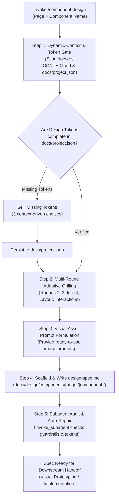

# Component & UI Design Skill (`component-design`)

A structured UX/UI discovery and specification workflow for designing web and application components, sections, and pages. Generates production-ready design specifications (`design-spec.md`) consumable by visual prototyping tools like [`stitch-design`](file:///d:/Scripts/aminwebsite/.agents/skills/stitch-design/SKILL.md) and code implementation workflows.

---

## Guardrails & Core Principles

> [!IMPORTANT]
> **1. Zero Coding Guardrail (Pure Design Scope)**: This skill is strictly concerned with UX, UI, layout architecture, typography, and visual tokens. Never output React components, Next.js directives, TypeScript prop interfaces, or package installation commands (no shadcn/Radix CLI commands). Code implementation is handled in downstream development workflows.

> [!CAUTION]
> **2. Design Tokens Prerequisite Gate (Tokens First Rule)**: No component can be designed without verified canonical design tokens in [`docs/project.json`](file:///docs/project.json). Missing tokens must be grilled and persisted before drafting component designs. See [token-verification-matrix.md](./references/token-verification-matrix.md).

> [!TIP]
> **3. Token Conservation Rule (Zero Direct In-Skill Image Generation)**: Never invoke `generate_image` directly. Formulate structured image generation prompts for the user to generate and place into project directories.

---

## Workflow Overview

---

## Execution Runbook

### Step 1: Dynamic Context Discovery & Design Token Verification Gate

1. **Scan Project Context**: Dynamically inspect all files in `docs/` and root `CONTEXT.md` to extract target personas, business goals, and existing design bookmarks.
2. **Scan Supported Locales**: Read `project_context_and_metadata.supported_languages` in [`docs/project.json`](file:///docs/project.json).
3. **Verify Design Tokens**: Audit [`docs/project.json`](file:///docs/project.json) under `"design_system"` against [token-verification-matrix.md](./references/token-verification-matrix.md).
4. **Grill Missing Tokens**: If tokens are absent, formulate 3 project-tailored options (marking one `(Recommended)`), grill the user, and persist them under `"design_system"`.

### Step 2: Progressive Multi-Round Component Grilling

Execute an adaptive 3-round interview using `ask_question` (or interactive chat), pausing between rounds to ingest user answers. Consult [adaptive-grilling-rounds.md](./references/adaptive-grilling-rounds.md) for full question formulations:

- **Round 1 (Intent & Story)**: Clarify component purpose, user jobs-to-be-done, and emotional tone.
- **Round 2 (Spatial Hierarchy & Grid)**: Tailor multi-column layout, density scales, and focal eye flow based on Round 1 responses.
- **Round 3 (Interactions & Accents)**: Establish hover/focus state dynamics, media assets, and BiDi / RTL nuances based on Rounds 1 & 2.

### Step 3: Proactive Visual Asset Prompt Formulation

If the component requires bespoke graphics, backdrops, or icons, formulate structured generation prompts for the user instead of calling `generate_image`. See prompt block format in [adaptive-grilling-rounds.md](./references/adaptive-grilling-rounds.md).

### Step 4: Scaffold Component Folder & `design-spec.md`

1. Create the directory: `docs/design/components/[page name]/[component name]/`
2. Scaffold `design-spec.md` using the canonical 9-section layout from [design-spec.template.md](./resources/templates/design-spec.template.md):
   - **§1 Executive Summary & Story**
   - **§2 Visual Hierarchy & Spatial Flow**
   - **§3 Layout Grid & Responsive Breakpoints** (Mobile, Tablet, Desktop)
   - **§4 Design Tokens & Color Mapping** (Light & Dark)
   - **§5 Typography Scale** (Per Supported Locale)
   - **§6 Interaction States Matrix** (Default, Hover, Active, Focus, Disabled, Skeleton)
   - **§7 Bidirectional (RTL) Adaptations**
   - **§8 Accessibility & Ergonomics** (WCAG AA/AAA, $\ge 44\text{px}$ touch targets)
   - **§9 Recommended Visual Assets & Prompts**

### Step 5: Independent Subagent Quality Audit (`invoke_subagent`)

To guarantee unbiased quality, invoke an independent reviewer subagent before presenting results to the user:

1. Spawn auditor subagent (`TypeName: "self"`, `Role: "Independent Design & UX Auditor"`, `Model: "inherit"`).
2. Use the structured audit prompt in [subagent-audit-protocol.md](./references/subagent-audit-protocol.md).
3. If `ISSUES_FOUND`, immediately resolve all flagged issues in `design-spec.md` before concluding.

---

## Downstream Handoff

Once `design-spec.md` is approved and verified:

1. **Visual Prototyping**: Trigger [`stitch-design`](file:///d:/Scripts/aminwebsite/.agents/skills/stitch-design/SKILL.md) to generate UI screens and layout variants in Google Stitch.
2. **Code Implementation**: Provide `design-spec.md` to component implementation skills (e.g., `nextjs-component-dev` / `nextjs-create-component`).

---

## Execution Verification Checklist

Before completing execution, confirm:

- [ ] No code or library installation commands (no React, Next.js, shadcn CLI) exist in deliverables.
- [ ] Canonical design tokens in [`docs/project.json`](file:///docs/project.json) are verified and complete.
- [ ] Output directory is structured at `docs/design/components/[page]/[component]/`.
- [ ] Grilling options were dynamically synthesized with zero hardcoded repository assumptions.
- [ ] Component grilling followed progressive adaptive rounds.
- [ ] `generate_image` was NOT called directly; asset prompts were provided to the user.
- [ ] `design-spec.md` includes all 9 required sections.
- [ ] Independent subagent audit was invoked via `invoke_subagent` and all issues resolved.
