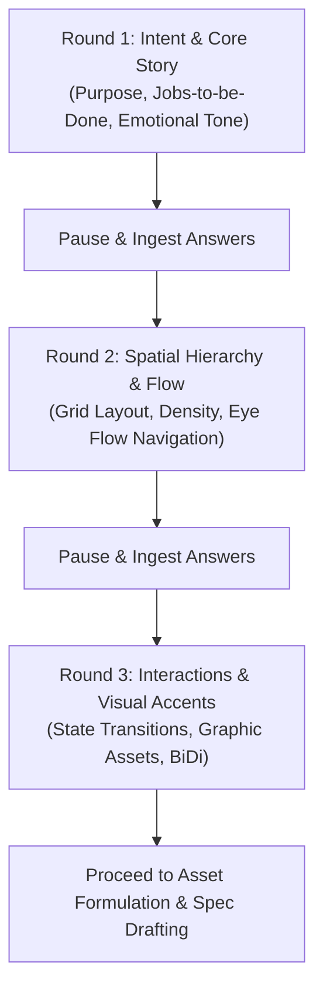

# Adaptive Multi-Round Component Grilling Guide

This guide details the multi-round interactive interview procedure for eliciting precise UX, spatial hierarchy, and interaction requirements for components.

---

## 1. Core Grilling Principles

- **Never Dump Monolithic Questionnaires**: Conduct the interview across **2 to 3 progressive rounds**. Pause after each round and ingest the user's responses.
- **Dynamic Branching**: Use earlier answers to adjust, narrow, and formulate questions for the subsequent round.
- **Context-Driven Options (Zero Hardcoded Assumptions)**:
  - Formulate exactly **3 distinct, realistic, high-quality choices** derived from scanned project docs and prior round answers.
  - Prefix the single strongest option with `(Recommended)`.
  - Avoid filler or generic opposite options.

---

## 2. Multi-Round Interview Sequence



---

### Round 1: Intent, Persona & Emotional Tone

Establish the foundational purpose, user journey, and tone of the component:

1. **Specific Component Purpose & User Job-to-be-Done:**
   - What specific task or decision does the visitor accomplish in this section, and why does it matter to their journey? Formulate 3 relevant options based on component type and project goals.
2. **Emotional Tone & Visual Persona:**
   - What emotional impression and visual attitude should this component convey (e.g., authoritative technical precision vs. friendly high-trust onboarding vs. bold high-contrast showcase)? Formulate 3 options fitting the brand story.

_-> Submit Round 1 questions via `ask_question` or interactive chat and wait for user response._

---

### Round 2: Spatial Hierarchy, Layout Grid & Focal Flow

Ingest Round 1 answers. Knowing the chosen purpose and emotional tone, tailor spatial layout and hierarchy questions:

1. **Layout Structure & Grid Arrangement:**
   - How should content be structured spatially across the viewport (e.g. asymmetrical split-column with sticky visual anchor, multi-column modular card matrix, or stacked editorial flow)? Formulate 3 tailored layout options.
2. **Spatial Density & Scale:**
   - Formulate 3 density scales aligned with the chosen tone (e.g. expansive spacious breathing room, balanced rhythmic content flow, or compact high-information density).
3. **Visual Focal Point & Eye Flow:**
   - Sequence of eye navigation tailored to the chosen layout: 1st focal hook (hero graphic / metric / title), 2nd supporting information (cards / benefits / subtext), 3rd action trigger (CTA button / link / form). Formulate 3 structured flow sequences.

_-> Submit Round 2 questions and wait for user response._

---

### Round 3: Interaction Dynamics, Media Accents & Ergonomics

Ingest answers from Rounds 1 and 2. Knowing the purpose, tone, and spatial layout, interview the user on interactions and visual accents:

1. **Interactive Behavior & State Dynamics:**
   - What hover, focus, and state transitions best elevate the component (e.g. subtle border glow + elevation lift, micro-expand interactive cards, or minimalist static presentation)? Formulate 3 interactive behavior options.
2. **Media, Accents & Visual Graphics:**
   - What visual assets are needed to support the primary focal hook (e.g. custom 3D isometric graphic, ambient glow backdrop, vector diagram/iconography, or typography-only layout)? Formulate 3 visual asset options.
3. **Ergonomic & Locale Nuances:**
   - If the project supports RTL or specific touch requirements, verify if directional adjustments (e.g. asymmetrical alignment flips, mirrored visual paths) or sticky behaviors are needed.

_-> Submit Round 3 questions and wait for user response before drafting specifications._

---

## 3. Visual Asset Prompt Formulation

> [!CAUTION]
> **Token Conservation Rule (Zero Direct In-Skill Image Generation):**
> Never invoke `generate_image` directly within this skill. When bespoke imagery is needed, formulate ready-to-use prompts for the user.

### Structured Asset Prompt Block Format:

```markdown
### Recommended Visual Asset: [Asset Name]

- **Target File Path:** `docs/design/components/[page]/[component]/[filename].png`
- **Recommended Aspect Ratio:** `16:9` (banners/backdrops), `1:1` (badges/avatars/logos), or `4:3` (cards)
- **Generation Prompt:**
  > "[Detailed prompt specifying artistic style, lighting, palette tokens, and subject matter]"
```
