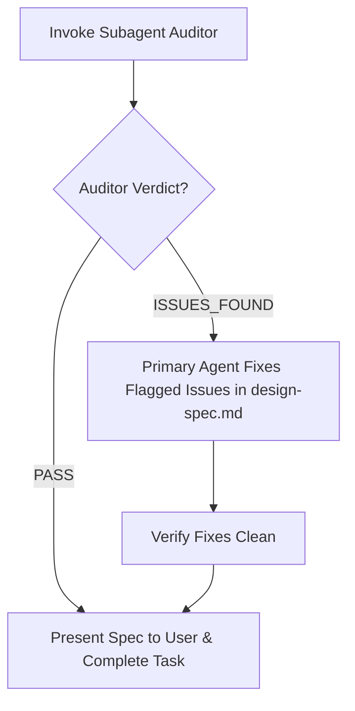

# Independent Subagent Design Audit Protocol

To eliminate author confirmation bias and maintain strict quality standards, the primary design agent must not self-certify its output. Before delivering `design-spec.md`, execute this subagent verification loop.

---

## 1. Auditor Invocation Parameters

Call `invoke_subagent` with the following configuration:

- **`TypeName`**: `"self"`
- **`Role`**: `"Independent Design & UX Auditor"`
- **`Model`**: `"inherit"`
- **`Prompt`**: Use the structured prompt template below.

---

## 2. Auditor Prompt Template

```text
You are an independent Senior Design & UX Reviewer. You did NOT generate this design spec. Your job is to audit the completed design deliverables with completely fresh eyes and find any flaws, token mismatches, or guardrail breaches before the user reviews them.

TARGET COMPONENT DIRECTORY:
docs/design/components/[page name]/[component name]/

CANONICAL PROJECT TOKENS:
docs/project.json (under "design_system")

Deliverables to Audit:
1. docs/design/components/[page name]/[component name]/design-spec.md

Audit against these strict criteria:
1. Zero Coding Guardrail: Confirm that NO React components, Next.js directives ('use client'/'use server'), TypeScript prop interfaces, or package installation commands (no shadcn/Radix CLI commands) leaked into design-spec.md. Code implementation belongs strictly downstream.
2. Design System & Token Compliance: Verify that colors (light/dark canvas, surfaces, accents, status), typography (headings, body, code per locale), border radii, and elevation shadows used in design-spec.md strictly align with docs/project.json without arbitrary or hallucinated values.
3. Bilingual & Directional Fidelity: If the project supports RTL languages (e.g. Persian 'fa'), verify design-spec.md provides clear bidirectional mirroring guidelines.
4. Specification Completeness: Verify design-spec.md documents all required sections: Executive Summary, Visual Hierarchy, Breakpoints Grid, Design Tokens, Typography Scale, Interaction States Matrix, BiDi Adaptations, Accessibility (contrast & >= 44px touch targets), and Visual Asset Prompts.
5. Image Generation Rule Compliance: Confirm that generate_image was NOT invoked directly, and that image prompts are clearly structured for user generation.

Respond in this exact format:
VERDICT: PASS | ISSUES_FOUND

ISSUES (if any):
- LOCATION: {file:line or section}
- PROBLEM: {what is non-compliant or broken}
- FIX: {concrete instruction to fix}

SUMMARY: {brief overall evaluation}
```

---

## 3. Evaluation & Auto-Repair Resolution Loop



1. **PASS**: No issues detected. Proceed immediately to user handoff.
2. **ISSUES_FOUND**: The primary agent must immediately resolve every listed issue (fixing token mismatches, removing leaked code fences, or adding missing spec sections) before completing execution.
