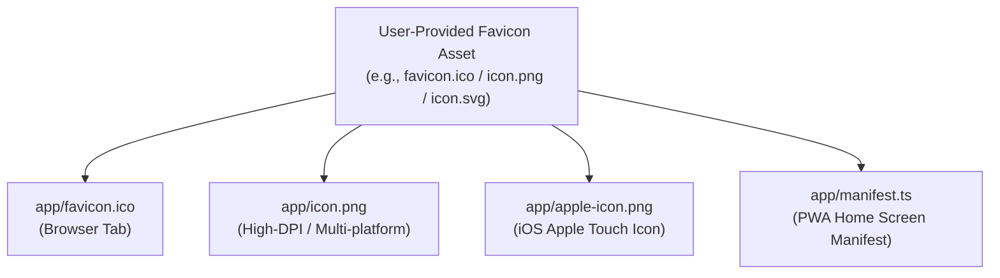

# App Icons, Apple Icon & PWA Manifest Setup Guide

A complete reference for configuring favicons, Apple touch icons, and Progressive Web App (PWA) web manifests in Next.js App Router applications based on official Next.js metadata file conventions.

---

## 1. Next.js App Router Icon File Conventions

Next.js App Router provides built-in, zero-configuration file conventions for application icons placed in the `app/` (or `src/app/`) directory. When these files are present, Next.js automatically generates the corresponding `<link>` tags in the HTML `<head>`.

| Icon Type | File Convention | Valid Extensions | `<head>` Output Tag | Purpose |
| :--- | :--- | :--- | :--- | :--- |
| **Favicon** | `app/favicon.ico` | `.ico` | `<link rel="icon" href="/favicon.ico" sizes="any" />` | Standard browser tab favicon (root segment only). |
| **Web App Icon** | `app/icon.(png\|ico\|svg)` | `.png`, `.ico`, `.svg`, `.jpg`, `.jpeg` | `<link rel="icon" href="/icon?<generated>" type="image/..." sizes="..." />` | High-DPI browser tabs, bookmarks, and shortcuts. |
| **Apple Touch Icon** | `app/apple-icon.(png\|jpg)` | `.png`, `.jpg`, `.jpeg` | `<link rel="apple-touch-icon" href="/apple-icon?<generated>" type="image/..." sizes="..." />` | iOS Home Screen bookmark and Safari touch icon. |
| **Web App Manifest** | `app/manifest.(ts\|json)` | `.ts`, `.js`, `.json`, `.webmanifest` | `<link rel="manifest" href="/manifest.webmanifest" />` | PWA installation metadata and home screen icons. |

---

## 2. User-Provided Favicon Reuse Strategy

In automated setups and standard workflows, the user provides a primary icon or favicon asset (e.g. `favicon.ico`, `favicon.png`, `icon.png`, or `icon.svg`). This single asset serves as the source of truth across all icon endpoints:



### Placement & File Mapping Rules:
1. **Root Favicon (`app/favicon.ico`)**: Place the `.ico` file (or converted ICO/PNG) in the root `app/` segment.
2. **Apple Touch Icon (`app/apple-icon.png`)**: Copy or export the user's icon to `app/apple-icon.png` (standard recommended resolution: 180×180px or higher PNG).
3. **App Icon (`app/icon.png`)**: Colocate `app/icon.png` in the root `app/` directory (standard recommended resolution: 32×32px, 192×192px, or SVG).
4. **PWA Manifest (`app/manifest.ts`)**: Reference `/favicon.ico`, `/icon.png`, and `/apple-icon.png` in the `icons` array of `app/manifest.ts`.

---

## 3. Web App Manifest Setup (`app/manifest.ts`)

Next.js supports generating the Web App Manifest dynamically using TypeScript via the `MetadataRoute.Manifest` type:

```typescript
import type { MetadataRoute } from 'next'

export default function manifest(): MetadataRoute.Manifest {
  return {
    name: 'Application Name',
    short_name: 'AppShortName',
    description: 'Application description and capabilities',
    start_url: '/',
    display: 'standalone',
    background_color: '#ffffff',
    theme_color: '#000000',
    icons: [
      {
        src: '/favicon.ico',
        sizes: 'any',
        type: 'image/x-icon',
      },
      {
        src: '/icon.png',
        sizes: 'any',
        type: 'image/png',
      },
      {
        src: '/apple-icon.png',
        sizes: 'any',
        type: 'image/png',
      },
    ],
  }
}
```

### Key Manifest Properties:
- **`display: 'standalone'`**: Hides browser UI chrome and URL bar when installed to mobile/desktop home screens.
- **`start_url: '/'`**: Launch URL when opened from the home screen icon.
- **`theme_color` & `background_color`**: Colors used for splash screens and system title bars.
- **`icons`**: Array of icon descriptors pointing to static files or generated routes.

---

## 4. Programmatic Icon Generation Alternative (`ImageResponse`)

When static image files are not provided, Next.js allows generating dynamic JSX-based icons at build time using `next/og`:

```typescript
// app/icon.tsx or app/apple-icon.tsx
import { ImageResponse } from 'next/og'

export const size = { width: 32, height: 32 }
export const contentType = 'image/png'

export default function Icon() {
  return new ImageResponse(
    (
      <div
        style={{
          fontSize: 20,
          background: 'black',
          width: '100%',
          height: '100%',
          display: 'flex',
          alignItems: 'center',
          justifyContent: 'center',
          color: 'white',
          borderRadius: '20%',
        }}
      >
        A
      </div>
    ),
    { ...size }
  )
}
```

---

## 5. Reverse Proxy & Service Worker Caching Safeguards

When extending the PWA with service workers or offline features:
1. **Service Worker Headers**: Ensure reverse proxies (Nginx / Traefik) serve `sw.js` with `Cache-Control: no-cache, no-store, must-revalidate` so updates are never blocked by intermediary caches.
2. **HTTPS Requirement**: Modern browsers only permit PWA home screen installation and Service Workers over secure HTTPS contexts (or `localhost`).
