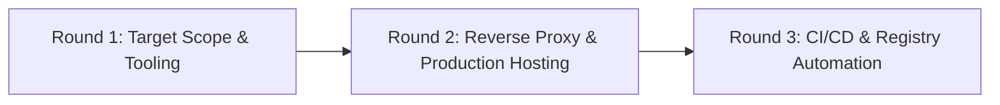

# Interactive Multi-Round Setup Interview (Grilling Runbook)

Conduct the developer setup interview in **progressive, adaptive rounds**. Do not dump a monolithic form. Stop and wait for the user to respond after each round before formulating the next round's questions.

---

## Round 1: Target Scope & Developer Tooling

Probe the user to determine which architectural layers should be scaffolded and enabled in `docs/project.json`:

1. **Testing Suites**:
   - Unit Testing (Jest + React Testing Library)?
   - E2E & Instant Navigation Testing (Playwright)?
   - Component Workshop (Storybook CSF3 + Accessibility addon)?
2. **AI & Code Intelligence MCP Servers**:
   - Next.js Dev Server (`next-devtools`)?
   - Playwright MCP for browser automation?
   - Storybook MCP for visual story inspection?
   - Codebase Memory Graph MCP (`codebase-memory-mcp` with `auto_watch=false`)?
3. **Styling & Design Tokens**:
   - Enforce `@shadcn/lint` and ESLint flat config design token verification?

---

## Round 2: Reverse Proxy & Production Hosting Strategy

Probe the user on the production deployment topology, domain routing, and reverse proxy layer:

1. **Hosting & Reverse Proxy Selection**:
   - **Traefik via Docker Compose**: Automated container discovery using dynamic Compose labels reading from environment variables (`${DOMAIN_NAME}`, `${TRAEFIK_ENTRYPOINT}`, `${TRAEFIK_CERTRESOLVER}`) with anti-buffering middleware.
   - **Nginx via Host System**: Static site configuration in `/etc/nginx/sites-available/<domain>` using Certbot SSL certificates.
   - **Standalone Node / Direct Port**: Running directly on host port without reverse proxy labels.
2. **Domain & Environment Variable Settings**:
   - What is the production domain / base URL (e.g. `https://example.com`)?
   - What environment variables will configure Traefik / container runtime (`DOMAIN_NAME`, `PORT`, `CONTAINER_NAME`)?
   - What is the Certbot domain path for SSL certificates (e.g. `/etc/letsencrypt/live/example.com/`)?
3. **Server Action & Anti-Buffering Safeguards**:
   - Confirm allowed origins for Server Actions (`example.com`, `*.example.com`, `localhost:3000`).
   - Confirm reverse proxy anti-buffering (`X-Accel-Buffering: no`) for Suspense streaming and Partial Prerendering (PPR).

---

## Round 3: CI/CD, Registry Packaging & Git Hooks

Probe the user on repository automation, versioning, and commit conventions:

1. **Git Hooks**:
   - Enable Husky commit-msg checking (`@commitlint/config-conventional`)?
   - Enable Husky pre-push dual test validation (`pnpm run test:all`)?
2. **GitHub Actions CI/CD**:
   - Enable Google Release Please for automated SemVer release PRs and changelogs?
   - Enable automated multi-arch Docker image compilation (AMD64 + ARM64) to GitHub Container Registry (GHCR)?
3. **Execution Protocol**:
   - Present a complete `implementation_plan.md` artifact summarizing all agreed choices before applying changes, and proceed directly with execution without waiting for manual confirmation.
