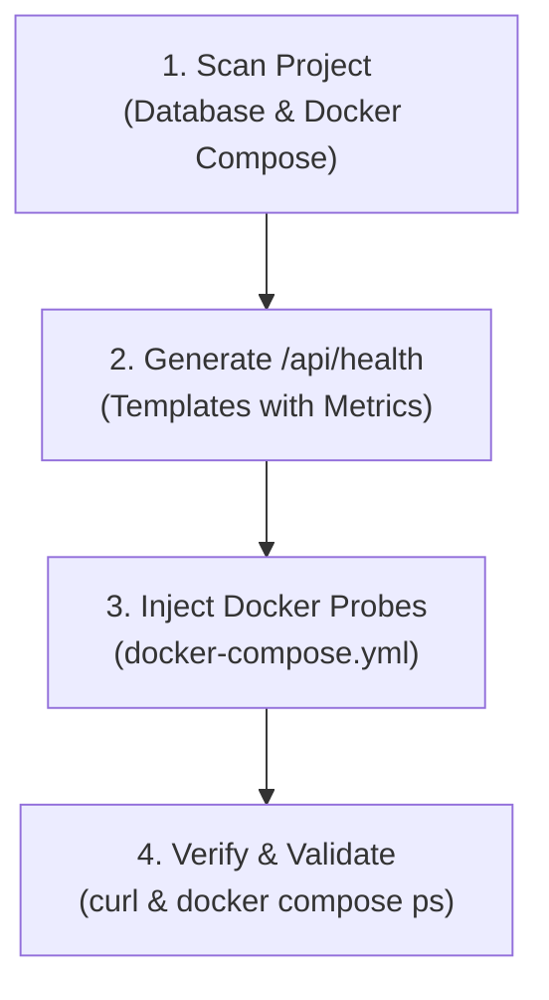

# Next.js Health Check & Observability Skill (`nextjs-healthcheck`)

A modular, production-ready workflow for creating and maintaining health check endpoints (`/api/health`), zero-dependency Docker Compose health probes, and Node.js runtime metrics across Next.js App Router applications.

---

## Workflow Overview



---

## Step-by-Step Execution Runbook

Follow this checklist sequentially to implement and verify application health monitoring:

### 1. Project Discovery & Dependency Inspection

- [ ] **Locate Route Handler Path**: Determine if the project uses `app/` or `src/app/` (target: `app/api/health/route.ts` or `src/app/api/health/route.ts`).
- [ ] **Detect Database / External Stores**: Scan `package.json` for ORMs and clients (Prisma, Drizzle, Supabase, Mongoose, PostgreSQL, Redis). Consult [database-probes.md](./references/database-probes.md).
- [ ] **Locate Docker Compose Files**: Discover `docker-compose.yml`, `docker-compose.prod.yml`, or other compose stacks. Consult [docker-compose-probes.md](./references/docker-compose-probes.md).

### 2. Implement Health Check Route Handler

- [ ] **Select Route Template**:
  - If **No Database**: Deploy [route-no-db.ts.template](./resources/templates/route-no-db.ts.template).
  - If **Database Present**: Deploy [route-with-db.ts.template](./resources/templates/route-with-db.ts.template) and wire project-specific DB client with a strict 2-second timeout.
- [ ] **Enforce Dynamic Execution**: Ensure `export const dynamic = "force-dynamic";` and `Cache-Control: no-store, no-cache, must-revalidate` headers are present.
- [ ] **Configure Non-Blocking Metrics**: Collect V8 heap saturation, event loop delay ($p99$ lag via `perf_hooks`), and process uptime. Consult [status-and-metrics.md](./references/status-and-metrics.md).
- [ ] **Enforce HTTP Status Code Discipline**: Return `200 OK` for `healthy`/`degraded` and `503 Service Unavailable` for `unhealthy`.

### 3. Configure Docker Compose Health Probes

- [ ] **Identify Next.js Services**: Inspect detected compose files for Next.js service blocks (`nextjs-app`, `web`, `app`).
- [ ] **Inject Healthcheck Block**: Add zero-dependency Node.js fetch health probe from [docker-compose.healthcheck.template.yml](./resources/templates/docker-compose.healthcheck.template.yml).

### 4. Verification & Testing

- [ ] **Local API Test**:
  ```bash
  curl -i http://localhost:3000/api/health
  ```
  _Verify HTTP 200 response with valid JSON payload (`status`, `timestamp`, `uptimeSeconds`, `checks`)._
- [ ] **Compose Health Status Check**:
  ```bash
  docker compose ps
  ```
  _Verify service state transitions to `(healthy)` after initial start period._

---

## Edge Cases & Known AI Pitfalls

> [!WARNING]
>
> - **Missing `force-dynamic`**: Next.js App Router may statically evaluate or cache route responses if `export const dynamic = "force-dynamic"` is omitted, causing stale timestamps and frozen uptime metrics.
> - **Hanging Database Connections**: Never query external databases without a race timeout (max 2000ms). Unhandled network latency will cascade into request pool exhaustion.
> - **External Tool Dependencies in Containers**: Do not rely on `curl` or `wget` in Docker health checks; production minimal images (e.g. `node:alpine` or distroless) often lack them. Use Node.js native `fetch` via `node -e`.
> - **Secret Leaks**: Never print database connection URLs, passwords, or internal raw error traces in the public `/api/health` response payload.

---

## Output Summary Schema

Upon completing health check setup, provide a concise summary report:

```markdown
### Health Monitoring Configuration Complete

- **Route Handler**: `[app/api/health/route.ts](file:///...)`
- **Database Probes**: [Configured: Prisma / Drizzle / None] (Timeout: 2000ms)
- **Runtime Metrics**: V8 Heap Saturation & Event Loop Delay (p99)
- **Docker Compose Stacks Updated**: `docker-compose.yml`, `docker-compose.prod.yml`
- **Verification Status**: PASSED (HTTP 200 / Container Healthy)
```

---

## Reference Guides & Templates

- [Status Codes & Metrics Reference](./references/status-and-metrics.md) — Architectural status matrix, memory formulas, and lag thresholds.
- [Database Probes Reference](./references/database-probes.md) — Detection checklist, timeout wrapping, and ORM probe patterns.
- [Docker Compose Probes Reference](./references/docker-compose-probes.md) — Service matching rules and zero-dependency fetch definitions.
- [Route Template (No DB)](./resources/templates/route-no-db.ts.template) — Complete route handler for stateless apps.
- [Route Template (With DB)](./resources/templates/route-with-db.ts.template) — Complete route handler with dependency probes.
- [Docker Compose Healthcheck Template](./resources/templates/docker-compose.healthcheck.template.yml) — Reusable compose snippet.
