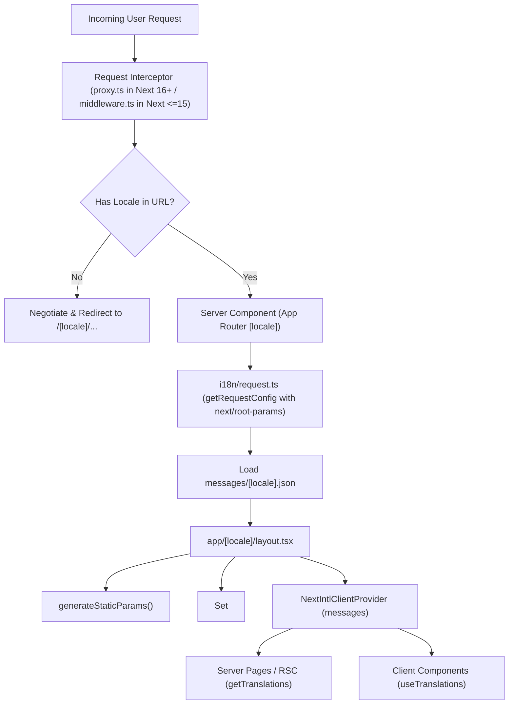

# Next.js App Router i18n Skill (`nextjs-i18n`)

This skill provides step-by-step instructions, architectural rules, code templates, and automated verification for integrating **`next-intl`** into an **existing Next.js App Router project**. It guides the full migration to locale-based routing (`/[locale]/...`), type-safe translations, BiDi (LTR/RTL) directionality, and static rendering optimization via modern **`next/root-params`** with zero regressions to existing features across **Next.js 16+ (`proxy.ts`)** and **Next.js <=15 (`middleware.ts`)**.

The default location for translation dictionaries is **`messages/`** at the project root (`messages/[locale].json`).

---

## Documentation & Primary References

- [Next.js App Router internationalization (i18n) – Setup locale-based routing](https://next-intl.dev/docs/routing/setup)
- [next-intl Routing Configuration Reference](https://next-intl.dev/docs/routing)
- [next-intl Server & Client Components Guide](https://next-intl.dev/docs/environments/server-client-components)
- [next-intl Request Configuration Reference](https://next-intl.dev/docs/usage/configuration)

---

## 1. Core Architecture & Mental Model

`next-intl` integrates natively with Next.js App Router by establishing a server-first internationalization pipeline:



### Key Architectural Concepts:

1. **Locale-Based Routing (`/[locale]` Dynamic Segment):** All application routes are placed inside the `app/[locale]/` folder, ensuring search engines, users, and server caches have dedicated URLs per locale (e.g. `/en/about`, `/fa/about`).
2. **Centralized Routing Config (`i18n/routing.ts`):** Single source of truth for supported locales, default locale, domain routing, and path prefixing strategies via `defineRouting`.
3. **Request Configuration (`i18n/request.ts` with `next/root-params`):** Server hook executed on every request via `getRequestConfig` to load translation JSON dictionaries from `messages/${locale}.json`. It resolves the matched locale from `next/root-params` (`await rootParams.locale()`), eliminating the deprecated `requestLocale` and legacy `setRequestLocale()` boilerplate.
4. **Navigation Helpers (`i18n/navigation.ts`):** Locale-aware wrappers around Next.js navigation (`Link`, `redirect`, `usePathname`, `useRouter`, `getPathname`) produced by `createNavigation(routing)`.
5. **Next.js Bundler Plugin (`next.config.ts`):** Wraps Next.js config with `createNextIntlPlugin()` to automatically link request configuration to React Server Components.
6. **Request Interceptor (`proxy.ts` in Next.js 16+ / `middleware.ts` in Next.js <=15):** 
   - **Next.js 16+ replaces `middleware.ts` with `proxy.ts` (`src/proxy.ts` or `proxy.ts`).**
   - **Next.js <=15 uses `src/middleware.ts` (or `middleware.ts`).**
   - In both cases, `createMiddleware(routing)` is exported with a matcher regex to negotiate headers, detect preferred locale, and rewrite/redirect paths without affecting static assets or APIs.
7. **Type-Safe Messages (`global.d.ts`):** Augments `AppConfig` so TypeScript validates message namespace and key paths at compile time with autocomplete from `@/messages/en.json`.

---

## 2. Project Configuration & Metadata Integration

> [!IMPORTANT]
> **MANDATORY PROJECT.JSON CONFIGURATION:**
> Whenever `nextjs-i18n` runs, it must ensure `docs/project.json` contains:
> - `"dictionaries_dir": "messages"` (default directory for translation files)
> - `"dictionary_file_pattern": "[locale].json"`

Before executing setup steps, read `docs/project.json` (or `docs/PROJECT.JSON`) at the workspace root to parse `project_context_and_metadata`.

Extract:
- `package_manager`: e.g. `pnpm`, `npm`, `yarn`, `bun`.
- `supported_languages`: array of locale objects (`language_code`, `direction`, `native_name`, `country_code`, `currency_code`, `calendar_type`).
- `dictionaries_dir`: defaults to `"messages"`.
- `dictionary_file_pattern`: defaults to `"[locale].json"`.
- `style_file_dir`: stylesheet location to verify BiDi / font rules.

If `docs/project.json` is missing or missing i18n dictionary fields, create or update `docs/project.json` to persist `dictionaries_dir: "messages"` and `dictionary_file_pattern: "[locale].json"`.

---

## 3. Step-by-Step Implementation Workflow

- [ ] **Step 0: Project Layout & Next.js Version Audit**
  - Read `docs/project.json` or inspect repository layout.
  - Determine if the project uses `src/app/` or `app/` (stored as `BASE_DIR`).
  - Detect current Next.js version in `package.json`:
    - **Next.js 16+**: Uses `[BASE_DIR]/proxy.ts` (`src/proxy.ts` or `proxy.ts`). If an existing `middleware.ts` is found, migrate and rename it to `proxy.ts`.
    - **Next.js 15 and earlier**: Uses `[BASE_DIR]/middleware.ts` (`src/middleware.ts` or `middleware.ts`).

- [ ] **Step 1: Install `next-intl` Package**
  - Run the package manager installation command:
    ```bash
    # For pnpm:
    pnpm add next-intl
    # For bun:
    bun add next-intl
    # For npm:
    npm install next-intl
    # For yarn:
    yarn add next-intl
    ```

- [ ] **Step 2: Update `docs/project.json` Configuration**
  - Ensure `docs/project.json` under `project_context_and_metadata` has:
    ```json
    "dictionaries_dir": "messages",
    "dictionary_file_pattern": "[locale].json"
    ```

- [ ] **Step 3: Create Centralized Routing Configuration (`[BASE_DIR]/i18n/routing.ts`)**
  - Define all supported locales and the default locale using `defineRouting`.
  - Match locales defined in `docs/project.json` `supported_languages`.

- [ ] **Step 4: Create Server Request Handler (`[BASE_DIR]/i18n/request.ts`)**
  - Use `next/root-params` (`import * as rootParams from 'next/root-params'`) to read the matched locale parameter.
  - Avoid deprecated `requestLocale`.
  - Handle invalid/unsupported locales with `notFound()`.
  - Dynamically load the dictionary JSON file from `../messages/${locale}.json` (or `@/messages/${locale}.json`).

- [ ] **Step 5: Create Navigation Utilities (`[BASE_DIR]/i18n/navigation.ts`)**
  - Call `createNavigation(routing)` and export localized `Link`, `redirect`, `usePathname`, `useRouter`, and `getPathname`.

- [ ] **Step 6: Configure Next.js Plugin (`next.config.ts` / `next.config.mjs`)**
  - Import `createNextIntlPlugin` from `next-intl/plugin`.
  - Wrap the existing `nextConfig` with `withNextIntl(nextConfig)`.
  - Ensure existing Webpack, Turbopack, or remote image configurations are preserved without changes.

- [ ] **Step 7: Setup Request Interceptor (`[BASE_DIR]/proxy.ts` for Next.js 16+ or `[BASE_DIR]/middleware.ts` for Next.js <=15)**
  - For **Next.js 16+**, create `src/proxy.ts` (or `proxy.ts` at root) exporting `proxy` function and default export.
  - For **Next.js <=15**, create `src/middleware.ts` (or `middleware.ts` at root).
  - Create the interceptor handler using `createMiddleware(routing)`.
  - Configure the route `matcher` regex to exclude Next.js internals (`_next`), Vercel internals (`_vercel`), API routes (`/api`, `/trpc`), and static asset files containing dots (`favicon.ico`, `.svg`, `.png`, `.webp`).

- [ ] **Step 8: Setup Translation Dictionaries (`messages/[locale].json`)**
  - In `messages/` (at root), create JSON dictionary files for each locale in `supported_languages` (e.g. `messages/en.json`, `messages/fa.json`), organized by logical namespaces (`common`, `navigation`, `home`, `metadata`).
  - Ensure identical key hierarchies exist across all translation files.

- [ ] **Step 9: Migrate Existing App Router Files to `app/[locale]/`**
  - Move existing top-level `app/` routes (`page.tsx`, `layout.tsx`, `not-found.tsx`, `error.tsx`, and feature directories) into `app/[locale]/`.
  - **Preserve Non-Localized Endpoints:** Keep `app/api/`, `app/robots.ts`, `app/sitemap.ts`, and `app/manifest.ts` outside `[locale]` if they are global.
  - In `app/[locale]/layout.tsx`:
    - Call `generateStaticParams()` to return `{ locale }` objects for SSG/ISR.
    - Set `<html lang={locale} dir={localeMetadata.direction}>` dynamically (e.g. `dir="rtl"` for Persian/Arabic, `dir="ltr"` for English).
    - Load messages via `await getMessages()` and wrap children in `<NextIntlClientProvider messages={messages}>`.
    - Apply locale-specific fonts (e.g. Geist/Inter for `en`, Vazirmatn/Sahel for `fa`).

- [ ] **Step 10: Setup TypeScript Type Augmentation (`global.d.ts`)**
  - Create or update `global.d.ts` (or `src/types/global.d.ts`) to declare the `AppConfig` interface referencing `@/messages/en.json`.
  - This unlocks compile-time type-safety and autocompletion for `t('namespace.key')`.

- [ ] **Step 11: Migrate Existing Links to Localized Navigation**
  - Search existing components for `import Link from 'next/link'` or `useRouter` from `next/navigation`.
  - Replace internal navigation imports with `Link` and `useRouter` from `@/i18n/navigation`.

- [ ] **Step 12: Execute Verification & Build**
  - Run `pnpm run build` and `pnpm run lint` to verify clean compilation and zero TypeScript/ESLint errors.

---

## 4. Reference Implementation Templates

### 1. Routing Configuration (`src/i18n/routing.ts` or `i18n/routing.ts`)

```typescript
import { defineRouting } from "next-intl/routing";

/**
 * Centralized i18n routing definition.
 */
export const routing = defineRouting({
  // All supported locale identifiers
  locales: ["en", "fa"],

  // Default fallback locale when no prefix is matched
  defaultLocale: "en",

  // Prefix strategy: 'always' (default), 'as-needed', or 'never'
  localePrefix: "always",
});

export type Locale = (typeof routing.locales)[number];
```

---

### 2. Request Configuration (`src/i18n/request.ts` or `i18n/request.ts` with `next/root-params`)

```typescript
import * as rootParams from "next/root-params";
import { notFound } from "next/navigation";
import { getRequestConfig } from "next-intl/server";
import { hasLocale } from "next-intl";
import { routing } from "./routing";

export default getRequestConfig(async ({ locale }) => {
  if (!locale) {
    const paramValue = await rootParams.locale();
    if (hasLocale(routing.locales, paramValue)) {
      locale = paramValue;
    } else {
      notFound();
    }
  }

  return {
    locale,
    // Dynamically load the JSON dictionary for the matched locale from messages/
    messages: (await import(`../messages/${locale}.json`)).default,
  };
});
```

---

### 3. Localized Navigation Utilities (`src/i18n/navigation.ts` or `i18n/navigation.ts`)

```typescript
import { createNavigation } from "next-intl/navigation";
import { routing } from "./routing";

/**
 * Lightweight locale-aware navigation wrappers.
 */
export const { Link, redirect, usePathname, useRouter, getPathname } =
  createNavigation(routing);
```

---

### 4. Next.js Plugin Configuration (`next.config.ts`)

```typescript
import type { NextConfig } from "next";
import createNextIntlPlugin from "next-intl/plugin";

// Automatically discovers src/i18n/request.ts or i18n/request.ts
const withNextIntl = createNextIntlPlugin();

const nextConfig: NextConfig = {
  // Preserve existing Next.js configuration options here
  reactStrictMode: true,
};

export default withNextIntl(nextConfig);
```

---

### 5. Request Interceptor (`proxy.ts` vs `middleware.ts`)

#### 5A. Next.js 16+ (`src/proxy.ts` or `proxy.ts`)

> In **Next.js 16+**, `middleware.ts` is replaced with `proxy.ts` located at the project root or in `src/`.

```typescript
import createMiddleware from "next-intl/middleware";
import type { NextRequest } from "next/server";
import { routing } from "./i18n/routing";

const handleRequest = createMiddleware(routing);

/**
 * Next.js 16+ proxy interceptor for locale negotiation and redirects.
 */
export function proxy(request: NextRequest) {
  return handleRequest(request);
}

export default proxy;

export const config = {
  // Match all pathnames except for:
  // - API routes (/api, /trpc)
  // - Next.js and Vercel internals (/_next, /_vercel)
  // - Static files containing a dot (e.g. favicon.ico, logo.svg, images)
  matcher: ["/((?!api|trpc|_next|_vercel|.*\\..*).*)"],
};
```

#### 5B. Next.js <=15 (`src/middleware.ts` or `middleware.ts`)

> In **Next.js 15 and earlier**, request interception is placed in `middleware.ts`.

```typescript
import createMiddleware from "next-intl/middleware";
import { routing } from "./i18n/routing";

/**
 * Next.js <=15 middleware interceptor for locale negotiation and redirects.
 */
export default createMiddleware(routing);

export const config = {
  // Match all pathnames except for:
  // - API routes (/api, /trpc)
  // - Next.js and Vercel internals (/_next, /_vercel)
  // - Static files containing a dot (e.g. favicon.ico, logo.svg, images)
  matcher: ["/((?!api|trpc|_next|_vercel|.*\\..*).*)"],
};
```

---

### 6. Root Locale Layout (`src/app/[locale]/layout.tsx` or `app/[locale]/layout.tsx`)

```tsx
import React from "react";
import type { Metadata } from "next";
import { notFound } from "next/navigation";
import { hasLocale, NextIntlClientProvider } from "next-intl";
import { getMessages, getTranslations } from "next-intl/server";
import { routing, type Locale } from "@/i18n/routing";

export function generateStaticParams() {
  return routing.locales.map((locale) => ({ locale }));
}

interface LocaleLayoutProps {
  children: React.ReactNode;
  params: Promise<{ locale: string }>;
}

export async function generateMetadata({
  params,
}: {
  params: Promise<{ locale: string }>;
}): Promise<Metadata> {
  const { locale } = await params;
  if (!hasLocale(routing.locales, locale)) {
    return {};
  }
  const t = await getTranslations({ locale, namespace: "metadata" });
  return {
    title: t("title"),
    description: t("description"),
  };
}

export default async function LocaleLayout({
  children,
  params,
}: LocaleLayoutProps): Promise<React.JSX.Element> {
  const { locale } = await params;

  // Validate locale segment
  if (!hasLocale(routing.locales, locale)) {
    notFound();
  }

  // Load all messages for the current locale
  const messages = await getMessages();

  // Resolve direction (RTL for fa/ar, LTR for en/de/etc.)
  const isRtl = locale === "fa" || locale === "ar";
  const direction = isRtl ? "rtl" : "ltr";

  return (
    <html lang={locale} dir={direction}>
      <body className="min-h-screen bg-background text-foreground antialiased">
        <NextIntlClientProvider messages={messages}>
          {children}
        </NextIntlClientProvider>
      </body>
    </html>
  );
}
```

---

### 7. TypeScript Type Augmentation (`src/types/global.d.ts` or `global.d.ts`)

```typescript
import type en from "@/messages/en.json";

type Messages = typeof en;

declare module "next-intl" {
  interface AppConfig {
    Messages: Messages;
  }
}
```

---

### 8. Translation Dictionaries (`messages/en.json` & `messages/fa.json`)

#### `messages/en.json`:

```json
{
  "common": {
    "brand": "Portfolio",
    "switch_language": "Change Language",
    "theme_toggle": "Toggle Theme"
  },
  "navigation": {
    "home": "Home",
    "about": "About",
    "projects": "Projects",
    "contact": "Contact"
  },
  "home": {
    "hero_title": "Full-Stack Engineer & Architect",
    "hero_description": "Crafting high-performance web experiences and AI-powered systems.",
    "cta_projects": "View Projects",
    "cta_contact": "Get in Touch"
  }
}
```

#### `messages/fa.json`:

```json
{
  "common": {
    "brand": "پورتفولیو",
    "switch_language": "تغییر زبان",
    "theme_toggle": "تغییر پوسته"
  },
  "navigation": {
    "home": "خانه",
    "about": "درباره من",
    "projects": "پروژه‌ها",
    "lab": "آزمایشگاه",
    "contact": "تماس"
  },
  "home": {
    "hero_title": "مهندس ارشد فول‌استک و معمار سیستم",
    "hero_description": "طراحی و پیاده‌سازی سیستم‌های مدرن وب با کارایی بالا و هوش مصنوعی.",
    "cta_projects": "مشاهده پروژه‌ها",
    "cta_contact": "ارتباط با من"
  }
}
```

---

## 5. Server vs Client Component Usage Guide

| Context                        | Hook / API                                | Example Code                                                       | Notes                                                                |
| :----------------------------- | :---------------------------------------- | :----------------------------------------------------------------- | :------------------------------------------------------------------- |
| **Server Component (RSC)**     | `getTranslations` (async)                 | `const t = await getTranslations('home');`                         | Direct async call on server; zero client JS bundle cost.             |
| **Client Component**           | `useTranslations` (hook)                  | `const t = useTranslations('navigation');`                         | Requires `"use client"` and `<NextIntlClientProvider>`.              |
| **Formatted Numbers/Currency** | `getFormatter` / `useFormatter`           | `format.number(1250, {style: 'currency', currency: 'USD'})`        | Native localized number formatting.                                  |
| **Formatted Dates/Times**      | `getFormatter` / `useFormatter`           | `format.dateTime(new Date(), {dateStyle: 'full'})`                 | Handles Gregorian vs Persian/Solar Hijri calendars.                  |
| **Dynamic Rich Text**          | `t.rich('key', { b: (c) => <b>{c}</b> })` | `t.rich('terms', { link: (c) => <Link href="/terms">{c}</Link> })` | Renders nested React elements inside translated strings.             |
| **Localized Dynamic Metadata** | `getTranslations` in `generateMetadata`   | `export async function generateMetadata({ params }) { ... }`       | Generates localized `<title>`, `<meta>`, and `alternates.languages`. |

---

## 6. BiDi (RTL / LTR) & Styling Standards

When building bilingual applications (e.g. English `ltr` and Persian `rtl`):

1. **Strict Tailwind Logical Properties:**
   - **Forbidden:** Physical properties (`ml-4`, `mr-4`, `pl-2`, `pr-2`, `left-0`, `right-0`, `text-left`, `text-right`).
   - **Required:** Logical properties (`ms-4`, `me-4`, `ps-2`, `pe-2`, `start-0`, `end-0`, `text-start`, `text-end`).
2. **Dynamic HTML Attributes:**
   - Root layout MUST set `dir={isRtl ? "rtl" : "ltr"}` and `lang={locale}`.
3. **Font Adaptation:**
   - Use CSS variables or Tailwind conditional font classes based on locale (e.g., Persian typeface `font-vazirmatn` for `fa`, sans-serif for `en`).

---

## 7. Common Edge Cases & Anti-Patterns

| Anti-Pattern / Mistake                                          | Root Cause                                                               | Proper Solution                                                                                                                                    |
| :-------------------------------------------------------------- | :----------------------------------------------------------------------- | :------------------------------------------------------------------------------------------------------------------------------------------------- |
| **Using deprecated `requestLocale` in `getRequestConfig`**      | `requestLocale` is deprecated in `next-intl` in favor of `next/root-params`. | Use `import * as rootParams from 'next/root-params'` and `await rootParams.locale()`.                                                             |
| **Using legacy `setRequestLocale()` boilerplate**               | `setRequestLocale()` is a legacy stopgap superseded by `next/root-params`. | With `next/root-params` in `i18n/request.ts` and `generateStaticParams()`, `setRequestLocale()` is no longer required.                             |
| **Using `middleware.ts` in Next.js 16+**                        | In Next.js 16+, `middleware.ts` is replaced by `proxy.ts`.               | Create `proxy.ts` (or `src/proxy.ts`) with named export `export function proxy(...)` and default export.                                           |
| **Using `proxy.ts` in Next.js <=15**                            | Next.js 15 and earlier versions do not recognize `proxy.ts`.             | Rename `proxy.ts` to `src/middleware.ts` (or `middleware.ts`).                                                                                    |
| **Both `proxy.ts` and `middleware.ts` coexisting**              | Lingering legacy `middleware.ts` after migrating to Next.js 16+.         | Remove the redundant `middleware.ts` and keep only `proxy.ts`.                                                                                    |
| **Hydration mismatch on `<html lang>` / `<html dir>`**          | Layout renders fixed `dir="ltr"` while server is rendering `rtl` locale. | Dynamically assign `dir={isRtl ? "rtl" : "ltr"}` from `params.locale` in `app/[locale]/layout.tsx`.                                                |
| **Static rendering disabled / De-opt to SSR**                   | Missing `generateStaticParams()`.                                        | Add `generateStaticParams()` returning `[{ locale: 'en' }, { locale: 'fa' }]`.                                                                   |
| **404 loop on static assets (favicon, images, robots.txt)**     | Interceptor matcher catches static files.                                | Ensure `matcher` in `proxy.ts`/`middleware.ts` excludes `.*\\..*`, `_next`, `_vercel`, and `/api`.                                                 |
| **Typo in translation key going unnoticed**                     | Missing TypeScript type augmentation.                                    | Augment `AppConfig.Messages` in `global.d.ts` from `@/messages/en.json`.                                                                           |
| **Broken navigation with raw `<a>` or unlocalized `next/link`** | Using standard `next/link` without locale prefix.                        | Import `Link` from `@/i18n/navigation` which automatically prepends the active locale.                                                             |
| **Calling `useTranslations` in Server Component**               | Hooks cannot be called in async RSC.                                     | Use `const t = await getTranslations('namespace')` in Server Components.                                                                           |

---

## 8. Verification & Sanity Check Execution

Before declaring completion of i18n setup:

1. **Execute Project Build / Type Check:**
   ```bash
   pnpm run build # or detected package manager
   ```
2. **Execute Linter:**
   ```bash
   pnpm run lint
   ```
3. **Output Execution Summary:**
   Present the final status of all created/modified files, detected locales, directionality mapping, and navigation updates to the user.
