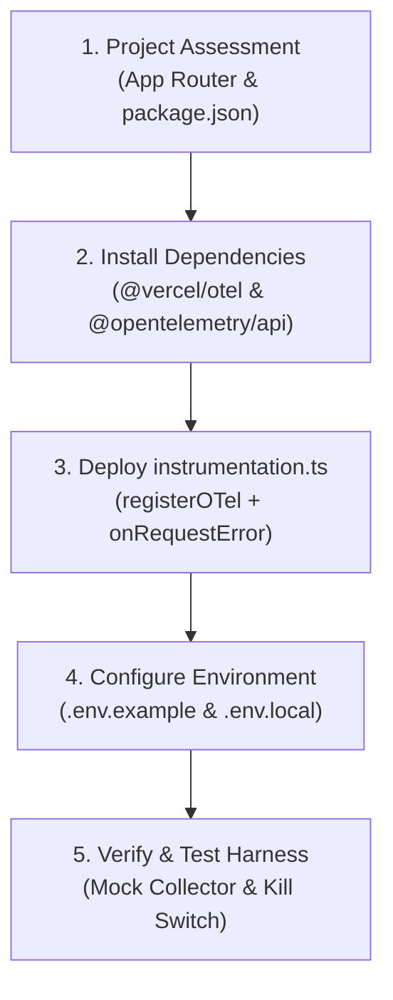

# Next.js OpenTelemetry Observability Skill (`nextjs-otel`)

A modular, production-ready workflow for configuring, testing, and verifying OpenTelemetry tracing in Next.js App Router applications, standardizing on a single kill switch, safeguarding against `@vercel/otel` initialization bugs, and automating trace verification.

---

## Workflow Overview



---

## Step-by-Step Execution Runbook

Follow this checklist sequentially to configure and verify OpenTelemetry observability:

### 1. Project Discovery & Dependency Inspection

- [ ] **Inspect Project Structure**: Confirm Next.js App Router version in `package.json` and package manager (`pnpm`, `bun`, `npm`).
- [ ] **Locate Instrumentation Root**: Check whether the project uses root `instrumentation.ts` or `src/instrumentation.ts`.
- [ ] **Review Architectural Standards**: Consult [architectural-standards.md](./references/architectural-standards.md) for single kill switch discipline and runtime boundaries.

### 2. Dependency Installation

- [ ] **Install Core Telemetry Packages**:
  ```powershell
  pnpm add @vercel/otel @opentelemetry/api
  ```

### 3. Deploy `instrumentation.ts`

- [ ] **Create Instrumentation File**: Deploy [instrumentation.ts.template](./resources/templates/instrumentation.ts.template) to root or `src/`.
- [ ] **Apply Truthiness Safeguard**: Ensure `register()` deletes `process.env.OTEL_SDK_DISABLED` when not strictly `"true"` to avoid `@vercel/otel` boolean evaluation bugs.
- [ ] **Wire Error Tracking**: Ensure `onRequestError()` captures `next.error.digest`, route path, and HTTP metadata onto active spans.

### 4. Configure Environment Variables

- [ ] **Update Environment Templates**: Inject OpenTelemetry configuration into `.env.example` and `.env.local` using [env.otel.template](./resources/templates/env.otel.template).
- [ ] **Set Service Name & Protocol**: Configure `OTEL_SERVICE_NAME`, `OTEL_EXPORTER_OTLP_ENDPOINT`, and `OTEL_EXPORTER_OTLP_PROTOCOL=http/json`.

### 5. Verification & Testing

- [ ] **Start Mock OTLP Collector**: Launch test collector on port 4318 per [verification-and-testing.md](./references/verification-and-testing.md):
  ```powershell
  node .agents/skills/nextjs-otel/scripts/mock_collector.js
  ```
- [ ] **Verify Active Traces (`OTEL_SDK_DISABLED=false`)**: Trigger test requests (`curl http://localhost:3000/`) and verify `POST /v1/traces` batches with HTTP 200 OK.
- [ ] **Verify Kill Switch (`OTEL_SDK_DISABLED=true`)**: Confirm Next.js server logs `[OTel] Instrumentation hook skipped` and exports 0 traces.
- [ ] **Output Verification Report**: Generate Markdown summary report.

---

## Edge Cases & Known AI Pitfalls

> [!WARNING]
>
> - **The `@vercel/otel` String Truthiness Bug**: `@vercel/otel` evaluates `!!process.env.OTEL_SDK_DISABLED`. In JavaScript, `Boolean("false")` is `true`. Without deleting `process.env.OTEL_SDK_DISABLED` when not `'true'`, setting `OTEL_SDK_DISABLED=false` disables tracing silently.
> - **Secondary Custom Flags**: Never introduce `OTEL_ENABLED` alongside `OTEL_SDK_DISABLED`. Standardize strictly on `OTEL_SDK_DISABLED`.
> - **Runtime Boundary Violations**: Never import `instrumentation.ts` or server OpenTelemetry SDKs into Client Components (`"use client"`).
> - **Chained Commands**: Never chain commands (`&&`, `||`, `;`). Execute all setup and test commands individually.

---

## Output Summary Schema

Upon completing OpenTelemetry setup or verification, output a structured report:

```markdown
# OpenTelemetry Verification Report

## Status Summary

- **OTel Status**: Active / Disabled
- **Service Name**: <configured_service_name>
- **Target Endpoint**: <configured_endpoint>
- **Exporter Protocol**: http/json | http/protobuf

## Verification Results

| Check                   | Expected                 | Actual             | Status |
| :---------------------- | :----------------------- | :----------------- | :----- |
| Initialization Hook     | Registered               | Registered         | PASS   |
| Trace Dispatch (Active) | POST /v1/traces (200 OK) | X batches received | PASS   |
| Kill Switch (Disabled)  | Skipped, 0 traces        | Skipped, 0 traces  | PASS   |
| Type Check              | 0 errors                 | 0 errors           | PASS   |
```

---

## Reference Guides & Templates

- [Architectural Standards Reference](./references/architectural-standards.md) — Kill switch discipline, truthiness bug mechanics, and error context.
- [Verification & Testing Runbook](./references/verification-and-testing.md) — Test harness instructions, curl triggers, and kill switch verification.
- [Instrumentation Template](./resources/templates/instrumentation.ts.template) — Complete `instrumentation.ts` with error handling.
- [Environment Config Template](./resources/templates/env.otel.template) — Complete `.env` configuration keys.
- [Mock Collector Script](./scripts/mock_collector.js) — Lightweight Node.js OTLP HTTP collector harness.
