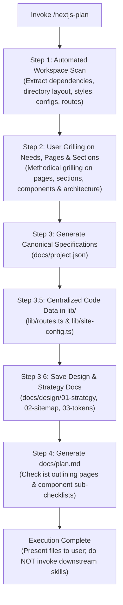

# Next.js Project Planning Skill (`nextjs-plan`)

This skill defines the complete workflow for planning a Next.js App Router project from concept to launch. When invoked, it automatically extracts known technical specifications from existing workspace files, conducts a targeted grilling interview on the user's general needs, pages, sections, and components, and outputs two core files inside `./docs`:

1. **`docs/project.json`**: The canonical technical specifications and metadata schema (single source of truth).
2. **`docs/plan.md`**: An actionable, chronological checklist (`- [ ]`) configured to take the project from an **empty workspace** all the way to **where the project currently is / target state**. In Step 1, every page is outlined as a checklist item with all of its components as sub-checklists, where a page is ticked off only when all its components are designed.

---

## 1. Core Deliverables & Workflow Overview



### Deliverable 1: `docs/project.json` (The Specifications)

A machine-readable JSON configuration specifying package manager, component paths, global styling, component libraries, animation libraries, testing libraries, and internationalization configuration.

### Deliverable 2: `docs/plan.md` (The Checklist)

A comprehensive, phased checklist file (`- [ ]`) outlining the steps necessary to get from a clean/empty workspace to the project's current state and target milestones. In Step 1, every page is outlined as a checklist item with all of its components as sub-checklists; a page is ticked off only when all of its components are designed. Any milestones already completed in the existing workspace are marked as `- [x]`, while remaining steps are marked as `- [ ]`.

### Standard Project Directory & Documentation Architecture

To organize all planning data and ensure code files remain directly accessible to Next.js, follow this standardized layout:

```text
├── lib/                           # 🚀 Executable, Type-Safe Next.js Source of Truth
│   ├── routes.ts                  # All route definitions & path builders (used by Next.js components)
│   ├── site-config.ts             # Master author bio, email, social links, credentials
│   └── utils.ts                   # Tailwind cn helper
│
├── docs/                          # 📚 Architecture, Planning & Design Rationale
│   ├── project.json               # Canonical specs for skills (package manager, libs, locales)
│   ├── plan.md                    # Master chronological 14-step checklist (empty workspace ➔ production)
│   ├── design/                    # Step 1: Web & App Design (Planning, UX, and UI)
│   │   ├── 01-strategy-brief.md   # Step 1.1: Purpose, personas, goals, KPIs, benchmarks, category
│   │   ├── 02-sitemap-and-routes.md # Step 1.2: Page inventory, section hierarchy, rendering matrix (SSG/ISR/SSR)
│   │   ├── 03-ui-design-tokens.md # Step 1.3: Storytelling message, semantic CSS tokens, fonts, Stitch/Coolors seeds
│   │   └── wireframes/            # Stitch screen exports, Figma links, layout snapshots
│   ├── adr/                       # Immutable Architecture Decision Records (0001-*.md)
│   ├── operations/                # Step 5 & 14: Telemetry, Health & Compliance
│   │   ├── health-and-telemetry.md# /api/health specs (V8 heap, event loop, DB ping), OTel traces
│   │   └── privacy-and-gdpr.md    # PII log scrubbing, cookie consent gating, log retention
│   └── agents/                    # AI Agent Guidelines & Repository Conventions
│       ├── domain.md              # Domain concepts mirroring CONTEXT.md
│       ├── issue-tracker.md       # GitHub issues & ticketing specs
│       └── triage-labels.md       # Role-to-label mappings
```

---

## 2. Step-by-Step Execution Workflow

### Step 1: Automated Workspace Inspection (Zero Interruption Rule)

> [!IMPORTANT]
> **Inspect first, ask later.** Never ask the user for configuration details or architecture facts that can be deduced directly from workspace files.

Before asking any questions, inspect the workspace and extract all existing context:

1. **Package Manager & Dependencies (`package.json`)**:
   - `packageManager` field (e.g. `pnpm@...`, `bun@...`).
   - Lockfile detection: `pnpm-lock.yaml` (`pnpm`), `bun.lockb` / `bun.lock` (`bun`), `yarn.lock` (`yarn`), `package-lock.json` (`npm`).
   - Dependencies & devDependencies: Next.js version (App Router 15+ / 16+), React version, TypeScript.
2. **Directory Layout & Component Targets**:
   - `src/app/` vs. `app/` $\rightarrow$ sets root routing directory.
   - Component directories: check for `app/components`, `src/components`, or `components`.
   - Public assets: check `public/` directory for existing favicons, logos, or media.
3. **Global Stylesheet & CSS Configuration**:
   - Identify global CSS path: `app/globals.css`, `src/app/globals.css`, `app/global.css`, or `src/styles/globals.css`.
   - Check `tailwind.config.*`, `postcss.config.*`, or Tailwind v4 CSS imports.
4. **Installed UI, Component & Animation Libraries**:
   - Component primitives: `components.json` (shadcn/ui), `@radix-ui/*`, `@headlessui/react`.
   - Animation tools: `gsap`, `@gsap/react`, `framer-motion`, `motion`.
   - Icons: `lucide-react`, `react-icons`, `@heroicons/react`.
5. **Internationalization Setup**:
   - Check for `next-intl` in `package.json`.
   - Check for root dictionary directory: `messages/` (e.g. `messages/en.json`, `messages/fa.json`).
   - Check for locale routing segment: `app/[locale]/` or `src/app/[locale]/`.
   - Check for middleware / routing helpers: `middleware.ts`, `proxy.ts`, `i18n/routing.ts`.
6. **Existing Routes & API Endpoints**:
   - Scan page routes: list all `page.tsx` files to map the current information architecture.
   - Scan API route handlers: list `route.ts` files under `app/api/` or `src/app/api/`.
7. **Testing, Tooling & Containerization**:
   - Testing setup: `jest.config.*`, `playwright.config.*`, `vitest.config.*`.
   - Docker setup: `Dockerfile`, `docker-compose.yml`, `.dockerignore`.
   - Existing docs: `README.md`, `docs/`, `CONTEXT.md`.

---

### Step 2: Grilling the User on General Needs, Pages, Sections & Components

Once the workspace facts are collected, identify any remaining gaps in product vision, architecture, pages, and general requirements. Engage the user in a structured interview using the **grilling methodology**:

> [!IMPORTANT]
> **Mandatory Step 1 Grilling Sequence (Pages $\rightarrow$ Sections $\rightarrow$ Components):**
> For Step 1 (Design Website & User Experience), the skill MUST methodically grill the user through three progressive layers before finalizing the plan:
>
> 1. **Pages Grilling**: Drill down on what exact pages the web app needs (e.g. Home `/`, About `/about`, Projects `/projects`, Blog `/blog`, Lab `/lab`, Contact `/contact`, Dashboard `/dashboard`). List every route that must exist.
> 2. **Sections Grilling**: For each identified page, drill down on what specific content sections that page needs from top to bottom (e.g. for Home: Global Header, Hero, Trust Signals / Credentials, Featured Case Studies, Interactive Lab Preview, CTA Bar, Global Footer).
> 3. **Components Grilling**: For each section, drill down on what individual UI components are required to construct that section (e.g. Hero needs `HeroHeadline`, `AvailabilityBadge`, `PrimaryCTAButtons`, `HeroGraphic`; Case Studies section needs `ProjectGrid`, `ProjectCard`, `MetricHighlight`).

Interview the user relentlessly until you reach a shared understanding. Map this as a **design tree**: every decision branches into the decisions that hang off it.

Work the tree in **rounds**. The **frontier** is every decision whose prerequisites are already settled: the questions you can ask _now_ without guessing at answers you haven't heard yet. Ask the whole frontier in one round: number each question and give your recommended answer. Then wait for the user's answers before the next round.

Format a round like so:

```
❓ **Q1** - **<question title>**: <question body, might be multiple paragraphs, including multiple choices>

➡️ <your recommended answer>

---

❓ **Q2** - **<question title>**: <question body, might be multiple paragraphs, including multiple choices>

➡️ <your recommended answer>
```

Each round the user answers reshapes the tree: settled decisions push the frontier outward and unblock questions that depended on them. Recompute the frontier and ask the next round. A question whose answer depends on another question still open in this round belongs to a _later_ round, not this one.

Finding _facts_ is your job, never the user's. When a frontier question needs a fact from the environment (filesystem, tools, etc.), dispatch a sub-agent to find it; don't ask the user for anything you could look up yourself. Don't block on it: a running exploration is an unsettled prerequisite, so only the questions downstream of it wait for the sub-agent to report; ask the rest of the frontier now. The _decisions_ are the user's: put each to them and wait.

The session is done when the frontier is empty: every branch of the design tree visited, nothing left silently assumed. Do not act on it until the user confirms you have reached a shared understanding.

#### Core Areas of Inquiry:

1. **Pages Inventory Grilling (Step 1 Design Core)**:
   - What pages must exist in the web application?
   - What are their target routes, and which pages belong in the primary navigation vs. utility/detail routes?
2. **Page Sections Grilling (Step 1 Design Core)**:
   - For every page identified above, what specific content sections are needed from top to bottom?
   - What is the primary purpose and narrative flow of each section?
3. **Component Breakdown Grilling (Step 1 Design Core)**:
   - For every section, what specific UI components must be created or assembled?
   - Which components are reusable across multiple pages (e.g. `SiteHeader`, `SiteFooter`, `Card`, `Badge`) vs. page-specific (e.g. `DoHProberConsole`, `ProjectFilterBar`)?
4. **Product Purpose & Target Audience**:
   - What core problem does this project solve?
   - Who are the target users (geographic location, language preferences, technical literacy)?
5. **Core Feature Scope & User Journeys**:
   - What are the primary user flows (e.g. portfolio browsing, case studies, client booking, e-commerce checkout, dashboard)?
   - What constitutes the immediate MVP vs. later phases?
6. **Authentication & Authorization**:
   - Is authentication required? If so, what provider (Better Auth, Clerk, Auth.js, Supabase Auth)?
   - What user roles exist (Public, Authenticated Member, Admin)?
7. **Data Layer, CMS & Services**:
   - How is data stored and queried (PostgreSQL, SQLite, Supabase, Redis)?
   - Which ORM or data layer is preferred (Drizzle, Prisma, Server Functions)?
   - Is a CMS needed for non-technical editors (Payload CMS in-repo, Headless CMS, or local MDX)?
8. **Internationalization & Localization (i18n)**:
   - What languages must be supported (e.g. English `en`, Persian `fa`, German `de`)?
   - Are there RTL (Right-to-Left) requirements and dedicated font pairings?
   - Note: Dictionaries are always placed in `messages/` at the project root.
9. **Visual Tone & Design Preferences**:
   - What emotional feel and aesthetic tone is desired (e.g. minimalist dark mode, corporate trust, high-velocity tech, playful)?
   - Any brand primary seed colors or theme preferences?
10. **Deployment & Infrastructure**:
    - Where will the application be deployed (self-hosted Docker on VPS, Vercel, Cloudflare)?
    - Are health monitoring (`/api/health`), OpenTelemetry tracing, or automated CI/CD required?

---

For each round of questioning if you could not get all the info you need prompt user to continue to next round of questioning outlining the topic until you have a complete understanding of the project requirements and constraints.

### Step 3: Generate `docs/project.json`

Ensure the `./docs` directory exists, then write `docs/project.json` conforming to the canonical schema required across the project.

#### Canonical `docs/project.json` Schema:

```json
{
  "project_context_and_metadata": {
    "package_manager": "pnpm",
    "new_component_dir": "app/components",
    "style_file_dir": "app/globals.css",
    "component_library": "shadcn/ui",
    "animation_library": ["gsap", "@gsap/react", "motion"],
    "testing_library": [
      "jest",
      "playwright",
      "@testing-library/react",
      "@testing-library/jest-dom"
    ],
    "supported_languages": [
      {
        "language_code": "en",
        "country_code": "US",
        "currency_code": "USD",
        "direction": "ltr",
        "native_name": "English",
        "calendar_type": "gregorian"
      },
      {
        "language_code": "fa",
        "country_code": "IR",
        "currency_code": "IRR",
        "direction": "rtl",
        "native_name": "فارسی",
        "calendar_type": "persian"
      }
    ],
    "dictionaries_dir": "messages",
    "dictionary_file_pattern": "[locale].json"
  }
}
```

---

### Step 3.5: Centralized Code Data in `lib/` (`lib/routes.ts` & `lib/site-config.ts`)

To avoid hardcoded URLs and duplicate client information across components, pages, metadata, and sitemaps, the skill defines and maintains two type-safe TypeScript modules inside `lib/` directly consumed by Next.js:

#### 1. Centralized Route Registry: `lib/routes.ts`

Eliminates hardcoded strings (e.g. `href="/en/lab/doh"`). If a path changes, updating `lib/routes.ts` instantly updates all UI links, redirects, and sitemaps while TypeScript flags any breaking changes during compilation.

```typescript
// lib/routes.ts

export const ROUTES = {
  home: "/",
  about: "/about",
  projects: {
    root: "/projects",
    detail: (slug: string) => `/projects/${slug}` as const,
  },
  resume: "/resume",
  lab: {
    root: "/lab",
    doh: "/lab/doh",
    ipInfo: "/lab/ipinfo",
    fingerprint: "/lab/fingerprint",
  },
  contact: "/contact",
  api: {
    health: "/api/health",
    telemetry: "/api/telemetry/vitals",
  },
} as const;

export type RouteKey = keyof typeof ROUTES;
```

#### 2. Centralized Site Configuration & Client Profile: `lib/site-config.ts`

Centralizes author details, contact emails, social links, base URL, and credentials. Consumed directly by Next.js root layout metadata, `sitemap.ts`, `robots.ts`, `SiteHeader`, `SiteFooter`, contact forms, and JSON-LD structured data.

```typescript
// lib/site-config.ts

export const SITE_CONFIG = {
  name: "Amin Jamali",
  title: "Amin Jamali | Full-Stack Engineer & Architect",
  description:
    "Personal portfolio, interactive engineering lab, and digital credentials platform.",
  baseUrl: process.env.NEXT_PUBLIC_BASE_URL || "https://aminjamali.com",
  contact: {
    email: "aminjamali248@gmail.com",
    timezone: "Asia/Tehran (UTC+3:30)",
    availability: "Available for contract & full-time roles",
  },
  social: {
    github: "https://github.com/BIGboss248",
    linkedin: "https://linkedin.com/in/amin-jamali",
    orcid: "https://orcid.org/...",
  },
  credentials: {
    orcidId: "0000-0002-XXXX-XXXX",
    publications: [],
  },
} as const;

export type SiteConfig = typeof SITE_CONFIG;
```

---

### Step 3.6: Save Design & Strategy Documentation in `docs/design/`

All strategic design discoveries, audience personas, KPIs, site architecture, and visual design systems gathered during the interview or workspace analysis are captured in structured markdown files in `docs/design/`. This creates an enduring design reference for developers and agents:

#### 1. Project Strategy Brief: `docs/design/01-strategy-brief.md`

Captures the foundational purpose, audience personas, quantifiable success metrics/KPIs, competitive benchmarks, and website classification (from Step 1.1).

- **Core Value Proposition**: The primary problem the product solves and unique differentiator.
- **Target Audience Profiles**: User personas, technical background, and user journey needs.
- **Measurable Goals & KPIs**: Targets such as Core Web Vitals (sub-second LCP, CLS < 0.1), 100% responsive, high conversion/trust rate.
- **Competitive Analysis**: Reference sites, benchmarks, and architectural inspirations.

#### 2. Sitemap & Route Inventory: `docs/design/02-sitemap-and-routes.md`

Documents the information architecture, navigation hierarchy, section layout, and Next.js rendering strategy derived from the Step 1 grilling interview:

- **Page Inventory & Hierarchy**: Complete tree of routes (Home, About, Projects, Resume, Lab tools, Contact).
- **Section Breakdown**: Section hierarchy per page (Hero, Features, Case Studies, Interactive Tools, Forms, Footers).
- **Component Breakdown**: Specific UI components associated with each section.
- **Rendering Strategy Matrix**: Explicit breakdown of SSG (Static Site Generation), ISR (Incremental Static Regeneration), SSR (Server-Side Rendering), and Client Components per route.
- **UX & Wireframe References**: Links to Google Stitch screens, Figma boards, or layout blueprints.

#### 3. Visual Identity & UI Design Tokens: `docs/design/03-ui-design-tokens.md`

Captures the storytelling theme, brand tone, typography, and semantic CSS variable tokens (from Step 1.3).

- **Brand Story & Narrative**: Tone of voice (e.g. Minimalist, High-Tech, Warm Dark Theme).
- **Semantic CSS Token System**: HSL / CSS variables for both light and dark themes (surfaces, elevated layers, borders, brand primary/secondary, text contrast, radius).
- **Typography Scales**: Heading and body font pairing via `next/font` (Latin + international locale fonts).
- **Component Primitives**: Specs for foundational components (Buttons, Cards, Inputs, Badges, Modals).

---

### Step 4: Generate `docs/plan.md`

Generate `docs/plan.md` as an actionable, chronological checklist (`- [ ]`) tracking the steps from an **empty workspace** to the **current state and target milestones**.

> [!IMPORTANT]
> **Step 1 Page & Component Checklist Architecture:**
> For **Step 1: Design Website & User Experience**, the plan MUST outline:
>
> 1. **Every page as a checklist item**: `- [ ] **Page: <Page Name> (<Route>)**`
> 2. **All components as sub-checklist items** organized under their respective page and section:
>    `  - [ ] **Section: <Section Name>**`
>    `   - [ ] Component:`<ComponentName>` - <Description/Role>`
> 3. **Page Completion Rule**: A page checklist item is ticked off (`- [x]`) **IF AND ONLY WHEN all of its component sub-checklist items are designed** (wireframed in Google Stitch/Figma, styled with design tokens, and specified).

#### Structure of `docs/plan.md`:

```markdown
# Implementation Plan

## Step 1: Design Website & User Experience (Planning, UX & UI)

- [ ] **1.1 Planning & Strategy (Project Brief & Discovery)**
  - [ ] Define project purpose, problem statement, and core value proposition
  - [ ] Identify target audience personas and geographic/technical profiles
  - [ ] Establish primary goals (building trust, lead generation, conversions)
  - [ ] Set quantifiable success metrics and KPIs (Lighthouse scores, sub-second LCP, CLS < 0.1)
  - [ ] Conduct competitive analysis and review top reference websites in the domain
  - [ ] Classify website category (Ecommerce, Marketing, Content/Media, Educational, Portfolio, Web App)
- [ ] **1.2 Visual Identity & UI Design System (UI & Aesthetics)**
  - [ ] Define brand narrative and storytelling: "What message will this convey?"
  - [ ] Establish color palette & semantic CSS tokens for light and dark themes (backgrounds, elevated cards, primary/secondary CTA, borders, radius)
  - [ ] Select typography and font pairings via `next/font` (Latin headings/body + locale-specific fonts like Persian/Arabic)
  - [ ] Design logo mark and brand assets
  - [ ] Curate imagery, custom illustrations, and icon system (`lucide-react`)
  - [ ] Design reusable UI primitives (Button, Card, Input, Modal, Badge) before code implementation
- [ ] **1.3 Page & Component Design Checklist (UX Wireframing & Screen Specs)**

  > [!IMPORTANT]
  > **Page Completion Rule**: A page checklist item is ticked off (`- [x]`) ONLY when all of its individual component sub-checklist items are designed.
  - [ ] **Page: Home (`/`)**
    - [ ] **Section: Global Navigation**
      - [ ] `SiteNavbar` - Brand header with desktop navigation links
      - [ ] `MobileDrawer` - Slide-out navigation menu for mobile viewports
      - [ ] `LocaleSwitcher` - Language selector dropdown
      - [ ] `ThemeToggle` - Dark/light mode switcher
    - [ ] **Section: Hero**
      - [ ] `HeroHeadline` - Core value proposition and intro copy
      - [ ] `AvailabilityBadge` - Status indicator pill (contract / full-time)
      - [ ] `HeroGraphic` - Animated visual or interactive hero asset
      - [ ] `PrimaryActions` - Call-to-action button group (Projects / Contact)
    - [ ] **Section: Featured Projects**
      - [ ] `ProjectGrid` - Responsive layout grid for featured work
      - [ ] `ProjectCard` - Showcase card with preview, tech tags, and metric highlights
    - [ ] **Section: Interactive Lab Preview**
      - [ ] `LabToolsGrid` - Interactive tool showcase grid
      - [ ] `ToolPreviewCard` - Tool card with live status & direct launcher
    - [ ] **Section: Trust Signals & Credentials**
      - [ ] `CredentialsBar` - Verified credentials, DOIs, ORCID icons, and awards
    - [ ] **Section: Global Footer**
      - [ ] `SiteFooter` - Author bio, contact links, copyright, and legal notices

  - [ ] **Page: About (`/about`)**
    - [ ] **Section: Biography & Philosophy**
      - [ ] `BioContent` - Professional narrative and engineering philosophy
      - [ ] `SkillMatrix` - Categorized competencies and technology pills
    - [ ] **Section: Career & Timeline**
      - [ ] `TimelineCard` - Career and education milestones
      - [ ] `CertBadgeList` - Vendor and research credential tokens

  - [ ] **Page: Projects / Case Studies (`/projects`)**
    - [ ] **Section: Filter & Search**
      - [ ] `ProjectFilterBar` - Category, domain, and tech stack filter buttons
    - [ ] **Section: Case Studies**
      - [ ] `CaseStudyCard` - Deep-dive project overview card
      - [ ] `MetricHighlight` - Highlighted project outcomes and benchmark stats

  - [ ] **Page: Interactive Lab (`/lab`)**
    - [ ] **Section: Lab Console**
      - [ ] `ToolSelector` - Tabbed diagnostic tool selector
      - [ ] `LiveConsole` - Interactive diagnostic runner and log view
      - [ ] `MetricGraph` - Real-time metrics visualization canvas

  - [ ] **Page: Contact (`/contact`)**
    - [ ] **Section: Inquiry Channels**
      - [ ] `ContactForm` - Accessible inquiry form with input validation
      - [ ] `DirectContactCard` - Direct email, timezone, and calendar link

## Step 2: Install Package Manager

- [ ] Select and configure package manager (`pnpm` / `bun`)

## Step 3: Setup Next.js Environment

- [ ] **3.1 Create Next.js App with CLI & Setup Environment**
  - [ ] Initialize Next.js App Router project with TypeScript and Tailwind CSS
  - [ ] Enable React Compiler (`babel-plugin-react-compiler`) in `next.config.ts` if applicable
  - [ ] Enable fast compile (`experimental.turbopackFileSystemCacheForDev: true`) if applicable
- [ ] **3.2 Configure `AGENTS.md` File**
  - [ ] Enforce reading `node_modules/next/dist/docs/` as the primary source of truth
  - [ ] Document project-specific rules, terminal command constraints, and coding standards
- [ ] **3.3 Configure AI MCP Servers & Agent Skills**
  - [ ] Set up `next-devtools-mcp` in `.mcp.json` / `.vscode/mcp.json`
  - [ ] Set up Playwright MCP in `.mcp.json` / `.vscode/mcp.json`
  - [ ] Register host-wide MCP configurations for Google Antigravity (AGY)
- [ ] **3.4 Setup Code Testing**
  - [ ] Configure Jest for unit/integration tests (`jest.config.ts`, `jsdom`, React Testing Library)
  - [ ] Configure Playwright for end-to-end testing across Chromium, Firefox, and WebKit (`playwright.config.ts`)
- [ ] **3.5 Setup CI/CD & Production Containerization**
  - [ ] Configure multi-stage production Dockerfile (`Dockerfile`, `docker-compose.yml`, `.dockerignore`) for standalone output
  - [ ] Configure Git pre-push hooks (`pnpm run test:all`) and GitHub Actions release workflows

## Step 4: Structure Content & Route Registry (Type-Safe Code in `lib/`)

- [ ] Create centralized route definitions in `lib/routes.ts` (`ROUTES` object with typed static paths and dynamic builders)
- [ ] Create centralized client configuration in `lib/site-config.ts` (`SITE_CONFIG` object with author bio, contact emails, social links, base URL, credentials)

## Step 5: Health & Log Monitoring

- [ ] Configure Docker container liveness probe endpoint (`/api/health` checking V8 heap, event loop lag, and DB connectivity)
- [ ] Setup server telemetry and distributed tracing via OpenTelemetry (`instrumentation.ts` / `@vercel/otel`)
- [ ] Setup Core Web Vitals (RUM) monitoring component (`useReportWebVitals` / beacon dispatcher)

## Step 6: Theme & Color Palette

- [ ] Define color palette and semantic theme tokens in `globals.css` (or Tailwind) for both light and dark themes
- [ ] Implement theme provider with system preference support and local storage persistence (`ThemeProvider` from `next-themes`)
- [ ] Build theme switcher dropdown / toggle component using Shadcn primitives

## Step 7: Setup Multilanguage Support (i18n)

- [ ] Configure request negotiation and routing with `proxy.ts` (Next.js 16+) or `middleware.ts` (Next.js 15-)
- [ ] Setup translation dictionaries strictly inside `messages/` at project root (`messages/en.json`, `messages/fa.json`)
- [ ] Implement bidirectional layout support (LTR / RTL directionality) and font pairings (e.g. Poppins / Vazirmatn)
- [ ] Create language switcher component and localized navigation links

## Step 8: Develop Reusable Components

- [ ] Build reusable UI primitives styled with design tokens (Shadcn / Radix primitives: Button, Card, Dialog, Input, etc.)
- [ ] Enforce React Server Components (RSC) by default; isolate interactive logic in leaf Client Components (`"use client"`)

## Step 9: Website Layout Shell

- [ ] Build root website layout shell (`app/layout.tsx` or `app/[locale]/layout.tsx`)
- [ ] Wrap application with global context providers in `app/providers.tsx` (QueryClient, ThemeProvider, etc.)
- [ ] Build responsive `SiteHeader` with navigation drawer for mobile viewports
- [ ] Build `SiteFooter` with brand details and navigation links
- [ ] Optimize web fonts using `next/font/google` or local fonts with zero layout shift (CLS)

## Step 10: Environment Variables Configuration

- [ ] Setup environment files (`.env.local`, `.env.development`, `.env.production`)
- [ ] Explicitly prefix client-exposed variables with `NEXT_PUBLIC_` (e.g. `NEXT_PUBLIC_BASE_URL`)
- [ ] Configure dynamic post-build environment variable loading (e.g. `@next/env`) for container runtime

## Step 11: Design Website Pages

- [ ] Implement page layouts and views for each registered route
- [ ] Add static / dynamic page metadata (`title`, `description`, `openGraph`, `twitter`, `robots`, canonical URL)
- [ ] Inject structured data (`JSON-LD` via `schema-dts`) for search crawlers
- [ ] Implement `loading.tsx` and React `<Suspense>` skeletons for streaming and un-prefetched dynamic routes
- [ ] Add smooth animations to page content where appropriate (GSAP / Framer Motion)

## Step 12: Design API Routes (if applicable)

- [ ] Implement API handlers (`route.ts`) under `app/api/` for `GET`, `POST`, `PUT`, `DELETE` operations
- [ ] Leverage Next.js Server Functions (`'use server'`) for secure form actions and mutations without boilerplate APIs
- [ ] Configure caching strategies (`"use cache"`, `cacheLife`, `cacheTag`, `revalidateTag`, `revalidatePath`)

## Step 13: Configure File-Based Metadata

- [ ] Add application icons (`favicon.ico`, `icon.png`, `apple-icon.png`)
- [ ] Add social sharing preview images (`opengraph-image.png`, `twitter-image.png`)
- [ ] Configure search engine crawler instructions in `app/robots.ts`
- [ ] Generate dynamic XML sitemap in `app/sitemap.ts`

## Step 14: Setup 3rd Party Plugins & Integrations

- [ ] Configure analytics and session recording (PostHog / Vercel Analytics) with user consent policies
- [ ] Configure Core Web Vitals monitoring (Vercel Speed Insights)
- [ ] Setup authentication system (Better Auth with Prisma/PostgreSQL, Clerk, or Supabase)
- [ ] Setup Content Management System (in-repo Payload CMS, Headless CMS, or local MDX)
- [ ] Integrate external service APIs (Email/Resend, Payment/Stripe)
```

> [!NOTE]
> Tailor the phases and items in `docs/plan.md` to match the exact findings from Step 1 and answers from Step 2:
>
> - **Step 1 Checklist Rule**: Outline every page identified during the grilling interview as a checklist item (`- [ ] **Page: <Page Name> (<Route>)**`), with all of its sections and individual components as nested sub-checklists.
> - **Page Completion Rule**: Mark a page as complete (`- [x]`) **if and only when all of its component sub-checklist items are designed**.
> - For all subsequent steps, mark an item with `- [x]` if already accomplished in the current workspace, or `- [ ]` if yet to be built.
> - Keep items clear, actionable, and structured so the developer can expand them into granular subtasks when executing.

---

### Step 5: Wrap-up & Completion

After creating `docs/project.json` and `docs/plan.md`:

1. Present a concise summary to the user highlighting:
   - What workspace facts were detected.
   - Key specifications recorded in `docs/project.json`.
   - Current progress and upcoming milestones outlined in `docs/plan.md`.
2. Explicitly stop and inform the user that planning is complete.
3. **DO NOT call other Next.js skills.** The user can now review `docs/plan.md` and decide how to proceed.
