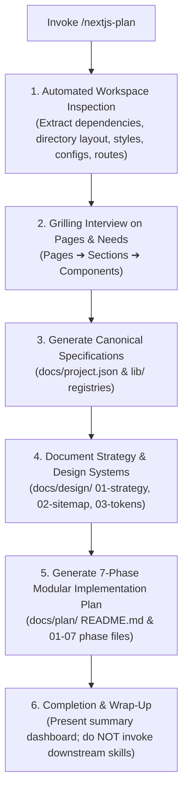

# Next.js Project Planning Skill (`nextjs-plan`)

A structured orchestration skill for planning Next.js App Router applications. When invoked, it extracts technical specifications from existing workspace files, conducts a targeted grilling interview on user requirements, and outputs canonical project specifications (`docs/project.json`), type-safe code registries in `lib/`, design briefs in `docs/design/`, and a 7-phase modular implementation roadmap in `docs/plan/`.

---

## Workflow Overview



---

## Standardized Project Directory Architecture

```text
├── lib/                             # Type-safe Next.js code source of truth
│   ├── routes.ts                    # Centralized route registry & path builders
│   ├── site-config.ts               # Centralized site metadata, author bio, social links
│   └── utils.ts                     # Tailwind cn helper
├── docs/                            # Architecture, planning & design rationale
│   ├── project.json                 # Canonical machine-readable specifications
│   ├── plan/                        # 7-Phase Modular Implementation Roadmap
│   │   ├── README.md                # Master Dashboard: Progress tracking & phase index
│   │   ├── 01-discovery-and-architecture.md
│   │   ├── 02-environment-and-cicd.md
│   │   ├── 03-system-health-probe.md
│   │   ├── 04-core-foundations.md
│   │   ├── 05-pages-and-components.md
│   │   ├── 06-server-functions-and-metadata.md
│   │   └── 07-integrations-and-release.md
│   ├── design/                      # UX, UI & Screen Specifications
│   │   ├── 01-strategy-brief.md     # Purpose, personas, goals, KPIs, benchmarks
│   │   ├── 02-sitemap-and-routes.md # Page inventory, section hierarchy, rendering matrix
│   │   ├── 03-ui-design-tokens.md   # Semantic CSS tokens, typography, component primitives
│   │   └── components/              # Component design specs & Stitch screenshots
│   └── adr/                         # Architecture Decision Records
```

---

## Step-by-Step Execution Runbook

### 1. Automated Workspace Inspection (Zero Interruption)

> [!IMPORTANT]
> **Inspect first, ask later.** Never prompt the user for facts that can be deduced directly from workspace files.

- [ ] **Scan Workspace Context**: Inspect `package.json`, lockfiles (`pnpm-lock.yaml`, `bun.lockb`), routing structure (`app/` vs `src/app/`), components directory, `app/globals.css`, UI libraries (`shadcn/ui`, `lucide-react`, animations), `next-intl` setup (root `messages/` folder), existing routes (`page.tsx`, `route.ts`), and testing/Docker configurations.
- [ ] For the complete inspection checklist, consult [workspace-inspection.md](./references/workspace-inspection.md).

### 2. User Grilling Interview (Pages ➔ Sections ➔ Components)

- [ ] **Conduct Adaptive Grilling Interview**: Engage the user in structured rounds using the grilling frontier methodology. Number each question and provide recommended answers.
- [ ] **Mandatory Grilling Sequence**:
  1. **Pages Grilling**: Enumerate all required web pages and target URL routes.
  2. **Sections Grilling**: For each page, identify all content sections from top to bottom.
  3. **Components Grilling**: For each section, define all required UI components.
- [ ] **Core Inquiries**: Problem statement, target personas, authentication, data layer/ORM, i18n locales & RTL, visual aesthetic tone, and deployment target.
- [ ] For interview templates and decision tree rules, consult [grilling-interview.md](./references/grilling-interview.md).

### 3. Generate Canonical Specifications & Type-Safe Code

- [ ] **Create `docs/project.json`**: Populate technical metadata (package manager, component dirs, styles, UI/animation/testing libraries, supported languages, dictionary paths). Consult [project-schema.md](./references/project-schema.md) and deploy [project.json.template](./resources/templates/project.json.template).
- [ ] **Create `lib/routes.ts`**: Generate type-safe route registry from [routes.ts.template](./resources/templates/routes.ts.template).
- [ ] **Create `lib/site-config.ts`**: Generate centralized site profile and metadata from [site-config.ts.template](./resources/templates/site-config.ts.template).

### 4. Document Design Strategy in `docs/design/`

- [ ] **Create `docs/design/01-strategy-brief.md`**: Deploy [01-strategy-brief.md.template](./resources/templates/01-strategy-brief.md.template).
- [ ] **Create `docs/design/02-sitemap-and-routes.md`**: Deploy [02-sitemap-and-routes.md.template](./resources/templates/02-sitemap-and-routes.md.template).
- [ ] **Create `docs/design/03-ui-design-tokens.md`**: Deploy [03-ui-design-tokens.md.template](./resources/templates/03-ui-design-tokens.md.template).

### 5. Generate 7-Phase Modular Implementation Roadmap (`docs/plan/`)

- [ ] **Scaffold `docs/plan/` Directory**: Deploy the modular plan files using templates in [resources/templates/plan/](./resources/templates/plan/):
  1. `docs/plan/README.md` (Master Progress Dashboard)
  2. `docs/plan/01-discovery-and-architecture.md` (Phase 1)
  3. `docs/plan/02-environment-and-cicd.md` (Phase 2)
  4. `docs/plan/03-system-health-probe.md` (Phase 3: `/api/health` Liveness Probe)
  5. `docs/plan/04-core-foundations.md` (Phase 4: Env vars, i18n, Theme tokens, Layouts, OTel)
  6. `docs/plan/05-pages-and-components.md` (Phase 5: Canonical Page & Component Checklists with SEO & support files)
  7. `docs/plan/06-server-functions-and-metadata.md` (Phase 6: Server Actions, API routes, Global SEO)
  8. `docs/plan/07-integrations-and-release.md` (Phase 7: Integrations & Production Release)
- [ ] **Single Source of Truth with Mandatory Page-Level Files**: Phase 5 (`05-pages-and-components.md`) is the exclusive canonical checklist for pages and components. For every page, enforce sub-checklist tasks for `page.tsx`, `loading.tsx`, `error.tsx`, `generateMetadata`, `JSON-LD Schema`, and `generateStaticParams()` (for dynamic routes).
- [ ] **Page Completion Rule**: In Phase 5, mark a page item as `- [x]` **if and only when all of its component sub-checklist items and page-level SEO/support tasks are completed**.
- [ ] Consult [plan-checklist-structure.md](./references/plan-checklist-structure.md) for full phase guidelines.

### 6. Wrap-up & Completion Gate

- [ ] Present concise summary report to user detailing workspace findings, specifications in `docs/project.json`, and roadmap in `docs/plan/README.md`.
- [ ] **DO NOT automatically invoke downstream Next.js skills.** Conclude execution and allow user to review the plan.

---

## Edge Cases & Known AI Pitfalls

> [!WARNING]
>
> - **Chaining Commands**: Never execute compound commands using `&&`, `||`, or `;` on a single line. Always execute terminal commands individually.
> - **Asking Before Inspecting**: Do not ask the user for basic facts that can be read directly from `package.json` or directory listings.
> - **Inverted Milestone Sequencing**: Health probe (`/api/health`) belongs in Phase 3, followed by Core Foundations (i18n, Theme, Layouts, OTel) in Phase 4 before page/component implementation.
> - **Omitting Page-Level Files**: When authoring Phase 5 checklists, never omit `loading.tsx`, `error.tsx`, `generateMetadata`, or JSON-LD schema tasks for any page.
> - **Page List Duplication**: Keep all page and component tracking strictly in `docs/plan/05-pages-and-components.md`.
> - **Premature Page Checkoff**: A page in Phase 5 must remain `- [ ]` until every child component and page-level support file is completed.
> - **Incorrect Dictionary Location**: In Next.js i18n configurations, dictionaries are located in root `messages/` (e.g., `messages/en.json`), never in `app/dictionaries`.
> - **Spawning Downstream Skills**: Do not automatically trigger implementation or styling skills upon completing the plan; stop and wait for user direction.

---

## Output Summary Schema

Upon concluding the planning phase, present the summary in this format:

```markdown
### Next.js Project Plan Completed

- **Canonical Specifications**: `[docs/project.json](file:///...)`
- **Type-Safe Registries**: `[lib/routes.ts](file:///...)` | `[lib/site-config.ts](file:///...)`
- **Design & Strategy Specs**: `[docs/design/01-strategy-brief.md](file:///...)`, `[docs/design/02-sitemap-and-routes.md](file:///...)`, `[docs/design/03-ui-design-tokens.md](file:///...)`
- **Modular Roadmap Dashboard**: `[docs/plan/README.md](file:///...)`
  - **Identified Pages**: X total routes mapped
  - **Identified Components**: Y total components cataloged across Z sections
  - **Completed Phases**: N / 7 phases verified

_Planning complete. Review `docs/plan/README.md` to proceed with component design or implementation._
```

---

## Reference Guides & Templates

- [Workspace Inspection Guide](./references/workspace-inspection.md) — Pre-interview codebase discovery checklist.
- [Grilling Interview Guide](./references/grilling-interview.md) — Multi-round questioning protocol and inquiry areas.
- [Project Schema Reference](./references/project-schema.md) — Specification fields and validation criteria for `docs/project.json`.
- [Plan Architecture Reference](./references/plan-checklist-structure.md) — 7-phase modular roadmap structure and page-component rules.
- [Project JSON Template](./resources/templates/project.json.template) — Starter schema for `docs/project.json`.
- [Modular Plan Templates](./resources/templates/plan/) — Starter templates for `docs/plan/`.
- [Routes TypeScript Template](./resources/templates/routes.ts.template) — Type-safe route definitions for `lib/routes.ts`.
- [Site Config Template](./resources/templates/site-config.ts.template) — Centralized site profile for `lib/site-config.ts`.
- [Strategy Brief Template](./resources/templates/01-strategy-brief.md.template) — Template for `docs/design/01-strategy-brief.md`.
- [Sitemap & Routes Template](./resources/templates/02-sitemap-and-routes.md.template) — Template for `docs/design/02-sitemap-and-routes.md`.
- [UI Design Tokens Template](./resources/templates/03-ui-design-tokens.md.template) — Template for `docs/design/03-ui-design-tokens.md`.
