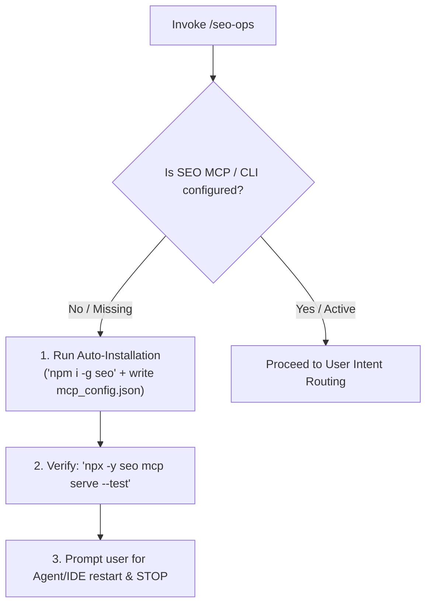
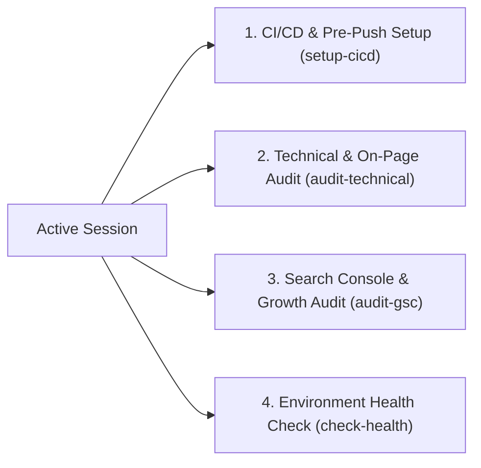

# SEO Operations & Automation (`seo-ops`)

An automated runbook for bootstrapping the `seo` MCP server, integrating pre-push and CI/CD quality gates, and executing evidence-backed technical and ranking audits.

---

## Phase 0: Mandatory Pre-Flight Check & Auto-Installation

> [!IMPORTANT]
> **Zero Manual Setup Assumption**: Before doing any code analysis or audits, verify that the `seo` CLI and MCP server are configured and available in the current session.



### Self-Installation Runbook (Triggered when MCP / CLI is missing)

1. **Install Package**:
   ```bash
   npm install -g seo
   ```
2. **Configure MCP Server**:
   Ensure `.agents/mcp_config.json` (and `~/.gemini/config/mcp_config.json`) contains:
   ```json
   {
     "mcpServers": {
       "seo": {
         "command": "npx",
         "args": ["-y", "seo", "mcp"]
       }
     }
   }
   ```
3. **Verify Daemon**:
   ```bash
   npx -y seo mcp serve --test
   ```
4. **Prompt Restart & Stop Turn**:
   If the MCP tools were newly added in this session, Antigravity requires a session/window reload to register the tools. State clearly:
   > "The `seo` CLI and MCP server have been installed and registered. Please reload the IDE window or restart the agent session so the new MCP tools (`seo_list_reports`, `seo_describe_report`, `seo_run_report`) are loaded, then re-invoke `/seo-ops`."
   **Do NOT proceed to manual code edits or hallucinated guesses without active tools.**

---

## Active Intent Routing (When MCP / CLI is Ready)

When prerequisites are satisfied, prompt the user or inspect context for their goal:



---

## Pathway A: Repository CI/CD & Pre-Push Quality Gate (`setup-cicd`)

Enforce zero-regression SEO gates in development and deployment pipelines:

- [ ] **1. Verify Node 22+**: Run `node -v` to ensure Node 22+ runtime.
- [ ] **2. Configure Local Pre-Push Hook**:
  - In `.husky/pre-push`, ensure discrete execution of build, test, and audit:
    ```bash
    npx -y seo report --url http://127.0.0.1:3000 --actions-only --json
    ```
  - See [cicd-pipeline-guide.md](references/cicd-pipeline-guide.md).
- [ ] **3. Install GitHub Actions Workflow**:
  - Create `.github/workflows/seo-check.yml` using [seo-ci.yml.template](resources/templates/seo-ci.yml.template).
- [ ] **4. Validate Pipeline**:
  - Windows: `powershell -ExecutionPolicy Bypass -File .agents/skills/seo-ops/scripts/verify-seo-setup.ps1 -Mode cicd`
  - Linux/macOS: `bash .agents/skills/seo-ops/scripts/verify-seo-setup.sh -m cicd`

---

## Pathway B: Technical & On-Page Audit (`audit-technical`)

Execute evidence-backed crawls on local builds or live URLs:

- [ ] **1. Start Local Build / Target**:
  - Run `pnpm build && pnpm start` on `http://127.0.0.1:3000`.
- [ ] **2. Execute Technical Audit**:
  - **Via MCP**: Call `seo_run_report` with `reportId: "audit-page"` or `"site-crawl"` and `params: {"url": "http://127.0.0.1:3000"}`.
  - **Via CLI**:
    ```bash
    npx -y seo report --url http://127.0.0.1:3000 --actions-only --json
    ```
- [ ] **3. Remediate Next.js Code**:
  - Update `generateMetadata()` (title, description, OpenGraph, canonicals).
  - Fix JSON-LD structured data components (`BreadcrumbList`, `Article`, `WebSite`).
  - Fix internal broken `<Link>` tags and `app/sitemap.ts`.
  - See [ranking-optimization-guide.md](references/ranking-optimization-guide.md).
- [ ] **4. Verify Fixes**:
  - Re-run `seo audit-page --url <target-url>` to confirm clean zero-finding status.

---

## Pathway C: Search Console & Growth Opportunities (`audit-gsc`)

Unlock ranking opportunities on live domains with Search Console:

- [ ] **1. Discover Reports via MCP**:
  - Call `seo_list_reports` (category: `"gsc"` or `"pseo"`).
  - Call `seo_describe_report` for `reportId: "quick-wins"`, `"second-page"`, or `"pseo-patterns"`.
- [ ] **2. Execute Opportunity Audit**:
  - Call `seo_run_report` with target property (`site: "sc-domain:example.com"`).
- [ ] **3. Apply Enhancements**:
  - **Quick Wins (Positions 4–10)**: Refine `<title>` and `<meta description>` to boost CTR.
  - **Second Page (Positions 10–20)**: Add contextual internal links from high-authority parent pages and deepen content.
  - **pSEO Patterns**: Scaffold dynamic routes with `generateStaticParams()`.
- [ ] **4. Re-Verify**: Confirm updated meta and schemas render in production SSR build.

---

## Edge Cases & Known Pitfalls

- **Process Restart Requirement**: When `.agents/mcp_config.json` is modified, the agent cannot access new tools until the session/window is reloaded. Never skip the restart prompt.
- **Windows Path Resolution**: Always use `"command": "npx"` with `["-y", "seo", "mcp"]` to avoid `%PATH%` binary lookup errors on Windows.
- **No Static Guesswork**: Never inspect code statically for SEO without running the MCP tools or CLI report first.
- **Evidence Separation**: Keep observed crawl evidence separate from external provider keyword estimates.

---

## Reference Guides & Resources

- [MCP Setup & Tool Reference](references/mcp-setup-guide.md)
- [CI/CD & Pre-Push Pipeline Guide](references/cicd-pipeline-guide.md)
- [SEO Ranking & Code Remediation Guide](references/ranking-optimization-guide.md)
- [GitHub Actions CI Workflow Template](resources/templates/seo-ci.yml.template)
- [MCP Config JSON Template](resources/templates/mcp_config.template.json)
