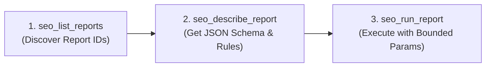

# MCP Setup & Tool Reference

This guide details configuring, testing, and querying the local `seo` Model Context Protocol (MCP) server within Antigravity and AI coding agents.

---

## 1. Prerequisites & Verification

- **Node.js**: Version 22.0.0 or higher.
- **Package**: `npm install -g seo`
- **Health Verification**:
  ```bash
  seo mcp serve --test
  ```
  *(Returns exit code 0 on success. Normal `seo mcp serve` runs as a persistent stdio daemon awaiting client JSON-RPC on stdin/stdout).*

---

## 2. Configuration Scopes

### Workspace Scope (`.agents/mcp_config.json`)

```json
{
  "mcpServers": {
    "seo": {
      "command": "npx",
      "args": ["-y", "seo", "mcp"],
      "env": {}
    }
  }
}
```

### Global Scope (`~/.gemini/config/mcp_config.json`)

```json
{
  "mcpServers": {
    "seo": {
      "command": "npx",
      "args": ["-y", "seo", "mcp"]
    }
  }
}
```

---

## 3. The 3-Tool MCP Discovery-Description-Execution Pattern

The `seo` MCP server deliberately exposes **3 compact tools** to keep agent context windows lean, rather than dumping 74 separate tool schemas into tool definition space:



### 1. `seo_list_reports`
- **Purpose**: Lists available report IDs, descriptions, and categories.
- **Optional Argument**: `category` (e.g., `"crawl"`, `"gsc"`, `"keywords"`, `"competitors"`, `"pseo"`, `"ai"`).

### 2. `seo_describe_report`
- **Purpose**: Returns the exact JSON Schema for parameters, required/optional fields, reading order (`readOrder`), verification steps, and non-claims (`doNotClaim`).
- **Required Argument**: `reportId` (e.g., `"quick-wins"`, `"audit-page"`, `"competitor-keyword-gap"`).

### 3. `seo_run_report`
- **Purpose**: Executes the report and returns structured findings.
- **Arguments**:
  - `reportId` (string, required)
  - `params` (object, optional): Bounded parameters conforming to the schema.
  - `view` (string, optional): Pass `"actions"` for high-priority action queues.

---

## 4. Key Report Categories & Workflow Recipes

| Category | Primary Reports | Purpose |
| :--- | :--- | :--- |
| **Crawl & Page** | `site-crawl`, `audit-page`, `audit-urls`, `redirect-trace`, `performance-audit` | Local and live technical validations, Core Web Vitals, and redirects. |
| **Findings & Rules** | `top-fixes`, `affected-urls`, `explain-crawl-issue`, `crawler-rules` | Plain-English explanations of crawler rules and affected URL inventories. |
| **Search Console** | `quick-wins`, `second-page`, `lost-clicks`, `cannibalisation`, `period-comparison` | High-impression low-CTR wins, striking-distance queries, and deploy impact. |
| **Programmatic SEO** | `pseo-patterns`, `pseo-opportunities` | Repeatable query patterns, entity combination templates, and route audits. |
| **Competitors & SERP** | `serp-competitors`, `competitor-keyword-gap`, `domain-overview` | Real ranking competitors, SERP intent, and keyword gaps. |
| **AI Search Visibility** | `ai-mention-research`, `ai-prompt-observations` | Tracking brand mentions, citations, and model responses across ChatGPT, Claude, Perplexity. |

---

## 5. Agent Evidence & Execution Discipline

1. **Check Status First**: Inspect data status (`complete`, `partial`, `capped`, `filtered`, `unavailable`) and caveats before forming conclusions.
2. **Assign Explicit Outcomes**:
   - For technical fixes: Mark each as `fixed`, `deferred`, or `not-needed`.
   - For content reviews: Mark each as `changed`, `no-change`, or `deferred`.
3. **Never Drop Findings**: Track every finding ID and URL inventory item returned by `seo_run_report`.
