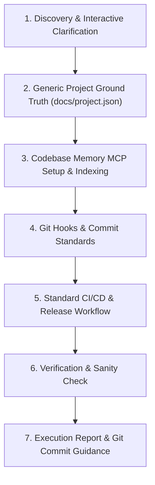

# Standard Repository CI/CD & Tooling Setup Skill (`setup-repository`)

This skill establishes a standardized development and CI/CD workflow for **any software repository** (regardless of language or framework). Guided by automated discovery and targeted developer clarification, it configures:

1. **Project Metadata Ground Truth** (`docs/project.json`)
2. **Codebase Intelligence Knowledge Graph** (`codebase-memory-mcp`)
3. **Commit Standardization & Pre-Push Quality Gates** (Husky & Commitlint)
4. **Standard CI/CD & Automated Semantic Releases** (GitHub Actions with Release Please and build/publish placeholders)
5. **Execution Reporting & Git Guidance**

---

## Workflow Overview



---

## Step 1: Discovery & Interactive Scaffolding

### 1.1. Automated Inspection (Zero Interruption Rule)

Scan the repository before prompting the developer:

- **Runtime & Build Tools**: Inspect manifests (`package.json`, `Cargo.toml`, `go.mod`, `pyproject.toml`, `pom.xml`, `Makefile`, etc.).
- **Test & Quality Tools**: Detect test runners and linters from configs or lockfiles.
- **Documentation**: Check `README.md`, `docs/`, or `CONTEXT.md` for existing architectural guidelines.

### 1.2. Interactive Clarification (AI-Assisted Scaffolding)

If any critical parameters are missing, ambiguous, or undetermined from existing files, ask the user focused questions using clear options:

```markdown
### 📋 Repository Setup & CI/CD Configuration

To configure the standard CI/CD workflow for this repository, please confirm or specify:

1. **Primary Language & Runtime**: (e.g., Node.js / TypeScript, Python, Go, Rust, Java, C++)
2. **Test Command**: (e.g., `pnpm test`, `pytest`, `cargo test`, `go test ./...`)
3. **Build Command**: (e.g., `pnpm run build`, `cargo build --release`, `go build`, `none`)
4. **Release / Publish Target**:
   - [ ] Docker Container Image (GHCR / Docker Hub)
   - [ ] Package Registry (npm, PyPI, Crates.io, Maven)
   - [ ] Binary Release Assets (GitHub Releases)
   - [ ] Static Site / Documentation (GitHub Pages)
   - [ ] None (CI Testing & SemVer Git Tags only)
```

---

## Step 2: Generic Project Configuration Template (`docs/project.json`)

Establish a clean, runtime-agnostic ground truth file at `docs/project.json`:

```json
{
  "project_context_and_metadata": {
    "project_name": "project-name",
    "runtime": "node | python | rust | go | java | generic",
    "package_manager": "pnpm | cargo | go | poetry | uv | maven | generic",
    "source_dir": "src",
    "test_command": "pnpm test",
    "build_command": "pnpm run build",
    "ci_cd_provider": "github-actions",
    "release_automation": "release-please",
    "publish_target": "container | package | binary | none"
  }
}
```

1. Ensure the `docs/` directory exists.
2. Write or update `docs/project.json` with the confirmed project values.

---

## Step 3: Setup `codebase-memory-mcp` Code Intelligence Server

Equip the repository with `codebase-memory-mcp` so AI agents can query the codebase knowledge graph (functions, classes, dependencies, call hierarchies) in milliseconds.

### 3.1. Install Binary

- **Windows (PowerShell)**:
  ```powershell
  Invoke-WebRequest -Uri https://raw.githubusercontent.com/DeusData/codebase-memory-mcp/main/install.ps1 -OutFile install.ps1
  Unblock-File .\install.ps1
  .\install.ps1
  Remove-Item .\install.ps1
  ```
- **macOS / Linux (Bash)**:
  ```bash
  curl -fsSL https://raw.githubusercontent.com/DeusData/codebase-memory-mcp/main/install.sh | bash
  ```
- **npm Global CLI**:
  ```bash
  npm install -g codebase-memory-mcp@latest
  ```

### 3.2. Register MCP Server

Add `codebase-memory` to:

- **Root `mcp.json`**:
  ```json
  {
    "mcpServers": {
      "codebase-memory": {
        "command": "codebase-memory-mcp",
        "args": []
      }
    }
  }
  ```
- **Agent Config (`.agents/mcp_config.json`)** if present.
- **Global Config (`~/.gemini/config/mcp_config.json` / Claude Desktop / Cursor)**.

### 3.3. Git Hygiene & Cadence Maintenance

1. **Ignore Local Cache**: Add `.codebase-memory/` to `.gitignore` (or track with Git LFS if team snapshot sharing is requested).
2. **Initial Index**:
   ```bash
   codebase-memory-mcp cli index_repository --repo-path "<canonical-repo-path>"
   ```
3. **Cadence Script**: If the project has a task runner (e.g. `package.json`, `Makefile`), add a command to update the index on milestones:
   ```json
   "cbm:update": "codebase-memory-mcp cli index_repository --repo-path . --persistence true"
   ```

---

## Step 4: Setup Git Hooks & Commit Standardization

Enforce Conventional Commits and guarantee tests run before code is pushed to remote branches.

1. **Install Husky & Commitlint** (for Node/JS projects) or configure `pre-commit` (for Python/Go/Rust):
   ```bash
   pnpm add -D husky @commitlint/cli @commitlint/config-conventional
   pnpm exec husky init
   ```
2. **Configure `commitlint.config.mjs`**:
   ```javascript
   export default {
     extends: ["@commitlint/config-conventional"],
   };
   ```
3. **Configure Hooks**:
   - `.husky/commit-msg`: validates commit messages against Conventional Commits:
     ```bash
     echo "pnpm exec commitlint --edit \$1" > .husky/commit-msg
     ```
   - `.husky/pre-push`: runs the project test suite before pushing:
     ```bash
     echo "<test-command>" > .husky/pre-push
     ```

> [!NOTE]
> Never generate dummy or sample test files in the workspace. Ensure test commands pass gracefully if test files are not yet created (e.g., `--passWithNoTests`).

---

## Step 5: Standard CI/CD Workflow with Release Please & Publish Placeholder

Create a robust, credit-optimized GitHub Actions workflow at `.github/workflows/release-please.yml` featuring:

1. **Automated Test / CI Gate**: Runs project tests on pull requests and commits to `main`.
2. **Release Please Automation**: Automates version bumps, changelogs, and release PRs.
3. **Build & Publish Placeholder Job**: Triggers only when a new release is merged/created, providing a clean extension point for building and publishing artifacts, packages, or container images.

```yaml
name: CI Validation & Release Please

on:
  push:
    branches: [main]
  pull_request:
    branches: [main]

concurrency:
  group: ${{ github.workflow }}-${{ github.ref }}
  cancel-in-progress: false

permissions:
  contents: write
  pull-requests: write
  packages: write

jobs:
  # =======================================================
  # 1. CI Validation Gate: Run Linters & Test Suites
  # =======================================================
  test:
    name: Test & Validate
    runs-on: ubuntu-latest
    steps:
      - name: Checkout Repository
        uses: actions/checkout@v4

      # --- [Setup Runtime Placeholder] ---
      # Example: uses: actions/setup-node@v4 / actions/setup-python@v5 / dtolnay/rust-toolchain@stable / actions/setup-go@v5
      - name: Setup Runtime Environment
        uses: actions/setup-node@v4
        with:
          node-version: 22

      - name: Install Dependencies
        run: echo "Run dependency installation here (e.g. pnpm install / pip install -r requirements.txt / cargo fetch)"

      - name: Run Test Suite
        run: echo "Run test command here (e.g. pnpm test / pytest / cargo test / go test ./...)"

  # =======================================================
  # 2. Release Please: Automated SemVer & Changelog PRs
  # =======================================================
  release-please:
    name: Release Please Automation
    needs: test
    if: github.ref == 'refs/heads/main' && github.event_name == 'push'
    runs-on: ubuntu-latest
    outputs:
      release_created: ${{ steps.release.outputs.release_created }}
      tag_name: ${{ steps.release.outputs.tag_name }}
      version: ${{ steps.release.outputs.version }}
    steps:
      - name: Run Release Please
        uses: googleapis/release-please-action@v4
        id: release
        with:
          # Configured release type (e.g. node, python, rust, go, or simple)
          release-type: simple

  # =======================================================
  # 3. Publish Placeholder: Runs When a Release is Created
  # =======================================================
  publish-release:
    name: Build & Publish Release Artifact
    needs: [test, release-please]
    if: needs.release-please.outputs.release_created == 'true'
    runs-on: ubuntu-latest
    steps:
      - name: Checkout Repository
        uses: actions/checkout@v4

      - name: Echo Release Information
        run: |
          echo "New release created: ${{ needs.release-please.outputs.version }}"
          echo "Tag: ${{ needs.release-please.outputs.tag_name }}"

      # --- [USER BUILD & PUBLISH PLACEHOLDER] ---
      # Replace this step with your specific release action:
      # - Docker image build and push to GHCR / Docker Hub
      # - Library publish to npm / PyPI / Crates.io
      # - Binary compilation and upload to GitHub Release assets
      - name: Build & Publish Artifact
        run: |
          echo "Execute release build & publishing steps here."
```

---

## Step 6: Environment Sanity Verification

Audit the newly created configurations:

1. Verify `docs/project.json` exists and is valid JSON.
2. Verify `mcp.json` contains `codebase-memory`.
3. Verify `codebase-memory-mcp cli get_architecture` runs cleanly.
4. Verify Commitlint validates valid Conventional Commit messages.
5. Verify `.github/workflows/release-please.yml` syntax is valid.

---

## Step 7: Standardized Execution Report & Git Commit Protocol

Upon completing setup, output the standardized execution report summarizing every component, explicitly distinguishing between what was freshly implemented vs. what was already configured:

### Standard Output Report Template

```markdown
## 🛠️ Repository Setup Execution Report

| Step / Component                | Target File(s) / Resource              | Status                          | Notes / Details                                               |
| :------------------------------ | :------------------------------------- | :------------------------------ | :------------------------------------------------------------ |
| **1. Project Metadata**         | `docs/project.json`                    | `[IMPLEMENTED]` / `[UNTOUCHED]` | Configured generic project metadata ground truth.             |
| **2. Codebase Memory MCP**      | `mcp.json`, `.agents/mcp_config.json`  | `[IMPLEMENTED]` / `[UNTOUCHED]` | Binary installed, MCP registered, and initial graph indexed.  |
| **3. Git Hooks & Standards**    | `.husky/`, `commitlint.config.mjs`     | `[IMPLEMENTED]` / `[UNTOUCHED]` | Configured Conventional Commits and pre-push testing gate.    |
| **4. Standard CI/CD Workflow**  | `.github/workflows/release-please.yml` | `[IMPLEMENTED]` / `[UNTOUCHED]` | Automated test gate, Release Please, and publish placeholder. |
| **5. Environment Sanity Check** | Workspace Audit                        | `[PASSED]`                      | All configurations verified cleanly.                          |

### Status Definitions:

- **`[IMPLEMENTED]`**: Freshly created, installed, or modified during this setup run.
- **`[UNTOUCHED]`**: Already properly configured prior to running the skill; preserved as-is.
- **`[SKIPPED]`**: Intentionally omitted based on project needs or developer preference.
```

### Git Commit Instructions

Group files and generate a commit message summarizing the changes made during the setup process. **Do not commit anything automatically**; output the exact git commit commands and leave committing to the human:

```bash
git add docs/project.json mcp.json commitlint.config.mjs .husky/ .github/workflows/
git commit -m "chore: configure standard repository tooling, codebase intelligence, and ci/cd"
```
