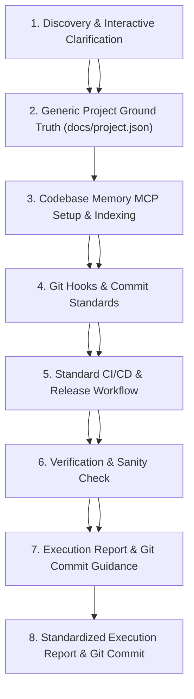

# Universal Repository Setup & Environment Skill (`setup-repository`)

# Standard Repository CI/CD & Tooling Setup Skill (`setup-repository`)

This skill establishes, configures, and validates the standard development environment for any software repository. It handles project metadata discovery, git hygiene, code intelligence with **`codebase-memory-mcp`**, commit standardization with **Husky & Commitlint**, production **Docker containerization**, and automated **Release Please & multi-arch GHCR** CI/CD deployment.
This skill establishes a standardized development and CI/CD workflow for **any software repository** (regardless of language or framework). Guided by automated discovery and targeted developer clarification, it configures:

1. **Project Metadata Ground Truth** (`docs/project.json`)
2. **Codebase Intelligence Knowledge Graph** (`codebase-memory-mcp`)
3. **Commit Standardization & Pre-Push Quality Gates** (Husky & Commitlint)
4. **Standard CI/CD & Automated Semantic Releases** (GitHub Actions with Release Please and build/publish placeholders)
5. **Execution Reporting & Git Guidance**

---

## Workflow Overview



---

## Step 1: Automated Discovery & Repository Scan (Zero Interruption Rule)

## Step 1: Discovery & Interactive Scaffolding

> [!IMPORTANT]
> **DO NOT PROMPT THE USER IF INFORMATION IS AVAILABLE IN REPOSITORY FILES.**
> Scan repository files, configs, and documentation in `docs/` first. Automatically deduce runtime, tooling, and conventions. Only prompt the human for missing or ambiguous configuration.

### 1.1. Automated Inspection (Zero Interruption Rule)

1. **Detect Framework & Runtime**:
   - Inspect package manifests: `package.json` (Node/Bun), `pyproject.toml` / `requirements.txt` (Python), `Cargo.toml` (Rust), `go.mod` (Go), etc.
   - Detect package manager from lockfiles:
     - `pnpm-lock.yaml` &rarr; `pnpm`
     - `bun.lockb` / `bun.lock` &rarr; `bun`
     - `yarn.lock` &rarr; `yarn`
     - `package-lock.json` &rarr; `npm`
2. **Scan Existing Documentation**:
   - Read `CONTEXT.md`, `docs/plan.md`, `docs/adr/*.md`, and `README.md` to extract architectural standards, test suites, and language conventions.
3. **Verify Git Working Tree**:
   - Check git status and branch. All inspection and command steps must be executed as discrete single operations without chaining.
     Scan the repository before prompting the developer:

- **Runtime & Build Tools**: Inspect manifests (`package.json`, `Cargo.toml`, `go.mod`, `pyproject.toml`, `pom.xml`, `Makefile`, etc.).
- **Test & Quality Tools**: Detect test runners and linters from configs or lockfiles.
- **Documentation**: Check `README.md`, `docs/`, or `CONTEXT.md` for existing architectural guidelines.

### 1.2. Interactive Clarification (AI-Assisted Scaffolding)

If any critical parameters are missing, ambiguous, or undetermined from existing files, ask the user focused questions using clear options:

```markdown
### 📋 Repository Setup & CI/CD Configuration

To configure the standard CI/CD workflow for this repository, please confirm or specify:

1. **Primary Language & Runtime**: (e.g., Node.js / TypeScript, Python, Go, Rust, Java, C++)
2. **Test Command**: (e.g., `pnpm test`, `pytest`, `cargo test`, `go test ./...`)
3. **Build Command**: (e.g., `pnpm run build`, `cargo build --release`, `go build`, `none`)
4. **Release / Publish Target**:
   - [ ] Docker Container Image (GHCR / Docker Hub)
   - [ ] Package Registry (npm, PyPI, Crates.io, Maven)
   - [ ] Binary Release Assets (GitHub Releases)
   - [ ] Static Site / Documentation (GitHub Pages)
   - [ ] None (CI Testing & SemVer Git Tags only)
```

---

## Step 2: Project Metadata Ground Truth (`docs/project.json`)

## Step 2: Generic Project Configuration Template (`docs/project.json`)

Maintain a central machine-readable configuration file at `docs/project.json` so all AI agents and specialized skills share identical context.
Establish a clean, runtime-agnostic ground truth file at `docs/project.json`:

### Standard `docs/project.json` Template:

```json
{
  "project_context_and_metadata": {
    "project_name": "my-project",
    "runtime": "node",
    "package_manager": "pnpm",
    "project_name": "project-name",
    "runtime": "node | python | rust | go | java | generic",
    "package_manager": "pnpm | cargo | go | poetry | uv | maven | generic",
    "source_dir": "src",
    "testing_library": ["jest", "playwright"],
    "containerization": "docker-standalone",
    "ci_cd": "release-please-ghcr"
    "test_command": "pnpm test",
    "build_command": "pnpm run build",
    "ci_cd_provider": "github-actions",
    "release_automation": "release-please",
    "publish_target": "container | package | binary | none"
  }
}
```

1. Ensure the `docs/` directory exists.
2. Write or update `docs/project.json` with the discovered configuration values.
3. Write or update `docs/project.json` with the confirmed project values.

---

## Step 3: Setup `codebase-memory-mcp` Code Intelligence Server

Equip the repository with the `codebase-memory-mcp` persistent knowledge graph server (162 languages, Tree-sitter AST, Hybrid LSP semantic type resolution, and 100% local vector search).
Equip the repository with `codebase-memory-mcp` so AI agents can query the codebase knowledge graph (functions, classes, dependencies, call hierarchies) in milliseconds.

### 3.1. Install Binary

Choose the platform method:

- **Windows (PowerShell)**:
  ```powershell
  Invoke-WebRequest -Uri https://raw.githubusercontent.com/DeusData/codebase-memory-mcp/main/install.ps1 -OutFile install.ps1
  Unblock-File .\install.ps1
  .\install.ps1
  Remove-Item .\install.ps1
  ```
- **macOS / Linux (Bash)**:
  ```bash
  curl -fsSL https://raw.githubusercontent.com/DeusData/codebase-memory-mcp/main/install.sh | bash
  ```
- **Global npm Package Alternative**:
- **npm Global CLI**:
  ```bash
  npm install -g codebase-memory-mcp@latest
  ```

### 3.2. Register Across MCP Configurations

### 3.2. Register MCP Server

Add `codebase-memory` to:

1. **Workspace Root `mcp.json`**:
   ```json
   {
     "mcpServers": {
       "codebase-memory": {
         "command": "codebase-memory-mcp",
         "args": []
       }
     }
   }
   ```
2. **Workspace Agent Config (`.agents/mcp_config.json`)**:
   Add the identical entry if the repo uses `.agents/`.
3. **Global User Config (`~/.gemini/config/mcp_config.json` / Claude / Cursor)**.

### 3.3. Git Hygiene & Persistence

- **Local-Only (Default)**: Add `.codebase-memory/` to `.gitignore`.
- **Team Snapshot Sharing**: If committing the pre-indexed graph snapshot for the team, track `.codebase-memory/graph.db.zst` with Git LFS in root `.gitattributes`:
  ```gitattributes
  .codebase-memory/graph.db.zst filter=lfs diff=lfs merge=lfs -text
  ```
- **Root `mcp.json`**:
  ```json
  {
    "mcpServers": {
      "codebase-memory": {
        "command": "codebase-memory-mcp",
        "args": []
      }
    }
  }
  ```
- **Agent Config (`.agents/mcp_config.json`)** if present.
- **Global Config (`~/.gemini/config/mcp_config.json` / Claude Desktop / Cursor)**.

### 3.4. Initial Indexing & Cadence Script

### 3.3. Git Hygiene & Cadence Maintenance

1. Run initial indexing:
1. **Ignore Local Cache**: Add `.codebase-memory/` to `.gitignore` (or track with Git LFS if team snapshot sharing is requested).
1. **Initial Index**:
   ```bash
   codebase-memory-mcp cli index_repository --repo-path "<canonical-repo-path>"
   ```
1. Add a cadence script to `package.json` for refreshing the index on milestones:
1. **Cadence Script**: If the project has a task runner (e.g. `package.json`, `Makefile`), add a command to update the index on milestones:
   ```json
   {
     "scripts": {
       "cbm:update": "codebase-memory-mcp cli index_repository --repo-path . --persistence true"
     }
   }
   "cbm:update": "codebase-memory-mcp cli index_repository --repo-path . --persistence true"
   ```

---

## Step 4: Setup Git Hooks with Husky & Commitlint

## Step 4: Setup Git Hooks & Commit Standardization

Enforce commit quality and prevent breaking code from being pushed to remote branches.
Enforce Conventional Commits and guarantee tests run before code is pushed to remote branches.

1. **Install Dev Dependencies**:
1. **Install Husky & Commitlint** (for Node/JS projects) or configure `pre-commit` (for Python/Go/Rust):
   ```bash
   pnpm add -D husky @commitlint/cli @commitlint/config-conventional
   pnpm exec husky init
   ```
1. **Configure `commitlint.config.mjs`**:
   ```javascript
   export default {
     extends: ["@commitlint/config-conventional"],
   };
   ```
1. **Initialize Husky**:
   ```bash
   pnpm exec husky init
   ```
1. **Configure `commit-msg` Hook**:
   ```bash
   echo "pnpm exec commitlint --edit \$1" > .husky/commit-msg
   ```
1. **Configure `pre-push` Hook**:
   Enforce test suite execution before allowing any `git push`:
   ```bash
   echo "pnpm run test:all" > .husky/pre-push
   ```
   > [!NOTE]
   > Ensure test scripts in `package.json` include graceful flags (e.g. `--passWithNoTests`) so repositories without test files exit code 0 rather than breaking pushes. Never create sample/dummy test files in the workspace.
1. **Configure Hooks**:
   - `.husky/commit-msg`: validates commit messages against Conventional Commits:
     ```bash
     echo "pnpm exec commitlint --edit \$1" > .husky/commit-msg
     ```
   - `.husky/pre-push`: runs the project test suite before pushing:
     ```bash
     echo "<test-command>" > .husky/pre-push
     ```

---

> [!NOTE]
> Never generate dummy or sample test files in the workspace. Ensure test commands pass gracefully if test files are not yet created (e.g., `--passWithNoTests`).

## Step 5: Setup Multi-Stage Production Docker Containerization

Configure containerization strictly for standalone production builds and deployments. Local development runs on the host machine using the project's native package manager.

### 5.1. Configure `.dockerignore`

Exclude local artifacts, git history, and secrets:

```dockerignore
node_modules/
.pnp/
.pnpm-store/
dist/
build/
coverage/
test-results/
.env*
*.log
.git/
.dockerignore
Dockerfile*
docker-compose*.yml
.codebase-memory/
```

### 5.2. Multi-Stage `Dockerfile`

Create a 3-stage multi-stage build (`dependencies` &rarr; `builder` &rarr; `runner`) running under a secure non-root user:

```dockerfile

ARG NODE_VERSION=22-slim

FROM node:${NODE_VERSION} AS dependencies
WORKDIR /app
ENV CI=true
COPY package.json yarn.lock* package-lock.json* pnpm-lock.yaml* ./
RUN --mount=type=cache,target=/root/.local/share/pnpm/store \
  if [ -f pnpm-lock.yaml ]; then corepack enable pnpm && pnpm install --frozen-lockfile; \
  elif [ -f package-lock.json ]; then npm ci; \
  else yarn install --frozen-lockfile; fi

FROM node:${NODE_VERSION} AS builder
WORKDIR /app
COPY --from=dependencies /app/node_modules ./node_modules
COPY . .
ENV NODE_ENV=production
RUN if [ -f pnpm-lock.yaml ]; then corepack enable pnpm && pnpm run build; else npm run build; fi

FROM node:${NODE_VERSION} AS runner
WORKDIR /app
ENV NODE_ENV=production
ARG PORT=3000
ENV PORT=${PORT}
ENV HOSTNAME="0.0.0.0"
COPY --from=builder --chown=node:node /app/dist ./dist
USER node
EXPOSE ${PORT}
CMD ["node", "dist/index.js"]
```

### 5.3. Docker Compose Stacks

1. **Local Build & Test (`docker-compose.yml`)**:
   ```yaml
   services:
     app:
       build:
         context: .
         dockerfile: Dockerfile
       container_name: app-production
       restart: unless-stopped
       ports:
         - "${PORT:-3000}:${PORT:-3000}"
       environment:
         - NODE_ENV=production
   ```
2. **Production Pre-Built Stack (`docker-compose.prod.yml`)**:
   Pulls pre-built multi-arch images directly from GHCR without source code:
   ```yaml
   services:
     app:
       image: ghcr.io/<lowercase-owner>/<lowercase-repo>:${IMAGE_TAG:-latest}
       container_name: app-production
       restart: always
       ports:
         - "${PORT:-3000}:${PORT:-3000}"
       environment:
         - NODE_ENV=production
   ```

---

## Step 6: Setup Credit-Optimized CI/CD & Release Please Automation

## Step 5: Standard CI/CD Workflow with Release Please & Publish Placeholder

Automate semantic releases, changelogs, and multi-arch (AMD64 & ARM64) GitHub Container Registry publishing via `.github/workflows/release-please.yml`:
Create a robust, credit-optimized GitHub Actions workflow at `.github/workflows/release-please.yml` featuring:

### Core DevOps Design Rules:

1. **Automated Test / CI Gate**: Runs project tests on pull requests and commits to `main`.
2. **Release Please Automation**: Automates version bumps, changelogs, and release PRs.
3. **Build & Publish Placeholder Job**: Triggers only when a new release is merged/created, providing a clean extension point for building and publishing artifacts, packages, or container images.

4. **`concurrency.cancel-in-progress: false`**: Never cancel release workflows or main-branch deployments in-flight.
5. **Two-Stage Multi-Arch Matrix Builder**: Build AMD64 and ARM64 on native runner machines (`ubuntu-latest` and `ubuntu-24.04-arm`) without QEMU emulation. Push images by digest.
6. **Digest Manifest Merge**: A downstream `merge-manifest` job stitches AMD64 and ARM64 digests into a unified multi-arch tag.
7. **Lowercase Repository Name**: Always transform `github.repository` to lowercase via `tr '[:upper:]' '[:lower:]'` into `IMAGE_NAME` (Docker OCI strict requirement).

### Workflow Template (`.github/workflows/release-please.yml`):

```yaml
name: Release Please & CI Validation
name: CI Validation & Release Please

on:
  push:
    branches: [main]
  pull_request:
    branches: [main]

concurrency:
  group: ${{ github.workflow }}-${{ github.ref }}
  cancel-in-progress: false

permissions:
  contents: write
  pull-requests: write
  packages: write

jobs:
  # =======================================================
  # 1. CI Validation Gate: Run Linters & Test Suites
  # =======================================================
  test:
    name: Run Test Suite
    name: Test & Validate
    runs-on: ubuntu-latest
    steps:
      - uses: actions/checkout@v4
      - uses: pnpm/action-setup@v4
      - name: Checkout Repository
        uses: actions/checkout@v4

      # --- [Setup Runtime Placeholder] ---
      # Example: uses: actions/setup-node@v4 / actions/setup-python@v5 / dtolnay/rust-toolchain@stable / actions/setup-go@v5
      - name: Setup Runtime Environment
        uses: actions/setup-node@v4
        with:
          run_install: false
      - uses: actions/setup-node@v4
        with:
          node-version: 22
          cache: "pnpm"
      - run: pnpm install --frozen-lockfile
      - run: pnpm test

      - name: Install Dependencies
        run: echo "Run dependency installation here (e.g. pnpm install / pip install -r requirements.txt / cargo fetch)"

      - name: Run Test Suite
        run: echo "Run test command here (e.g. pnpm test / pytest / cargo test / go test ./...)"

  # =======================================================
  # 2. Release Please: Automated SemVer & Changelog PRs
  # =======================================================
  release-please:
    name: Release Please Automation
    needs: test
    if: github.ref == 'refs/heads/main' && github.event_name == 'push'
    runs-on: ubuntu-latest
    outputs:
      release_created: ${{ steps.release.outputs.release_created }}
      tag_name: ${{ steps.release.outputs.tag_name }}
      version: ${{ steps.release.outputs.version }}
    steps:
      - uses: googleapis/release-please-action@v4
      - name: Run Release Please
        uses: googleapis/release-please-action@v4
        id: release
        with:
          release-type: node
          # Configured release type (e.g. node, python, rust, go, or simple)
          release-type: simple

  build-container:
    name: Build Container (${{ matrix.platform }})
  # =======================================================
  # 3. Publish Placeholder: Runs When a Release is Created
  # =======================================================
  publish-release:
    name: Build & Publish Release Artifact
    needs: [test, release-please]
    if: needs.release-please.outputs.release_created == 'true'
    strategy:
      fail-fast: false
      matrix:
        include:
          - runner: ubuntu-latest
            platform: linux/amd64
            arch: amd64
          - runner: ubuntu-24.04-arm
            platform: linux/arm64
            arch: arm64
    runs-on: ${{ matrix.runner }}
    runs-on: ubuntu-latest
    steps:
      - uses: actions/checkout@v4
      - run: echo "IMAGE_NAME=$(echo "ghcr.io/${{ github.repository }}" | tr '[:upper:]' '[:lower:]')" >> "$GITHUB_ENV"
      - uses: docker/setup-buildx-action@v3
      - uses: docker/login-action@v3
        with:
          registry: ghcr.io
          username: ${{ github.actor }}
          password: ${{ secrets.GITHUB_TOKEN }}
      - uses: docker/build-push-action@v6
        id: build
        with:
          context: .
          platforms: ${{ matrix.platform }}
          outputs: type=image,name=${{ env.IMAGE_NAME }},push-by-digest=true,name-canonical=true,push=true
      - run: |
          mkdir -p /tmp/digests
          digest="${{ steps.build.outputs.digest }}"
          touch "/tmp/digests/${digest#sha256:}"
      - uses: actions/upload-artifact@v4
        with:
          name: digests-${{ matrix.arch }}
          path: /tmp/digests/*
          retention-days: 1
      - name: Checkout Repository
        uses: actions/checkout@v4

  merge-manifest:
    name: Create & Push Multi-Arch Manifest
    needs: [release-please, build-container]
    runs-on: ubuntu-latest
    steps:
      - uses: actions/download-artifact@v4
        with:
          path: /tmp/digests
          pattern: digests-*
          merge-multiple: true
      - run: echo "IMAGE_NAME=$(echo "ghcr.io/${{ github.repository }}" | tr '[:upper:]' '[:lower:]')" >> "$GITHUB_ENV"
      - uses: docker/setup-buildx-action@v3
      - uses: docker/login-action@v3
        with:
          registry: ghcr.io
          username: ${{ github.actor }}
          password: ${{ secrets.GITHUB_TOKEN }}
      - working-directory: /tmp/digests
      - name: Echo Release Information
        run: |
          docker buildx imagetools create \
            -t ${{ env.IMAGE_NAME }}:latest \
            -t ${{ env.IMAGE_NAME }}:${{ needs.release-please.outputs.version }} \
            -t ${{ env.IMAGE_NAME }}:v${{ needs.release-please.outputs.version }} \
            $(printf '${{ env.IMAGE_NAME }}@sha256:%s ' *)
          echo "New release created: ${{ needs.release-please.outputs.version }}"
          echo "Tag: ${{ needs.release-please.outputs.tag_name }}"

      # --- [USER BUILD & PUBLISH PLACEHOLDER] ---
      # Replace this step with your specific release action:
      # - Docker image build and push to GHCR / Docker Hub
      # - Library publish to npm / PyPI / Crates.io
      # - Binary compilation and upload to GitHub Release assets
      - name: Build & Publish Artifact
        run: |
          echo "Execute release build & publishing steps here."
```

---

## Step 7: Verification & Environment Sanity Check

## Step 6: Environment Sanity Verification

Audit the configuration integrity:
Audit the newly created configurations:

1. Verify `docs/project.json` exists with valid schema.
2. Verify `mcp.json` has `codebase-memory`.
3. Verify `codebase-memory-mcp cli get_architecture` runs successfully.
4. Verify Commitlint validates valid messages and rejects invalid formats.
5. Verify `.husky/pre-push` is executable.
6. Verify Docker build succeeds locally (`docker compose config`).
7. Verify `docs/project.json` exists and is valid JSON.
8. Verify `mcp.json` contains `codebase-memory`.
9. Verify `codebase-memory-mcp cli get_architecture` runs cleanly.
10. Verify Commitlint validates valid Conventional Commit messages.
11. Verify `.github/workflows/release-please.yml` syntax is valid.

---

## Step 8: Standardized Dev Setup Execution Report & Git Commit

## Step 7: Standardized Execution Report & Git Commit Protocol

Upon completing setup, output the standardized execution report summarizing every component, explicitly distinguishing between what was freshly implemented vs. what was already configured:

### Standard Output Report Template

```markdown
## 🛠️ Repository Setup Execution Report

| Step / Component                   | Target File(s) / Resource                                                      | Status                          | Notes / Details                                                      |
| :--------------------------------- | :----------------------------------------------------------------------------- | :------------------------------ | :------------------------------------------------------------------- |
| **1. Project Metadata**            | `docs/project.json`                                                            | `[IMPLEMENTED]` / `[UNTOUCHED]` | Recorded runtime, package manager, and test tooling metadata.        |
| **2. Codebase Memory MCP**         | `mcp.json`, `.agents/mcp_config.json`                                          | `[IMPLEMENTED]` / `[UNTOUCHED]` | Binary verified, MCP server registered, and initial graph indexed.   |
| **3. Husky Git Hooks**             | `.husky/commit-msg`, `.husky/pre-push`                                         | `[IMPLEMENTED]` / `[UNTOUCHED]` | Configured Conventional Commits gate and pre-push test suite runner. |
| **4. Commitlint Config**           | `commitlint.config.mjs`                                                        | `[IMPLEMENTED]` / `[UNTOUCHED]` | Enforces `@commitlint/config-conventional` specification.            |
| **5. Docker Containerization**     | `Dockerfile`, `docker-compose.yml`, `docker-compose.prod.yml`, `.dockerignore` | `[IMPLEMENTED]` / `[UNTOUCHED]` | Multi-stage production container & local/GHCR compose stacks.        |
| **6. Release Please & Multi-Arch** | `.github/workflows/release-please.yml`                                         | `[IMPLEMENTED]` / `[UNTOUCHED]` | Automated SemVer release PRs and native AMD64/ARM64 GHCR deployment. |
| **7. Environment Sanity Check**    | Workspace Audit                                                                | `[PASSED]`                      | All configuration files and hooks verified clean.                    |
| Step / Component                   | Target File(s) / Resource                                                      | Status                          | Notes / Details                                                      |
| :------------------------------    | :-------------------------------------                                         | :------------------------------ | :------------------------------------------------------------        |
| **1. Project Metadata**            | `docs/project.json`                                                            | `[IMPLEMENTED]` / `[UNTOUCHED]` | Configured generic project metadata ground truth.                    |
| **2. Codebase Memory MCP**         | `mcp.json`, `.agents/mcp_config.json`                                          | `[IMPLEMENTED]` / `[UNTOUCHED]` | Binary installed, MCP registered, and initial graph indexed.         |
| **3. Git Hooks & Standards**       | `.husky/`, `commitlint.config.mjs`                                             | `[IMPLEMENTED]` / `[UNTOUCHED]` | Configured Conventional Commits and pre-push testing gate.           |
| **4. Standard CI/CD Workflow**     | `.github/workflows/release-please.yml`                                         | `[IMPLEMENTED]` / `[UNTOUCHED]` | Automated test gate, Release Please, and publish placeholder.        |
| **5. Environment Sanity Check**    | Workspace Audit                                                                | `[PASSED]`                      | All configurations verified cleanly.                                 |

### Status Definitions:

- **`[IMPLEMENTED]`**: Freshly created, installed, or modified during this setup run.
- **`[UNTOUCHED]`**: Already properly configured prior to running the skill; preserved as-is.
- **`[SKIPPED]`**: Intentionally omitted (e.g. optional tooling or user preference).
- **`[SKIPPED]`**: Intentionally omitted based on project needs or developer preference.
```

### Git Commit Instructions

Group files and generate a commit message summarizing the changes made during the setup process. **Do not commit anything automatically**; output the exact git commit commands and leave committing to the human:

```bash
git add docs/project.json mcp.json commitlint.config.mjs .husky/ Dockerfile docker-compose*.yml .github/workflows/
git commit -m "chore: initialize repository tooling, cbm intelligence, git hooks, and ci/cd"
git add docs/project.json mcp.json commitlint.config.mjs .husky/ .github/workflows/
git commit -m "chore: configure standard repository tooling, codebase intelligence, and ci/cd"
```
