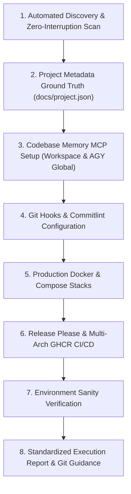

# Universal Repository Setup & Environment Skill (`setup-repository`)

This skill establishes, configures, and validates the standard development environment for any software repository. It handles project metadata discovery, git hygiene, code intelligence with **`codebase-memory-mcp`** (configured in workspace and globally for **Google Antigravity / AGY only**), commit standardization with **Husky & Commitlint**, production **Docker containerization**, and automated **Release Please & multi-arch GHCR** CI/CD deployment.

---

## Workflow Overview



---

## Step 1: Automated Discovery & Repository Scan (Zero Interruption Rule)

> [!IMPORTANT]
> **DO NOT PROMPT THE USER IF INFORMATION IS AVAILABLE IN REPOSITORY FILES.**
> Scan repository files, configs, and documentation in `docs/` first. Automatically deduce runtime, tooling, and conventions. Only prompt the human for missing or ambiguous configuration.

### 1.1. Automated Inspection (Zero Interruption Rule)

1. **Detect Framework & Runtime**:
   - Inspect package manifests: `package.json` (Node/Bun), `pyproject.toml` / `requirements.txt` (Python), `Cargo.toml` (Rust), `go.mod` (Go), etc.
   - Detect package manager from lockfiles:
     - `pnpm-lock.yaml` &rarr; `pnpm`
     - `bun.lockb` / `bun.lock` &rarr; `bun`
     - `yarn.lock` &rarr; `yarn`
     - `package-lock.json` &rarr; `npm`
2. **Scan Existing Documentation**:
   - Read `CONTEXT.md`, `docs/plan.md`, `docs/adr/*.md`, and `README.md` to extract architectural standards, test suites, and language conventions.
3. **Verify Git Working Tree**:
   - Check git status and branch. All inspection and command steps must be executed as discrete single operations without chaining.

### 1.2. Interactive Clarification (AI-Assisted Scaffolding)

If any critical parameters are missing, ambiguous, or undetermined from existing files, ask the user focused questions using clear options:

```markdown
### 📋 Repository Setup & CI/CD Configuration

To configure the standard CI/CD workflow for this repository, please confirm or specify:

1. **Primary Language & Runtime**: (e.g., Node.js / TypeScript, Python, Go, Rust, Java, C++)
2. **Test Command**: (e.g., `pnpm test`, `pytest`, `cargo test`, `go test ./...`)
3. **Build Command**: (e.g., `pnpm run build`, `cargo build --release`, `go build`, `none`)
4. **Release / Publish Target**:
   - [ ] Docker Container Image (GHCR / Docker Hub)
   - [ ] Package Registry (npm, PyPI, Crates.io, Maven)
   - [ ] Binary Release Assets (GitHub Releases)
   - [ ] Static Site / Documentation (GitHub Pages)
   - [ ] None (CI Testing & SemVer Git Tags only)
```

---

## Step 2: Project Metadata Ground Truth (`docs/project.json`)

Maintain a central machine-readable configuration file at `docs/project.json` so all AI agents and specialized skills share identical context.

### Standard `docs/project.json` Template:

```json
{
  "project_context_and_metadata": {
    "project_name": "my-project",
    "runtime": "node",
    "package_manager": "pnpm",
    "source_dir": "src",
    "test_command": "pnpm test",
    "build_command": "pnpm run build",
    "testing_library": ["jest", "playwright"],
    "containerization": "docker-standalone",
    "ci_cd_provider": "github-actions",
    "release_automation": "release-please",
    "publish_target": "container"
  }
}
```

1. Ensure the `docs/` directory exists.
2. Write or update `docs/project.json` with the discovered or confirmed configuration values.

---

## Step 3: Setup `codebase-memory-mcp` Code Intelligence Server

Equip the repository with the `codebase-memory-mcp` persistent knowledge graph server (162 languages, Tree-sitter AST, Hybrid LSP semantic type resolution, and 100% local vector search).

### 3.1. Install Binary

Choose the platform method:

- **Windows (PowerShell)**:
  ```powershell
  Invoke-WebRequest -Uri https://raw.githubusercontent.com/DeusData/codebase-memory-mcp/main/install.ps1 -OutFile install.ps1
  Unblock-File .\install.ps1
  .\install.ps1
  Remove-Item .\install.ps1
  ```
- **macOS / Linux (Bash)**:
  ```bash
  curl -fsSL https://raw.githubusercontent.com/DeusData/codebase-memory-mcp/main/install.sh | bash
  ```
- **Global npm Package Alternative**:
  ```bash
  npm install -g codebase-memory-mcp@latest
  ```

### 3.2. Register MCP Server (Workspace & AGY Global Only)

> [!IMPORTANT]
> **Global MCP Registration is for Antigravity (AGY) ONLY.**
> Antigravity discovers and loads MCP servers that are configured globally on the host system. **Never configure or register MCP servers globally for other coding agents** (e.g., Claude Desktop, Cursor, VS Code, Cline). Register the MCP server across the following locations:

1. **Workspace Root `mcp.json`**:
   ```json
   {
     "mcpServers": {
       "codebase-memory": {
         "command": "codebase-memory-mcp",
         "args": []
       }
     }
   }
   ```
2. **Workspace Agent Config (`.agents/mcp_config.json`)** (if repo uses `.agents/`):
   ```json
   {
     "mcpServers": {
       "codebase-memory": {
         "command": "codebase-memory-mcp",
         "args": []
       }
     }
   }
   ```
3. **Global Host Config (Google Antigravity / AGY Only)**:
   Add `codebase-memory` strictly to the AGY host configurations:
   - `~/.gemini/antigravity/mcp_config.json`
   - `~/.gemini/config/mcp_config.json`
     _(Do NOT register in Claude Desktop, Cursor, or other coding agents)_:
   ```json
   {
     "mcpServers": {
       "codebase-memory": {
         "command": "codebase-memory-mcp",
         "args": []
       }
     }
   }
   ```

### 3.3. Git Hygiene & Persistence

- **Local-Only (Default)**: Add `.codebase-memory/` to `.gitignore`.
- **Team Snapshot Sharing**: If committing the pre-indexed graph snapshot for the team, track `.codebase-memory/graph.db.zst` with Git LFS in root `.gitattributes`:
  ```gitattributes
  .codebase-memory/graph.db.zst filter=lfs diff=lfs merge=lfs -text
  ```

### 3.4. Initial Indexing & Cadence Script

1. Run initial indexing:
   ```bash
   codebase-memory-mcp cli index_repository --repo-path "<canonical-repo-path>"
   ```
2. Add a cadence script to `package.json` for refreshing the index on milestones:
   ```json
   {
     "scripts": {
       "cbm:update": "codebase-memory-mcp cli index_repository --repo-path . --persistence true"
     }
   }
   ```

---

## Step 4: Setup Git Hooks with Husky & Commitlint

Enforce Conventional Commits and guarantee test suites execute before code can be pushed to remote branches.

1. **Install Dev Dependencies**:
   ```bash
   pnpm add -D husky @commitlint/cli @commitlint/config-conventional
   ```
2. **Configure `commitlint.config.mjs`**:
   ```javascript
   export default {
     extends: ["@commitlint/config-conventional"],
   };
   ```
3. **Initialize Husky**:
   ```bash
   pnpm exec husky init
   ```
4. **Configure `commit-msg` Hook**:
   ```bash
   echo "pnpm exec commitlint --edit \$1" > .husky/commit-msg
   ```
5. **Configure `pre-push` Hook**:
   Enforce test suite execution before allowing any `git push`:
   ```bash
   echo "pnpm run test:all" > .husky/pre-push
   ```
   > [!NOTE]
   > Ensure test scripts in `package.json` include graceful flags (e.g. `--passWithNoTests`) so repositories without test files exit code 0 rather than breaking pushes. Never create sample/dummy test files in the workspace.

---

## Step 5: Setup Multi-Stage Production Docker Containerization

Configure containerization strictly for standalone production builds and deployments. Local development runs on the host machine using the project's native package manager.

### 5.1. Configure `.dockerignore`

Exclude local artifacts, git history, and secrets:

```dockerignore
node_modules/
.pnp/
.pnpm-store/
dist/
build/
coverage/
test-results/
.env*
*.log
.git/
.dockerignore
Dockerfile*
docker-compose*.yml
.codebase-memory/
```

### 5.2. Multi-Stage `Dockerfile`

Create a 3-stage multi-stage build (`dependencies` &rarr; `builder` &rarr; `runner`) running under a secure non-root user:

```dockerfile
ARG NODE_VERSION=22-slim

FROM node:${NODE_VERSION} AS dependencies
WORKDIR /app
ENV CI=true
COPY package.json yarn.lock* package-lock.json* pnpm-lock.yaml* ./
RUN --mount=type=cache,target=/root/.local/share/pnpm/store \
  if [ -f pnpm-lock.yaml ]; then corepack enable pnpm && pnpm install --frozen-lockfile; \
  elif [ -f package-lock.json ]; then npm ci; \
  else yarn install --frozen-lockfile; fi

FROM node:${NODE_VERSION} AS builder
WORKDIR /app
COPY --from=dependencies /app/node_modules ./node_modules
COPY . .
ENV NODE_ENV=production
RUN if [ -f pnpm-lock.yaml ]; then corepack enable pnpm && pnpm run build; else npm run build; fi

FROM node:${NODE_VERSION} AS runner
WORKDIR /app
ENV NODE_ENV=production
ARG PORT=3000
ENV PORT=${PORT}
ENV HOSTNAME="0.0.0.0"
COPY --from=builder --chown=node:node /app/dist ./dist
USER node
EXPOSE ${PORT}
CMD ["node", "dist/index.js"]
```

### 5.3. Docker Compose Stacks

1. **Local Build & Test (`docker-compose.yml`)**:
   ```yaml
   services:
     app:
       build:
         context: .
         dockerfile: Dockerfile
       container_name: app-production
       restart: unless-stopped
       ports:
         - "${PORT:-3000}:${PORT:-3000}"
       environment:
         - NODE_ENV=production
   ```
2. **Production Pre-Built Stack (`docker-compose.prod.yml`)**:
   Pulls pre-built multi-arch images directly from GHCR without source code:
   ```yaml
   services:
     app:
       image: ghcr.io/<lowercase-owner>/<lowercase-repo>:${IMAGE_TAG:-latest}
       container_name: app-production
       restart: always
       ports:
         - "${PORT:-3000}:${PORT:-3000}"
       environment:
         - NODE_ENV=production
   ```

---

## Step 6: Setup Credit-Optimized CI/CD & Release Please Automation

Automate semantic releases, changelogs, and multi-arch (AMD64 & ARM64) GitHub Container Registry publishing via `.github/workflows/release-please.yml`:

### Core DevOps Design Rules:

1. **Automated Test Gate**: Runs project tests on pull requests and commits to `main`.
2. **Release Please Automation**: Automates version bumps, changelogs, and release PRs.
3. **`concurrency.cancel-in-progress: false`**: Never cancel release workflows or main-branch deployments in-flight.
4. **Two-Stage Multi-Arch Matrix Builder**: Build AMD64 and ARM64 on native runner machines (`ubuntu-latest` and `ubuntu-24.04-arm`) without QEMU emulation. Push images by digest.
5. **Digest Manifest Merge**: A downstream `merge-manifest` job stitches AMD64 and ARM64 digests into a unified multi-arch tag.
6. **Lowercase Repository Name**: Always transform `github.repository` to lowercase via `tr '[:upper:]' '[:lower:]'` into `IMAGE_NAME` (Docker OCI strict requirement).

### Workflow Template (`.github/workflows/release-please.yml`):

```yaml
name: Release Please & CI Validation

on:
  push:
    branches: [main]
  pull_request:
    branches: [main]

concurrency:
  group: ${{ github.workflow }}-${{ github.ref }}
  cancel-in-progress: false

permissions:
  contents: write
  pull-requests: write
  packages: write

jobs:
  # =======================================================
  # 1. CI Validation Gate: Run Linters & Test Suites
  # =======================================================
  test:
    name: Run Test Suite
    runs-on: ubuntu-latest
    steps:
      - name: Checkout Repository
        uses: actions/checkout@v4

      - name: Setup pnpm
        uses: pnpm/action-setup@v4

      - name: Setup Node.js
        uses: actions/setup-node@v4
        with:
          node-version: 22
          cache: "pnpm"

      - name: Install Dependencies
        run: pnpm install --frozen-lockfile

      - name: Run Test Suite
        run: pnpm test

  # =======================================================
  # 2. Release Please: Automated SemVer & Changelog PRs
  # =======================================================
  release-please:
    name: Release Please Automation
    needs: test
    if: github.ref == 'refs/heads/main' && github.event_name == 'push'
    runs-on: ubuntu-latest
    outputs:
      release_created: ${{ steps.release.outputs.release_created }}
      tag_name: ${{ steps.release.outputs.tag_name }}
      version: ${{ steps.release.outputs.version }}
    steps:
      - name: Run Release Please
        uses: googleapis/release-please-action@v4
        id: release
        with:
          release-type: node

  # =======================================================
  # 3. Build Container Matrix: AMD64 & ARM64 Native Runners
  # =======================================================
  build-container:
    name: Build Container (${{ matrix.platform }})
    needs: [test, release-please]
    if: needs.release-please.outputs.release_created == 'true'
    strategy:
      fail-fast: false
      matrix:
        include:
          - runner: ubuntu-latest
            platform: linux/amd64
            arch: amd64
          - runner: ubuntu-24.04-arm
            platform: linux/arm64
            arch: arm64
    runs-on: ${{ matrix.runner }}
    steps:
      - name: Checkout Repository
        uses: actions/checkout@v4

      - name: Set Lowercase Image Name
        run: echo "IMAGE_NAME=$(echo "ghcr.io/${{ github.repository }}" | tr '[:upper:]' '[:lower:]')" >> "$GITHUB_ENV"

      - name: Setup Docker Buildx
        uses: docker/setup-buildx-action@v3

      - name: Log in to GHCR
        uses: docker/login-action@v3
        with:
          registry: ghcr.io
          username: ${{ github.actor }}
          password: ${{ secrets.GITHUB_TOKEN }}

      - name: Build and Push by Digest
        id: build
        uses: docker/build-push-action@v6
        with:
          context: .
          platforms: ${{ matrix.platform }}
          outputs: type=image,name=${{ env.IMAGE_NAME }},push-by-digest=true,name-canonical=true,push=true

      - name: Export Digest
        run: |
          mkdir -p /tmp/digests
          digest="${{ steps.build.outputs.digest }}"
          touch "/tmp/digests/${digest#sha256:}"

      - name: Upload Digest Artifact
        uses: actions/upload-artifact@v4
        with:
          name: digests-${{ matrix.arch }}
          path: /tmp/digests/*
          retention-days: 1

  # =======================================================
  # 4. Manifest Merge: Create Multi-Arch Image Tag
  # =======================================================
  merge-manifest:
    name: Create & Push Multi-Arch Manifest
    needs: [release-please, build-container]
    runs-on: ubuntu-latest
    steps:
      - name: Download Digests
        uses: actions/download-artifact@v4
        with:
          path: /tmp/digests
          pattern: digests-*
          merge-multiple: true

      - name: Set Lowercase Image Name
        run: echo "IMAGE_NAME=$(echo "ghcr.io/${{ github.repository }}" | tr '[:upper:]' '[:lower:]')" >> "$GITHUB_ENV"

      - name: Setup Docker Buildx
        uses: docker/setup-buildx-action@v3

      - name: Log in to GHCR
        uses: docker/login-action@v3
        with:
          registry: ghcr.io
          username: ${{ github.actor }}
          password: ${{ secrets.GITHUB_TOKEN }}

      - name: Create Multi-Arch Manifest
        working-directory: /tmp/digests
        run: |
          docker buildx imagetools create \
            -t ${{ env.IMAGE_NAME }}:latest \
            -t ${{ env.IMAGE_NAME }}:${{ needs.release-please.outputs.version }} \
            -t ${{ env.IMAGE_NAME }}:v${{ needs.release-please.outputs.version }} \
            $(printf '${{ env.IMAGE_NAME }}@sha256:%s ' *)
```

---

## Step 7: Environment Sanity Verification

Audit the configuration integrity:

1. Verify `docs/project.json` exists with valid schema.
2. Verify `mcp.json` and AGY global `mcp_config.json` contain `codebase-memory`.
3. Verify `codebase-memory-mcp cli get_architecture` runs cleanly.
4. Verify Commitlint validates valid Conventional Commit messages and rejects invalid formats.
5. Verify `.husky/commit-msg` and `.husky/pre-push` are configured and executable.
6. Verify Docker configuration parses cleanly (`docker compose config`).
7. Verify `.github/workflows/release-please.yml` syntax is valid.

---

## Step 8: Standardized Dev Setup Execution Report & Git Commit Protocol

Upon completing setup, output the standardized execution report summarizing every component, explicitly distinguishing between what was freshly implemented vs. what was already configured:

### Standard Output Report Template

```markdown
## 🛠️ Repository Setup Execution Report

| Step / Component                   | Target File(s) / Resource                                                      | Status                          | Notes / Details                                                                   |
| :--------------------------------- | :----------------------------------------------------------------------------- | :------------------------------ | :-------------------------------------------------------------------------------- |
| **1. Project Metadata**            | `docs/project.json`                                                            | `[IMPLEMENTED]` / `[UNTOUCHED]` | Recorded runtime, package manager, and test tooling metadata.                     |
| **2. Codebase Memory MCP**         | `mcp.json`, `.agents/mcp_config.json`, AGY global configs                      | `[IMPLEMENTED]` / `[UNTOUCHED]` | Binary installed, registered in workspace & globally for AGY only, indexed graph. |
| **3. Husky Git Hooks**             | `.husky/commit-msg`, `.husky/pre-push`                                         | `[IMPLEMENTED]` / `[UNTOUCHED]` | Configured Conventional Commits gate and pre-push test suite runner.              |
| **4. Commitlint Config**           | `commitlint.config.mjs`                                                        | `[IMPLEMENTED]` / `[UNTOUCHED]` | Enforces `@commitlint/config-conventional` specification.                         |
| **5. Docker Containerization**     | `Dockerfile`, `docker-compose.yml`, `docker-compose.prod.yml`, `.dockerignore` | `[IMPLEMENTED]` / `[UNTOUCHED]` | Multi-stage production container & local/GHCR compose stacks.                     |
| **6. Release Please & Multi-Arch** | `.github/workflows/release-please.yml`                                         | `[IMPLEMENTED]` / `[UNTOUCHED]` | Automated SemVer release PRs and native AMD64/ARM64 GHCR deployment.              |
| **7. Environment Sanity Check**    | Workspace Audit                                                                | `[PASSED]`                      | All configuration files and hooks verified clean.                                 |

### Status Definitions:

- **`[IMPLEMENTED]`**: Freshly created, installed, or modified during this setup run.
- **`[UNTOUCHED]`**: Already properly configured prior to running the skill; preserved as-is.
- **`[SKIPPED]`**: Intentionally omitted based on project needs or developer preference.
```

### Git Commit Instructions

Group files and generate a commit message summarizing the changes made during the setup process. **Do not commit anything automatically**; output the exact git commit commands and leave committing to the human:

```bash
git add docs/project.json mcp.json commitlint.config.mjs .husky/ Dockerfile docker-compose*.yml .github/workflows/
git commit -m "chore: configure standard repository tooling, codebase intelligence, and ci/cd"
```
