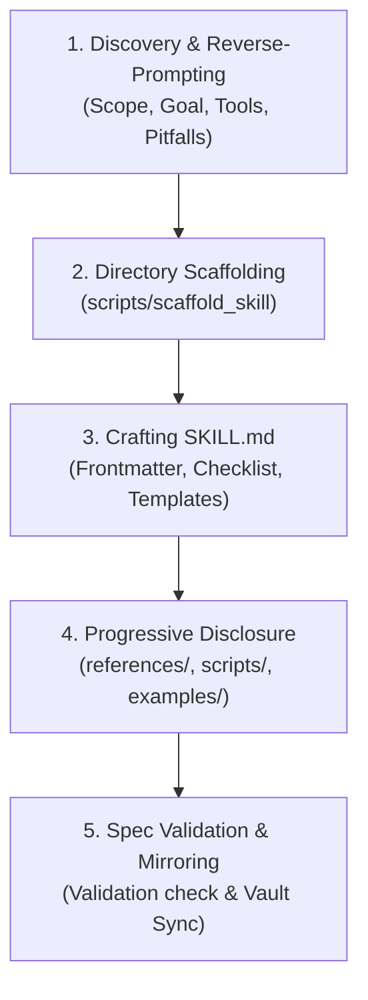
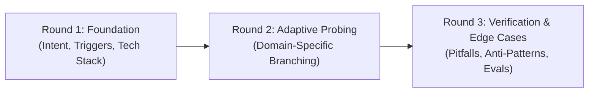
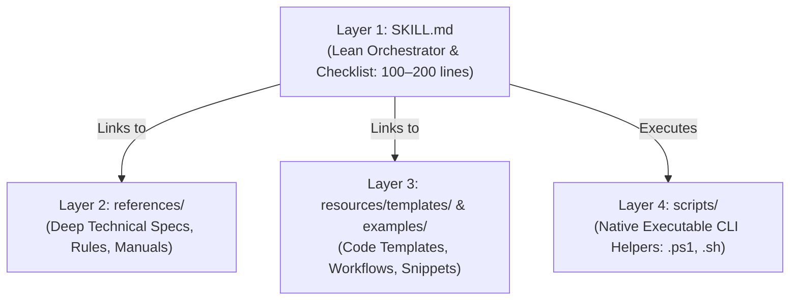

# AI Skill Creator (`skill-creator`)

A structured, end-to-end guide and toolkit for authoring production-grade AI skills. This skill helps you convert complex workflows, repository standards, and domain expertise into modular, self-correcting agent capabilities adhering to the [Open Agent Skills Specification](https://agentskills.io/specification).

---

## Quick Start: Interactive Skill Creation Runbook

Follow this 5-phase procedure when creating or refining a skill:



---

## Phase 1: Adaptive Round-Based Discovery (Reverse-Prompting)

Do not dump a single massive questionnaire. Conduct the discovery interview in **adaptive rounds**, updating subsequent questions dynamically based on earlier responses.



### Round 1: Foundation & Intent

Ask 2-3 high-level framing questions and **stop to wait for user response**:

1. **Core Goal**: What specific workflow or task does this skill automate?
2. **Triggers**: What specific prompts or scenarios should trigger this skill?
3. **Tech Stack / Domain**: What framework, language, CLI tool, or agent pattern is used?

### Round 2: Domain-Specific Probing (Dynamically Adapted)

Analyze the user's Round 1 answers, pick the relevant domain branch, and ask targeted questions:

- _If Web / Frontend_: Inquire about routing (App/Pages), state/data caching, UI libraries, i18n, and required config fallbacks.
- _If CLI / DevOps / Backend_: Inquire about required binaries, container constraints (e.g. standalone production Docker), auth tokens, and exit codes.
- _If Multi-Agent / Workflow_: Inquire about agent topology (linear, hierarchical, consensus), subagent reflection, and shared state memory.

### Round 3: Edge Cases, Risk & Verification Criteria

Adapt final probing questions based on Rounds 1 & 2:

1. **Known AI Pitfalls**: What specific mistakes or hallucinations do AI models typically make with this stack/task?
2. **Risk & Reversibility**: Are there destructive or high-risk actions that require dry-run validation or user approval gates?
3. **Objective Verification**: What exact commands (`pnpm test`, lint, healthchecks) prove the task was successful?
4. **Output Format**: What structured template or report schema should the skill output?

> [!TIP]
> Consult [adaptive-discovery-rounds.md](./references/adaptive-discovery-rounds.md) for full branching trees and question sets across domains.

---

## Phase 2: Directory Scaffolding

Scaffold the standard Open Agent Skills directory structure:

```text
skills/<skill-name>/
├── SKILL.md                 # Required: Entrypoint runbook & frontmatter
├── scripts/                 # Optional: Native helper scripts (.ps1, .sh)
│   ├── scaffold_skill.ps1
│   └── scaffold_skill.sh
├── references/              # Optional: Deep technical docs, schemas, checklists
│   ├── frontmatter-and-triggers.md
│   ├── progressive-disclosure.md
│   ├── evals-and-verification.md
│   └── skill-templates.md
├── examples/                # Optional: Reference implementations & snippets
└── resources/               # Optional: Config templates, assets, schemas
```

### Automated Scaffolding:

Run the platform-appropriate script to generate the folder boilerplate:

- **Windows (PowerShell)**:
  ```powershell
  powershell -ExecutionPolicy Bypass -File skills/skill-creator/scripts/scaffold_skill.ps1 -Name "<skill-name>" -Description "<skill-description>"
  ```
- **Linux / macOS (Bash)**:
  ```bash
  bash skills/skill-creator/scripts/scaffold_skill.sh -n "<skill-name>" -d "<skill-description>"
  ```

---

## Phase 3: Crafting `SKILL.md`

Every `SKILL.md` must follow these core structural conventions:

### 1. Ultra-Minimal Frontmatter Contract

```yaml
---
name: my-specialized-skill
description: >-
  1-2 concise sentences in third-person stating WHAT the skill does and specific trigger phrases.
---
```

> [!IMPORTANT]
> **Strict Description Brevity Rule**: Keep the frontmatter `description` strictly to 1–2 concise sentences (under ~150–200 characters). State only **WHAT** the skill accomplishes and **WHEN** it triggers. **NEVER describe internal procedural steps, methodology, or implementation mechanics ("how")** in the frontmatter. See [frontmatter-and-triggers.md](./references/frontmatter-and-triggers.md).

### 2. Ultra-Lean Orchestration Runbook (100–200 Lines Max)

`SKILL.md` must serve strictly as an **orchestrator and checklist**, not an encyclopedia:

- Target a compact length of **100–200 lines maximum**.
- Structure operational steps as actionable markdown checklists (`- [ ]`) or high-level numbered stages.
- Instruct the agent to think step-by-step, executing and verifying each milestone sequentially.

### 3. Strict Code Template Offloading (No Inline Code Dumps)

> [!CAUTION]
> **Never embed large code blocks, configuration boilerplates, Dockerfiles, or CI workflows directly in `SKILL.md`.**
> Move code templates and config snippets into dedicated files under [`resources/templates/`](./resources/templates/) or [`examples/`](./examples/) and link to them with relative markdown links (e.g., `[Dockerfile template](./resources/templates/Dockerfile.template)` or `[release workflow](./examples/release-please.yml)`).

### 4. Edge Cases & Known AI Pitfalls

Always include a focused **"Edge Cases & Common Mistakes"** section detailing domain-specific nuances that LLMs typically miss (e.g., hidden flags, command chaining bans, timezone bugs).

### 5. Output Contract / Templates

Provide a concise output template or reporting schema so the agent formats results consistently without guessing.

---

## Phase 4: Progressive Disclosure & Modular Content Separation

Preserve the agent's active context window by separating skill content across four distinct modular layers:



1. **Layer 1 (`SKILL.md`)**: High-level workflow, pre-conditions, checklist, and verification gates.
2. **Layer 2 (`references/`)**: Detailed technical documentation, API specifications, rule matrices, and diagnostic tables. (Link via `[topic.md](./references/topic.md)`).
3. **Layer 3 (`resources/templates/` & `examples/`)**: Isolated boilerplate code, Dockerfiles, config templates, and snippet references. (Link via `[template.json](./resources/templates/template.json)`).
4. **Layer 4 (`scripts/`)**: Complex, multi-step CLI automation encapsulated into native cross-platform scripts (`.ps1` and `.sh`) with `--help` flags and exit codes.

> [!NOTE]
> Review [progressive-disclosure.md](./references/progressive-disclosure.md) for full context management techniques.

---

## Phase 5: Validation, Reflection & Mirroring

Before concluding skill creation:

### 1. Spec Validation Check

Verify naming rules, YAML frontmatter, and file paths:

- **Windows**:
  ```powershell
  powershell -ExecutionPolicy Bypass -File skills/skill-creator/scripts/scaffold_skill.ps1 -Validate "skills/<skill-name>"
  ```
- **Linux / macOS**:
  ```bash
  bash skills/skill-creator/scripts/scaffold_skill.sh -v "skills/<skill-name>"
  ```

### 2. Self-Correction & Verification Loops

Ensure the skill includes built-in verification mechanisms (e.g. run test suite, check linting, inspect log files, subagent reflection). See [evals-and-verification.md](./references/evals-and-verification.md).

### 3. Central Vault Mirroring

When working in a project repository, mirror newly created or updated skills to the central Obsidian knowledge base (`d:/Scripts/Obsidian/skills/<name>/`).

---

## Reference Guides

- [Adaptive Discovery Rounds](./references/adaptive-discovery-rounds.md) — Multi-round interactive interview workflow.
- [Frontmatter & Triggers Guide](./references/frontmatter-and-triggers.md) — How to write high-precision skill descriptions.
- [Progressive Disclosure Guide](./references/progressive-disclosure.md) — Managing context limits, relative linking, and references.
- [Evals & Verification Loops](./references/evals-and-verification.md) — Building self-correcting and reflective skills.
- [Skill Templates](./references/skill-templates.md) — Boilerplates for Workflow, Architecture, Multi-Agent, and Tool skills.
