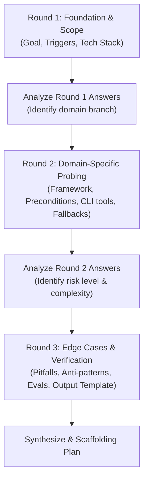

# Adaptive Discovery Rounds (Interactive Reverse-Prompting)

When authoring a skill, conducting the discovery phase in **adaptive rounds** ensures the agent gathers precise, high-signal requirements without overwhelming the user with a single massive questionnaire. Each round adapts dynamically based on the answers provided in the preceding round.

---

## The 3-Round Adaptive Discovery Framework

---

## Round 1: Foundation & Intent Discovery

Ask 2-3 high-level framing questions:

1. **Core Goal**: What specific problem or workflow does this skill solve?
2. **Triggers**: What phrases or situations should trigger this skill? (e.g., *"deploy to staging"*, *"review my auth flow"*, *"generate stories"*)
3. **Domain / Stack**: What is the target stack, tool, or environment? (e.g., Next.js App Router, Docker, Android SDK, Go, Multi-Agent workflow)

> **Agent Action**: Pause and wait for user answers. Do not ask Round 2 until Round 1 is answered.

---

## Round 2: Adaptive Domain Probing (Branching Logic)

Branch your questions dynamically based on the user's stack and goal:

### Branch A: Web / Frontend Frameworks (e.g. Next.js, React, Flutter)
- Which routing paradigm is used (e.g. Next.js App Router vs Pages Router)?
- What UI/component library is standard (e.g. Tailwind, shadcn/ui, GSAP)?
- What conventions exist for data-fetching, caching (`use cache`, ISR), and i18n (e.g. `messages/en.json`)?
- What files must exist, and what fallback should be created if missing (e.g. `components.json`)?

### Branch B: Backend, DevOps & CLI Tools (e.g. Docker, Go, Python, Git)
- What CLI binaries or MCP servers are required (e.g. `docker`, `git`, `gopls`)?
- Are operations standalone or containerized (e.g. standalone production Dockerfile vs local dev)?
- What authentication or environment variables are expected?
- What are standard success/failure exit codes and log formats?

### Branch C: Multi-Agent & Collaborative Workflows
- What is the agent topology: Linear pipeline, Hierarchical manager-worker, or Multi-agent consensus?
- Should reflection/review be handled by a dedicated subagent?
- Where is shared state stored (e.g. JSON memory file, workspace scratch)?

---

## Round 3: Edge Cases, Anti-Patterns & Verification Criteria

Formulate targeted probing questions based on the answers from Rounds 1 & 2:

1. **Known AI Pitfalls & Nuances**:
   - What mistakes or hallucinations do AI models typically make with this specific technology? (e.g., hallucinating deprecated imports, forgetting soft-delete clauses, missing client directives `"use client"`).
2. **Risk & Reversibility**:
   - Is this a high-risk or destructive operation? (e.g. database schema change, force push). Should the skill include dry-run checks or explicit user confirmation gates?
3. **Verification & Self-Check Criteria**:
   - What exact automated commands or test suites determine success? (e.g. `pnpm test:all`, `go test ./...`, linting, healthcheck endpoint).
4. **Deliverable Contract**:
   - What specific output format (Markdown table, JSON report, diff snippet) should the skill produce?

---

## Guidelines for the Interviewing Agent

- **Ask 2–4 focused questions per round**: Never dump 10+ questions at once.
- **Synthesize context between rounds**: Acknowledge what was learned in Round 1 before presenting Round 2 questions.
- **Recommend sensible defaults**: If a user is uncertain, propose the community or repository standard as a recommendation.

