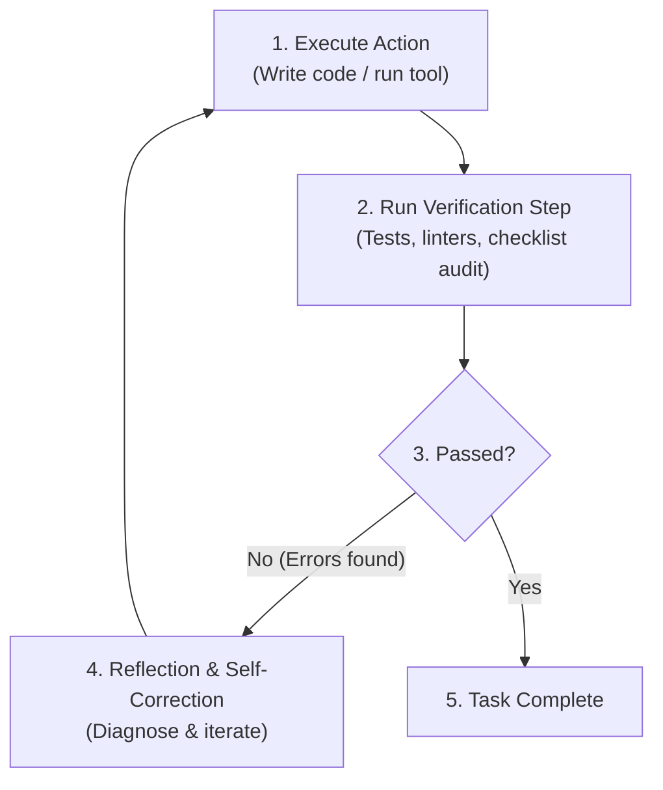

# Evals, Self-Correction & Verification Loops

A high-quality skill does not merely generate code or text—it enforces **verification loops** to guarantee that output meets quality standards before considering a task complete.

---

## 1. The Core Verification Pattern

Every actionable skill should instruct the agent to follow a 4-step loop:



---

## 2. Objective vs. Subjective Verification

### Objective Verification (Code & Tests)

Always prefer deterministic, code-based checks whenever possible:

- **Unit & Integration Tests**: `pnpm test`, `pytest`, `cargo test`.
- **Type Checking & Linting**: `pnpm tsc --noEmit`, `eslint`, `ruff check`.
- **Build Checks**: `pnpm build`, `go build`.
- **Validation Scripts**: Executable scripts in `scripts/` checking constraints (e.g. JSON schema validation, soft delete queries).

### Subjective Verification (Agent Reflection & Checklists)

For subjective tasks (documentation, UI design, copywriting, prompt design):

- Instruct the agent to run a structured rubric or checklist.
- Example:

  ```markdown
  ### Verification Rubric

  - [ ] Did the output address all required user constraints?
  - [ ] Is error handling included for network dropouts and timeouts?
  - [ ] Are sensitive credentials stored in environment variables rather than hardcoded?
  ```

---

## 3. Subagent Reflection Pattern

For complex or high-stakes workflows, decouple implementation from review by delegating review to a separate subagent or specialized reviewer role:

1. **Implementer Agent**: Generates the first draft/code.
2. **Reviewer Subagent**: Spawned with clean context to review specifically for security, performance, and missing edge cases.
3. **Resolver**: Fixes identified issues before final approval.

---

## 4. How to Specify Verification in `SKILL.md`

Always add a dedicated `## Verification & Self-Check` section in your skill:

```markdown
## Verification & Self-Check

After completing the changes:

1. Run the project test suite: `pnpm test`
2. Run type checking: `pnpm type-check`
3. Inspect generated configuration files against [schema.json](./resources/schema.json).
4. If any test fails, diagnose the root cause, fix the issue, and rerun the test suite until all checks pass.
```
