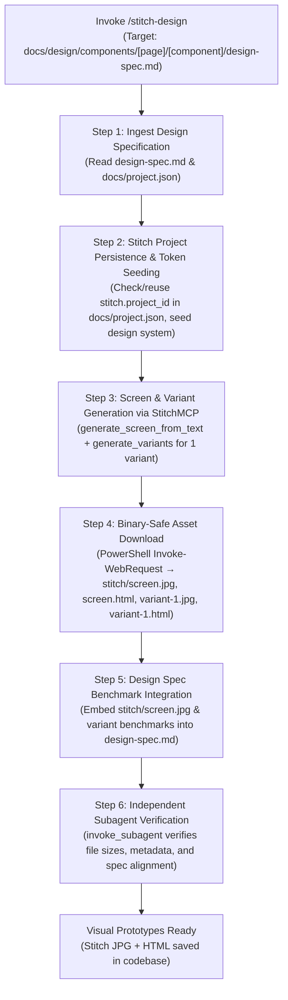

# Google Stitch UI Prototyping & Variant Skill (`stitch-design`)

This skill defines the complete workflow for taking an established component design specification (`design-spec.md`) and using **Google Stitch (`StitchMCP`)** to scaffold screen layouts, generate spatial variants, download high-resolution visual assets (JPG screenshots and raw HTML exports) into the codebase, and update the design specification with concrete layout benchmarks.

> [!IMPORTANT]
> **Input Prerequisite:**
> This skill requires a completed design specification at `docs/design/components/[page name]/[component name]/design-spec.md` (typically generated by [`component-design`](file:///d:/Scripts/aminwebsite/.agents/skills/component-design/SKILL.md)). If no spec exists, run `/component-design` first.

> [!CAUTION]
> **Binary Download Safety Rule:**
> NEVER use `read_url_content` to download Stitch JPG screenshots or HTML exports. `read_url_content` is text-only and converts responses to markdown, corrupting binary images and mangling HTML structure. All downloads MUST use `run_command` with PowerShell `Invoke-WebRequest -Uri <url> -OutFile <path>`. Signed download URLs expire quickly—download immediately upon receiving the Stitch response.

> [!TIP]
> **Zero In-Skill Image Generation (Token Conservation Rule):**
> To conserve tokens, this skill MUST NOT invoke `generate_image` directly. If the screen requires custom background images, illustrations, or icons, formulate and output structured prompts to the user so they can generate and place them in the project files.

---

## 1. Core Deliverables & Workflow Overview



### Deliverable: The Stitch Assets Subfolder

Every Stitch run creates or populates the `stitch/` subfolder inside the component's design directory:

```text
docs/design/components/[page name]/[component name]/
├── design-spec.md          # Updated with Stitch benchmarks & embedded screenshots
└── stitch/                 # Downloaded Google Stitch design files
    ├── screen.jpg          # Stitch-generated JPG screenshot of the primary screen
    ├── screen.html         # Stitch-generated raw HTML export of the primary screen
    ├── variant-1.jpg       # Stitch-generated JPG screenshot of the variant
    ├── variant-1.html      # Stitch-generated raw HTML export of the variant
    └── stitch-meta.json    # Stitch project ID, screen ID, variant IDs, and generation prompt
```

---

## 2. Step-by-Step Execution Workflow

### Step 1: Ingest Design Specification & Project Context

1. **Locate Target Component:**
   - Identify the component path: `docs/design/components/[page name]/[component name]/`.
   - Read `design-spec.md` to extract:
     - Executive summary, persona, and emotional tone.
     - Visual hierarchy (1st, 2nd, and 3rd focal points).
     - Layout grid and breakpoint behaviors.
     - Design tokens (colors, radii, elevation).
     - Per-locale typography pairings.
2. **Read Project Context:**
   - Read [`docs/project.json`](file:///d:/Scripts/aminwebsite/docs/project.json) to verify the canonical design system and check for existing Stitch configuration.

---

### Step 2: Google Stitch Project Persistence & Design System Seeding (`StitchMCP`)

> [!IMPORTANT]
> **Single Project Per Repository Rule (Zero Duplicate Projects):**
> Every repository must maintain exactly **one shared Google Stitch project container** for all of its component and screen designs. NEVER create multiple Stitch projects for the same repository.

1. **Check `docs/project.json` First:**
   - Inspect `docs/project.json` for an existing `"stitch"` object with `project_id`.
2. **Reuse Existing Project:**
   - If `stitch.project_id` exists, ALWAYS reuse that `projectId` directly for all screen scaffolding, variants, and design system updates. Do NOT call `create_project`.
3. **Create & Immediately Persist (Only if Absent):**
   - If no `stitch.project_id` exists in `docs/project.json`:
     - Call `call_mcp_tool` on `StitchMCP` with `list_projects` to check if a project matching the repository title already exists.
     - If none exists, call `create_project` with `title: "[Project Title] Design System & Components"`.
     - **IMMEDIATELY persist the project properties** to `docs/project.json` under `"stitch"`:
       ```json
       "stitch": {
         "project_id": "<projectId>",
         "project_name": "projects/<projectId>",
         "title": "<title>"
       }
       ```
4. **Seed Design Tokens:**
   - Provide the project's canonical design system (from `docs/project.json`) to Stitch via `upload_design_md` or `create_design_system_from_design_md` to establish global color, font, and radius consistency.

---

### Step 3: Screen & Variant Generation via `StitchMCP`

1. **Synthesize Detailed Design Prompt:**
   - Combine the component purpose, user persona, emotional tone, and layout requirements from `design-spec.md`.
   - Explicitly specify visual tokens: background canvas, surface cards, primary accent, secondary accent, status colors, and typography from `docs/project.json`.
   - Specify target viewport: `deviceType: "DESKTOP"` (or `"MOBILE"` / `"TABLET"` if targeting a mobile-first component).
2. **Generate Primary Screen:**
   - Call `generate_screen_from_text` on `StitchMCP`:
     - `projectId`: Active Stitch project ID.
     - `prompt`: Synthesized design prompt.
     - `deviceType`: `"DESKTOP"`.
   - Extract the generated screen ID and resource name (format: `projects/{projectId}/screens/{screenId}`).
3. **Generate One Variant:**
   - Call `generate_variants` on `StitchMCP` using the generated screen ID to produce one spatial/visual variant of the design spec file (e.g. exploring an alternative layout density, card vs. full-bleed, or asymmetric visual flow).
   - Record the variant screen ID.

---

### Step 4: Binary-Safe Asset Download Protocol

> [!CAUTION]
> **PowerShell `Invoke-WebRequest` Required:**
> Run each download command as a discrete single operation. Verify that each file downloaded has a non-zero byte size (> 10KB for JPGs).

1. **Ensure Directory Exists:**
   - Target directory: `docs/design/components/[page name]/[component name]/stitch/`.
2. **Download Primary Screen JPG:**
   - Extract `screenshot.downloadUrl` from the primary screen response.
   - Execute:
     ```powershell
     powershell -Command "Invoke-WebRequest -Uri '<screenshot.downloadUrl>' -OutFile 'docs/design/components/[page]/[component]/stitch/screen.jpg'"
     ```
3. **Download Primary Screen HTML:**
   - Extract `htmlCode.downloadUrl` from the primary screen response.
   - Execute:
     ```powershell
     powershell -Command "Invoke-WebRequest -Uri '<htmlCode.downloadUrl>' -OutFile 'docs/design/components/[page]/[component]/stitch/screen.html'"
     ```
4. **Download Variant-1 JPG:**
   - Extract `screenshot.downloadUrl` from the variant response.
   - Execute:
     ```powershell
     powershell -Command "Invoke-WebRequest -Uri '<variant.screenshot.downloadUrl>' -OutFile 'docs/design/components/[page]/[component]/stitch/variant-1.jpg'"
     ```
5. **Download Variant-1 HTML:**
   - Extract `htmlCode.downloadUrl` from the variant response.
   - Execute:
     ```powershell
     powershell -Command "Invoke-WebRequest -Uri '<variant.htmlCode.downloadUrl>' -OutFile 'docs/design/components/[page]/[component]/stitch/variant-1.html'"
     ```
6. **Save Stitch Metadata (`stitch-meta.json`):**
   - Write `docs/design/components/[page]/[component]/stitch/stitch-meta.json`:
     ```json
     {
       "projectId": "<stitchProjectId>",
       "screenId": "<screenId>",
       "screenName": "projects/<projectId>/screens/<screenId>",
       "deviceType": "DESKTOP",
       "generationPrompt": "<synthesizedPrompt>",
       "variantIds": ["<variantScreenId1>"]
     }
     ```

---

### Step 5: Design Spec Benchmark Integration

Update `docs/design/components/[page name]/[component name]/design-spec.md` with the Stitch results:

1. **Embed Stitch Primary Screen & Variant:**
   ```markdown
   ## Google Stitch Layout Architecture & Benchmarks

   ### Primary Screen Design
   

   ### Variant 1 Exploration
   
   ```
2. **Document Layout Architecture Observations:**
   - Note the spatial grid, visual weight, whitespace rhythm, and typography hierarchy demonstrated in the Stitch screens.
   - Compare the primary screen with Variant 1, highlighting the strengths of each composition.

---

### Step 6: Visual Asset Prompts (If Applicable)

> [!NOTE]
> If inspecting the Stitch layouts reveals a need for bespoke visual assets (e.g. ambient backgrounds, custom icons, or diagrams), do NOT call `generate_image`. Output structured prompts to the user:

```markdown
### Recommended Visual Asset: [Asset Name]
- **Target File Path:** `docs/design/components/[page]/[component]/[filename].png`
- **Recommended Aspect Ratio:** `16:9` or `1:1`
- **Generation Prompt:**
  > "[Detailed prompt describing the visual asset matching the Stitch layout]"
```

---

### Step 7: Independent Subagent Verification Loop (`invoke_subagent`)

> [!IMPORTANT]
> **Subagent Review Protocol:**
> Always verify downloaded assets and spec updates via an independent subagent before reporting completion.

#### 1. Spawn Verification Subagent

Call `invoke_subagent` with:

- `TypeName`: `"self"`
- `Role`: `"Stitch Asset & Download Auditor"`
- `Model`: `"inherit"`
- `Prompt`:

```text
You are an independent Stitch Asset Auditor. Your job is to verify that Google Stitch assets were downloaded cleanly and integrated into the component directory.

TARGET COMPONENT DIRECTORY:
docs/design/components/[page name]/[component name]/

Deliverables to Audit:
1. docs/design/components/[page name]/[component name]/stitch/screen.jpg (must exist, non-zero bytes)
2. docs/design/components/[page name]/[component name]/stitch/screen.html (must exist, raw HTML)
3. docs/design/components/[page name]/[component name]/stitch/variant-1.jpg (must exist, non-zero bytes)
4. docs/design/components/[page name]/[component name]/stitch/variant-1.html (must exist, raw HTML)
5. docs/design/components/[page name]/[component name]/stitch/stitch-meta.json (valid JSON with projectId, screenId, generationPrompt, variantIds)
6. docs/design/components/[page name]/[component name]/design-spec.md (must embed stitch/screen.jpg and stitch/variant-1.jpg)

Audit against these strict criteria:
1. Binary File Integrity: Confirm screen.jpg and variant-1.jpg are not empty or corrupted (size > 10KB).
2. HTML Integrity: Confirm screen.html and variant-1.html are valid HTML files and not corrupted markdown.
3. Metadata Integrity: Confirm stitch-meta.json has valid fields.
4. Spec Integration: Confirm design-spec.md contains the embedded screenshot links and Stitch layout benchmark notes.
5. Token Conservation: Confirm generate_image was NOT called directly.

Respond in this exact format:
VERDICT: PASS | ISSUES_FOUND

ISSUES (if any):
- LOCATION: {file:line or section}
- PROBLEM: {what is non-compliant or broken}
- FIX: {concrete instruction to fix}

SUMMARY: {brief overall evaluation}
```

#### 2. Evaluate Review & Resolve

If `ISSUES_FOUND`, immediately resolve them (e.g. re-downloading any failed asset or fixing metadata) before completing execution.

---

## 3. Execution Verification Checklist

Before completing execution, verify:

- [ ] `design-spec.md` was ingested from `docs/design/components/[page]/[component]/`.
- [ ] Stitch project ID was verified/reused from `docs/project.json` (or created and immediately persisted).
- [ ] Design tokens were seeded into Stitch via `upload_design_md` or `create_design_system_from_design_md`.
- [ ] Primary screen was generated via `generate_screen_from_text`.
- [ ] Exactly one variant was generated via `generate_variants`.
- [ ] All assets were downloaded using PowerShell `Invoke-WebRequest -OutFile` (zero use of `read_url_content`).
- [ ] `screen.jpg`, `screen.html`, `variant-1.jpg`, `variant-1.html` are saved in `stitch/` with non-zero sizes.
- [ ] `stitch/stitch-meta.json` was saved with complete metadata.
- [ ] `design-spec.md` was updated with embedded screenshots and Stitch layout benchmarks.
- [ ] `generate_image` was NOT called directly; image prompts were output for the user if needed.
- [ ] Independent subagent audit was invoked via `invoke_subagent` and passed.

