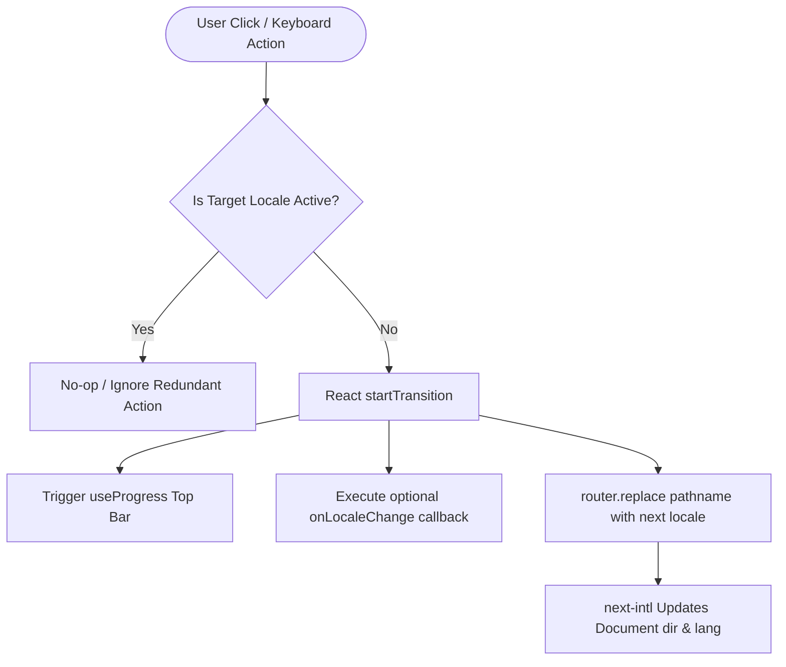

# Component Modules Directory (`app/components`)

This directory houses reusable client and server components for the Amin Jamali Systems Portfolio & Lab.

---

## 1. Module Index

| Component            | Type                              | Responsibility                                                                                                             | Primary Consumer                | Skeletons / Fallbacks    |
| :------------------- | :-------------------------------- | :------------------------------------------------------------------------------------------------------------------------- | :------------------------------ | :----------------------- |
| **`LocaleSwitcher`** | Client Component (`"use client"`) | High-precision segmented pill switcher toggling English (`en` - LTR) and Persian (`fa` - RTL) with progress bar telemetry. | `SiteHeader`, `MobileNavDrawer` | `LocaleSwitcherSkeleton` |
| **`Link`**           | Client Component (`"use client"`) | Progress-aware Next.js Link wrapper integrating `next-intl` navigation and `react-transition-progress`.                    | Global navigation, CTA buttons  | N/A                      |

---

## 2. Component Architecture: `LocaleSwitcher`

### Algorithmic Breakdown & Flow

### Bidirectional Layout Sorting

- **LTR (`dir="ltr"`)**: Flex order displays `Globe (order-0) -> EN (order-1) -> FA (order-2)`.
- **RTL (`dir="rtl"`)**: Flex order displays `Globe (order-0) -> FA (order-1) -> EN (order-2)`, allowing Persian readers to visually encounter their native script first.
- **Cartographic Orientation**: The geometric globe icon explicitly maintains `[transform:none]` and `shrink-0` to safeguard real-world orientation against RTL mirroring.

### Accessibility (A11y)

- **Container**: `role="radiogroup"` with localized `aria-label="Language selection / انتخاب زبان"`.
- **Segments**: `role="radio"` with dynamic `aria-checked="true|false"` and roving `tabIndex` (`0` for active, `-1` for inactive).
- **Keyboard Controls**: `ArrowRight` / `ArrowLeft` cycles focus between segments; `Enter` / `Space` activates the focused radio.

### Storybook Integration

- Storybook Story: `app/components/LocaleSwitcher.stories.tsx`
- Stories exported:
  1. `Light`: Previewed in light mode container with production semantic tokens.
  2. `Dark`: Signature systems cockpit preview with Electric Cyan telemetry glow.
  3. `SkeletonLight`: Loading placeholder previewed in light mode.
  4. `SkeletonDark`: Loading placeholder previewed in dark mode.
