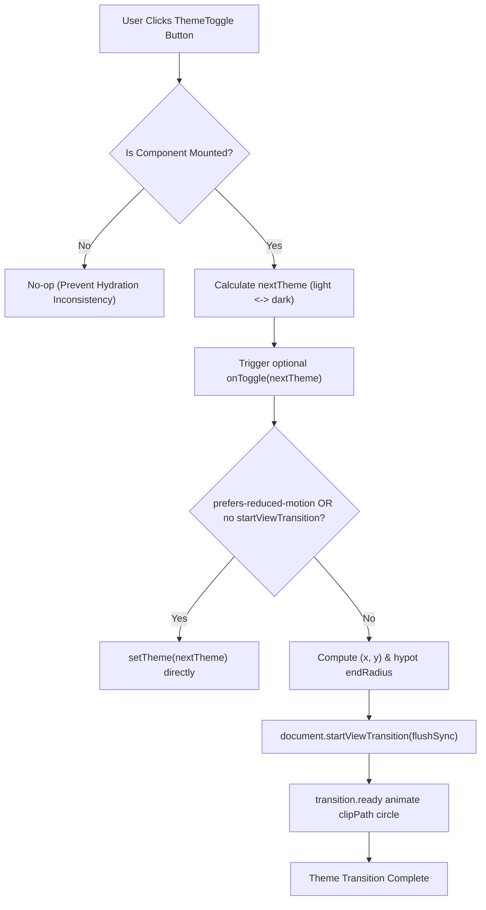

# Components Module Architecture & Catalog

This document details the architectural specifications, state machines, and companion files for components housed in the `components/` directory.

---

## 1. `ThemeToggle` (`components/theme-toggle.tsx`)

Interactive client-side theme switcher allowing users to switch between `"light"` and `"dark"` color themes with circular View Transition animation and reduced-motion fallbacks.

### Architecture & Boundaries

- **RSC Boundary**: Leaf Client Component (`"use client"`).
- **Theme Provider**: Interacts with `next-themes` (`useTheme()`).
- **Hydration Safety**: Employs `React.useSyncExternalStore` to avoid SSR hydration mismatches.
- **Motion & Accessibility**: Uses `document.startViewTransition` with a circular `clip-path` animation anchored to the click event coordinates. Gracefully falls back to direct state updates when the View Transitions API is unavailable or when `prefers-reduced-motion: reduce` is active.
- **BiDi / RTL Ready**: Uses logical CSS tokens and centered icon overlays (`Sun` and `Moon` with CSS transforms).

### State Flow Diagram



### Companion Artifacts

- **Component**: [`components/theme-toggle.tsx`](file:///d:/Scripts/aminwebsite/components/theme-toggle.tsx)
- **Skeleton Fallback**: [`components/theme-toggleSkeleton.tsx`](file:///d:/Scripts/aminwebsite/components/theme-toggleSkeleton.tsx) (and inline export `ThemeToggleSkeleton`)
- **Baseline Unit Tests**: [`components/theme-toggle.test.tsx`](file:///d:/Scripts/aminwebsite/components/theme-toggle.test.tsx)
- **Adversarial Edge-Case Tests**: [`components/theme-toggle.edge.test.tsx`](file:///d:/Scripts/aminwebsite/components/theme-toggle.edge.test.tsx)
- **Storybook Story**: [`components/theme-toggle.stories.tsx`](file:///d:/Scripts/aminwebsite/components/theme-toggle.stories.tsx)

### Consumers

- [`app/[locale]/page.tsx`](file:///d:/Scripts/aminwebsite/app/%5Blocale%5D/page.tsx)
- Global navigation headers and drawer menus.

### Storybook Preview

To launch Storybook and inspect the component in isolation:

```bash
pnpm storybook
```

Navigate to **Navigation > ThemeToggle** in the sidebar.
