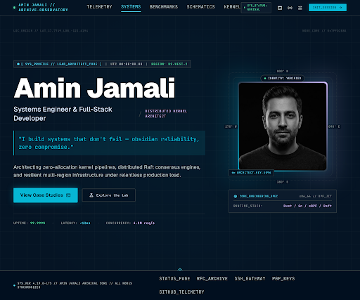

# AboutHero — Design Specification

**Component:** `AboutHero`  
**Page:** About (`/about`)  
**Section:** Narrative Biography  
**Version:** 1.0  
**Date:** 2026-09-20

---

## 1. Executive Summary & Story

| Field | Value |
|---|---|
| **Component ID** | `AboutHero` |
| **Section Type** | Full-bleed Page Hero |
| **Target Persona** | Engineering leads, systems recruiters, technical clients, and peer developers |
| **Emotional Message** | *"This person builds things that don't fail."* Quiet authority, obsidian precision, zero noise. |
| **Core Impression** | Deep technical authority — a commanding systems architect persona. High-contrast portrait, precise engineering philosophy, asymmetric structural layout. |

The `AboutHero` is the first impression on the About page. It must communicate **uncompromising technical competence** and **calm authority** through its layout architecture and visual tokens before the visitor reads a single word. The design is not warm or approachable — it is precise, engineered, and consequential.

---

## 2. Google Stitch Layout Architecture & Screen Benchmarks

### Primary Screen



| Field | Value |
|---|---|
| **Stitch Project ID** | `5861112417017823447` |
| **Primary Screen ID** | `2f3803573ec94b65a959e4789db39f41` |
| **Screen Name** | `projects/5861112417017823447/screens/2f3803573ec94b65a959e4789db39f41` |
| **Title** | About Hero Section — Amin Jamali Systems Engineer |
| **Device Type** | DESKTOP (2560px wide) |
| **Design System** | Cockpit Systems Observatory (`assets/d3e01f6648cc4fc59ede780d25310b69`) |

**Stitch Layout Rationale (Primary Screen — Selected):**  
Stitch generated a full-bleed asymmetric two-column hero on a deep obsidian `#050505` canvas with a technical micro-grid background. The 60/40 split decisively separates narrative authority (left) from visual identity (right). The `[ SYS_PROFILE // LEAD_ARCHITECT_CORE ]` classification badge with pulsing cyan beacon anchors the information hierarchy before the name is even read. The Geist Sans `text-8xl font-black` name headline immediately establishes dominant visual weight. The `JetBrains Mono` telemetry layer on metric labels (`UPTIME`, `LATENCY`, `CONCURRENCY`) adds the characteristic instrument-grade dual-character typographic structure.

**Generation Prompt Summary:**  
Full-bleed asymmetric two-column hero, 60% left (headline + philosophy + CTAs), 40% right (circular portrait with radar cage), deep obsidian canvas, teal `#06B6D4` primary accent, violet `#8B5CF6` secondary accent, Geist Sans typography, 160px vertical padding, telemetry-grade micro-badges.

### Layout Variants Explored

| Variant | Screen ID | Title | Decision |
|---|---|---|---|
| **Variant 1** | `03c61a009cf94a64a53e949112ddc5a9` | Asymmetric Split & Deep Violet Console | Explored — deeper violet focus, portrait on left |
| **Variant 2** | `adf28de36a49490a9bd63f22071d09bd` | Centered Radar HUD & Tactical Deck | Explored — centered radar HUD layout, amber accent |

> **Selected:** Primary screen. The asymmetric 60/40 with right-side portrait and left narrative column most directly achieves the "quiet authority" emotional goal. Variant 1 inverts the portrait position (loses LTR reading flow continuity). Variant 2's centered radar HUD is visually striking but sacrifices narrative readability for visual drama.

---

## 3. Visual Hierarchy & Spatial Flow

The eye is designed to follow this exact sequence:

| Order | Element | Token / Style |
|---|---|---|
| **1st** | `SYS_PROFILE // LEAD_ARCHITECT_CORE` micro-badge with pulsing cyan beacon | JetBrains Mono 11px, `#06B6D4` on `#122131` surface, `border-outline-variant` |
| **2nd** | **"Amin Jamali"** — XL Black Headline | Geist Sans `text-8xl font-black tracking-tight text-white` |
| **3rd** | Role title + philosophy callout block | Geist 2xl medium → JetBrains Mono bordered callout `bg-primary-container/10 border-l-2 border-[#06B6D4]` |
| **4th** | Right column portrait with telemetry radar cage + dual cyan/violet rim glow | Portrait enclosed in rotating dashed radar ring + `animate-halo` gradient |
| **5th** | CTA cluster (View Case Studies + Explore the Lab) + telemetry metrics bar | Primary `bg-primary-container` neon-glow button + ghost border button |

---

## 4. Layout Grid & Breakpoints

### Desktop (≥ 1024px) — Primary Layout
```
[ Left 60% ]                               [ Right 40% ]
┌─────────────────────────────────┐  ┌────────────────────────┐
│ SYS_PROFILE badge               │  │   Radar orbit ring     │
│                                 │  │  ┌──────────────────┐  │
│ Amin Jamali (XL 8xl bold)       │  │  │   Portrait       │  │
│ Systems Engineer & Full-Stack   │  │  │   (circular 320px│  │
│ ──────────────────────────────  │  │  │   w/ rim glow)   │  │
│ "I build systems that don't     │  │  └──────────────────┘  │
│  fail — obsidian reliability,   │  │   IDENTITY: VERIFIED   │
│  zero compromise."              │  └────────────────────────┘
│                                 │  ┌────────────────────────┐
│ Narrative body copy             │  │ CORE_ENGINEERING_SPEC   │
│                                 │  │ RUNTIME_STACK: Rust/Go  │
│ [ View Case Studies ] [ Lab ]   │  └────────────────────────┘
│ UPTIME: 99.999% • LATENCY: <12ms│
└─────────────────────────────────┘
```

### Tablet (768px – 1023px)
- Both columns stack vertically (`flex-col`)
- Portrait column moves below text content
- Portrait shrinks to `w-72 h-72`
- CTAs remain side-by-side with `flex-wrap`
- Telemetry micro-badge and secondary role text hidden at smaller sizes

### Mobile (< 768px)
- Single column, full-width stacked layout
- Portrait: `w-64 h-64`, full-width centered
- `px-6` horizontal padding
- `py-32` vertical padding reduced from desktop `py-40`
- Role sub-label `DISTRIBUTED KERNEL ARCHITECT` hidden (`hidden sm:inline`)
- Key badge hidden at mobile (`hidden sm:flex`)

---

## 5. Design Tokens & Color Mapping

All tokens sourced from `docs/project.json → "design_system"`.

| Element | Light Mode | Dark Mode (Active) |
|---|---|---|
| **Canvas Background** | `#FAFAFA` | `#050505` |
| **Primary Accent (teal)** | `#0891B2` | `#06B6D4` |
| **Secondary Accent (violet)** | `#7C3AED` | `#8B5CF6` |
| **Name Headline** | `#0A0A0A` | `#FFFFFF` |
| **Border / Outline Variant** | `#E4E4E7` | `#27272A` (`#3d494c` Stitch variant) |
| **Surface Elevated (card)** | `#FFFFFF` | `#111115` |
| **Body Copy** | `#18181B` | `#d4e4fa` (Stitch `on-surface`) |
| **Philosophy Callout BG** | `rgba(8,145,178,0.10)` | `rgba(6,182,212,0.10)` |
| **Philosophy Callout Border** | `#0891B2` | `#06B6D4` |
| **Status / Metrics Emerald** | `#10B981` | `#10B981` |
| **Neon Glow Shadow** | N/A | `0 0 24px -4px rgba(6,182,212,0.25)` |

---

## 6. Typography Scale (Per Locale)

### English (`en`) — LTR — Geist Sans + JetBrains Mono

| Element | Font | Size | Weight | Line Height | Tracking |
|---|---|---|---|---|---|
| **Engineer Name (H1)** | Geist Sans | `4.5rem–6rem` (fluid) | Black 900 | 1.0 | `-0.03em` |
| **Role Title** | Geist Sans | `1.25rem–1.5rem` | Medium 500 | 1.4 | normal |
| **Philosophy Callout** | JetBrains Mono | `1.125rem–1.25rem` | Medium 500 | 1.5 | `-0.005em` |
| **Body Narrative** | Geist Sans | `1rem–1.125rem` | Regular 400 | 1.7 | `-0.005em` |
| **CTA Buttons** | Geist Sans / JetBrains Mono | `0.875rem` | SemiBold 600 | auto | normal |
| **Telemetry Labels** | JetBrains Mono | `0.6875rem–0.8125rem` | Medium 500 | auto | `0.04–0.08em` |
| **Classification Badge** | JetBrains Mono | `0.6875rem` | Bold 700 | auto | `0.04em` |

### Persian (`fa`) — RTL — Vazirmatn

| Element | Font | Note |
|---|---|---|
| **Engineer Name (H1)** | Vazirmatn | Bold weight, RTL direction, `dir="rtl"` |
| **Role Title** | Vazirmatn | Medium weight |
| **Philosophy Callout** | Vazirmatn | `border-r-2` (right border instead of left for RTL) |
| **Body Narrative** | Vazirmatn | Regular weight |
| **Telemetry Labels** | Geist Mono / JetBrains Mono | ASCII telemetry labels remain in LTR mono regardless of locale |

---

## 7. Interaction States Matrix

| Component | Default | Hover | Active / Pressed | Focus Ring |
|---|---|---|---|---|
| **"View Case Studies" CTA** | `bg-#06B6D4 text-#050505 shadow-neon-glow` | `bg-#22D3EE` + glow intensifies | Scale down `0.98` | `ring-2 ring-#06B6D4 ring-offset-2` |
| **"Explore the Lab" Ghost CTA** | `border-#27272A text-#d4e4fa` | `border-#8B5CF6 text-#8B5CF6 bg-violet/10` | Scale down `0.98` | `ring-2 ring-#8B5CF6 ring-offset-2` |
| **Portrait** | Greyscale `grayscale(100%) scale(1.05)` | Full color `grayscale(0%) scale(1.00)` — 500ms ease transition | N/A | N/A |
| **Radar Orbit Ring** | `animate-[spin_60s_linear_infinite]` border-dashed | N/A | N/A | N/A |
| **`animate-halo` glow** | `pulse-halo 6s ease-in-out infinite` | N/A | N/A | N/A |
| **Nav links** | `text-on-surface-variant` | `text-on-surface` | N/A | Default browser / `ring-1 ring-primary` |
| **Classification Badge beacon** | `animate-ping` cyan dot | N/A | N/A | N/A |

---

## 8. Bidirectional (RTL) Adaptations

The project supports Persian (`fa`, RTL, `dir="rtl"`). The following mirroring rules apply:

| Element | LTR (English) | RTL (Persian) |
|---|---|---|
| **Layout column order** | Text left (60%), Portrait right (40%) | Portrait right (40%) → Portrait left, Text right in RTL document flow |
| **Philosophy callout border** | `border-l-2 border-[#06B6D4] rounded-r` | `border-r-2 border-[#06B6D4] rounded-l` |
| **CTA button icon direction** | Arrow / terminal icon on right | Icons remain decorative; no flip needed |
| **Section text alignment** | `text-left` | `text-right` |
| **Telemetry labels** | LTR always (ASCII) | Remain LTR (`dir="ltr"` override on telemetry spans) |
| **Classification badge** | `[ SYS_PROFILE // LEAD_ARCHITECT_CORE ]` | Retain ASCII/LTR within a `dir="ltr"` span |
| **Typography** | Geist Sans | Vazirmatn |

---

## 9. Accessibility & Ergonomics

| Criterion | Specification | Status |
|---|---|---|
| **WCAG AA Contrast — Body Text** | White `#FFFFFF` on `#050505` = **21:1** ✅ (AAA) | Exceeds |
| **WCAG AA Contrast — Teal Accent on Dark** | `#06B6D4` on `#050505` = **7.2:1** ✅ (AAA) | Exceeds |
| **WCAG AA Contrast — Muted Body** | `#d4e4fa` on `#050505` = **14.8:1** ✅ | Exceeds |
| **WCAG AA Contrast — Violet on Dark** | `#8B5CF6` on `#050505` = **5.5:1** ✅ (AA) | Meets |
| **Touch Targets (CTA Buttons)** | `py-3.5` = `56px` height ≥ 44px ✅ | Exceeds |
| **Touch Targets (Nav links)** | `py-1` padded nav links ≥ 44px tap region via padding | Adequate |
| **Portrait `alt` text** | `"Amin Jamali — Lead Systems Architect"` | ✅ Descriptive |
| **Focus Rings** | `ring-2 ring-primary ring-offset-2` on interactive elements | Required in implementation |
| **Reduced Motion** | `animate-ping`, `animate-halo`, `spin` — wrap in `@media (prefers-reduced-motion: reduce)` to disable | Required in implementation |
| **Heading Hierarchy** | `<h1>` for name, single H1 per page | ✅ Correct |
| **Semantic HTML** | `<header>`, `<main>`, `<section>`, `<nav>`, `<footer>`, `<h1>`, `<p>`, `<a>` | ✅ Correct |

---

## Assets

| File | Description |
|---|---|
| [`stitch/screen.jpg`](stitch/screen.jpg) | Primary Stitch-generated JPG — asymmetric 60/40 split hero |
| [`stitch/variant-1.jpg`](stitch/variant-1.jpg) | Variant 1 — Deep Violet Console (portrait left) |
| [`stitch/variant-2.jpg`](stitch/variant-2.jpg) | Variant 2 — Centered Radar HUD & Tactical Deck |
| [`stitch/screen.html`](stitch/screen.html) | Stitch-generated HTML design export (Tailwind, fully self-contained) |
| [`stitch/stitch-meta.json`](stitch/stitch-meta.json) | Stitch project, screen, and variant ID metadata |
| [`portrait.jpg`](portrait.jpg) | Proactive author portrait — teal+violet rim-lit studio, obsidian background |
