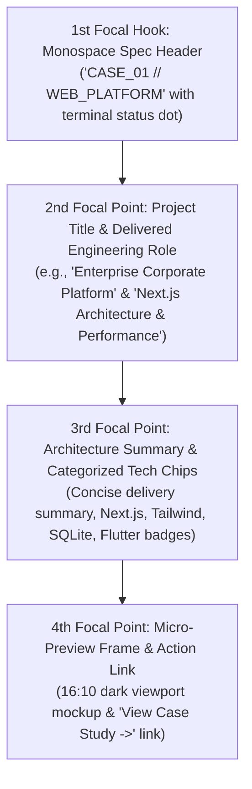

# Design Specification: Featured Case Studies Spec Grid (`FeaturedProjectsGrid` & `ProjectCard`)

**Document Path:** `docs/design/components/home/featured-case-studies/design-spec.md`  
**Target Page:** Home (`/` / `/[locale]`)  
**Component Identifier:** `FeaturedProjectsGrid` (encompassing `ProjectCard` instances)  
**Design System Reference:** [`docs/project.json`](file:///d:/Scripts/aminwebsite/docs/project.json) (`design_system`)  
**Downstream Scaffolding:** Ready for [`/stitch-design`](file:///d:/Scripts/aminwebsite/.agents/skills/stitch-design/SKILL.md) or frontend implementation workflows.

---

## 1. Executive Summary & Narrative Story

The **Featured Case Studies Section** is situated on the Home Page to provide visitors (technical hiring managers, clients, and engineering leads) with an immediate, high-density snapshot of delivered engineering systems. While a dedicated `/projects` page exists for comprehensive project archives, this home section functions as a **Minimalist Technical Dossier**: three precision-engineered case cards summarizing delivered systems across distinct platforms:

1. **Enterprise Company Website (`CASE_01 // WEB_PLATFORM`):**
   - High-performance corporate web platform engineered with Next.js App Router, Tailwind CSS, and localized bilingual content delivery, achieving sub-second LCP and 99+ Lighthouse scores.
2. **High-Throughput E-Commerce Platform (`CASE_02 // COMMERCE_ENGINE`):**
   - Scalable digital storefront and checkout engine featuring optimized server-side rendering, catalog filtering, resilient inventory state handling, and payment flow integration.
3. **Cross-Platform Note-Taking Application (`CASE_03 // MOBILE_APP`):**
   - Multi-platform productivity app engineered in **Flutter**, featuring local-first SQLite persistence, instant markdown rendering, encrypted data synchronization, and fluid 60fps mobile ergonomics.

### Emotional Impression & Voice

- **Technical Authority & Precision:** High-density, typography-forward spec card layout evocative of architecture design documents and systems engineering reports.
- **Calm, High-Contrast Obsidian Aesthetic:** Deep elevated card surfaces (`#111115` / `#FFFFFF`) with crisp structural 1px hair-lines (`#27272A` / `#E4E4E7`) and subtle electric cyan telemetry accents (`#06B6D4` / `#0891B2`).
- **Brevity & Direct Proof:** Highlights the engineering role, core tech stack, and primary system outcome with a direct path to the in-depth case study.

---

## 2. Visual Hierarchy & Eye Flow Sequence

Each project card guides the visitor's eye through a structured 4-step technical hierarchy:



1. **1st Focal Hook (Spec Index Tag):**
   - Monospace index header (`CASE_01`, `CASE_02`, `CASE_03`) accompanied by category tag (`WEB_PLATFORM`, `COMMERCE_ENGINE`, `MOBILE_APP`) and a subtle glowing status pulse dot.
2. **2nd Focal Point (Title & Role):**
   - Bold display heading naming the project, paired with a sub-label stating the engineering role (e.g. *Full-Stack Architecture*, *Mobile & State Engineering*).
3. **3rd Focal Point (Concise Summary & Tech Stack Chips):**
   - 2-3 line concise engineering narrative describing what was designed and solved.
   - Categorized technology chips (`Next.js`, `TypeScript`, `Tailwind CSS`, `Flutter`, `SQLite`) rendered in subtle muted badges.
4. **4th Focal Point (Micro-Preview & Dossier Link):**
   - 16:10 aspect ratio dark UI viewport frame showcasing a high-fidelity interface hero moment.
   - High-contrast interactive footer link: `"View Case Study ->"` with animated directional chevron.

---

## 3. Spatial Layout Grid & Responsive Architecture

### Layout Philosophy

- **Desktop ($\ge 1024\text{px}$):** 3-column equal-width modular spec grid (`grid-cols-3`, `gap-6` or `gap-8`), max-width container (`max-w-7xl`).
- **Tablet ($768\text{px} - 1023\text{px}$):** 2-column wrapping layout with `CASE_01` and `CASE_02` side-by-side, and `CASE_03` spanning 2 columns or wrapping cleanly.
- **Mobile ($< 768\text{px}$):** Single vertical column stack (`grid-cols-1`, `gap-5`) with full-width ergonomic touch padding.

```text
Desktop Layout (>= 1024px):
┌─────────────────────────┬─────────────────────────┬─────────────────────────┐
│ CASE_01 // WEB_PLATFORM │ CASE_02 // COMMERCE     │ CASE_03 // MOBILE_APP   │
│ Enterprise Corporate    │ High-Throughput E-Comm  │ Cross-Platform Notes    │
│ [Concise Summary]       │ [Concise Summary]       │ [Concise Summary]       │
│ [Tech Chips]            │ [Tech Chips]            │ [Tech Chips]            │
│ ┌─────────────────────┐ │ ┌─────────────────────┐ │ ┌─────────────────────┐ │
│ │ 16:10 Browser Frame │ │ │ 16:10 Browser Frame │ │ │ 16:10 Phone Frame   │ │
│ └─────────────────────┘ │ └─────────────────────┘ │ └─────────────────────┘ │
│ View Case Study ->      │ View Case Study ->      │ View Case Study ->      │
└─────────────────────────┴─────────────────────────┴─────────────────────────┘
```

---

## 4. Design Tokens & Color Mapping

All colors strictly reference canonical design tokens defined in [`docs/project.json`](file:///d:/Scripts/aminwebsite/docs/project.json):

| UI Layer Element | Dark Theme Token (Default) | Light Theme Token | Semantic Token Class |
| :--- | :--- | :--- | :--- |
| **Section Background** | `#050505` (`canvas_background`) | `#FAFAFA` (`canvas_background`) | `bg-background` |
| **Card Surface** | `#111115` (`surface_elevated`) | `#FFFFFF` (`surface_elevated`) | `bg-card` |
| **Card Border (Default)** | `#27272A` (`border`) | `#E4E4E7` (`border`) | `border-border` |
| **Card Border (Hover/Focus)** | `#06B6D4` (`primary_accent`) | `#0891B2` (`primary_accent`) | `border-primary` |
| **Card Hover Shadow Glow** | `0 0 24px -4px rgba(6, 182, 212, 0.25)` | `0 10px 15px -3px rgba(0, 0, 0, 0.08)` | `shadow-neon` / `shadow-lg` |
| **Spec Index Tag** | `#38BDF8` (`status_info`) | `#0891B2` (`primary_accent`) | `text-primary` |
| **Primary Title Text** | `#FAFAFA` (`canvas_foreground`) | `#0A0A0A` (`canvas_foreground`) | `text-foreground` |
| **Summary & Meta Text** | `#A1A1AA` (Zinc 400) | `#71717A` (Zinc 500) | `text-muted-foreground` |
| **Tech Chip Surface** | `#18181B` with `#27272A` border | `#F4F4F5` with `#E4E4E7` border | `bg-muted` `border-border` |
| **Tech Chip Text** | `#E4E4E7` | `#18181B` | `text-foreground` |
| **Link & CTA Accent** | `#06B6D4` (`primary_accent`) | `#0891B2` (`primary_accent`) | `text-primary` |

---

## 5. Typography Scale & Per-Locale Specifications

### Typography Tokens (`docs/project.json`)

- **English (`en`):** `Geist Sans`, `Inter, sans-serif` (Heading & Body), `Geist Mono` (Code/Spec Index)
- **Persian (`fa`):** `Vazirmatn, sans-serif` (Heading & Body), `Geist Mono` (Code/Spec Index)

| Element | English (`en`) Style | Persian (`fa`) Style | Weight | Tracking / Leading |
| :--- | :--- | :--- | :--- | :--- |
| **Section Tag / Eyebrow** | `text-xs font-mono uppercase` | `text-xs font-mono uppercase` | `font-semibold` (600) | `tracking-wider` |
| **Section Main Heading** | `text-3xl lg:text-4xl font-sans` | `text-3xl lg:text-4xl font-sans` | `font-bold` (700) | `tracking-tight leading-tight` |
| **Spec Index / Case Header**| `text-xs font-mono uppercase` | `text-xs font-mono uppercase` | `font-medium` (500) | `tracking-widest` |
| **Card Project Title** | `text-xl font-sans` | `text-xl font-sans` | `font-bold` (700) | `tracking-normal leading-snug` |
| **Role Subtitle** | `text-sm font-sans` | `text-sm font-sans` | `font-medium` (500) | `leading-normal` |
| **Concise Summary Text** | `text-sm font-sans` | `text-sm font-sans` | `font-normal` (400) | `leading-relaxed` |
| **Tech Chip Labels** | `text-xs font-mono` | `text-xs font-mono` | `font-medium` (500) | `tracking-normal` |
| **Dossier Action Link** | `text-sm font-sans` | `text-sm font-sans` | `font-semibold` (600) | `tracking-normal` |

---

## 6. Interaction States Matrix

| State | Visual Behavior & Feedback | Transition Curve |
| :--- | :--- | :--- |
| **Default** | Elevated surface (`#111115` / `#FFFFFF`), 1px structural border (`#27272A` / `#E4E4E7`), static micro-preview. | Base state |
| **Hover** | Surface lifts slightly (`translateY(-2px)`), card border transitions to primary cyan accent glow (`#06B6D4`), subtle neon glow halo activates, and the micro-preview image gains +5% contrast/clarity. Action link chevron slides +4px. | `transition: all 250ms cubic-bezier(0.16, 1, 0.3, 1)` |
| **Focus-Visible (Keyboard)**| 2px solid cyan focus ring (`#06B6D4`) with `2px` offset (`outline-offset: 2px`). Accessible navigation across all cards. | `transition: outline 150ms ease` |
| **Active / Press** | `translateY(0px)`, border intensifies, slight scale compression (`scale(0.995)`). | `transition: transform 100ms ease-out` |
| **Skeleton / Loading Fallback** | Card geometry preserved with shimmer rectangles: pulse block for case index, title bar, 2-line summary shimmer, chip placeholders, and 16:10 preview frame skeleton (`#1F1F24` with `#303038` shimmer in dark, `#E4E4E7` with `#D4D4D8` in light). | `animation: pulse 2s cubic-bezier(0.4, 0, 0.6, 1) infinite` |

---

## 7. Bidirectional (RTL) Layout Adaptations

For Persian (`fa` locale):
- **Layout Flow:** Spec cards render right-to-left. Text alignment defaults to `text-right`.
- **Directional Chevrons:** Action link arrows (`ArrowRight` / `ChevronRight`) mirror horizontally (`rtl:rotate-180` or `rtl:scale-x-[-1]`).
- **Code & Case Indicators:** Monospace spec identifiers (`CASE_01`, `CASE_02`, `CASE_03`) remain unmirrored LTR for international technical standard consistency.
- **Tech Chips:** Technology brand names (`Next.js`, `Flutter`, `TypeScript`, `Tailwind CSS`, `SQLite`) remain LTR inline within RTL flow.

---

## 8. Accessibility & Ergonomics

- **Color Contrast:** All text tokens meet or exceed WCAG AA standards:
  - Text on dark elevated surface (`#FAFAFA` on `#111115`): **16.8:1** contrast ratio.
  - Cyan primary accent on dark surface (`#06B6D4` on `#111115`): **7.2:1** contrast ratio.
  - Text on light elevated surface (`#0A0A0A` on `#FFFFFF`): **19.8:1** contrast ratio.
- **Touch Target Sizing:** Card links and interactive chips provide clickable areas $\ge 44\text{px} \times 44\text{px}$.
- **Screen Reader Semantics:** Cards wrapped in semantic `<article>` tags with `aria-labelledby` referencing project titles and `aria-describedby` referencing summary copy.

---

## 9. Recommended Visual Asset Generation Prompts (User Generation)

> [!TIP]
> **External Generation Notice:**
> In accordance with project rules, images are not generated directly in-skill. Use the structured prompts below in an external image generation tool (Midjourney, Imagen 3, DALL-E 3) and place the saved PNG files in the specified paths.

### 1. Asset: Company Website Micro-Preview
- **Target File Path:** `docs/design/components/home/featured-case-studies/company-website-mockup.png`
- **Recommended Aspect Ratio:** `16:10`
- **Generation Prompt:**
  > "High-precision modern dark-themed corporate technology company website interface mockup inside a clean minimalist dark browser viewport frame, showcasing hero typography, sleek systems metrics, obsidian black and charcoal surfaces with subtle neon cyan glowing accents (#06B6D4), ultra-crisp engineering aesthetic, Figma UI presentation style, 8k resolution, photorealistic studio lighting, zero clutter"

### 2. Asset: E-Commerce Platform Micro-Preview
- **Target File Path:** `docs/design/components/home/featured-case-studies/ecommerce-platform-mockup.png`
- **Recommended Aspect Ratio:** `16:10`
- **Generation Prompt:**
  > "Sleek dark-mode enterprise e-commerce platform and digital store interface mockup inside a dark minimalist browser window, displaying product catalog grid, real-time cart drawer, transaction throughput telemetry, high-contrast dark surfaces with vibrant cyan and violet status accents, ultra-crisp UI design, professional product showcase, 8k resolution"

### 3. Asset: Flutter Note-Taking App Micro-Preview
- **Target File Path:** `docs/design/components/home/featured-case-studies/flutter-notes-app-mockup.png`
- **Recommended Aspect Ratio:** `16:10`
- **Generation Prompt:**
  > "Minimalist modern mobile note-taking application interface mockup displayed inside a sleek dark smartphone bezel frame, showing clean markdown typography, organized folder tree, local sync status badge, dark obsidian UI theme with electric cyan highlight lines, elegant mobile ergonomics, 8k resolution, photorealistic studio render"

