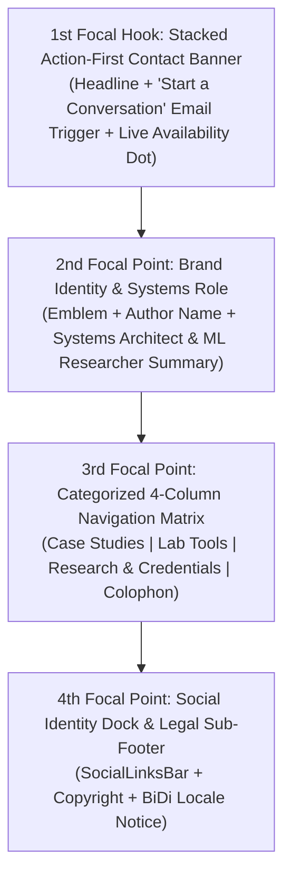
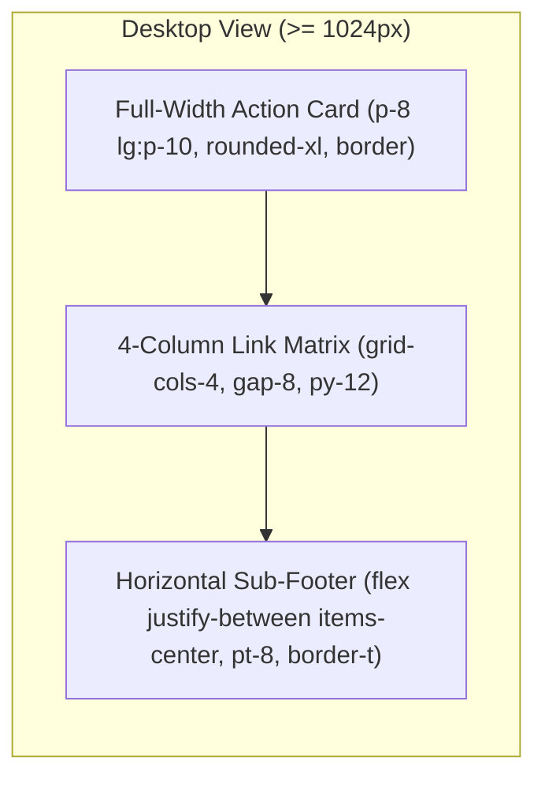

# Design Specification: Global Website Footer (`SiteFooter` & `SocialLinksBar`)

**Document Path:** `docs/design/components/home/global-footer/design-spec.md`  
**Target Page:** Global Layout Shell / Home (`/` / `/[locale]`)  
**Component Identifiers:** `SiteFooter` (Global Container, Action Banner & Navigation Matrix) and `SocialLinksBar` (Interactive Social Identity Dock)  
**Design System Reference:** [`docs/project.json`](file:///d:/Scripts/aminwebsite/docs/project.json) (`design_system`)  
**Downstream Scaffolding:** Ready for [`/stitch-design`](file:///d:/Scripts/aminwebsite/.agents/skills/stitch-design/SKILL.md) or frontend implementation workflows.

---

## 1. Executive Summary & Narrative Story

The **Global Website Footer** anchors the entire web application, serving as the foundational closing statement for all pages across the platform. Based on design discovery, this section is engineered as an **Action-Oriented Consultation & Contact Gateway** expressed through a **Modern Minimalist Tech** aesthetic.

Rather than acting as an overlooked graveyard of links, the footer provides a decisive culmination to the visitor's journey:

1. **Top Action-First Contact Banner:**
   - A full-width prominent invitation card inviting engineering collaboration, systems consultation, and research inquiries, equipped with a one-click direct email trigger and live availability indicator.
2. **Streamlined Navigation Matrix:**
   - A balanced 4-column link directory logically grouping Case Studies, Interactive Lab Tools, Academic Credentials / Publications, and Engineering Colophon details.
3. **Verified Social Identity Dock (`SocialLinksBar`):**
   - High-contrast interactive channels connecting visitors directly to GitHub, LinkedIn, ORCID, and Twitter/X with micro-interaction hover states.
4. **Sub-Footer Colophon & Legal Bar:**
   - Clear attribution, copyright notice, real-time client time/calendar context, and framework pride badge.

### Emotional Impression & Voice

- **Calm Authority & Engineering Competence:** Deep obsidian surfaces (`#111115` dark / `#FFFFFF` light) framed by structural 1px hair-line borders (`#27272A` / `#E4E4E7`), subtle cyan accents (`#06B6D4` / `#0891B2`), and balanced modern whitespace (`py-16 lg:py-20`).
- **Frictionless Action:** Instant copy-to-clipboard or mailto triggers for contact, removing all hesitation for prospective recruiters, collaborators, and clients.
- **Bilingual & BiDi Harmony:** Flawless visual balance and structural symmetry across English (LTR) and Persian (RTL).

---

## 2. Visual Hierarchy & Eye Flow Sequence

The footer establishes a clear 4-stage eye navigation flow:

1. **1st Focal Hook (Action-First Contact Banner):**
   - Elevated top card featuring a bold headline (_"Let's Build Something Exceptional"_ / _"بیایید سیستمی ماندگار خلق کنیم"_), supporting copy on systems architecture and high-performance engineering, and a high-contrast primary CTA button with email copy pill and subtle cyan border glow.
2. **2nd Focal Point (Brand Identity & Mission):**
   - Minimalist brand mark emblem, author name (`Amin Jamali`), and a single-sentence systems architecture summary positioned alongside the navigation columns.
3. **3rd Focal Point (Categorized Navigation Matrix):**
   - 4 clearly labeled link columns organized by user intent:
     - **Explore / Case Studies:** Featured Engineering, Architecture Benchmarks, Performance Metrics.
     - **Interactive Lab:** DNS over HTTPS Prober, IP Leak Scanner, Device Fingerprint.
     - **Research & Credentials:** Peer-Reviewed Papers (DOIs), ORCID Record, Verified Certifications.
     - **Systems & Platform:** Health Telemetry, Source Repository, Changelog, RSS.
4. **4th Focal Point (Social Identity Dock & Colophon):**
   - The `SocialLinksBar` housing high-contrast interactive buttons for GitHub, LinkedIn, ORCID, and Twitter/X, flanked by copyright notice, active locale calendar notice, and theme status.

---

## 3. Spatial Layout Grid & Responsive Architecture

### Layout Specifications

- **Container Constraint:** `max-w-7xl mx-auto px-4 sm:px-6 lg:px-8`.
- **Vertical Spacing:** Section padding `pt-16 pb-12 lg:pt-20 lg:pb-16` separated from page body by a subtle 1px border.
- **Layer 1: Contact Action Banner:**
  - Full-width card with elevated surface (`bg-surface_elevated`), subtle structural border (`border-border`), and internal padding (`p-6 sm:p-8 lg:p-10`).
  - Flex layout transitioning from vertical stack on mobile (`flex-col gap-6`) to horizontal split on desktop (`lg:flex-row lg:items-center lg:justify-between`).
  - Left zone: Monospace category pill (`// DIRECT CONTACT`), bold H2 headline, and concise invitation copy.
  - Right zone: Interactive direct email badge button with copy icon, accompanied by a pulsing green status dot (`#10B981`) indicating open availability.
- **Layer 2: 4-Column Navigation Directory:**
  - Responsive Grid:
    - **Desktop ($\ge 1024\text{px}$):** 4 equal columns (`grid-cols-4`, `gap-8`).
    - **Tablet ($768\text{px} - 1023\text{px}$):** 2x2 grid (`grid-cols-2`, `gap-8`).
    - **Mobile ($< 768\text{px}$):** 2-column or stacked accordion (`grid-cols-2 sm:grid-cols-2`, `gap-6`).
  - Column Structure: Monospace category header (`text-xs font-mono tracking-wider uppercase text-muted-foreground`) followed by a vertical list of links with 8px vertical spacing (`space-y-2.5`).
- **Layer 3: Sub-Footer Colophon & `SocialLinksBar`:**
  - 1px top border divider (`border-t border-border pt-8 mt-12`).
  - Flex container: `flex flex-col sm:flex-row items-center justify-between gap-4`.
  - Left side: Copyright notice (`© 2026 Amin Jamali. All rights reserved.`) and framework metadata tag.
  - Right side: `SocialLinksBar` rendering 4 rounded interactive icon buttons (`w-9 h-9 flex items-center justify-center rounded-lg border border-border`).

---

## 4. Design Tokens & Color Mapping

All colors, surfaces, and shadows strictly reference the canonical tokens defined in [`docs/project.json`](file:///d:/Scripts/aminwebsite/docs/project.json) (`design_system`).

| UI Element                 | Light Mode Token (`docs/project.json`) | Dark Mode Token (`docs/project.json`) | Visual Effect / Purpose               |
| :------------------------- | :------------------------------------- | :------------------------------------ | :------------------------------------ |
| **Footer Canvas**          | `#FAFAFA` (`canvas_background`)        | `#050505` (`canvas_background`)       | Deep grounding background layer       |
| **Contact Card Surface**   | `#FFFFFF` (`surface_elevated`)         | `#111115` (`surface_elevated`)        | Elevated action container             |
| **Structural Borders**     | `#E4E4E7` (`border`)                   | `#27272A` (`border`)                  | Crisp 1px hairline dividers           |
| **Primary Typography**     | `#0A0A0A` (`canvas_foreground`)        | `#FAFAFA` (`canvas_foreground`)       | High-contrast headlines & titles      |
| **Muted Text / Metadata**  | `#71717A` (`text-muted-foreground`)    | `#A1A1AA` (`text-muted-foreground`)   | Category headers, secondary links     |
| **Primary Accent Glow**    | `#0891B2` (`primary_accent`)           | `#06B6D4` (`primary_accent`)          | Contact button highlight, link active |
| **Availability Indicator** | `#10B981` (`status_success`)           | `#10B981` (`status_success`)          | Pulsing green live status indicator   |
| **Social Button Surface**  | `#F4F4F5` (`section_alternate_bg`)     | `#18181B` (`surface_elevated`)        | Icon button resting surface           |
| **Social Button Hover**    | `#FFFFFF` with `#0891B2` border        | `#27272A` with `#06B6D4` border       | Micro-lift and accent edge glow       |
| **Card Shadow**            | `elevation_and_shadows.card`           | `elevation_and_shadows.card`          | Subtle elevation depth                |
| **Border Radius**          | `0.75rem` (`border_radius.card`)       | `0.75rem` (`border_radius.card`)      | Rounded-xl container corners          |

---

## 5. Typography Scale (Per Locale)

### English Locale (`en` - LTR)

- **Primary Typeface:** `Geist Sans`, `Inter`, sans-serif
- **Monospace Typeface:** `Geist Mono`, `JetBrains Mono`, monospace
- **Action Banner Headline (H2):** `text-2xl sm:text-3xl font-bold tracking-tight text-foreground`
- **Banner Supporting Text:** `text-sm sm:text-base text-muted-foreground leading-relaxed max-w-xl`
- **Category Headers:** `text-xs font-mono tracking-widest uppercase text-muted-foreground font-semibold`
- **Navigation Links:** `text-sm text-foreground/80 hover:text-primary transition-colors font-medium`
- **Sub-Footer Legal / Colophon:** `text-xs text-muted-foreground font-normal`

### Persian Locale (`fa` - RTL)

- **Primary Typeface:** `Vazirmatn`, sans-serif
- **Monospace Typeface:** `Geist Mono`, monospace (used for email, domains, DOIs)
- **Action Banner Headline (H2):** `text-2xl sm:text-3xl font-bold tracking-tight text-foreground leading-snug`
- **Banner Supporting Text:** `text-sm sm:text-base text-muted-foreground leading-loose max-w-xl`
- **Category Headers:** `text-xs font-mono tracking-wider text-muted-foreground font-semibold`
- **Navigation Links:** `text-sm text-foreground/80 hover:text-primary transition-colors font-medium`
- **Sub-Footer Legal / Colophon:** `text-xs text-muted-foreground leading-relaxed`

---

## 6. Interaction States Matrix

| Element                 | Default State                                             | Hover State                                                                            | Active / Pressed State               | Focus Ring (A11y)                   | Skeleton Fallback                    |
| :---------------------- | :-------------------------------------------------------- | :------------------------------------------------------------------------------------- | :----------------------------------- | :---------------------------------- | :----------------------------------- |
| **Contact CTA Button**  | Solid accent `#0891B2` / `#06B6D4` text, elevated surface | Accent glow (`box-shadow`), `-translate-y-0.5` micro-lift                              | `scale-98`, deeper accent background | 2px offset ring in `primary_accent` | Full-width rounded skeleton box      |
| **Email Copy Pill**     | Border `#E4E4E7` / `#27272A`, monospace email text        | Border `#0891B2` / `#06B6D4`, icon pulse                                               | Text changes to "Copied!" for 2s     | 2px offset ring                     | Pill skeleton `h-10 w-48`            |
| **Navigation Links**    | `text-muted-foreground` or `text-foreground/80`           | `text-primary` (`#0891B2` / `#06B6D4`), `translate-x-1` (LTR) / `-translate-x-1` (RTL) | Opacity 80%                          | Visible outline ring                | Skeleton line `h-4 w-28`             |
| **Social Icon Buttons** | Neutral border, muted icon color                          | Border in `primary_accent`, icon colored, scale 1.05                                   | `scale-95`                           | 2px circular ring                   | Square skeleton `w-9 h-9 rounded-lg` |
| **Availability Dot**    | `#10B981` solid core                                      | Continuous gentle ping pulse                                                           | N/A                                  | N/A                                 | Static gray dot                      |

---

## 7. Bidirectional (RTL) Adaptations (Persian `fa`)

1. **Grid & Reading Order:**
   - On RTL locales (`fa`), the 4 navigation columns reverse horizontal visual order (`dir="rtl"`), placing primary navigation on the right and systems/colophon on the left.
2. **Text Alignment:**
   - All text headings, subheadings, and link lists align to the right (`rtl:text-right`).
3. **Directional Glyphs & Chevrons:**
   - All directional arrow icons (e.g. `->` or external link chevrons) flip horizontally with `rtl:rotate-180`.
4. **Preserved LTR Islands:**
   - Monospace email addresses (e.g., `contact@aminjamali.com`), domain names, permanent DOIs (`doi:10.1007/...`), and ORCID numbers (`0000-0002-...`) strictly preserve LTR text flow (`dir="ltr" font-mono`) to prevent numerical inversion.
5. **Sub-Footer Layout:**
   - Copyright notice aligns to the right; `SocialLinksBar` docks to the left.

---

## 8. Accessibility (A11y) & Ergonomic Guardrails

- **Semantic Landmark:** Enclosed in `<footer role="contentinfo" aria-label="Global Footer">` container.
- **Contrast Ratios:**
  - Headline and body text achieve $> 7:1$ contrast against canvas and elevated surfaces (exceeding WCAG AAA).
  - Muted text and category headers achieve $> 4.5:1$ contrast against surfaces (exceeding WCAG AA).
- **Touch Target Ergonomics:**
  - All interactive elements (email button, social links, navigation anchors) enforce minimum clickable area $\ge 44\text{px} \times 44\text{px}$.
- **Keyboard Navigation & Screen Readers:**
  - All social icon buttons include visually hidden screen reader labels (`GitHub Profile`).
  - Clear, high-contrast 2px focus rings (`focus-visible:ring-2 focus-visible:ring-primary focus-visible:ring-offset-2`).
  - Instant live feedback announcement via `aria-live="polite"` when email address is copied to clipboard.

---

## 9. Recommended Visual Assets & Prompts

To conserve tokens, images are not generated directly. The following background pattern asset is specified for user generation:

### Recommended Visual Asset: Footer Radar Grid Pattern

- **Target File Path:** `docs/design/components/home/global-footer/footer-radar-grid.png`
- **Recommended Aspect Ratio:** `16:9` or tileable vector SVG
- **Generation Prompt:**
  > "Minimalist abstract dark radar grid pattern, subtle precision geometric dot matrix and concentric thin lines, deep obsidian background (#050505) with very faint electric cyan glow accents (#06B6D4) at 5% opacity, clean telemetry visualization, high-tech systems engineering aesthetic, no text, no heavy gradients, ultra-refined 4k."

---

## 10. Downstream Handoff

- **Visual Prototyping:** Ready for screen generation and variant exploration via [`/stitch-design`](file:///d:/Scripts/aminwebsite/.agents/skills/stitch-design/SKILL.md) using Stitch project `5861112417017823447`.
- **Component Development:** Hand off to `nextjs-component-dev` for TDD construction of `SiteFooter` and `SocialLinksBar`.
