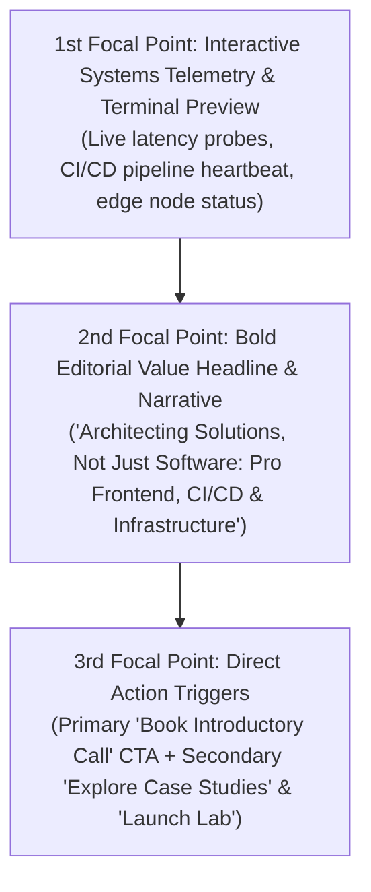

# Design Specification: Home Page Hero Section (`HeroSection`)

**Document Path:** `docs/design/components/home/hero/design-spec.md`  
**Target Page:** Home (`/` / `/[locale]`)  
**Component Identifier:** `HeroSection`  
**Design System Reference:** [`docs/project.json`](file:///d:/Scripts/aminwebsite/docs/project.json) (`design_system`)  
**Downstream Scaffolding:** Ready for [`/stitch-design`](file:///d:/Scripts/aminwebsite/.agents/skills/stitch-design/SKILL.md) or frontend component implementation.

---

## 1. Executive Summary & Narrative Story

The **Home Page Hero Section** establishes the digital flagship presence of Amin Jamali. Rather than presenting as a conventional frontend developer portfolio, this hero introduces a **Pro Frontend Developer & Solutions Architect** who bridges user-facing interface craftsmanship with deep competence across **CI/CD automation, edge networking, and scalable cloud infrastructure**.

The section speaks directly to **engineering leadership, technical co-founders, and enterprise clients** who require comprehensive solutions—engineers capable of architecting both the pixel-level interaction fidelity and the underlying deployment, delivery, and networking topologies that make web applications resilient, ultra-fast, and secure.

### Emotional Impression & Voice

- **Authoritative & Calm:** High-precision engineering minimalism with generous whitespace, crisp structural hair-lines, and deep obsidian canvases.
- **Verifiable Competence:** Immediate visual telemetry cues proving real-time systems mastery rather than vague assertions.
- **Architectural Depth:** Clear articulation that code is merely one facet of a complete engineered solution encompassing build pipelines, DNS routing, and edge execution.

---

## 2. Visual Hierarchy & Eye Flow Sequence

The visual composition is arranged in an **Editorial Minimalist** hierarchy to guide visitors through immediate technical proof to core value proposition, culminating in direct action:

1. **1st Focal Point (The Hook): Interactive Systems Telemetry / Terminal Preview**
   - Positioned prominently to capture immediate attention.
   - Displays real-time or live-simulated systems telemetry (e.g. edge probe latency, CI/CD build integrity badge, DNS resolver status).
   - Serves as proof-of-competence before the user reads a single marketing sentence.
2. **2nd Focal Point (The Value): Editorial Headline & Narrative Copy**
   - Clean, oversized typographic statement declaring the duality of frontend mastery and infrastructure architecture.
   - Concise 2-sentence explanatory paragraph highlighting expertise across Next.js, CI/CD pipelines, containerization, and networking.
3. **3rd Focal Point (The Conversion): Action Triggers**
   - High-contrast primary call to action for direct booking / contact.
   - Secondary path to deep case studies and live interactive networking lab tools.

---

## 3. Spatial Layout & Breakpoint Architecture

### Editorial Minimalist Grid Philosophy

- **Whitespace Rhythm:** Generous vertical padding (`py-20` to `py-32`) allowing each element room to breathe without claustrophobic density.
- **Structural Borders:** Subtle 1px structural dividing rules using the canonical border token (`#27272A` in dark, `#E4E4E7` in light).
- **Zero Heavy Card Bloat:** Information is organized through typographic scale, subtle hair-lines, and clean alignment rather than nested heavy boxes.

### Responsive Breakpoint Specifications

| Viewport Tier | Width Range      | Layout Composition & Behavior                                                                                                                                                                                                                                                                                      | Spacing & Constraints                                                                    |
| :------------ | :--------------- | :----------------------------------------------------------------------------------------------------------------------------------------------------------------------------------------------------------------------------------------------------------------------------------------------------------------- | :--------------------------------------------------------------------------------------- |
| **Mobile**    | `< 768px`        | Single-column vertical stack. 1. Availability status badge 2. Editorial headline 3. Narrative paragraph 4. Stacked full-width action buttons 5. Compact systems telemetry strip                                                                                                                     | Padding: `px-4 py-16` Touch targets: $\ge 44\text{px}$ Headline: `text-3xl` (30px) |
| **Tablet**    | `768px - 1024px` | Elevated single column with expanded margins. Headline scales to `text-5xl`. Action buttons align horizontally inline. Telemetry card expands to full width below actions with 2-column internal stats.                                                                                                         | Padding: `px-8 py-20` Max container: `720px` Headline: `text-5xl` (48px)           |
| **Desktop**   | `$\ge$ 1024px`   | Asymmetric 12-column editorial grid. - **Columns 1–7 (Start):** Availability badge, bold headline, narrative statement, action buttons, and trust signal micro-indicators. - **Columns 8–12 (End):** Interactive live telemetry HUD & terminal preview floating over the abstract systems topology backdrop. | Padding: `px-12 py-28` Max container: `1280px` Headline: `text-6xl` (60px)         |

---

## 4. Design Tokens & Color Palette Mapping

All color assignments strictly reference the canonical tokens verified in [`docs/project.json`](file:///d:/Scripts/aminwebsite/docs/project.json):

### Light & Dark Color Mapping

| UI Element / Surface              | Light Theme Value | Dark Theme Value                        | Semantic Token Purpose                                               |
| :-------------------------------- | :---------------- | :-------------------------------------- | :------------------------------------------------------------------- |
| **Hero Canvas Background**        | `#FAFAFA`         | `#050505`                               | Deep obsidian canvas (dark) / pristine off-white (light)             |
| **Alternate Section / Backdrop**  | `#F4F4F5`         | `#0A0A0C`                               | Subtle contrasting backdrop layer for topology grid                  |
| **Structural Borders & Rules**    | `#E4E4E7`         | `#27272A`                               | Crisp 1px hair-lines separating narrative and telemetry              |
| **Primary Typography (Headline)** | `#0A0A0A`         | `#FAFAFA`                               | Maximum contrast for typographic authority                           |
| **Secondary Typography (Body)**   | `#71717A`         | `#A1A1AA`                               | Balanced contrast for narrative readability                          |
| **Primary Accent (Cyan)**         | `#0891B2`         | `#06B6D4`                               | Primary brand accent for buttons, telemetry highlights, active nodes |
| **Secondary Accent (Violet)**     | `#7C3AED`         | `#8B5CF6`                               | Secondary accent for CI/CD status, infrastructure tags, gradients    |
| **Status: Success (Active Node)** | `#10B981`         | `#10B981`                               | Emerald indicator for live telemetry, system online state            |
| **Status: Info (Telemetry)**      | `#06B6D4`         | `#38BDF8`                               | Cyan pulse indicator for network pings and latency probes            |
| **Neon Glow Atmosphere**          | `none`            | `0 0 24px -4px rgba(6, 182, 212, 0.25)` | Ambient radiant glow behind telemetry HUD card                       |

### Border Radii & Spatial Geometry

- **Status Pills / Badges:** `9999px` (fully rounded capsule)
- **Buttons (Primary & Secondary):** `0.5rem` (`8px` base radius)
- **Telemetry Card Container:** `0.75rem` (`12px` card radius)
- **Terminal Inner Container:** `0.5rem` (`8px`)

---

## 5. Typography Scale & Multilingual Pairing

Typography is tailored per locale in accordance with `docs/project.json`:

- **English (`en`):** `Geist Sans` for headings & narrative; `Geist Mono` for telemetry, code, and metrics.
- **Persian (`fa`):** `Vazirmatn` for headings & narrative; `Geist Mono` for numerical telemetry and code tokens.

### Typographic Hierarchy Matrix

| Role                | Font Family (`en` / `fa`)  | Font Size / Line Height (Desktop) | Weight & Tracking                  | Sample Text (`en` / `fa`)                                                                                                                                                                           |
| :------------------ | :------------------------- | :-------------------------------- | :--------------------------------- | :-------------------------------------------------------------------------------------------------------------------------------------------------------------------------------------------------- | --------------- | -------------- |
| **Status Pill**     | `Geist Sans` / `Vazirmatn` | `12px / 16px` (`text-xs`)         | `font-medium`, `tracking-wider`    | `AVAILABLE FOR ARCHITECTURE & CONTRACTS` `آماده برای همکاری و مشاوره معماری`                                                                                                                     |
| **Hero Headline**   | `Geist Sans` / `Vazirmatn` | `60px / 68px` (`text-6xl`)        | `font-extrabold`, `tracking-tight` | `Architecting Solutions Across Frontend & Infrastructure` `معماری راه‌حل‌های جامع از فرانت‌اند تا زیرساخت`                                                                                       |
| **Narrative Body**  | `Geist Sans` / `Vazirmatn` | `18px / 28px` (`text-lg`)         | `font-normal`, `leading-relaxed`   | `Pro frontend engineering backed by deep CI/CD pipelines, edge networking, and resilient systems design.` `توسعه حرفه‌ای فرانت‌اند مبتنی بر خطوط CI/CD، شبکه‌های لبه و طراحی سیستم‌های تاب‌آور.` |
| **Telemetry Mono**  | `Geist Mono`               | `13px / 20px` (`text-xs`)         | `font-mono`, `font-normal`         | `EDGE_LATENCY: 18ms                                                                                                                                                                                 | PIPELINE: GREEN | LTR_RTL: TRUE` |
| **CTA Button Text** | `Geist Sans` / `Vazirmatn` | `15px / 22px` (`text-sm`)         | `font-semibold`, `tracking-normal` | `Book Introductory Call` `رزرو جلسه گفتگو`                                                                                                                                                       |

---

## 6. Interaction States Matrix

| Interactive Element                | Default State                                                                 | Hover State                                                                              | Active / Pressed State               | Focus Ring (Keyboard Accessible)                              | Loading / Skeleton State                           |
| :--------------------------------- | :---------------------------------------------------------------------------- | :--------------------------------------------------------------------------------------- | :----------------------------------- | :------------------------------------------------------------ | :------------------------------------------------- |
| **Primary CTA (`Book Call`)**      | Background `primary_accent`, text `primary_accent_foreground`, subtle shadow. | Background shifts 10% brighter, shadow elevates, `translate-y-[-1px]` micro-lift.        | `translate-y-[1px]`, shadow recedes. | `2px` ring in `primary_accent` with `2px` offset from canvas. | Shimmer skeleton pill matching width/height.       |
| **Secondary CTA (`Case Studies`)** | Transparent background, 1px border `border`, text `canvas_foreground`.        | Background `section_alternate_background`, border `primary_accent`.                      | Background `primary_accent/10`.      | `2px` ring in `primary_accent` with `2px` offset.             | Shimmer skeleton pill matching width/height.       |
| **Availability Status Pill**       | Transparent canvas, subtle border `status_success/30`, green pulsing dot.     | Border `status_success/60`, background `status_success/5`.                               | No scale change (informational).     | `2px` ring in `status_success`.                               | `w-32 h-6` skeleton capsule.                       |
| **Telemetry HUD Card**             | Background `surface_elevated`, border `border`, ambient cyan glow.            | Border illuminates to `primary_accent/40`, glow intensifies (`rgba(6, 182, 212, 0.35)`). | Static container.                    | Card container tab-focusable with visible focus outline.      | Shimmer skeleton block matching card aspect ratio. |

---

## 7. Bidirectional (RTL / LTR) Adaptations

The hero section must render seamlessly across both English (`ltr`) and Persian (`rtl`):

1. **Logical Layout Mirroring:**
   - On desktop, the editorial narrative is on the **Start** side (Left in LTR, Right in RTL) and the telemetry/topology card is on the **End** side (Right in LTR, Left in RTL).
   - Action buttons align to the **Start** boundary.
2. **Directional Iconography:**
   - Right-facing arrow icons in CTAs (e.g. `arrow-right`) MUST mirror to `arrow-left` in RTL mode.
   - Status dots and badge indicators maintain their relative position at the **inline-start** of the label.
3. **Monospace Code & Telemetry Preservation:**
   - Numerical telemetry readouts, terminal outputs, and code tokens (e.g. `18ms`, `v1.9`, `edge-iad-01`) remain strictly **LTR** with `dir="ltr"` even when the parent page is in RTL Persian mode.
4. **Typography Line Heights:**
   - Persian (`Vazirmatn`) requires slightly taller line-height (`leading-relaxed` or `leading-[1.75]`) compared to Latin to accommodate Persian ascenders and descenders without clipping.

---

## 8. Accessibility & Ergonomics Standards

- **Color Contrast:** All body text meets WCAG AAA ($\ge 7:1$) against canvas; all headings meet WCAG AA ($\ge 4.5:1$).
- **Touch Target Dimensions:** All interactive buttons and links have a minimum hit area of $\ge 44\text{px} \times 44\text{px}$.
- **Motion Reduction (`prefers-reduced-motion`):** Particle pulses on the systems topology backdrop and pulsing status dots must gracefully transition to static indicators when reduced motion is preferred.
- **Semantic Structure:** Single `<h1>` for the primary editorial headline; landmark `<section aria-labelledby="hero-heading">`.

---

## 9. Recommended Visual Assets & Generation Prompts

> [!NOTE]
> In compliance with project guidelines, images are **not generated directly by the agent** to conserve tokens. The following structured prompts are ready for user generation:

### Visual Asset 1: Abstract Systems Topology Grid (`hero-topology-backdrop.png`)

- **Target File Path:** `docs/design/components/home/hero/hero-topology-backdrop.png`
- **Recommended Aspect Ratio:** `16:9`
- **Asset Purpose:** Ambient background visual representing distributed infrastructure, edge routing nodes, and clean circuit network topology.
- **Generation Prompt:**
  > "High-precision abstract distributed systems topology grid, glowing cyan (#06B6D4) and deep violet (#8B5CF6) micro data nodes connected by ultra-thin geometric vector lines, floating on a deep obsidian black background (#050505), subtle radiant glow, hyper-minimalist, sleek enterprise infrastructure aesthetic, technical schematic visual, high-end developer cockpit, 8k resolution, cinematic lighting, zero clutter, elegant dark mode design."

### Visual Asset 2: Live Telemetry Terminal Window Visual (`hero-telemetry-preview.png`)

- **Target File Path:** `docs/design/components/home/hero/hero-telemetry-preview.png`
- **Recommended Aspect Ratio:** `4:3`
- **Asset Purpose:** High-fidelity mockup of the interactive telemetry preview card showing real-time network probes, CI/CD pipeline heartbeat, and system health benchmarks.
- **Generation Prompt:**
  > "Sleek dark mode developer cockpit terminal window, floating glass card with crisp 1px border (#27272A), deep dark surface (#111115), displaying real-time systems telemetry, monospace data readouts in electric cyan and emerald green, latency graph with subtle waveform, pipeline status indicator, clean minimalist UI, soft ambient neon cyan back-glow, high precision engineering aesthetic, Figma UI design mockup style."

---

## 10. Downstream Handoff

This specification is complete, token-verified, and ready for:

1. **Google Stitch Layout Prototyping:** Run `/stitch-design` with this specification to scaffold the screen and generate spatial variants via `StitchMCP`.
2. **Implementation:** Feed to Next.js component creation workflow (`nextjs-create-component`) for implementation in `app/components/home/HeroSection/`.
