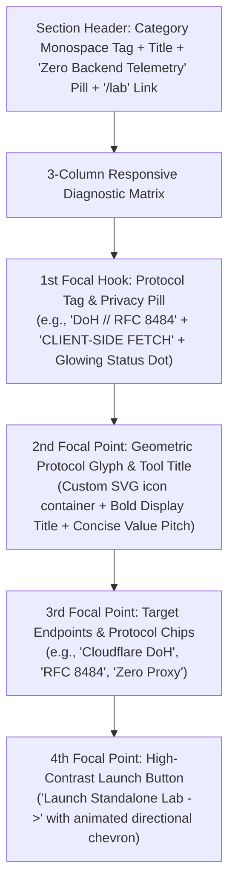
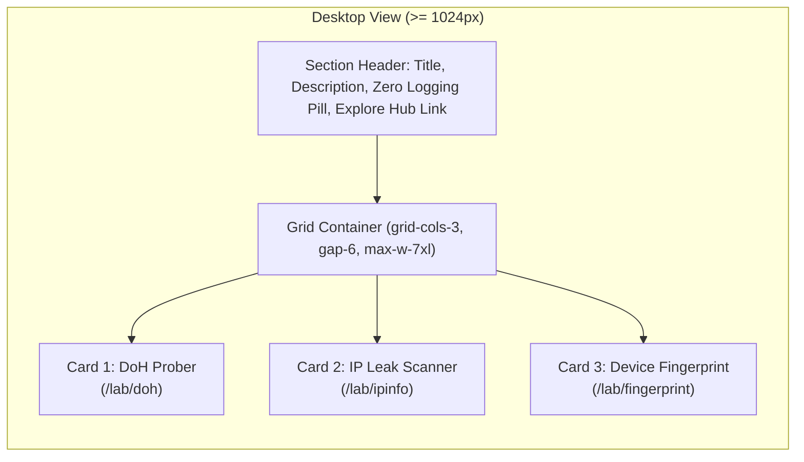

# Design Specification: Interactive Lab Tools Launcher (`LabLauncherSection` & `ToolQuickCard`)

**Document Path:** `docs/design/components/home/lab-launcher/design-spec.md`  
**Target Page:** Home (`/` / `/[locale]`)  
**Component Identifiers:** `LabLauncherSection` (Container & Section Header) and `ToolQuickCard` (Interactive Diagnostic Tool Card)  
**Design System Reference:** [`docs/project.json`](file:///d:/Scripts/aminwebsite/docs/project.json) (`design_system`)  
**Downstream Scaffolding:** Ready for [`/stitch-design`](file:///d:/Scripts/aminwebsite/.agents/skills/stitch-design/SKILL.md) or frontend implementation workflows.

---

## 1. Executive Summary & Narrative Story

The **Interactive Lab Tools Launcher Section** is positioned on the Home Page to serve as an immediate, interactive demonstration of deep client-side systems engineering, network protocol competence, and privacy architecture.

Unlike traditional static portfolios that merely list theoretical skills, this section functions as a **Live Developer Cockpit & Real-Time Observatory**. It showcases three standalone client-executed diagnostic tools:

1. **DNS over HTTPS (DoH) Censorship & Latency Prober (`/lab/doh`):**
   - Direct client-to-resolver DNS querying over RFC 8484 (Cloudflare, Google, Quad9) measuring real-time DNS resolution latency, upstream DNS poisoning, and record integrity directly from the user's browser without intermediary server hops.
2. **IP & Identity Leak Scanner (`/lab/ipinfo`):**
   - Client-side STUN/WebRTC local candidate discovery, transparent public IPv4/IPv6 querying, ISP/ASN lookup, and browser-versus-IP timezone mismatch detection.
3. **Client Device & Canvas Fingerprint Inspector (`/lab/fingerprint`):**
   - Real-time client hardware entropy analyzer generating deterministic 2D Canvas render hashes, WebGL unmasked GPU vendor/renderer signatures, and AudioContext oscillator frequency hashes.

### Core Architecture & Privacy Stance

- **100% Client-Side Direct Fetch:** All diagnostic queries are executed directly by the visitor's browser hitting public third-party APIs (Cloudflare DoH, Google DNS, STUN endpoints) or local browser APIs (Canvas, WebGL, Web Audio).
- **Zero Server Telemetry / Zero Logging:** The application backend never inspects, proxies, stores, or logs visitor IP addresses, queries, or hardware hashes.
- **Dedicated Standalone Pages:** Each card acts as an architectural launcher providing a comprehensive preview of the tool's capabilities with a direct, friction-free transition to its dedicated standalone lab page (`/lab/doh`, `/lab/ipinfo`, `/lab/fingerprint`), alongside a link to the overarching `/lab` hub.

### Emotional Impression & Voice

- **Technical Authority & Engineering Precision:** Clean, structured card layout evocative of high-performance observability dashboards, network telemetry consoles, and academic research workbenches.
- **Obsidian Telemetry Aesthetic:** Deep elevated surfaces (`#111115` dark / `#FFFFFF` light) framed by structural 1px hair-lines (`#27272A` / `#E4E4E7`), glowing green telemetry status pulses (`#10B981`), and electric cyan highlights (`#06B6D4` / `#0891B2`).
- **Uncompromising Privacy Transparency:** Prominently highlights the client-side execution model with a dedicated badge (`ZERO BACKEND LOGGING // 100% CLIENT FETCH`).

---

## 2. Visual Hierarchy & Eye Flow Sequence

Each `ToolQuickCard` guides the visitor's eye through a structured 4-step technical hierarchy:

1. **1st Focal Hook (Protocol Tag & Live Status Indicator):**
   - Monospace protocol spec header (e.g., `DoH // RFC 8484`, `IPv4/v6 // STUN LEAK`, `CANVAS // WEBGL ENTROPY`) paired with a pulsing live green telemetry dot (`#10B981`) and a subtle `CLIENT-SIDE` badge.
2. **2nd Focal Point (Protocol Glyph & Tool Title):**
   - Precision geometric SVG icon housed in an elevated container with subtle cyan/violet radial glow backdrop.
   - High-contrast title (e.g., *DNS over HTTPS Prober*, *IP & Identity Leak Scanner*, *Device Fingerprint Inspector*) accompanied by a 2-line concise description of what the tool diagnoses.
3. **3rd Focal Point (Client Endpoints & Architecture Chips):**
   - Monospace badge pills highlighting the target client APIs and zero-proxy execution model (e.g., `cloudflare-dns.com`, `STUN rfc5389`, `WebGL 2.0`, `Zero Logging`).
4. **4th Focal Point (Launch Action & Directional Transition):**
   - Full-width ergonomic launch button styled with subtle structural borders and high-contrast text: `"Launch Standalone Lab ->"`, transitioning to cyan accent glow and sliding chevron on hover.

---

## 3. Spatial Layout Grid & Responsive Architecture

### Layout Specifications

- **Container Constraint:** `max-w-7xl` centered with horizontal padding (`px-4 sm:px-6 lg:px-8`).
- **Section Spacing:** Vertical padding `py-20 lg:py-24` maintaining balanced systems rhythm between *Featured Case Studies* above and *Competencies & Tech Matrix* below.
- **Section Header Bar:**
  - **Category Pill & Eyebrow:** Monospace text `// INTERACTIVE SYSTEMS LAB` with subtle border badge.
  - **Main Heading:** Bold display headline: `Live Client-Side Diagnostic Tools`.
  - **Sub-description:** Explanatory text communicating direct client execution and zero data retention.
  - **Header Meta Row / Actions:** Flex row containing the `Zero Backend Logging // 100% Client Fetch` security pill and a direct link: `"Explore Full Lab Hub ->"` pointing to `/lab`.
- **Responsive Breakpoint Matrix:**
  - **Desktop ($\ge 1024\text{px}$):** 3-column equal-width grid (`grid-cols-3`, `gap-6` or `gap-8`). Each card occupies 1/3 grid width with uniform card height (`h-full flex flex-col justify-between`).
  - **Tablet ($768\text{px} - 1023\text{px}$):** 2-column wrapping layout (`grid-cols-2`, `gap-6`). Card 1 (DoH) and Card 2 (IP Info) sit side-by-side; Card 3 (Fingerprint) spans 2 columns or wraps with full width for balanced visual weight.
  - **Mobile ($< 768\text{px}$):** Single vertical stack (`grid-cols-1`, `gap-5`). Cards take 100% viewport width minus padding, maintaining minimum $\ge 44\text{px}$ touch targets for all interactive elements.

---

## 4. Design Tokens & Color Mapping

All colors, surfaces, and shadows strictly reference the canonical tokens defined in [`docs/project.json`](file:///d:/Scripts/aminwebsite/docs/project.json) (`design_system`).

| UI Element | Light Mode Token (`docs/project.json`) | Dark Mode Token (`docs/project.json`) | Visual Effect / CSS Class |
| :--- | :--- | :--- | :--- |
| **Section Background** | `#FAFAFA` (`canvas_background`) | `#050505` (`canvas_background`) | `bg-background` |
| **Alternate Section Accent** | `#F4F4F5` (`section_alternate_background`) | `#0A0A0C` (`section_alternate_background`) | Subtle ambient section dividers |
| **Card Surface** | `#FFFFFF` (`surface_elevated`) | `#111115` (`surface_elevated`) | `bg-card` / elevated obsidian container |
| **Card Structural Border** | `#E4E4E7` (`border`) | `#27272A` (`border`) | `border border-border` 1px solid |
| **Card Hover Border** | `#0891B2` (`primary_accent`) | `#06B6D4` (`primary_accent`) | `hover:border-primary` with cyan transition |
| **Primary Typography** | `#0A0A0A` (`canvas_foreground`) | `#FAFAFA` (`canvas_foreground`) | `text-foreground` font-semibold / font-bold |
| **Muted Description** | `#71717A` (Muted Zinc) | `#A1A1AA` (Muted Zinc) | `text-muted-foreground` |
| **Primary Accent Accent** | `#0891B2` (`primary_accent`) | `#06B6D4` (`primary_accent`) | `text-primary` / `bg-primary` for badges |
| **Secondary Accent Glow** | `#7C3AED` (`secondary_accent`) | `#8B5CF6` (`secondary_accent`) | Soft ambient icon radial backdrop |
| **Live Status Indicator** | `#10B981` (`status_success`) | `#10B981` (`status_success`) | Pulsing green status dot |
| **Privacy / Info Badge** | `#0891B2` / `#F4F4F5` | `#06B6D4` / `#111115` | `bg-primary/10 text-primary border-primary/20` |
| **Card Elevation Shadow** | `0 1px 3px 0 rgb(0 0 0 / 0.1)` | `0 10px 15px -3px rgb(0 0 0 / 0.3)` | `shadow-sm hover:shadow-lg` |
| **Neon Accent Glow** | `0 0 16px -4px rgba(8, 145, 178, 0.15)` | `0 0 24px -4px rgba(6, 182, 212, 0.25)` | `neon_glow` on hover |

---

## 5. Typography Scale & Per-Locale Hierarchy

Typography follows the per-locale system defined in [`docs/project.json`](file:///d:/Scripts/aminwebsite/docs/project.json):
- **English (`en`):** Heading & Body: `Geist Sans, Inter, sans-serif`; Monospace: `Geist Mono, JetBrains Mono, monospace`.
- **Persian (`fa`):** Heading & Body: `Vazirmatn, sans-serif`; Monospace: `Geist Mono, monospace`.

| Hierarchy Level | Font Size (Desktop) | Font Size (Mobile) | Font Weight | Line Height | Tracking | Purpose & Usage |
| :--- | :--- | :--- | :--- | :--- | :--- | :--- |
| **Eyebrow Tag** | `0.75rem` (12px) | `0.75rem` (12px) | Medium (500) | `1rem` (16px) | `+0.05em` | Monospace category & protocol indicators |
| **Section Heading** | `2.25rem` (36px) | `1.75rem` (28px) | Bold (700) | `1.2` (44px) | `-0.02em` | Section headline (`Live Client-Side Diagnostic Tools`) |
| **Section Subtext** | `1.0rem` (16px) | `0.9375rem` (15px) | Regular (400) | `1.6` (26px) | Normal | Section privacy & architecture explainer |
| **Card Title** | `1.25rem` (20px) | `1.125rem` (18px) | SemiBold (600) | `1.3` (26px) | `-0.01em` | Individual tool title (`DNS over HTTPS Prober`) |
| **Card Description** | `0.875rem` (14px) | `0.875rem` (14px) | Regular (400) | `1.5` (21px) | Normal | 2-line diagnostic capability summary |
| **Chip / Tag Label** | `0.6875rem` (11px) | `0.6875rem` (11px) | Medium (500) | `1rem` (16px) | `+0.02em` | Monospace client endpoints (`RFC 8484`, `STUN`) |
| **Action CTA Text** | `0.875rem` (14px) | `0.875rem` (14px) | Medium (500) | `1.25rem` (20px) | Normal | Button text (`Launch Standalone Lab ->`) |

---

## 6. Detailed Card Specification & Tool Breakdown

### Card 01: DNS over HTTPS (DoH) Prober

- **Target Route:** `/lab/doh` (localized: `/[locale]/lab/doh`)
- **Protocol Header:** `PROBE_01 // RFC 8484 DOH`
- **Privacy Mode:** `CLIENT-SIDE PROBE`
- **Icon / Glyph:** Hexagonal DNS resolver network node with radiating signal rings.
- **Title:** `DNS over HTTPS (DoH) Prober`
- **Value Pitch:** *"Benchmark real-time DNS resolution latency, audit upstream DNS poisoning, and verify RFC 8484 resolver answers directly from your browser."*
- **Target Client Endpoints / Chips:**
  - `cloudflare-dns.com`
  - `dns.google`
  - `quad9.net`
  - `Direct Browser Fetch`
- **CTA Label:** `Launch DoH Prober ->`

---

### Card 02: IP & Identity Leak Scanner

- **Target Route:** `/lab/ipinfo` (localized: `/[locale]/lab/ipinfo`)
- **Protocol Header:** `PROBE_02 // STUN & IP AUDIT`
- **Privacy Mode:** `ZERO SERVER LOGGING`
- **Icon / Glyph:** Concentric radar sweep mesh and shielded geolocation coordinate node.
- **Title:** `IP & Identity Leak Scanner`
- **Value Pitch:** *"Detect WebRTC private/local candidate leaks, inspect public IPv4/IPv6 ASN routing, and verify browser-to-network timezone synchronization."*
- **Target Client Endpoints / Chips:**
  - `WebRTC STUN (RFC 5389)`
  - `IPv4 / IPv6 Dual-Stack`
  - `ASN / ISP Geolocation`
  - `Zero IP Retention`
- **CTA Label:** `Launch Identity Scanner ->`

---

### Card 03: Client Device & Fingerprint Inspector

- **Target Route:** `/lab/fingerprint` (localized: `/[locale]/lab/fingerprint`)
- **Protocol Header:** `PROBE_03 // ENTROPY & HARDWARE`
- **Privacy Mode:** `LOCAL COMPUTATION`
- **Icon / Glyph:** Cryptographic silicon chip with 2D canvas drawing matrix and waveform lines.
- **Title:** `Client Device Fingerprint Inspector`
- **Value Pitch:** *"Analyze client hardware entropy by computing deterministic 2D Canvas render hashes, WebGL GPU vendor strings, and AudioContext frequency signatures."*
- **Target Client Endpoints / Chips:**
  - `HTML5 2D Canvas`
  - `WebGL Unmasked Renderer`
  - `AudioContext Oscillator`
  - `100% In-Memory Hash`
- **CTA Label:** `Launch Fingerprint Lab ->`

---

## 7. Interaction States Matrix

| State | Container / Surface | Structural Border | Typography / Text | Visual Glyph & Status Dot | Action CTA Button |
| :--- | :--- | :--- | :--- | :--- | :--- |
| **Default** | Elevated surface (`#111115` / `#FFFFFF`) | `1px solid #27272A` / `#E4E4E7` | Primary foreground headings, muted descriptions | Green status dot pulses slowly (2s cycle); glyph in muted accent container | Subtle bordered pill with transparent/muted background |
| **Hover** | Lift `-translate-y-1` (200ms ease-out) | Border transitions to cyan (`#06B6D4` / `#0891B2`) | Title text gains subtle cyan text glow | Glyph container brightens with ambient cyan radial glow; pulse accelerates | Button background fills with subtle cyan (`bg-primary/10`), chevron slides right `translate-x-1` (or left in RTL) |
| **Active / Pressed** | Scale `scale-[0.99]` | Crisp primary accent border | Solid text clarity | Instant tactile feedback | Button background activates to `bg-primary/20` |
| **Focus Visible (Keyboard)** | Surface remains stable | `2px solid #06B6D4` / `#0891B2` | High-contrast readability | Focused ring highlight | 2px offset cyan focus ring (`ring-2 ring-primary ring-offset-2 ring-offset-background`) |
| **Loading / Skeleton Fallback** | Animated shimmer surface (`#1F1F24` / `#E4E4E7`) | Muted skeleton border (`#3F3F46` / `#D1D5DB`) | Rectangular skeleton bars with rounded corners | Rounded skeleton placeholder box with pulse | Skeleton button placeholder bar |

---

## 8. Bidirectional (RTL) & Persian (`fa`) Adaptations

The application natively supports Persian (`fa`) with full right-to-left (RTL) layout switching:

1. **Reading & Visual Flow:**
   - Section header title, description, and card text align to `right` in RTL mode (`dir="rtl"`).
   - Card layout structures flip seamlessly: status dot and protocol tags align to the top-right in RTL.
2. **Directional Glyphs & Chevrons:**
   - Action CTA arrows (`->`) and directional icons flip direction horizontally (`<-` / `translate-x-[-4px]` on hover).
3. **Monospace & Code Direction Preservation:**
   - Technical protocol markers (`DoH // RFC 8484`, `STUN rfc5389`, `WebGL 2.0`, `cloudflare-dns.com`) remain strictly **Left-to-Right (LTR)** (`dir="ltr" text-left inline-block`) inside their chips to preserve protocol syntax and URL readability.
4. **Typography Line Height Accommodation:**
   - Persian `Vazirmatn` body text uses slightly relaxed line-height (`leading-relaxed` / `1.65`) compared to Latin fonts to accommodate Persian ascenders and descenders comfortably without visual clipping.

---

## 9. Accessibility & Ergonomics (WCAG 2.1 AA Compliant)

- **Color Contrast Ratios:**
  - High-contrast text on dark surface: `#FAFAFA` on `#111115` ($16.8:1$, exceeds AAA threshold).
  - High-contrast text on light surface: `#0A0A0A` on `#FFFFFF` ($19.5:1$, exceeds AAA threshold).
  - Cyan accents on dark canvas: `#06B6D4` on `#050505` ($7.4:1$, exceeds AAA threshold).
  - Cyan accents on light canvas: `#0891B2` on `#FAFAFA` ($4.8:1$, exceeds AA threshold).
- **Touch Target Sizing:**
  - All interactive buttons and cards maintain a minimum touch target bounding box of $\ge 44\text{px} \times 44\text{px}$ across mobile viewports.
- **Keyboard Navigation:**
  - Clear logical tab order across cards: Section Link (`/lab`) $\rightarrow$ Card 1 CTA (`/lab/doh`) $\rightarrow$ Card 2 CTA (`/lab/ipinfo`) $\rightarrow$ Card 3 CTA (`/lab/fingerprint`).
  - Dedicated high-visibility focus ring styles (`ring-2 ring-primary ring-offset-2`).
- **Screen Reader Considerations:**
  - Live status pulse contains descriptive `aria-label="Diagnostic Tool Online and Ready"`.
  - Privacy tags include semantic `role="status"` or hidden assistive text: `aria-description="All queries execute directly from client browser without server proxy"`.

---

## 10. Recommended Visual Asset Prompts (For User Placement)

> [!TIP]
> In accordance with the token conservation rule, images are NOT generated automatically. The user can generate the following high-fidelity visual assets externally and place them in the specified paths.

### Recommended Visual Asset 01: DoH DNS Network Node Glyph
- **Target File Path:** `docs/design/components/home/lab-launcher/glyph-doh.png`
- **Recommended Aspect Ratio:** `1:1`
- **Generation Prompt:**
  > "Minimalist isometric 3D icon of an illuminated cryptographic DNS network router, glowing electric cyan and dark obsidian materials, interconnected node lines and secure lock shield, clean dark studio background, high contrast, sleek cybernetic telemetry aesthetic, 8k resolution, Unreal Engine 5 render style"

### Recommended Visual Asset 02: IP & Radar Geolocation Node Glyph
- **Target File Path:** `docs/design/components/home/lab-launcher/glyph-ipinfo.png`
- **Recommended Aspect Ratio:** `1:1`
- **Generation Prompt:**
  > "Minimalist isometric 3D icon of a holographic wireframe earth globe with sweeping radar beam, localized IP network coordinate node, deep obsidian black and glowing cyan telemetry rings, dark studio lighting, high precision systems engineering aesthetic, clean geometric lines"

### Recommended Visual Asset 03: Hardware & Silicon Fingerprint Chip Glyph
- **Target File Path:** `docs/design/components/home/lab-launcher/glyph-fingerprint.png`
- **Recommended Aspect Ratio:** `1:1`
- **Generation Prompt:**
  > "Minimalist isometric 3D icon of a microchip processor featuring a glowing optical canvas fingerprint pattern etched in neon cyan and subtle purple circuitry on dark obsidian silicon, macro studio photography, high contrast, cyber security telemetry aesthetic"

