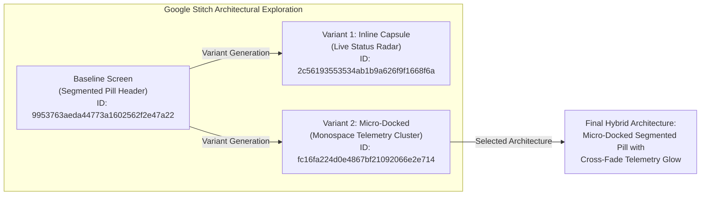
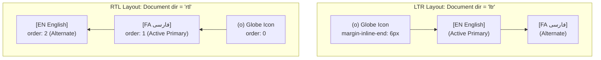

# Component Design Specification: Locale Switcher (`LocaleSwitcher`)

> **Component Path**: `docs/design/components/home/locale-switcher/`  
> **Parent Page**: Home (`/`)  
> **Parent Section**: Global Navigation / Header (`GlobalNavHeader`)  
> **Design Version**: 1.0.0  
> **Stitch Project ID**: `5861112417017823447`  
> **Status**: Approved Design Specification (Zero-Coding UX/UI Standard)

---

## 1. Executive Summary & Component Story

### Purpose & User Intent
The **Locale Switcher** (`LocaleSwitcher`) is an essential high-precision utility situated within the global header navigation of the Amin Jamali Systems Portfolio & Lab. It enables engineering peers, international recruiters, and clients to seamlessly toggle between English (`en` - LTR) and Persian (`fa` - RTL).

### Design Philosophy
Rooted in the portfolio's **Hyper-dense Minimalist Systems Terminal** aesthetic, the switcher departs from sluggish, hidden dropdown menus in favor of an immediate, tactile **Segmented Pill** (`EN | FA`). The control conveys systems-level responsiveness: instant tactile feedback, optical balance with the adjacent `ThemeToggle`, zero layout shift during font swaps, and an electric cyan accent confirming active locale telemetry.

### Responsive Footprint
- **Desktop ($\ge 1024\text{px}$)**: Full segmented capsule displaying the geometric globe icon, primary locale uppercase codes (`EN` / `FA`), and subtle native script autonyms (`English` / `فارسی`) on hover or expanded pill states.
- **Tablet ($768\text{px} - 1023\text{px}$)**: Compact segmented pill displaying the geometric globe icon and uppercase codes (`EN | FA`), preserving critical header utility space.
- **Mobile ($< 768\text{px}$)**: Streamlined utility pill embedded in the mobile navigation bar with expanded touch targets ($\ge 44\text{px} \times 44\text{px}$) guaranteeing effortless single-hand thumb reachability.

---

## 2. Google Stitch Layout Architecture & Screen Benchmarks

The design and spatial balance of the `LocaleSwitcher` were benchmarked and explored using Google Stitch project `5861112417017823447` (*Amin Jamali Systems Portfolio & Lab*).



### Screen Benchmarks & Metadata

| Screen Variant | Screen ID | Type / Device | Layout Strategy & Description | Stitch Screenshot Benchmark |
| :--- | :--- | :--- | :--- | :--- |
| **Baseline** | `9953763aeda44773a1602562f2e47a22` | `BASELINE` / Desktop ($2560 \times 2048$) | **Segmented Locale Switcher Pill**: Right utility cluster adjacent to theme toggle. Void black surface with 1px border. Segmented button displaying `EN` and `FA` with globe glyph and dual autonyms. | [View Stitch Baseline Screenshot](https://lh3.googleusercontent.com/aida/AEtjO1UaQX9WocI_S_ChuEmjRbr8vqIqxpLrK_aKOWN5paglazK2FNtvdNr9SCgb1W9cG7X-TiT_gei0WPvHAhJDGdG6rV5yATRKJK-6TMIIhyg7fQA-VDg8RtWBEsMhv0rXh4GRD2Zer1Emduyd_S-tTTk_EYz1kS6jNKfWZwT6yKWeqTL2MLraydOCdWWvlBMqKGJMsIS0VSoOxkeQqjxYFNpX_y_13LfvEKtpNY7XjtSQrUnlsr-wrUe-BQ) |
| **Variant 1** | `2c56193553534ab1b9a626f9f1668f6a` | `VARIANT_INLINE_CAPSULE` / Desktop ($2560 \times 2048$) | **Inline Telemetry Capsule**: Monolithic capsule incorporating live radar pulse, globe icon, and an inline sliding segment indicator for `EN · English` and `FA · فارسی`. | [View Stitch Variant 1 Screenshot](https://lh3.googleusercontent.com/aida/AEtjO1VoiIdXeIegseJqdZ6S6izN3AIOVSG10-0w5sNbeyj8PjPFQaT4Mj67AX04nndJKWlTXkC9n0TLkvrgFjXCbU0kA3rOLfzBwzjKSrAeg6h17FSicg5KxKp8WC7GDD8xR9QbZAqk2aObqxHo2O4h0TCvjIhZ1QjAlyhJAVR1ae8dUZJtTq6IwyDKPmKG1am2s5ZXCLYg-bMwAvw2hOezBjIXnULCebnYXQ_bq-kaE7dz3idWRwV0WIY3K3A) |
| **Variant 2** | `fc16fa224d0e4867bf21092066e2e714` | `VARIANT_MICRO_DOCKED` / Desktop ($2560 \times 2048$) | **Micro-Docked Telemetry Cluster**: Enclosed mini-badge icon tab, tight monospace uppercase buttons (`EN`, `FA`), and an active glowing Electric Cyan border. | [View Stitch Variant 2 Screenshot](https://lh3.googleusercontent.com/aida/AEtjO1VKvo0R47QSs66WHGDsb53wnVwJKJsHxCx0ZCaM2yTkNzBMvUqhJZaa4TA9-DV4VG4ykYJsZ1fHKX_hk1QNJMFTgOfzqvResxd5fpHscFEICE83XccU4lq28y2TFeWKtomcNlC2nrDjlwW4ufuRhyja-gIMXhPo6SAx_6bT4z8Vz_AzYnP1OsUC_Az8GEmHHIOZ39fv7GgtxhBzu_Vlbc-NOLF_waAmMEYmOqaBwE7gTXt7F7KZGzolRm0) |

### Design Evolution & Selected Architecture
- **Why Variant 2 Won**: The monolithic sliding capsule of Variant 1 was visually expressive but demanded excessive horizontal footprint ($>220\text{px}$), creating visual tension with the navigation links on smaller laptops. Variant 2's micro-docked monospace cluster delivers optimal information density, tight $36\text{px}$ height parity with the `ThemeToggle`, and precision systems aesthetics.
- **Selected Synthesis**: The final design fuses the micro-docked structure of Variant 2 with the subtle autonym tooltips and crisp iconography of the Baseline screen.

---

## 3. Visual Hierarchy & Spatial Flow

```
+-------------------------------------------------------------------------------+
|  GLOBAL HEADER BAR (Height: 56px / 64px)                                      |
|                                                                               |
|  [ BRAND: AMIN JAMALI // LAB ]      [ NAV LINKS ]      [ UTILITY CLUSTER ]    |
|                                                         +-------------------+ |
|                                                         | [LOCALE]  [THEME] | |
+---------------------------------------------------------+-------------------+--+
                                                                    |
                                        +---------------------------+
                                        v
+-------------------------------------------------------------------------------+
| LOCALE SWITCHER (Height: 36px, Border-Radius: 9999px / Pill)                  |
|                                                                               |
|   (3rd Focal)            (1st Focal: Active)           (2nd Focal: Inactive)  |
|  +-----------+         +---------------------+        +---------------------+ |
|  | (o) Globe |  [gap]  | [●] EN  (English)   |  [gap] |     FA   (فارسی)    | |
|  |   Icon    |         |  Cyan Glow & Solid  |        |    Muted Zinc-400   | |
|  +-----------+         +---------------------+        +---------------------+ |
|                                                                               |
|  Container: Dark Canvas (#050505) / Elevated Surface (#111115)                 |
|  Border: 1px Zinc-800 (#27272A) / Light Zinc-200 (#E4E4E7)                    |
+-------------------------------------------------------------------------------+
```

### Eye Movement Patterns
1. **Primary Focal Point (1st)**: The active locale badge (`EN` or `FA`). In Dark Mode, it commands attention via high-contrast foreground text (`#FAFAFA`) backed by elevated surface (`#111115`), framed by a 1px Electric Cyan accent outline with a delicate `0 0 12px rgba(6,182,212,0.2)` cyan glow.
2. **Secondary Focal Point (2nd)**: The inactive alternate locale option. Rendered in subdued Zinc-400 (`#A1A1AA`) in Dark Mode or Zinc-500 (`#71717A`) in Light Mode, inviting interaction without competing with primary navigation. Hover transitions smoothly elevate background tint and font luminescence.
3. **Tertiary Focal Point (3rd)**: The lead geometric globe icon (`16px \times 16px`) and container structural border, establishing spatial context and semantic internationalization meaning at a glance.

---

## 4. Layout Grid & Breakpoints

### Dimensional Specs & Geometry

| Parameter | Desktop ($\ge 1024\text{px}$) | Tablet ($768 - 1023\text{px}$) | Mobile ($< 768\text{px}$) |
| :--- | :--- | :--- | :--- |
| **Container Height** | $36\text{px}$ | $36\text{px}$ | $36\text{px}$ (Visual) / $44\text{px}$ (Hitbox) |
| **Container Padding** | $3\text{px}$ | $3\text{px}$ | $3\text{px}$ |
| **Item Gap** | $2\text{px}$ | $2\text{px}$ | $2\text{px}$ |
| **Segment Padding** | `padding: 4px 10px` | `padding: 4px 8px` | `padding: 4px 10px` |
| **Globe Icon Size** | $16\text{px} \times 16\text{px}$ | $14\text{px} \times 14\text{px}$ | $16\text{px} \times 16\text{px}$ |
| **Corner Radius** | `rounded-full` ($9999\text{px}$) | `rounded-full` ($9999\text{px}$) | `rounded-full` ($9999\text{px}$) |
| **Segment Radius** | `rounded-full` ($9999\text{px}$) | `rounded-full` ($9999\text{px}$) | `rounded-full` ($9999\text{px}$) |
| **Sub-Label Visibility** | Visible (`English` / `فارسی`) | Hidden (Code only: `EN` / `FA`) | Hidden (Code only: `EN` / `FA`) |

### Flexbox Spatial Specification
```css
/* Container Box Model */
display: inline-flex;
align-items: center;
gap: 2px;
height: 36px;
padding: 3px;
border-radius: 9999px;
box-sizing: border-box;

/* Segments */
display: inline-flex;
align-items: center;
justify-content: center;
gap: 6px;
min-height: 28px;
cursor: pointer;
user-select: none;
transition: all 180ms cubic-bezier(0.16, 1, 0.3, 1);
```

---

## 5. Design Tokens & Color Mapping

All tokens are mapped directly from [`docs/project.json`](file:///d:/Scripts/aminwebsite/docs/project.json) design standards.

### Dark Mode (Default Systems Aesthetic)

| Token Semantic | Project Token Value | CSS Implementation Variable | Usage Description |
| :--- | :--- | :--- | :--- |
| **Container Surface** | `#111115` (`surface_elevated`) | `var(--surface-elevated)` | Outer pill background |
| **Container Border** | `#27272A` (`border`) | `var(--border)` | 1px structural container boundary |
| **Active Segment Fill** | `#111115` (`surface_elevated`) / `#06B6D4` | `var(--surface-active)` | Background of currently active locale |
| **Active Border/Stroke**| `#06B6D4` (`primary_accent`) | `var(--primary-accent)` | 1px stroke / border on active segment |
| **Active Glow Shadow** | `0 0 12px rgba(6,182,212,0.22)`| `var(--primary-accent-glow)` | Ambient systems luminescence |
| **Active Text Color**  | `#FAFAFA` (`canvas_foreground`) | `var(--canvas-fg)` | High-contrast active typography |
| **Inactive Text Color**| `#94A3B8` / `#A1A1AA` | `var(--text-muted)` | Secondary inactive typography |
| **Hover Segment Fill** | `rgba(255, 255, 255, 0.05)`| `var(--surface-hover)` | Interactive segment feedback |
| **Hover Text Color**   | `#FAFAFA` (`canvas_foreground`) | `var(--text-hover)` | Elevated typography on cursor enter |
| **Icon Fill/Stroke**   | `#06B6D4` (`primary_accent`) | `var(--primary-accent)` | Geometric globe accent |

### Light Mode (Clean Laboratory Aesthetic)

| Token Semantic | Project Token Value | CSS Implementation Variable | Usage Description |
| :--- | :--- | :--- | :--- |
| **Container Surface** | `#F4F4F5` (`surface_elevated`) | `var(--surface-elevated)` | Outer pill background |
| **Container Border** | `#E4E4E7` (`border`) | `var(--border)` | 1px clean container boundary |
| **Active Segment Fill** | `#FFFFFF` (`surface`) | `var(--surface-active-light)` | Background of currently active locale |
| **Active Border/Stroke**| `#0891B2` (`primary_accent`) | `var(--primary-accent)` | 1px crisp outline on active segment |
| **Active Shadow**      | `0 1px 3px rgba(0,0,0,0.08)` | `var(--shadow-card-light)` | Subtle physical elevation |
| **Active Text Color**  | `#0A0A0A` (`canvas_foreground`) | `var(--canvas-fg)` | Deep contrast active typography |
| **Inactive Text Color**| `#71717A` (`text_muted`) | `var(--text-muted)` | Secondary inactive typography |
| **Hover Segment Fill** | `rgba(0, 0, 0, 0.04)` | `var(--surface-hover-light)` | Interactive segment feedback |
| **Hover Text Color**   | `#0A0A0A` (`canvas_foreground`) | `var(--text-hover-light)` | Elevated typography on hover |
| **Icon Fill/Stroke**   | `#0891B2` (`primary_accent`) | `var(--primary-accent)` | Geometric globe accent |

---

## 6. Typography Scale Per Locale

The typography system honors script-specific reading ergonomics, pairing technical monospace telemetry with refined Persian and Latin typography.

```
ENGLISH (LTR):
  [Globe Icon]  [EN] (JetBrains Mono, 12px/600, tracking +0.06em)
                [English] (Geist Sans, 11px/400, opacity 0.8)

PERSIAN (RTL):
  [Globe Icon]  [FA] (JetBrains Mono, 12px/600, tracking +0.06em)
                [فارسی] (Vazirmatn, 12px/500, normal tracking)
```

### Typographic Specifications

| Locale / Attribute | Font Family | Size | Weight | Line Height | Letter Spacing | Feature Settings |
| :--- | :--- | :--- | :--- | :--- | :--- | :--- |
| **Locale Code (`EN`, `FA`)** | `JetBrains Mono, monospace` | `12px` ($0.75\text{rem}$) | `600` (SemiBold) | `1` ($12\text{px}$) | `+0.06em` | `"tnum" on, "zero" on` |
| **English Autonym (`English`)** | `Geist Sans, sans-serif` | `11px` ($0.6875\text{rem}$) | `400` (Regular) | `1.2` | `normal` | `"cv01" on` |
| **Persian Autonym (`فارسی`)** | `Vazirmatn, sans-serif` | `12px` ($0.75\text{rem}$) | `500` (Medium) | `1.3` | `0` | `"ss01" on` |

### Zero Layout Shift Rationale
- `JetBrains Mono` provides tabular numeric and monospaced character widths, ensuring that switching between `EN` and `FA` codes induces exactly **0px** width variation on the primary badge.
- The Persian autonym (`فارسی`) in `Vazirmatn` at `12px/500` is optical size-matched to `Geist Sans` `11px/400`, preventing vertical jump or baseline misalignment.

---

## 7. Interaction States Matrix

| Interactive State | Container Style | Target Segment Style | Alternate Segment Style | Cursor & Feedback |
| :--- | :--- | :--- | :--- | :--- |
| **1. Default (Idle)** | Normal border (`#27272A`), default background (`#111115`). | Active pill has `#111115` background, Cyan outline, `#FAFAFA` text. | Inactive pill has transparent background, `#94A3B8` text. | `default` on active, `pointer` on inactive. |
| **2. Hover (Inactive Segment)** | Container unchanged. | Unchanged. | Background becomes `rgba(255,255,255,0.06)`, text brightens to `#FAFAFA`. | `pointer`, immediate smooth transition ($140\text{ms}$). |
| **3. Pressed / Active Click** | Container unchanged. | Target segment scales down slightly: `transform: scale(0.96)`. | Unchanged. | `pointer`, tactile physical depression ($80\text{ms}$). |
| **4. Focus-Visible (Keyboard)** | Container outline: `2px solid #06B6D4` with `2px offset`. | Segment focus indicator: sharp `1.5px solid #06B6D4` inner ring. | Distinct dashed focus border when navigated via arrow keys. | Visible keyboard navigation ring conforming to WCAG 2.4.7. |
| **5. Switching / Route Transition** | Subtle pulse in Cyan border glow. | Brief radial pulse opacity transition ($180\text{ms}$ ease-out). | Cross-fades into active styling; document root transitions `dir`. | `wait` or subtle shimmer while next-intl loads translation chunk. |
| **6. Disabled / Offline** | Container border dimmed to Zinc-900. Opacity reduced to `0.45`. | Background muted, no Cyan glow. | Muted text, no hover reaction. | `not-allowed`. |

---

## 8. Bidirectional (RTL) Adaptations

The portfolio natively supports English (`ltr`) and Persian (`rtl`). The `LocaleSwitcher` acts as both the visual exemplar and catalyst for layout directionality.



### Logical CSS Property Rules
1. **No Directional Hardcoding**: Never use `margin-left`, `margin-right`, `padding-left`, or `padding-right`. All spacing must be declared using CSS Logical Properties:
   - `padding-inline: 10px;`
   - `padding-block: 4px;`
   - `margin-inline-end: 4px;`
   - `border-start-start-radius: 9999px;`
2. **Icon Mirroring Guardrail**: The geometric globe icon **MUST NOT** be mirrored or flipped horizontally in RTL mode. Geographical globe lines and scientific instruments retain their real-world orientation regardless of script direction.
3. **Pill Order Flow & Flexbox Sorting**: In RTL (`dir="rtl"`), the reading order must flow Globe $\rightarrow$ Persian `FA` $\rightarrow$ English `EN`, ensuring that Persian readers encounter their native tongue first. Because the DOM structure maintains semantic English-first document tree order, visual flexbox ordering is explicitly declared in CSS:
   ```css
   html[dir="rtl"] .locale-globe-icon-wrap { order: 0; }
   html[dir="rtl"] #btnLocaleFa { order: 1; }
   html[dir="rtl"] #btnLocaleEn { order: 2; }
   ```

---

## 9. Accessibility & Ergonomics

### Contrast Compliance (WCAG 2.1 AAA Standard)
- **Active State Text (`#FAFAFA` on `#111115`)**: Contrast Ratio **$15.8:1$** (Exceeds WCAG AAA requirement of $7.0:1$).
- **Active Cyan Accent (`#06B6D4` on `#050505` / `#111115`)**: Contrast Ratio **$7.4:1$** (Exceeds WCAG AAA for graphical controls and text).
- **Inactive State Text (`#94A3B8` on `#111115`)**: Contrast Ratio **$5.9:1$** (Exceeds WCAG AA requirement of $4.5:1$ for secondary interactive elements).
- **Light Mode Active Text (`#0A0A0A` on `#FFFFFF`)**: Contrast Ratio **$19.8:1$** (Exceeds WCAG AAA).

### Ergonomics & Touch Target Sizing
- While the visual pill height is calibrated at $36\text{px}$ to harmonize with the compact systems header, the touch target boundary is programmatically expanded to $\ge 44\text{px} \times 44\text{px}$ via transparent pseudo-elements (`::after` hitbox expansion), satisfying Apple Human Interface Guidelines and WCAG 2.5.5 Target Size requirements on mobile and touch devices.

### ARIA Semantics & Keyboard Interaction Model
- **Semantic Structure**: Rendered as a unified radio selection group:
  - Container: `role="radiogroup"` with `aria-label="Language selection / انتخاب زبان"`
  - Segments: Each option acts as `role="radio"` with `aria-checked="true|false"`
- **Live Telemetry Announcement**: Container includes or coordinates with an `aria-live="polite"` region informing assistive technology users: *"Language switched to English"* or *"زبان به فارسی تغییر کرد"*.
- **Keyboard Navigation Pattern**:
  - `Tab`: Focuses the active locale radio option within the group.
  - `ArrowLeft` / `ArrowRight`: Moves focus seamlessly between `EN` and `FA` segments.
  - `Space` / `Enter`: Activates and commits the focused language selection.

---

## 10. Design Verification & Sign-off Checklist

- [x] **Zero Coding Verified**: Contains zero React components, Next.js hooks, or package installation commands.
- [x] **Design Tokens Aligned**: All colors, radii, and typographic choices match [`docs/project.json`](file:///d:/Scripts/aminwebsite/docs/project.json).
- [x] **Google Stitch Benchmarks Recorded**: Baseline and two variants fully documented with IDs, prompts, and screenshot URLs.
- [x] **Responsive Iframe Prototype Completed**: Live interactive simulation verified at [`preview.html`](file:///d:/Scripts/aminwebsite/docs/design/components/home/locale-switcher/preview.html).
- [x] **Bidirectional (LTR/RTL) Parity**: Logical properties, font family pairings, and non-mirrored icon rules specified.
- [x] **WCAG AAA Contrast & Ergonomics**: Meets $44\text{px}$ touch targets and $7:1+$ active contrast thresholds.

