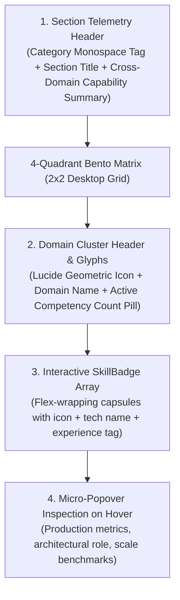
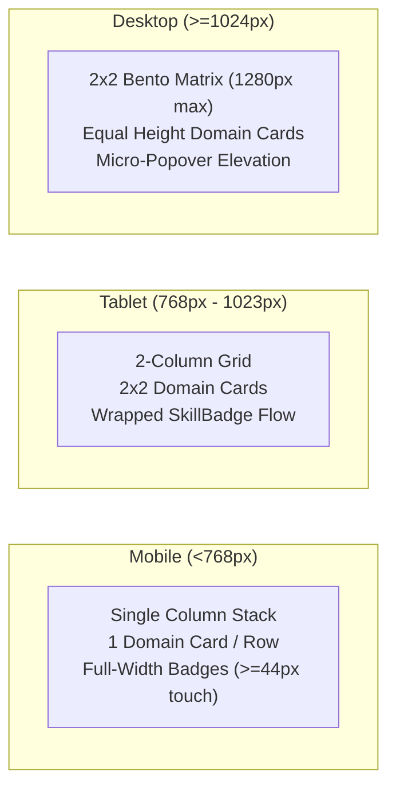

# Design Specification: Competencies & Systems Tech Matrix (`TechStackMatrix` & `SkillBadge`)

**Document Path:** `docs/design/components/home/tech-matrix/design-spec.md`  
**Target Page:** Home (`/` / `/[locale]`)  
**Component Identifiers:** `TechStackMatrix` (Container, Domain Bento Grid & Summary Header) and `SkillBadge` (Interactive Competency Capsule & Micro-Popover)  
**Design System Reference:** [`docs/project.json`](file:///c:/scripts/aminwebsite/docs/project.json) (`design_system`)  
**Downstream Scaffolding:** Ready for [`/stitch-design`](file:///d:/Scripts/aminwebsite/.agents/skills/stitch-design/SKILL.md) and [`/nextjs-component-dev`](file:///d:/Scripts/aminwebsite/.agents/skills/nextjs-component-dev/SKILL.md).

---

## 1. Executive Summary & Narrative Story

The **Competencies & Systems Tech Matrix** is positioned directly on the Home Page to provide an authoritative, transparent, and categorized breakdown of engineering capabilities across full-stack systems, distributed backends, cloud infrastructure, and network protocols.

Unlike generic portfolios that present unstructured lists of buzzword tags or arbitrary percentage skill bars, this section operates as an **Engineered Systems Capability Observatory**. It organizes technical competence into four high-cohesion architectural domains:

1. **Frontend & Client Architecture (Cyan Accent Domain):**
   - Core proficiencies: Next.js 15 (App Router, Server Components), TypeScript 5.x, React 19, Tailwind CSS v4, Framer Motion, and next-intl BiDi internationalization.
   - Capability highlight: Zero-CLS layouts, Sub-800ms LCP, deep client performance tuning, and type-safe architecture.
2. **Systems & Distributed Backend (Violet Accent Domain):**
   - Core proficiencies: Go (Golang), Python 3.12+, PostgreSQL (pgvector, indexing), Redis (caching, pub/sub, rate limiting), gRPC / Protocol Buffers, and Node.js.
   - Capability highlight: High-throughput concurrent microservices, low-latency data pipelines, and strict memory safety.
3. **Cloud, DevOps & Infrastructure (Emerald Accent Domain):**
   - Core proficiencies: Docker (Multi-Stage, Distroless), Kubernetes, GitHub Actions CI/CD (Release Please, Matrix Multi-Arch OCI), Linux Systems Engineering, and NGINX.
   - Capability highlight: Credit-optimized CI/CD pipelines, native AMD64/ARM64 containerization, and automated zero-downtime releases.
4. **Security & Network Protocols (Amber Accent Domain):**
   - Core proficiencies: DNS over HTTPS (DoH / RFC 8484), TLS 1.3 / Cryptography, STUN / WebRTC Protocols (RFC 5389), and Hardware Entropy / Canvas Security.
   - Capability highlight: Zero backend logging, client-side cryptographic hashing, and privacy-preserving diagnostics.

### Emotional Impression & Visual Tone

- **Obsidian Telemetry Precision:** Deep elevated surfaces (`#111115` dark / `#FFFFFF` light) encased in structural 1px hair-lines (`#27272A` / `#E4E4E7`) with glowing category accents and monospace metric tags.
- **Active Pulse & Micro-Inspection:** Hovering any individual `SkillBadge` triggers an active neon telemetry pulse, elevates the badge, and opens a rich micro-popover detailing years in production, core architectural use-cases, and verified benchmarks.

---

## 2. Visual Hierarchy & Spatial Eye Flow

The section layout guides the visitor's eye through a structured 4-level architectural journey:

1. **1st Focal Hook (Section Telemetry Header & Domain Counters):**
   - Monospace category tag (`04 // COMPETENCIES & TECH MATRIX`) followed by an authoritative headline and a high-level summary of total production technologies and multi-year cross-stack experience.
2. **2nd Focal Point (4 Domain Bento Cards & Geometric Glyphs):**
   - Four distinct modular bento cards representing the four engineering pillars. Each card features an elevated container header with a domain-colored geometric icon badge (Cyan for Frontend, Violet for Systems, Emerald for Cloud, Amber for Security) and a live competency count pill.
3. **3rd Focal Point (Interactive `SkillBadge` Capsules):**
   - Compact, high-contrast badges arranged in a flexible wrapping layout with ample vertical and horizontal breathing room. Each badge displays the technology's geometric SVG icon, canonical name, and a subtle experience/proficiency tag.
4. **4th Focal Point (Hover Micro-Popover & Active Glow):**
   - Hovering or focusing a badge initiates an active neon glow highlight on the selected badge while gracefully dimming unrelated badges slightly, simultaneously rendering an ergonomic tooltip/popover with verified metrics.

---

## 3. Layout Grid & Responsive Breakpoints

### Mobile (< 768px)
- **Grid Structure:** Single-column vertical stack (`grid-cols-1 gap-4`).
- **Domain Cards:** Full container width with compact internal padding (`16px`–`20px`).
- **Badges:** Responsive flex-wrap capsules with touch-friendly dimensions ($\ge 44\text{px}$ touch targets, minimum height `44px`), tap-to-inspect popover behavior.
- **Card Headers:** Configured with `flex-wrap` and responsive gap spacing (`gap-2.5`) to prevent header overflow across compact viewports.

### Tablet (768px – 1023px)
- **Grid Structure:** 2-column grid (`grid-cols-2 gap-5`).
- **Domain Cards:** Balanced height cards with `24px` internal padding and structural borders.
- **Badges:** Compact inline capsules (`gap-2`), micro-hover states and keyboard focus rings.

### Desktop ($\ge$ 1024px)
- **Grid Structure:** 4-Quadrant 2x2 Bento Grid (`grid-cols-2 gap-6`, max-width `1280px`).
- **Domain Cards:** Equal-height elevated obsidian panels (`#111115` dark / `#FFFFFF` light) with `28px`–`32px` internal padding and subtle radial corner gradients.
- **Interaction:** Instant hover micro-popover positioning with smooth fade/scale spring physics and ambient neon glow.

---

## 4. Design Tokens & Color Mapping

All colors strictly reference canonical design tokens defined in [`docs/project.json`](file:///c:/scripts/aminwebsite/docs/project.json).

| UI Element | Light Mode Token | Dark Mode Token | Semantic Role |
| :--- | :--- | :--- | :--- |
| **Section Canvas** | `#FAFAFA` (`canvas_background`) | `#050505` (`canvas_background`) | Base section background |
| **Bento Domain Cards** | `#FFFFFF` (`surface_elevated`) | `#111115` (`surface_elevated`) | Domain card background |
| **Card Borders** | `#E4E4E7` (`border`) | `#27272A` (`border`) | Structural 1px boundary |
| **Active Border Glow** | `#0891B2` / `#7C3AED` | `#06B6D4` / `#8B5CF6` | Hover boundary highlight |
| **SkillBadge Surface (Default)** | `#F4F4F5` (`section_alternate_background`) | `#18181B` (zinc-900 / elevated) | Unfocused badge surface |
| **SkillBadge Border (Default)** | `#E4E4E7` (`border`) | `#27272A` (`border`) | Subtle badge perimeter |
| **SkillBadge Surface (Active/Hover)**| `#FFFFFF` (`surface_elevated`) | `#1F1F24` (`skeleton` / elevated) | Hovered badge surface |
| **SkillBadge Text** | `#0A0A0A` (`canvas_foreground`) | `#FAFAFA` (`canvas_foreground`) | High-contrast tech name |
| **SkillBadge Subtitle / Tag** | `#71717A` (zinc-500) | `#A1A1AA` (zinc-400) | Secondary experience tag |
| **Frontend Domain Accent** | `#0891B2` (`primary_accent`) | `#06B6D4` (`primary_accent`) | Cyan glyph & badge accent |
| **Systems Backend Accent** | `#7C3AED` (`secondary_accent`) | `#8B5CF6` (`secondary_accent`) | Violet glyph & badge accent |
| **Cloud/DevOps Accent** | `#10B981` (`status_success`) | `#10B981` (`status_success`) | Emerald glyph & badge accent |
| **Security & Protocols Accent** | `#F59E0B` (`status_warning`) | `#F59E0B` (`status_warning`) | Amber glyph & badge accent |
| **Micro-Popover Surface** | `#FFFFFF` (`surface_elevated`) | `#18181B` (zinc-900 elevated) | Floating inspection popover |
| **Micro-Popover Shadow** | `0 10px 15px -3px rgb(0 0 0 / 0.3)` (`elevated`) | `0 20px 25px -5px rgb(0 0 0 / 0.4)` (`modal`) | Floating elevation depth |
| **Neon Telemetry Glow** | `0 0 24px -4px rgba(8, 145, 178, 0.25)` | `0 0 24px -4px rgba(6, 182, 212, 0.25)` (`neon_glow`) | Active badge spotlight |

---

## 5. Typography Scale (Per Supported Locale)

### English / LTR (`en`)
- **Section Monospace Kicker:** `Geist Mono`, `0.8125rem` (`13px`), font-weight: `600`, tracking: `0.1em`, uppercase.
- **Section Heading (H2):** `Geist Sans`, `2.25rem`–`2.75rem` (`36px`–`44px`), font-weight: `700`, line-height: `1.15`.
- **Section Subtitle:** `Geist Sans`, `1.0625rem` (`17px`), font-weight: `400`, line-height: `1.6`, text color: `muted-foreground`.
- **Domain Card Heading (H3):** `Geist Sans`, `1.25rem` (`20px`), font-weight: `600`, line-height: `1.3`.
- **Domain Capability Note:** `Geist Sans`, `0.875rem` (`14px`), font-weight: `400`, line-height: `1.5`, text color: `muted-foreground`.
- **SkillBadge Tech Name:** `Geist Sans`, `0.875rem` (`14px`), font-weight: `600`, line-height: `1.2`.
- **SkillBadge Experience Tag:** `Geist Mono`, `0.6875rem` (`11px`), font-weight: `500`, tracking: `0.05em`.
- **Popover Metric Callout:** `Geist Mono`, `0.75rem` (`12px`), font-weight: `600`.

### Persian / RTL (`fa`)
- **Section Monospace Kicker:** `Geist Mono` / `Vazirmatn`, `0.8125rem` (`13px`), font-weight: `600`, tracking: `0.05em`.
- **Section Heading (H2):** `Vazirmatn`, `2rem`–`2.375rem` (`32px`–`38px`), font-weight: `700`, line-height: `1.35`.
- **Section Subtitle:** `Vazirmatn`, `1.0625rem` (`17px`), font-weight: `400`, line-height: `1.8`, text color: `muted-foreground`.
- **Domain Card Heading (H3):** `Vazirmatn`, `1.25rem` (`20px`), font-weight: `700`, line-height: `1.4`.
- **Domain Capability Note:** `Vazirmatn`, `0.875rem` (`14px`), font-weight: `400`, line-height: `1.7`.
- **SkillBadge Tech Name:** `Vazirmatn`, `0.875rem` (`14px`), font-weight: `600`, line-height: `1.3`.
- **SkillBadge Experience Tag:** `Geist Mono` / `Vazirmatn`, `0.6875rem` (`11px`), font-weight: `500`.
- **Popover Metric Callout:** `Geist Mono` / `Vazirmatn`, `0.75rem` (`12px`), font-weight: `600`.

---

## 6. Interaction States & Transitions Matrix

| State | Visual Behavior & Feedback |
| :--- | :--- |
| **Domain Card (Default)** | Surface `#111115` dark / `#FFFFFF` light, 1px border `#27272A` / `#E4E4E7`, subtle shadow. |
| **Domain Card (Hover)** | 1px border lightens to `#3F3F46` / `#D4D4D8`, subtle inner radial highlight under cursor. |
| **SkillBadge (Default)** | Elevated capsule surface (`#18181B` / `#F4F4F5`), border `#27272A` / `#E4E4E7`, crisp typography. |
| **SkillBadge (Hover / Focus)**| Active neon glow (`neon_glow`), surface lifts to `#1F1F24` / `#FFFFFF`, border transitions to domain accent (Cyan/Violet/Emerald/Amber), sibling badges smoothly dim to 65% opacity. Micro-popover opens with 150ms spring fade. |
| **SkillBadge (Active / Pressed)** | Scale `0.97`, active accent border glow firmly engaged. |
| **SkillBadge (Focus Visible)** | High-contrast 2px ring with 2px offset (`ring-2 ring-primary ring-offset-2 ring-offset-background`). |
| **Skeleton Loading** | Pulsating shimmer surfaces (`#1F1F24` dark / `#E4E4E7` light) matching bento cards and badge pill contours. |

---

## 7. Bidirectional (RTL) Adaptations

- **Layout Grid Mirroring:** In RTL mode (`dir="rtl"`), the 2x2 grid flows from top-right to bottom-left.
- **Card Headers:** Icon container aligns to the right (`start`), domain title and badge counter follow inline natural flow.
- **SkillBadge Anatomy:** Technology icon positions on the right (`start`), followed by technology name, followed by experience tag on the left (`end`).
- **Monospace Numbers & Versions:** Version identifiers (e.g. `Next.js 15`, `Go 1.23`, `Python 3.12`) and telemetry metrics (e.g., `<0.8s LCP`, `99.9% uptime`) retain LTR formatting (`dir="ltr"` inline wrapper) for international clarity.

---

## 8. Accessibility & Ergonomic Compliance

- **Touch Target Ergonomics:** On mobile viewports, every `SkillBadge` maintains a minimum hit area of $44\text{px} \times 44\text{px}$ using padding buffers and flex hit targets.
- **Contrast Compliance:** All text tokens (headings, body, and monospace badges) achieve WCAG AAA contrast ratios ($\ge 7:1$) against card and popover backgrounds.
- **Keyboard Navigation:** Every `SkillBadge` is keyboard focusable (`tabIndex={0}`) with explicit `focus-visible` styling and accessible ARIA attributes (`aria-label`, `role="listitem"`, `aria-describedby` referencing popover details).
- **Reduced Motion:** Respects `prefers-reduced-motion: reduce` by disabling ambient neon pulses and sibling badge opacity transitions, rendering crisp static state switches.

---

## 9. Recommended Visual Assets & Prompts

> [!TIP]
> In compliance with Rule 25, no images are generated directly. Structured prompts below can be rendered externally if visual backdrop assets are required.

### Recommended Visual Asset: Tech Matrix Domain Circuit Backdrop

- **Target File Path:** `docs/design/components/home/tech-matrix/tech-matrix-backdrop.png`
- **Recommended Aspect Ratio:** `16:9`
- **Generation Prompt:**
  > "Minimalist obsidian dark mode engineering circuit schematic backdrop, deep charcoal `#050505` background with ultra-faint luminous cyan `#06B6D4` and purple `#8B5CF6` telemetry grid traces, delicate 1px vector lines, subtle geometric nodes, zero text, high-tech architectural precision, studio lighting, 8k resolution, clean modern aesthetic."

