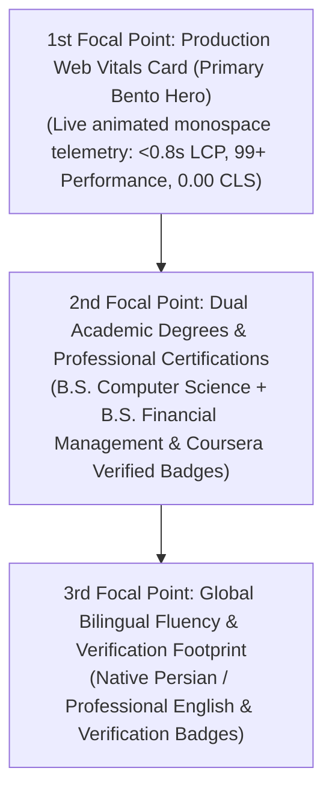

# Design Specification: Trust Signals & Credentials Bento (`TrustSignalsSection`)

**Document Path:** `docs/design/components/home/trust-signals/design-spec.md`  
**Target Page:** Home (`/` / `/[locale]`)  
**Component Identifier:** `TrustSignalsSection` (encompassing `CredentialsBar` and `MetricHighlightList`)  
**Design System Reference:** [`docs/project.json`](file:///d:/Scripts/aminwebsite/docs/project.json) (`design_system`)  
**Downstream Scaffolding:** Ready for [`/stitch-design`](file:///d:/Scripts/aminwebsite/.agents/skills/stitch-design/SKILL.md) or frontend implementation workflows.

---

## 1. Executive Summary & Narrative Story

The **Trust Signals & Credentials Section** serves as the immediate credibility and verification anchor situated directly below the Home Page Hero. Rather than relying on generic claims, this section presents an authentic, empirical, and multi-dimensional verification matrix tailored to Amin Jamali's background.

The section targets **engineering hiring leads, technical founders, and enterprise clients** by organizing verified credibility into four distinct proof pillars:

1. **Empirical Production Performance:** Verifiable production delivery metrics from a deployed company web platform (sub-second LCP < 0.8s, 99+ Lighthouse performance score, zero CLS).
2. **Dual-Degree Academic Foundation:** Formal dual Bachelor's degrees combining **Computer Science** (algorithmic rigor, software engineering, systems architecture) and **Financial Management** (computational modeling, quantitative logic, business acumen).
3. **Continuous Mastery & Professional Certifications:** A dense showcase of verified industry specializations (Coursera, Meta, Google, DeepLearning.AI across Full-Stack and Systems Engineering).
4. **Global Bilingual Fluency:** Native Persian with advanced professional English proficiency, validating cross-border team collaboration and internationalization expertise.

### Emotional Impression & Voice

- **Empirical Rigor:** Grounded in hard metrics, verifiable degrees, and real deployed software.
- **Interdisciplinary Strength:** The unique intersection of computer science architecture and financial management systems.
- **Engineered Minimalism:** A modern, high-density Bento Grid with obsidian card surfaces, crisp 1px structural hair-lines, and subtle telemetry glows.

---

## 2. Visual Hierarchy & Eye Flow Sequence

The section is composed as an asymmetrical **Bento Grid Matrix** designed to guide the visitor's eye through a 3-step proof progression:



1. **1st Focal Point (The Empirical Anchor): Production Web Vitals Card (Large Bento Cell)**
   - Dominates the left/start side of the bento grid.
   - Highlights real-world production metrics from deployed enterprise infrastructure: `<0.8s LCP`, `99+ Performance`, `100% SEO/Best Practices`.
   - Uses monospace numeric typography (`Geist Mono`) with subtle emerald status indicators (`#10B981`) to communicate instant technical excellence.

2. **2nd Focal Point (The Academic & Specialized Foundation): Dual B.S. & Coursera Certifications (Mid Bento Cells)**
   - Top-right cell: Dual Bachelor's degree showcase (Computer Science + Financial Management) with university verification emblems and discipline badges.
   - Middle cell: Curated Coursera / Industry Professional Certifications list with verified issuer tags and interactive credential links.

3. **3rd Focal Point (The Global Reach): Bilingual Fluency & Verified Footprint (Compact Bento Cell)**
   - Highlights native Persian (RTL) mastery and fluent English (LTR) communication capability.
   - Includes clean Lucide vector icons (`Languages`, `ShieldCheck`, `CheckCircle2`) validating end-to-end internationalized application delivery.

---

## 3. Spatial Layout & Bento Grid Architecture

### Bento Grid Philosophy

- **Modular Asymmetry:** 4 distinct modular cards arranged in a cohesive 12-column bento structure on desktop, reflowing cleanly to 2 columns on tablet and a single vertical stack on mobile.
- **Structural Hairlines:** Crisp 1px structural dividing rules using the canonical border token (`#27272A` in dark mode, `#E4E4E7` in light mode).
- **Subtle Glassmorphic Surface:** Elevated card surfaces (`#111115` in dark mode, `#FFFFFF` in light mode) with high-contrast text and interactive hover transitions.

### Bento Cell Distribution Matrix

```text
+-------------------------------------------------------------------------------+
| SECTION HEADER: // 01. VERIFIED CREDENTIALS & PRODUCTION SIGNALS            |
+---------------------------------------+---------------------------------------+
| CELL 1: PRODUCTION WEB VITALS (6 Col) | CELL 2: DUAL ACADEMIC DEGREES (6 Col) |
| - Live Production Deployed Project    | - B.S. Computer Science               |
| - < 0.8s LCP | 99+ Lighthouse | 0 CLS | - B.S. Financial Management           |
| - Real-time Performance Telemetry     | - Systems Logic + Financial Systems   |
+---------------------------------------+---------------------------------------+
| CELL 3: PROFESSIONAL CERTS (8 Col)    | CELL 4: BILINGUAL FLUENCY (4 Col)     |
| - Coursera Professional Specializations| - Native Persian (Mother Language)   |
| - Full-Stack, Architecture & Systems   | - Fluent Professional English (C1/C2) |
| - Verified Credential Links           | - BiDi & Global Systems Ready         |
+---------------------------------------+---------------------------------------+
```

### Responsive Breakpoint Specifications

| Viewport Tier | Width Range | Layout Composition & Behavior | Spacing & Constraints |
| :--- | :--- | :--- | :--- |
| **Mobile** | `< 768px` | **1-Column Vertical Stack:**<br>1. Section eyebrow & title<br>2. Cell 1: Production Web Vitals Card<br>3. Cell 2: Dual Degrees Card<br>4. Cell 3: Professional Certifications Card<br>5. Cell 4: Bilingual Fluency Card | Padding: `px-4 py-12`<br>Grid Gap: `gap-4`<br>Touch targets: $\ge 44\text{px}$<br>Card padding: `p-5` |
| **Tablet** | `768px - 1024px` | **2-Column Bento Reflow:**<br>- Row 1: Cell 1 (Col Span 1) & Cell 2 (Col Span 1)<br>- Row 2: Cell 3 (Col Span 2)<br>- Row 3: Cell 4 (Col Span 2) | Padding: `px-6 py-16`<br>Grid Gap: `gap-5`<br>Max container: `768px`<br>Card padding: `p-6` |
| **Desktop** | `$\ge$ 1024px` | **12-Column Asymmetrical Bento Matrix:**<br>- Top Row: Cell 1 (Span 6) + Cell 2 (Span 6)<br>- Bottom Row: Cell 3 (Span 7) + Cell 4 (Span 5)<br>Equidistant vertical rhythm with header eyebrow. | Padding: `px-12 py-20`<br>Grid Gap: `gap-6`<br>Max container: `1280px`<br>Card padding: `p-7` |

---

## 4. Design Tokens & Color Palette Mapping

All color assignments strictly conform to the canonical design system tokens in [`docs/project.json`](file:///d:/Scripts/aminwebsite/docs/project.json):

### Light & Dark Color Mapping

| UI Element / Surface | Light Theme Token | Dark Theme Token | Semantic Purpose |
| :--- | :--- | :--- | :--- |
| **Section Canvas Background** | `#FAFAFA` | `#050505` | Viewport background canvas |
| **Bento Card Surface (`surface_elevated`)** | `#FFFFFF` | `#111115` | Elevated modular bento container |
| **Card Border (`border`)** | `#E4E4E7` | `#27272A` | Crisp 1px structural card boundary |
| **Section Alternate Background** | `#F4F4F5` | `#0A0A0C` | Inner badge / pill background |
| **Primary Typography (Headings & Metric)** | `#0A0A0A` | `#FAFAFA` | Primary high-contrast titles and numerical metrics |
| **Secondary Typography (Labels & Body)** | `#71717A` | `#A1A1AA` | Secondary labels, descriptions, and metadata |
| **Primary Accent (Cyan)** | `#0891B2` | `#06B6D4` | Active status dots, metric focus, link highlights |
| **Secondary Accent (Violet)** | `#7C3AED` | `#8B5CF6` | Academic degree accent, specialized cert badges |
| **Status: Success (Emerald)** | `#10B981` | `#10B981` | 99+ Lighthouse score indicator, verified badge |
| **Status: Info (Cyan/Sky)** | `#06B6D4` | `#38BDF8` | Web Vitals telemetry chip, live probe pulse |
| **Skeleton Base (`skeleton`)** | `#E4E4E7` | `#1F1F24` | Loading placeholder background |
| **Skeleton Shimmer (`skeleton_shimmer`)** | `#D4D4D8` | `#303038` | Shimmer pulse highlight |
| **Skeleton Border (`skeleton_border`)** | `#D1D5DB` | `#3F3F46` | Accessible loading boundary |
| **Hover Glow (`neon_glow`)** | `none` | `0 0 24px -4px rgba(6, 182, 212, 0.15)` | Subtle ambient card hover atmosphere |

### Border Radii & Spatial Geometry

- **Bento Card Containers:** `0.75rem` (`12px` - `border_radius.card`)
- **Inner Metric Pill / Sub-blocks:** `0.5rem` (`8px` - `border_radius.base`)
- **Verification Badges & Language Chips:** `9999px` (Fully rounded capsule - `border_radius.badge`)
- **Interactive Buttons / Links:** `0.5rem` (`8px` - `border_radius.button`)

---

## 5. Typographic Scale & Per-Locale Hierarchy

Typography is mapped per supported locale (`en` and `fa`) referencing [`docs/project.json`](file:///d:/Scripts/aminwebsite/docs/project.json):

### English (`en` - LTR)
- **Section Eyebrow:** `Geist Mono`, `text-xs` (12px), uppercase, tracking-wider, `text-primary-accent` (`#0891B2` / `#06B6D4`).
- **Section Heading:** `Geist Sans`, `text-2xl` to `text-3xl` (24px–30px), font-bold, tracking-tight, `text-foreground`.
- **Large Metric Figures:** `Geist Mono`, `text-4xl` to `text-5xl` (36px–48px), font-bold, tracking-tighter.
- **Card Subheadings:** `Geist Sans`, `text-lg` (18px), font-semibold, `text-foreground`.
- **Body & Captions:** `Geist Sans`, `text-sm` (14px), font-normal, `text-muted-foreground`.
- **Metric Labels & Badges:** `Geist Mono`, `text-xs` (12px), font-medium.

### Persian (`fa` - RTL)
- **Section Eyebrow:** `Vazirmatn`, `text-xs` (12px), font-medium, `text-primary-accent`.
- **Section Heading:** `Vazirmatn`, `text-2xl` to `text-3xl` (24px–30px), font-bold, `text-foreground`.
- **Large Metric Figures:** `Geist Mono` (numeric Latin figures for technical metric clarity), `text-4xl` to `text-5xl`.
- **Card Subheadings:** `Vazirmatn`, `text-lg` (18px), font-bold, `text-foreground`.
- **Body & Captions:** `Vazirmatn`, `text-sm` (14px), font-normal, leading-relaxed, `text-muted-foreground`.
- **Metric Labels & Badges:** `Vazirmatn`, `text-xs` (12px), font-medium.

---

## 6. Detailed Bento Card Specifications

### Cell 1: Production Web Vitals & Real-World Delivery (Primary Bento Anchor)
- **Card Role:** Quantitative proof of production capability from a live, deployed company website.
- **Visual Composition:**
  - Top header: Status indicator dot (`#10B981` emerald pulse) + "PRODUCTION VERIFIED" label.
  - Core metrics display (3-column sub-grid):
    1. **`< 0.8s`** — Largest Contentful Paint (LCP) | Label: "Sub-Second LCP"
    2. **`99+`** — Lighthouse Performance | Label: "Audited Score"
    3. **`0.00`** — Cumulative Layout Shift (CLS) | Label: "Zero Visual Shift"
  - Bottom summary: "Engineered for high-traffic enterprise reliability, edge caching, and instant interaction."

### Cell 2: Dual Academic Foundation (CS + Financial Management)
- **Card Role:** Highlighting interdisciplinary analytical and software engineering rigor.
- **Visual Composition:**
  - Icon: Lucide `GraduationCap` with subtle violet accent (`#8B5CF6`).
  - Degree 1: **B.S. in Computer Science** — Algorithms, Distributed Systems, Software Engineering.
  - Degree 2: **B.S. in Financial Management** — Quantitative Modeling, Risk Analysis, Systems Optimization.
  - Key Differentiator Badge: "Dual Academic Perspective: Systems Architecture $\times$ Business Logic".

### Cell 3: Continuous Mastery & Professional Certifications
- **Card Role:** Dense, verifiable showcase of ongoing industry specializations and deep learning coursework.
- **Visual Composition:**
  - Header: Lucide `Award` icon + "VERIFIED SPECIALIZATIONS".
  - Interactive Tag Matrix:
    - `Full-Stack Web Architecture` (Meta / Coursera)
    - `Deep Learning & Neural Networks` (DeepLearning.AI)
    - `Cloud Systems & DevOps Automation`
    - `Advanced TypeScript & Modern React Systems`
  - Footer Action: "View All Verified Credentials $\rightarrow$" linking to `/about` or `/resume`.

### Cell 4: Global Bilingual Fluency & Internationalization
- **Card Role:** Establishing seamless cross-border communication and bilingual engineering capability.
- **Visual Composition:**
  - Icon: Lucide `Languages` with cyan accent (`#06B6D4`).
  - Language 1: **Persian (فارسی)** — Native / Mother Language (RTL Mastery & Localization Architecture).
  - Language 2: **English** — Full Professional Proficiency (Technical Documentation, Architecture RFCs & Global Collaboration).
  - Metric Pill: `100% BiDi Ready` (LTR + RTL Architecture).

---

## 7. Interaction States Matrix

| State | Bento Card Surface | Card Border | Typography / Icon | Status Indicator / Glow |
| :--- | :--- | :--- | :--- | :--- |
| **Default** | `bg-card` (`#FFFFFF` / `#111115`) | `border-border` (`#E4E4E7` / `#27272A`) | Primary titles `text-foreground`, labels `text-muted-foreground` | Static status dot (emerald `#10B981`) |
| **Hover** | `bg-card` with subtle translate-y `(-2px)` | `border-primary-accent/40` (`#0891B2` / `#06B6D4`) | Accent links light up; vector icons scale `scale-105` | Ambient cyan neon glow (`0 0 24px -4px rgba(6, 182, 212, 0.15)`) in dark mode |
| **Active / Click** | `bg-muted` (`#F4F4F5` / `#18181B`) | `border-primary-accent` | Immediate tactile feedback | Glow tightens |
| **Focus-Visible** | Native background | High-contrast focus ring (`2px solid #0891B2` / `#06B6D4`), offset `2px` | Focus indicator on actionable credential links | Outline conforms to WCAG 2.4.7 |
| **Disabled** | Opacity `0.5` | Static border | No pointer events | Muted gray status dot |
| **Skeleton / Loading** | `bg-skeleton` (`#E4E4E7` / `#1F1F24`) | `border-skeleton` (`#D1D5DB` / `#3F3F46`) | Shimmer pulse animation via `bg-skeleton-shimmer` | `aria-hidden="true"`, vestibular-safe |

---

## 8. Bidirectional (RTL) Adaptations

For Persian (`fa`) viewports, the section dynamically adapts to ensure natural reading ergonomics:

1. **Bento Grid Reading Flow:**
   - In LTR (English), Cell 1 (Web Vitals) is placed at top-left; in RTL (Persian), Cell 1 is placed at top-right, naturally initiating the visual scan from right to left.
2. **Text Alignment & Direction:**
   - Headings, body copy, and labels align to the right (`text-right`).
   - Bullet points and status pills place the indicator dot on the right side of the text label.
3. **Monospace Number Preservation:**
   - Performance metrics (`< 0.8s`, `99+`, `0.00`) and technical tags retain Western Arabic numerals and LTR font orientation (`dir="ltr"` for raw metric figures) to preserve scientific standard formatting.
4. **Directional Iconography:**
   - Trailing navigation chevrons (`ArrowUpRight`, `ChevronRight`) rotate 180 degrees in RTL context (`rtl:rotate-180` / `rtl:-scale-x-100`).

---

## 9. Accessibility & Ergonomics Standards

- **Contrast Ratios (WCAG 2.1 AAA/AA):**
  - High-contrast text on elevated cards exceeds `7:1` ratio (`#FAFAFA` on `#111115` has an `18.2:1` contrast ratio).
  - Secondary metadata (`#A1A1AA` on `#111115`) exceeds `4.8:1` (WCAG AA compliant).
- **Minimum Touch Target Size:**
  - All interactive credential badges, pills, and external link triggers maintain a minimum touch target area of $\ge 44\text{px} \times 44\text{px}$.
- **Keyboard Navigation & Screen Readers:**
  - Clear `aria-label` descriptors on all metric counters (e.g. `aria-label="Largest Contentful Paint: less than 0.8 seconds"`).
  - Visible focus rings with high-contrast outlines for all interactive elements (`focus-visible:ring-2 focus-visible:ring-primary`).
- **Vestibular Motion Safety (WCAG 2.1 SC 2.2.2):**
  - All hover animations, count-up transitions, and pulse glows strictly respect `@media (prefers-reduced-motion: reduce)`.

---

## 10. Recommended Visual Assets & Prompts

> [!TIP]
> **User Generation Prompts (Rule 25 Compliance):**
> Bespoke backdrop textures or subtle geometric accents may be generated externally by the user and placed in the target directory below.

### Recommended Asset: Bento Card Subtle Grid Backdrop Texture
- **Target File Path:** `docs/design/components/home/trust-signals/bento_grid_texture.png`
- **Recommended Aspect Ratio:** `16:9`
- **Generation Prompt:**
  > "Dark obsidian high-precision engineering telemetry backdrop, subtle ultra-fine technical grid lines, minimalistic abstract cyan and violet glowing micro-accents, deep graphite background #050505, clean vector aesthetic, high contrast, zero blur, professional architectural data visualization style, 8k resolution, clean minimal texture"

