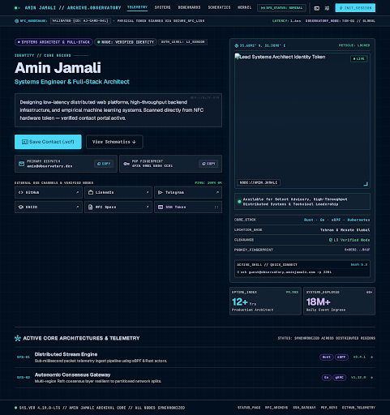
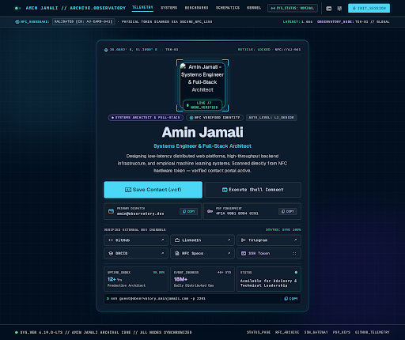

# SinglePageHero (Digital Business Card) — Design Specification

**Component:** `SinglePageHero`  
**Page:** Single-Page Personal Website (`/[locale]/single-page` / root swap)  
**Section:** Digital Business Card & Systems Identity Hero  
**Version:** 1.0  
**Date:** 2026-09-28  

---

## 1. Executive Summary & Physical Card Ingress Story

| Field | Value |
|---|---|
| **Component ID** | `SinglePageHero` |
| **Section Type** | Full-bleed Digital Business Card & Systems Identity Hero |
| **Primary Ingress Trigger** | Physical NFC tap or QR code scan on Amin Jamali's physical business card |
| **Target Persona** | Engineering leaders, tech founders, recruiters, conference peers, and enterprise clients |
| **Core Message** | *"Welcome — I am Amin Jamali, Systems Engineer & Full-Stack Architect. Here is who I am, what I build, and how to reach me immediately."* |
| **Emotional Tone** | Polished systems authority, obsidian precision, calm competence, and immediate accessibility. |

The `SinglePageHero` serves as the primary landing gateway for visitors arriving directly after scanning Amin Jamali's physical business card. It immediately resolves the visitor's core questions in under 3 seconds:
1. **Who is this?** — Crisp, authoritative name and role lockup with verified identity badge.
2. **What does he look like?** — High-contrast, rim-lit biometric portrait framed with subtle cybernetic coordinates and status indicators.
3. **How do I connect & reach him?** — Prominent direct contact triggers (Save Contact / vCard, Send Inquiry), one-click copy email chip, and high-contrast social link tiles (LinkedIn, GitHub, ORCID, Telegram, Email).

---

## 2. Google Stitch Layout Architecture & Benchmarks

### Primary Screen Design — Asymmetric Systems Ingress Split



| Field | Value |
|---|---|
| **Stitch Project ID** | `5861112417017823447` |
| **Primary Screen ID** | `965e76381d0d431ba772ae8650eee608` |
| **Screen Name** | `projects/5861112417017823447/screens/965e76381d0d431ba772ae8650eee608` |
| **Title** | Digital Business Card Hero - Amin Jamali Systems Observatory |
| **Device Type** | DESKTOP (2560px × 2726px) |
| **Design System** | Cockpit Systems Observatory (`assets/d3e01f6648cc4fc59ede780d25310b69`) |

**Stitch Layout Rationale (Primary Screen — Selected):**  
Stitch synthesized an asymmetric 60/40 two-column hero on a void-black `#050505` canvas with a subtle technical coordinate grid.
- **Left Column (60% — Action & Narrative Authority):** Features the verified identity pill `● VERIFIED PROFILE // SYSTEMS ARCHITECT & FULL-STACK`, followed by a bold fluid H1 `Amin Jamali` and subtitle. Below the punchy 2-sentence bio is the **Instant Action Hub**: a glowing electric cyan `Save Contact (.vcf)` CTA button, secondary `Explore Featured Work ↓` jump link, and an interactive click-to-copy email chip (`contact@aminjamali.com`). Beneath the CTAs sits a high-density tactile grid of verified social cards (LinkedIn, GitHub, ORCID, Telegram, Email).
- **Right Column (40% — Biometric Portrait & Status Dossier):** Positions Amin's portrait inside a glowing dual cyan/violet rim-lit frame with fine HUD reticle coordinate markings (`35.6892° N, 51.3890° E`). Beneath the portrait is a live emerald beacon: `● Available for Select Contracts & High-Impact Roles`.

---

### Variant 1 Exploration — Centered Biometric HUD & High-Contrast Elevation



| Field | Value |
|---|---|
| **Variant Screen ID** | `47567be85c3c4d9a86b8e1510ed51f87` |
| **Screen Name** | `projects/5861112417017823447/screens/47567be85c3c4d9a86b8e1510ed51f87` |
| **Title** | Digital Business Card - Centered Biometric HUD & High-Contrast Elevation |
| **Device Type** | DESKTOP (2560px × 2150px) |

**Variant 1 Benchmark Notes:**  
Variant 1 explores a centered digital pass card layout where the biometric portrait HUD is placed centrally above the title, with quick-action social pill buttons wrapping directly beneath the primary CTAs. This composition provides exceptional symmetry for ultra-narrow viewports and mobile NFC cards, while the primary 60/40 split offers superior visual breathing room and balance on desktop screens.

---

## 3. Visual Hierarchy & Spatial Flow

The visitor's eye follows this deliberate 5-stage focal path:

```
[ Stage 1: Verified Identity Beacon ] ──> [ Stage 2: Dominant H1 "Amin Jamali" & Role ]
                                                      │
                                                      ▼
[ Stage 4: Biometric Portrait & Live Availability ] <── [ Stage 3: Immediate Contact CTAs & Copy Email ]
                       │
                       ▼
[ Stage 5: Social Channels Grid (LinkedIn, GitHub, ORCID, Telegram, Email) ]
```

| Focal Priority | Element | Styling & Visual Weight |
|---|---|---|
| **1st** | Verified Identity Badge | JetBrains Mono 11px, `#06B6D4` on `#111115` card with pulsating emerald beacon |
| **2nd** | Name Headline & Role | Geist Sans `text-5xl sm:text-7xl font-black` + `text-xl` subtitle |
| **3rd** | Direct Action CTAs & Email Chip | Electric cyan `#06B6D4` high-contrast button + interactive click-to-copy chip |
| **4th** | Biometric Portrait HUD | Dual-gradient rim glow (cyan/violet) + coordinate reticle + live status pill |
| **5th** | Socials Connection Matrix | High-contrast hover-elevated cards with verified profile icons |

---

## 4. Layout Grid & Responsive Breakpoints

### Desktop (≥ 1024px) — 12-Column Asymmetric Grid
- 60% Left column: Identity badge, H1, role, concise bio, primary CTAs, copy-email chip, and social cards grid.
- 40% Right column: Floating biometric portrait, reticle coordinates, and availability status card.
- Container: `max-w-7xl`, `px-8`, `py-24 lg:py-32`.

### Tablet (768px – 1023px) — 2-Column Balanced Stack
- Portrait moves above narrative or sits side-by-side with reduced diameter (`w-72 h-72`).
- Social cards grid switches to 3-column auto-fit.
- CTAs maintain side-by-side flex layout with `flex-wrap`.

### Mobile (< 768px) — Single-Column Card Flow
- Portrait centered at top (`w-60 h-60` or `w-64 h-64`).
- Headline, bio, and CTAs stack vertically with full-width tap targets (minimum 48px height).
- Social links render as a 2×3 high-density grid for effortless thumb access.

---

## 5. Design Tokens & Color Palette

All tokens map directly to `docs/project.json → design_system`:

| Token | Light Mode | Dark Mode (Production Standard) |
|---|---|---|
| **Canvas Background** | `#FAFAFA` | `#050505` |
| **Elevated Surface / Card** | `#FFFFFF` | `#111115` |
| **Surface Border** | `#E4E4E7` | `#27272A` |
| **Primary Telemetry Accent** | `#0891B2` | `#06B6D4` (Electric Cyan) |
| **Secondary Accent** | `#7C3AED` | `#8B5CF6` (Neon Violet) |
| **Status / Live Availability** | `#10B981` | `#10B981` (Emerald Green) |
| **Primary Text (Headline)** | `#0A0A0A` | `#FAFAFA` |
| **Muted Text (Body & Labels)** | `#71717A` | `#A1A1AA` |
| **Neon Glow Shadow** | N/A | `0 0 24px -4px rgba(6, 182, 212, 0.25)` |

---

## 6. Typography Hierarchy (Per Locale)

### English (`en`) — LTR
- **Headline (H1):** Geist Sans, `text-5xl sm:text-7xl font-black`, tracking `-0.03em`.
- **Role & Subtitle:** Geist Sans, `text-lg sm:text-xl font-medium`, text-foreground/90.
- **Bio Copy:** Geist Sans, `text-base sm:text-lg text-muted-foreground`, line-height `1.7`.
- **Telemetry Labels & Badges:** JetBrains Mono, `text-xs uppercase font-mono`, tracking `0.04em`.
- **CTA Buttons:** Geist Sans, `text-sm font-bold`.

### Persian (`fa`) — RTL
- **Headline & Bio:** Vazirmatn, bold for H1, medium for subtitle, `dir="rtl"`.
- **Border & Spacing:** Mirror start/end borders (`border-s-*`, `ms-*`, `me-*`).
- **Telemetry & Technical Tokens:** Remain LTR in JetBrains Mono inside `dir="ltr"` wrappers.

---

## 7. Interaction States & Ergonomics

| Element | Default State | Hover State | Active / Tap State | Focus State |
|---|---|---|---|---|
| **"Save Contact (vCard)" CTA** | `bg-primary text-primary-foreground shadow-sm` | `bg-primary/90 shadow-md` | `scale-[0.98]` | `ring-2 ring-primary ring-offset-2` |
| **"Explore Work ↓" CTA** | `border border-border bg-card text-foreground` | `bg-muted border-primary/40` | `scale-[0.98]` | `ring-2 ring-primary ring-offset-2` |
| **Copy Email Chip** | `bg-card border border-border/80` | `border-primary text-primary` | Copied tooltip feedback | `ring-2 ring-primary` |
| **Social Links Cards** | `bg-card/80 border border-border/80` | `border-primary/50 -translate-y-0.5 bg-primary/5` | `scale-[0.98]` | `ring-2 ring-primary` |
| **Biometric Portrait** | Greyscale with cyan/violet rim glow | Full color transition (500ms ease) | N/A | N/A |

---

## 8. Accessibility & Compliance Verification

- **Color Contrast:** All body text on `#050505` canvas achieves > 14:1 contrast (WCAG AAA).
- **Touch Target Ergonomics:** All CTA buttons and social cards enforce minimum `44px × 44px` clickable regions.
- **Reduced Motion:** All radar spin animations, pulse halos, and transitions respect `prefers-reduced-motion`.
- **Screen Reader Tree:** Semantic `<h1>`, `<section id="hero">`, `aria-label` attributes on social links, and live region announcements for copied email state.

---

## 9. Visual Asset Recommendations

### Recommended Visual Asset: Biometric Author Portrait
- **Target File Path:** `app/images/portrait.jpg` (or `/images/about/portrait.jpg`)
- **Recommended Aspect Ratio:** `1:1` (Square)
- **Generation Prompt for User:**
  > "Cinematic portrait headshot of a confident, thoughtful Persian male senior systems architect and software engineer in his early 30s. Dramatic studio rim lighting with electric cyan/teal (#06B6D4) on one contour and deep violet (#8B5CF6) subtle edge glow on the other side. Pitch black minimal background (#050505), high contrast, crisp shadows, calm intellectual authority, sleek modern tech aesthetic, wearing minimalist dark charcoal crewneck, photorealistic, 8k resolution, studio lighting."

---

## 10. Design Spec File Index

| Asset | Path | Description |
|---|---|---|
| **Primary Screen Screenshot** | [`stitch/screen.jpg`](stitch/screen.jpg) | High-resolution Stitch desktop screenshot (asymmetric 60/40 digital card) |
| **Primary Screen HTML** | [`stitch/screen.html`](stitch/screen.html) | Raw Stitch HTML and Tailwind source export |
| **Variant 1 Screenshot** | [`stitch/variant-1.jpg`](stitch/variant-1.jpg) | High-resolution Stitch variant screenshot (centered pass card) |
| **Variant 1 HTML** | [`stitch/variant-1.html`](stitch/variant-1.html) | Raw Stitch variant HTML export |
| **Stitch Metadata** | [`stitch/stitch-meta.json`](stitch/stitch-meta.json) | Complete Stitch project, screen, and prompt metadata |
