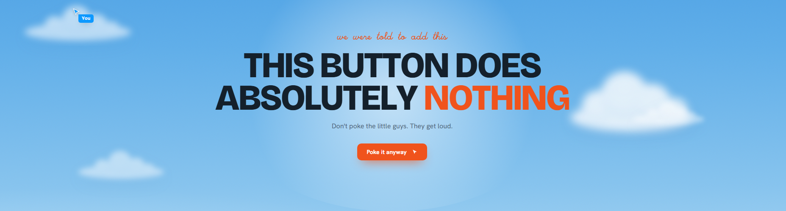
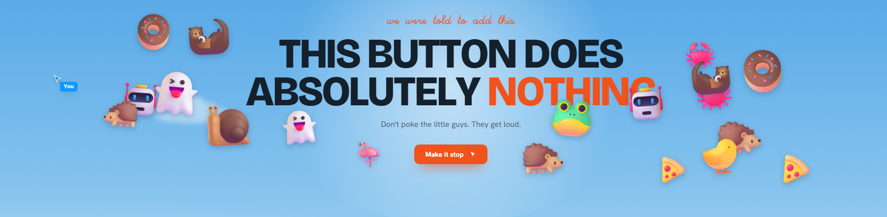
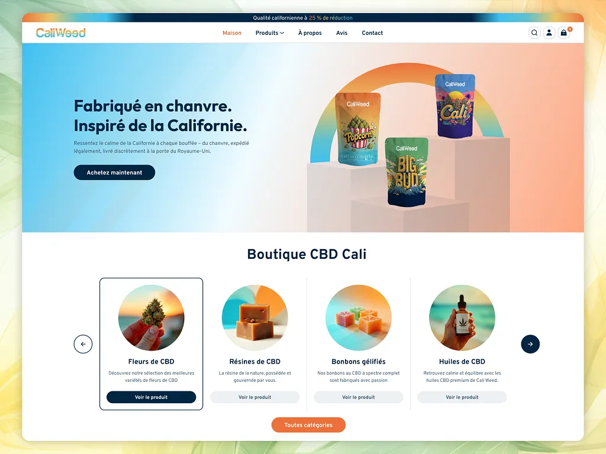
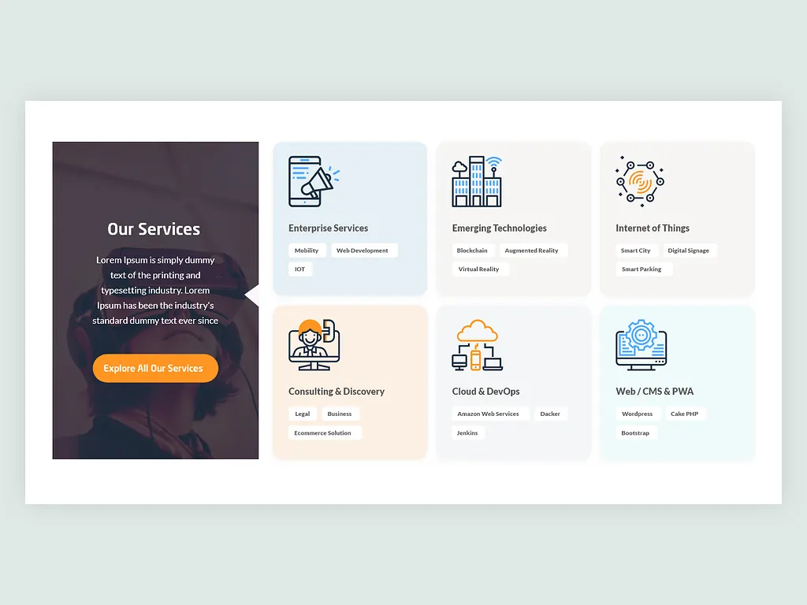
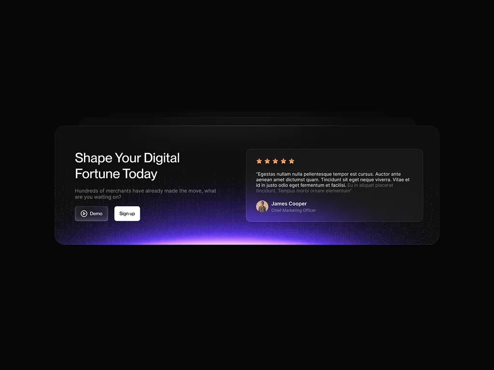
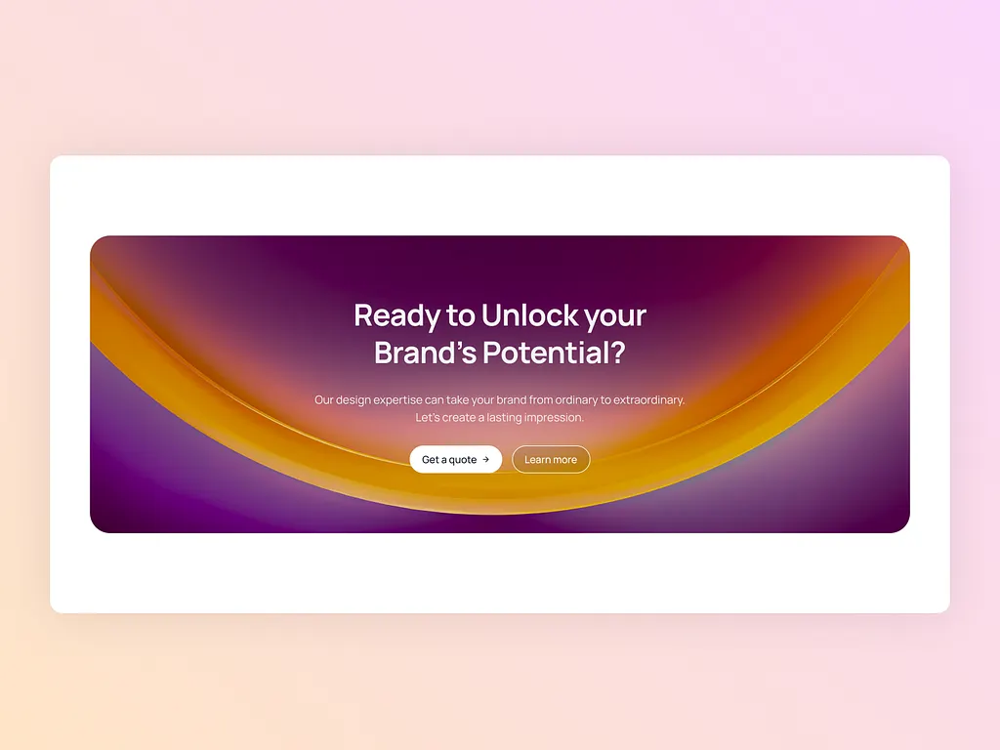
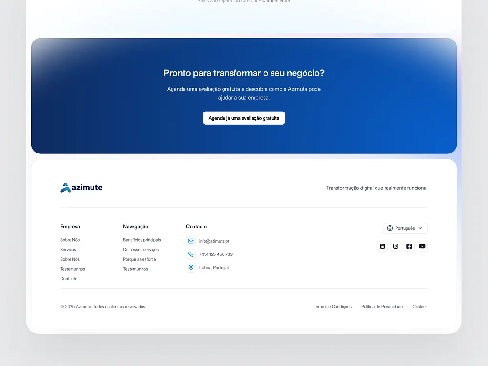
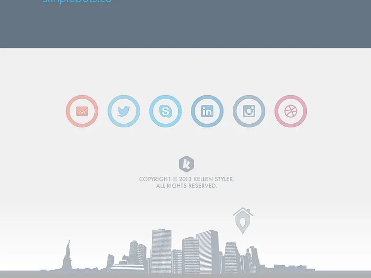

# project plan

What is this file?
This is the file where I do initial planning for project

1. Why this website was created?

This is a personal website where I showcase some of my skills in making a website and to generate leads for both freelance projecst or hiring opotunities

2. Who is it for?

Talent recruiters, web designers, normal people looking for a software engineer

3. What is the goal?

Lead generation via, recruitment opotunities, freelance projects, a place to show my resume, build trust, provide value like networking tools etc...

4. what are success metrics?

Lead generation, website traffic, SEO ranking

5. Website category

This website is a portfolio website of a web designer and developer

## Site map

### 1. Site Map Hierarchy

```text
├── / (Home)
├── /projects (Work / Portfolio)
│   └── /projects/[slug] (Detailed Case Study)
├── /services (Freelance & Offerings)
├── /about (Story & Experience)
├── /resume (Digital CV / Qualifications)
├── /lab (Interactive Tools & Mini Apps)
│   ├── IP Info Lookup (/lab/ipinfo)
│   └── DNS over HTTPS (DoH) Tester (/lab/doh)
├── /contact (Lead Capture & Booking)
├── [404] /not-found (Custom Not Found Page)
└── [Error] /error (Global & Route Error Boundaries)
```

---

### 2. Page Specifications

#### Core Pages (Phase 1 — MVP)

- **Home (`/`)**
  - **Hero Section:** Value proposition highlighting dual expertise in Web Design and Software Engineering + availability status badge.
  - **Featured Projects:** Top 2–3 case studies with live badges and metrics.
  - **Services Overview:** High-level summary of capabilities.
  - **Social Proof / Metrics:** Trust signals, client testimonials, or GitHub activity.
  - **Primary CTAs:** "Hire Me" / "View Projects" / "Download Resume".

- **Projects / Portfolio (`/projects`)**
  - Filterable gallery (Web Design, Full-Stack, Frontend, Open Source).
  - Project preview cards with visual thumbnails, tech stack tags, and impact summaries.

- **Case Study Detail (`/projects/[slug]`)**
  - **Overview:** Problem statement, your role, timeline, and tech stack.
  - **Process:** Design decisions, wireframes, architectural breakdown, and challenges overcome.
  - **Outcome & Impact:** Performance benchmarks (Lighthouse scores), user metrics, and business results.
  - **Links:** Live preview URL and GitHub repository.

- **Resume / CV (`/resume`)**
  - Digital interactive CV with expandable roles and key achievements.
  - Downloadable PDF resume button.
  - Skills matrix (Languages, Frameworks, Design Tools, DevOps).

- **Contact (`/contact`)**
  - Smart inquiry form with intent selection (Freelance project vs. Full-time opportunity vs. General inquiry).
  - Direct contact details (Email, LinkedIn, GitHub, Twitter/X).
  - Calendar booking integration (Cal.com / Calendly) for quick intro calls.
  - Timezone & availability status.

---

#### Services & Brand Pages (Phase 2)

- **Services / Hire Me (`/services`)**
  - Detailed service offerings (MVP Development, Custom Web Apps, UI/UX Design to Code, Performance Optimization).
  - 4-step workflow process (Discover $\rightarrow$ Design $\rightarrow$ Build $\rightarrow$ Launch).
  - Client FAQ addressing pricing models, timelines, and communication.

- **About (`/about`)**
  - Personal story, design & engineering philosophy.
  - Career milestones and personal achievements.
  - Beyond code: open-source work, interests, and community engagement.

---

#### Interactive Tools & Utilities (Phase 3)

- **Tools / Lab (`/lab`)**
  - Interactive tools, networking utilities, and experimental UI playgrounds.
  - **IP Info Lookup (`/lab/ipinfo`):** Real-time IP address details, ISP / ASN information, geolocation map, and connection protocol checks.
  - **DNS over HTTPS (DoH) Tester (`/lab/doh`):** Secure DNS query tool supporting standard record types (A, AAAA, CNAME, MX, TXT, NS) across multiple DoH providers (Cloudflare, Google, Quad9) with latency & response benchmarking.
  - Live demonstrations of frontend, backend, and networking engineering capabilities.

---

#### System & Error Handling (MVP Polish)

- **404 Not Found (`not-found.tsx`)**
  - **Branded & Creative UI:** Playful visual, subtle interactive element, or designer easter egg.
  - **Clear Guidance:** Friendly message explaining the missing or moved route.
  - **Recovery Navigation:** Quick links back to `Home`, `Projects`, `Resume`, and `Contact`.

- **Error / Server Error (`error.tsx` & `global-error.tsx`)**
  - **Graceful Degradation:** Catches runtime exceptions and prevents the entire app from crashing.
  - **User-Friendly Notice:** Explains the issue politely without displaying cryptic stack traces to clients/recruiters.
  - **Recovery Actions:** "Try Again" (`reset()`) button, "Return Home" button, and contact link for bug reporting.

---

### 3. Phased Rollout Plan

1. **Phase 1 (Launch-ready MVP):** `Home`, `Projects`, `Project Detail`, `Resume`, `Contact`, `404 Not Found`, `Error Boundary`.
2. **Phase 2 (Freelance & Story):** `Services`, `About`.
3. **Phase 3 (Interactive Tools & Value Engine):** `Lab / Tools` (IP Info Lookup, DoH Tester).

## Decent designs

### Home

#### Hero

https://alkemymarket.com/

This websie has an interactable hero section where mouse hover creates colorful effects a decent but also modern design that showcases skill with mouse hover animations

https://pauschal.design/en/

Showing an awsome landscape where the heading will appear when the user scrolls (might need a notificaiton for scroll though)

https://www.playmagicreef.com/

In this design the heading has a transparent design and when user scrolls out of hero section the heading will get a background color

#### Sections and flow

https://www.ohhmydesign.com/

This website has cool animations in section transition also there was a fun section where when you clicked it spawned fun emojis




#### Featured products



simple but I'm not sure if it is useful for website or product showcases

#### Services Overview



Simple can be improved via animations and interactions

#### CTA



Liked the background design



Decent background

### Heading

https://www.thelaunchcompany.cc/

minimal apple like design can be good to send modernity and skill message

https://austinwerner.io/

Full on heading with navigtaion center alligned and brand left alligned

https://lorolabs.ai/

Decent liquid glass like design

### Color pallet

https://orbitaix.webflow.io/

Fun cyan based color pallet and design

### Animation and effects

https://www.linearity.io/

While the design was not that good the animations were smooth I might want to have a look at tech stack

### OS like projects

https://pouyashahri.com/

impressive website built to look like windows 11 really decent design but it makes it super hard for a normal guy to use the site the optimal approach here is to showcase this as a project and not for the main website

### Footer



Since big footers are like the trend in Iran we go for it



interesting footer desgin where we have the brand logo and socials

One thing to note is that interactive animations can be fun in footer for example brand will show itself around mouse hover
