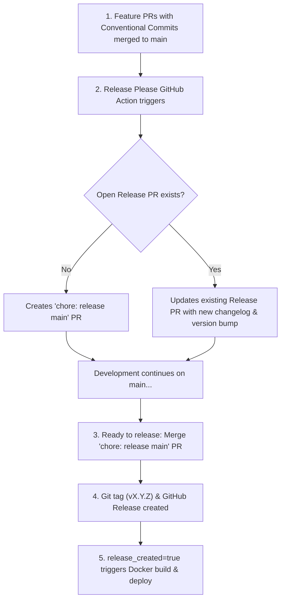

# Automatic Semantic Versioning & Release Automation (Release Please)

This project uses **[Release Please](https://github.com/googleapis/release-please)** (by Google) alongside **Conventional Commits** and **Husky + Commitlint** to automate semantic versioning, changelog generation, and Docker production deployments.

---

## 1. How It Works

Release Please operates through a **Release PR (Pull Request)** lifecycle rather than cutting releases immediately on each micro-commit.



---

## 2. Conventional Commits & Version Bumping Rules

Every commit message merged into `main` must adhere to the Conventional Commits format (enforced locally via Husky & Commitlint):

| Commit Prefix                                     | SemVer Impact                             | Description                                    | Example                                        |
| :------------------------------------------------ | :---------------------------------------- | :--------------------------------------------- | :--------------------------------------------- |
| `fix:`                                            | **Patch** (`0.1.0` $\rightarrow$ `0.1.1`) | Bug fixes and patches                          | `fix: resolve mobile navigation overflow`      |
| `feat:`                                           | **Minor** (`0.1.0` $\rightarrow$ `0.2.0`) | New features and capabilities                  | `feat: implement bilingual RTL switcher`       |
| `feat!:`, `fix!:`, or `BREAKING CHANGE:`          | **Major** (`0.1.0` $\rightarrow$ `1.0.0`) | Breaking changes                               | `feat!: redesign API and dictionary structure` |
| `chore:`, `docs:`, `style:`, `refactor:`, `test:` | **None**                                  | Internal improvements, styling, test additions | `chore: update dependencies`                   |

> [!NOTE]
> When multiple commits are merged before a release, Release Please batches all changes into a single Release PR and calculates the highest required SemVer bump.

---

## 3. The Release PR Lifecycle

1. **Continuous Accumulation:**
   - As you merge feature PRs into `main`, Release Please automatically maintains a pull request titled `chore: release main (vX.Y.Z)`.
   - The PR shows the updated version in `package.json` and a formatted preview of `CHANGELOG.md`.

2. **Triggering a Release:**
   - When you are ready to publish and deploy to production, **merge the `chore: release main` PR** (via GitHub or the VS Code GitHub Pull Requests extension).

3. **Post-Merge Automation:**
   - Upon merging the Release PR, Release Please creates an immutable Git Tag (e.g., `v1.2.0`) and publishes a GitHub Release with detailed notes.
   - It outputs `release_created = true` to downstream GitHub Actions.

---

## 4. Docker Deployment Integration

In containerized deployments, Docker images are built and published **only when an official release is created**:

```yaml
jobs:
  release-please:
    runs-on: ubuntu-latest
    outputs:
      release_created: ${{ steps.release.outputs.release_created }}
      tag_name: ${{ steps.release.outputs.tag_name }}
    steps:
      - uses: googleapis/release-please-action@v4
        id: release
        with:
          release-type: node

  docker-build-and-deploy:
    needs: release-please
    if: needs.release-please.outputs.release_created == 'true'
    runs-on: ubuntu-latest
    steps:
      - uses: actions/checkout@v4
      - name: Build & Push Docker image
        # Images are tagged with the semantic version tag (e.g. :1.2.0) and :latest
        run: |
          docker build -t ghcr.io/${{ github.repository }}:${{ needs.release-please.outputs.tag_name }} .
          docker push ghcr.io/${{ github.repository }}:${{ needs.release-please.outputs.tag_name }}
```

---

## 5. Required GitHub Repository Access Permissions

> [!IMPORTANT]
> To allow Release Please to open and update the automated Release Pull Request, GitHub Actions permissions must be enabled on the repository:
>
> 1. Navigate to **Settings** → **Actions** → **General** in your repository.
> 2. Under **Workflow permissions**:
>    - Check **"Read and write permissions"**.
>    - Check **"Allow GitHub Actions to create and approve pull requests"**.
> 3. Click **Save**.

---

## 6. Developer Daily Workflow (VS Code & CLI)

1. **Create Branch:** `git checkout -b feat/my-feature`
2. **Commit:** `git commit -m "feat: add animated hero section"`
3. **Open & Merge PR:** Use VS Code's GitHub extension or `gh pr create` / `gh pr merge`.
4. **Inspect Release PR:** Check the automated `chore: release main` PR opened by Release Please.
5. **Publish & Deploy:** Merge the Release PR whenever you want a new production version and Docker build.
